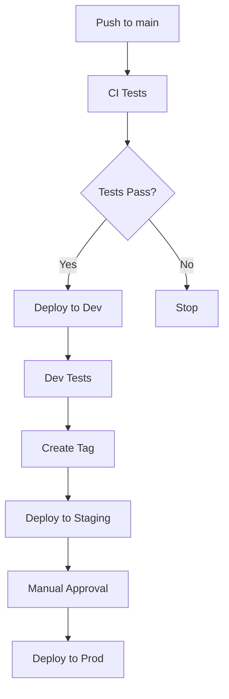

# GitHub Workflows

This directory contains GitHub Actions workflows for automating CI/CD processes in the Mastery AI Workshop.

## 📋 Workflow Overview

### Core Workflows

| Workflow | Trigger | Purpose |
|----------|---------|---------|
| ci.yml | Push/PR | Run tests, lint code, validate |
| deploy-dev.yml | Push to main | Deploy to development |
| deploy-staging.yml | Tag v* | Deploy to staging |
| deploy-prod.yml | Manual | Deploy to production |

### Module-Specific Workflows

| Workflow | Trigger | Purpose |
|----------|---------|---------|
| module-tests.yml | PR to modules/* | Test specific module |
| module-deploy.yml | Push to modules/* | Deploy module updates |

## 🚀 Workflow Structure

### CI Workflow (ci.yml)
```yaml
name: CI

on:
  push:
    branches: [main, develop]
  pull_request:
    branches: [main]

jobs:
  test:
    runs-on: ubuntu-latest
    strategy:
      matrix:
        python-version: [3.9, 3.10, 3.11]
    
    steps:
      - uses: actions/checkout@v4
      - name: Set up Python
        uses: actions/setup-python@v4
        with:
          python-version: ${{ matrix.python-version }}
      - name: Run tests
        run: |
          pip install -r requirements.txt
          pytest
```

### Deployment Workflow Pattern
```yaml
name: Deploy to Environment

on:
  workflow_dispatch:
    inputs:
      environment:
        description: 'Target environment'
        required: true
        type: choice
        options:
          - dev
          - staging
          - prod

jobs:
  deploy:
    runs-on: ubuntu-latest
    environment: ${{ inputs.environment }}
    
    steps:
      - uses: actions/checkout@v4
      
      - name: Azure Login
        uses: azure/login@v1
        with:
          creds: ${{ secrets.AZURE_CREDENTIALS }}
      
      - name: Deploy Infrastructure
        run: |
          ./scripts/deploy-infrastructure.sh ${{ inputs.environment }}
      
      - name: Deploy Application
        run: |
          ./scripts/deploy-application.sh ${{ inputs.environment }}
```

## 🔒 Required Secrets

Configure in Settings → Secrets → Actions:

| Secret | Description | Environments |
|--------|-------------|--------------|
| AZURE_CREDENTIALS | Service Principal JSON | All |
| GITHUB_TOKEN | Auto-provided | All |
| OPENAI_API_KEY | For AI services | Dev, Staging, Prod |
| SONAR_TOKEN | Code quality scanning | All |

## 📊 Status Badges

Add to your README:
```markdown


```

## 🏷️ Best Practices

1. **Use Environments**: Configure protection rules
2. **Cache Dependencies**: Speed up workflows
3. **Matrix Testing**: Test multiple versions
4. **Artifacts**: Store build outputs
5. **Concurrency**: Prevent conflicting deployments

## 🔄 Workflow Dependencies



## 📝 Creating New Workflows

1. Create `.yml` file in this directory
2. Define triggers (on:)
3. Define jobs and steps
4. Add required secrets
5. Test in feature branch
6. Document in this README

## 🐛 Debugging

Enable debug logging:
1. Add `ACTIONS_STEP_DEBUG: true` to secrets
2. Re-run workflow
3. Check detailed logs

## 📚 Resources

- [GitHub Actions Docs](https://docs.github.com/actions)
- [Workflow Syntax](https://docs.github.com/actions/reference/workflow-syntax-for-github-actions)
- [Azure Actions](https://github.com/Azure/actions)
