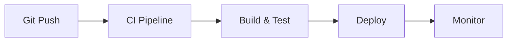

# 🔄 GitOps Patterns Guide

## Introduction to GitOps

GitOps uses Git as the single source of truth for declarative infrastructure and applications. Combined with AI, it becomes a powerful approach for modern development.

## Core GitOps Principles

### 1. Declarative Configuration
Everything is defined as code in Git:
- Infrastructure (IaC)
- Application configuration
- Deployment manifests
- Security policies

### 2. Version Control Everything
```yaml
# Example: Application config
apiVersion: v1
kind: ConfigMap
metadata:
  name: app-config
data:
  environment: production
  log_level: info
  ai_model: gpt-4
```

### 3. Automated Reconciliation
Git commits trigger automated workflows:


## AI-Enhanced GitOps Workflows

### 1. AI-Powered Code Reviews
```yaml
name: AI Code Review
on:
  pull_request:
    types: [opened, synchronize]

jobs:
  ai-review:
    runs-on: ubuntu-latest
    steps:
      - uses: actions/checkout@v3
      - name: AI Security Scan
        run: |
          ai-security-scan --model claude-3.5 \
            --check vulnerabilities \
            --check best-practices
```

### 2. Automated PR Descriptions
Use AI to generate comprehensive PR descriptions:
```bash
# .github/hooks/prepare-commit-msg
#!/bin/bash
AI_DESCRIPTION=$(ai-cli describe-changes --diff)
echo "AI-Generated Summary: $AI_DESCRIPTION" >> $1
```

### 3. Smart Commit Messages
```bash
# Git alias for AI commits
git config --global alias.ai-commit '!f() {
  DIFF=$(git diff --staged)
  MSG=$(ai-cli generate-commit-message "$DIFF")
  git commit -m "$MSG"
}; f'
```

## GitOps Directory Structure

```
.
├── .github/
│   ├── workflows/          # CI/CD pipelines
│   ├── CODEOWNERS         # Automated review assignment
│   └── dependabot.yml     # Dependency updates
├── infrastructure/
│   ├── environments/
│   │   ├── dev/
│   │   ├── staging/
│   │   └── production/
│   └── modules/           # Reusable components
├── kubernetes/
│   ├── base/             # Base configurations
│   └── overlays/         # Environment-specific
└── scripts/
    └── gitops/           # GitOps utilities
```

## Best Practices

### 1. Branch Protection Rules
```json
{
  "protection_rules": {
    "main": {
      "required_reviews": 2,
      "dismiss_stale_reviews": true,
      "require_code_owner_reviews": true,
      "required_status_checks": [
        "ai-security-scan",
        "unit-tests",
        "integration-tests"
      ]
    }
  }
}
```

### 2. Semantic Versioning with AI
```yaml
# .github/workflows/release.yml
name: Semantic Release
on:
  push:
    branches: [main]

jobs:
  release:
    steps:
      - name: Analyze Commits
        run: |
          VERSION_BUMP=$(ai-cli analyze-commits \
            --since-last-release \
            --suggest-version-bump)
          echo "VERSION_BUMP=$VERSION_BUMP" >> $GITHUB_ENV
```

### 3. Environment Promotion
```yaml
# Automated promotion pipeline
stages:
  - name: Deploy to Dev
    trigger: push to main
    
  - name: Deploy to Staging
    trigger: approval + automated tests
    
  - name: Deploy to Production
    trigger: manual approval + AI validation
```

## AI-Powered Git Hooks

### Pre-commit Hook
```bash
#!/bin/bash
# .git/hooks/pre-commit

# AI code quality check
ai-cli check-quality --staged || exit 1

# AI security scan
ai-cli security-scan --staged || exit 1

# Auto-format with AI suggestions
ai-cli format --apply-suggestions
```

### Commit-msg Hook
```bash
#!/bin/bash
# .git/hooks/commit-msg

# Validate commit message format
ai-cli validate-commit-message $1 || {
  echo "Commit message does not follow convention"
  echo "Suggested: $(ai-cli suggest-commit-message)"
  exit 1
}
```

## GitOps with Different Platforms

### GitHub Actions + AI
```yaml
name: AI-Enhanced CI/CD
on: [push, pull_request]

jobs:
  ai-pipeline:
    runs-on: ubuntu-latest
    steps:
      - uses: actions/checkout@v3
      
      - name: AI Code Analysis
        uses: ai-assistant/code-analysis@v1
        with:
          model: gpt-4
          checks: |
            - security
            - performance
            - best-practices
            
      - name: AI Test Generation
        run: ai-cli generate-tests --coverage-target 80%
```

### GitLab CI + AI
```yaml
# .gitlab-ci.yml
stages:
  - analyze
  - test
  - deploy

ai-analysis:
  stage: analyze
  script:
    - ai-cli analyze --full-report
  artifacts:
    reports:
      junit: ai-analysis-report.xml
```

### Azure DevOps + AI
```yaml
# azure-pipelines.yml
trigger:
  - main

pool:
  vmImage: 'ubuntu-latest'

steps:
- task: AICodeReview@1
  inputs:
    model: 'azure-openai'
    endpoint: '$(AI_ENDPOINT)'
```

## Monitoring and Observability

### AI-Powered Alerts
```yaml
# monitoring/alerts.yml
alerts:
  - name: deployment-anomaly
    condition: |
      ai_analyze(
        deployment_duration,
        historical_baseline
      ) > threshold
    action: rollback
```

### Automated Incident Response
```python
# scripts/incident-response.py
def handle_incident(alert):
    # AI analyzes the incident
    analysis = ai.analyze_incident(alert)
    
    # Generate fix suggestion
    fix = ai.suggest_fix(analysis)
    
    # Create automated PR
    create_pr(
        title=f"AI Fix: {alert.name}",
        body=analysis.summary,
        changes=fix.code_changes
    )
```

## Security Considerations

### 1. Secrets Management
Never commit secrets. Use:
- Environment variables
- Secret management tools
- Git-crypt for sensitive files

### 2. AI Model Access
```yaml
# Secure AI configuration
ai_config:
  model_endpoint: ${AI_ENDPOINT}
  api_key: ${AI_API_KEY}  # From secrets manager
  rate_limit: 100
  timeout: 30s
```

### 3. Audit Trail
```json
{
  "ai_operations": {
    "timestamp": "2024-01-20T10:30:00Z",
    "model": "gpt-4",
    "operation": "code_review",
    "user": "github-actions",
    "result": "approved",
    "confidence": 0.95
  }
}
```

## Troubleshooting GitOps

### Common Issues

1. **Pipeline Failures**
   ```bash
   ai-cli diagnose-pipeline --job-id $CI_JOB_ID
   ```

2. **Drift Detection**
   ```bash
   ai-cli detect-drift --environment production
   ```

3. **Rollback Strategies**
   ```bash
   ai-cli suggest-rollback --incident-id $INCIDENT_ID
   ```

## Future of AI + GitOps

- Self-healing infrastructure
- Predictive scaling
- Automated security patching
- Intelligent deployment strategies
- AI-driven cost optimization

Remember: GitOps + AI = Automated, Intelligent, and Reliable Deployments! 