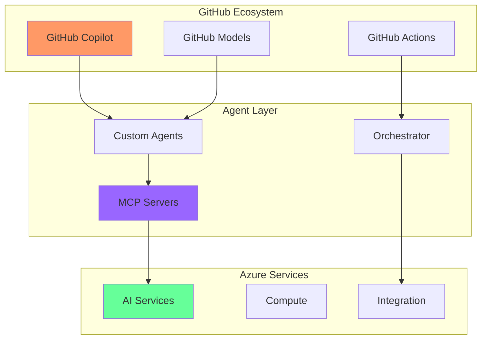

# 🤖 Agent & MCP Modules - Detailed Exercise Breakdown

## Modules 21-25: Complete Agent Development Journey

### Module 21: Introduction to AI Agents

#### Exercise 1: Your First Copilot Agent (⭐ Easy - 30 min)
**Objective**: Create a simple GitHub Copilot agent extension

**What You'll Build**:
- Basic agent that responds to code comments
- Simple tool integration
- Error handling basics

**Technologies**:
- GitHub Copilot API
- VS Code Extension API
- TypeScript

**Copilot Prompts**:
```typescript
// Create a Copilot agent that:
// 1. Listens for TODO comments
// 2. Generates implementation suggestions
// 3. Provides inline documentation
```

---

#### Exercise 2: Code Review Agent (⭐⭐ Medium - 45 min)
**Objective**: Build an intelligent code review assistant

**What You'll Build**:
- Agent that analyzes PR changes
- Suggests improvements
- Checks coding standards

**Technologies**:
- GitHub API
- Copilot Chat API
- Azure OpenAI

**Key Features**:
- Pattern detection
- Security scanning
- Performance suggestions

---

#### Exercise 3: Refactoring Agent (⭐⭐⭐ Hard - 60 min)
**Objective**: Create a multi-step refactoring automation

**What You'll Build**:
- Complex refactoring workflows
- Dependency analysis
- Safe transformation rules

**Technologies**:
- AST manipulation
- Multi-file coordination
- Testing integration

---

### Module 22: Building Custom Agents

#### Exercise 1: Documentation Agent (⭐ Easy - 30 min)
**Objective**: Auto-generate comprehensive documentation

**What You'll Build**:
- README generator
- API documentation
- Code examples

**Technologies**:
- Semantic Kernel
- Markdown generation
- Code parsing

---

#### Exercise 2: Database Migration Agent (⭐⭐ Medium - 45 min)
**Objective**: Intelligent database schema evolution

**What You'll Build**:
- Schema analyzer
- Migration generator
- Rollback strategies

**Technologies**:
- Database introspection
- SQL generation
- Version control

---

#### Exercise 3: Architecture Decision Agent (⭐⭐⭐ Hard - 60 min)
**Objective**: AI-powered architectural guidance

**What You'll Build**:
- Pattern recognition
- Decision trees
- Trade-off analysis

**Technologies**:
- Design patterns
- Decision matrices
- Knowledge graphs

---

### Module 23: Model Context Protocol (MCP)

#### Exercise 1: Basic MCP Server (⭐ Easy - 30 min)
**Objective**: Implement your first MCP server

**What You'll Build**:
- Simple MCP endpoint
- Request handling
- Response formatting

**Technologies**:
- MCP specification
- Node.js/Python
- JSON-RPC

**MCP Configuration**:
```json
{
  "mcpServers": {
    "my-first-server": {
      "command": "node",
      "args": ["./mcp-server.js"],
      "capabilities": ["tools", "context"]
    }
  }
}
```

---

#### Exercise 2: Database MCP Connector (⭐⭐ Medium - 45 min)
**Objective**: Create MCP-enabled database access

**What You'll Build**:
- Secure database connector
- Query interface
- Result formatting

**Technologies**:
- MCP tools protocol
- Database drivers
- Connection pooling

---

#### Exercise 3: Secure MCP Gateway (⭐⭐⭐ Hard - 60 min)
**Objective**: Enterprise-grade MCP security

**What You'll Build**:
- Authentication layer
- Rate limiting
- Audit logging

**Technologies**:
- OAuth/JWT
- TLS encryption
- Access control

---

### Module 24: Multi-Agent Orchestration

#### Exercise 1: Two-Agent Collaboration (⭐ Easy - 30 min)
**Objective**: Coordinate agents for code generation

**What You'll Build**:
- Agent communication
- Task delegation
- Result aggregation

**Technologies**:
- GitHub Actions
- Agent messaging
- State management

---

#### Exercise 2: Debugging Orchestra (⭐⭐ Medium - 45 min)
**Objective**: Multi-agent debugging system

**What You'll Build**:
- Error detection agent
- Root cause agent
- Fix suggestion agent

**Technologies**:
- Distributed tracing
- Log analysis
- Pattern matching

---

#### Exercise 3: Enterprise Workflow (⭐⭐⭐ Hard - 60 min)
**Objective**: Complex business process automation

**What You'll Build**:
- Approval workflows
- Parallel processing
- Error recovery

**Technologies**:
- Workflow engines
- Event-driven architecture
- Saga patterns

---

### Module 25: Advanced Agent Patterns

#### Exercise 1: Supervisor Agent (⭐ Easy - 30 min)
**Objective**: Hierarchical agent management

**What You'll Build**:
- Parent-child agents
- Task distribution
- Result aggregation

**Technologies**:
- Agent hierarchies
- Communication protocols
- Monitoring

---

#### Exercise 2: Self-Healing System (⭐⭐ Medium - 45 min)
**Objective**: Autonomous error recovery

**What You'll Build**:
- Error detection
- Automatic remediation
- Learning from failures

**Technologies**:
- Circuit breakers
- Retry strategies
- Failure analysis

---

#### Exercise 3: Competitive Agents (⭐⭐⭐ Hard - 60 min)
**Objective**: Multi-agent negotiation system

**What You'll Build**:
- Resource allocation
- Bid strategies
- Consensus mechanisms

**Technologies**:
- Game theory
- Distributed consensus
- Performance metrics

---

## 🛠️ Technology Deep Dive

### Core Agent Technologies by Module

| Module | Primary Tech | Secondary Tech | Cloud Services |
|--------|--------------|----------------|----------------|
| 21 | GitHub Copilot API | VS Code Extensions | Azure OpenAI |
| 22 | Semantic Kernel | Custom Tools | Azure Functions |
| 23 | MCP Protocol | JSON-RPC | Azure API Management |
| 24 | GitHub Actions | Event Grid | Service Bus |
| 25 | Agent Patterns | State Machines | Durable Functions |

### Integration Points



## 📊 Learning Metrics

### Expected Completion Times

| Module | Study Time | Exercise Time | Total Time | Success Rate |
|--------|------------|---------------|------------|--------------|
| 21 | 45 min | 2h 15min | 3 hours | 90% |
| 22 | 45 min | 2h 15min | 3 hours | 85% |
| 23 | 45 min | 2h 15min | 3 hours | 80% |
| 24 | 45 min | 2h 15min | 3 hours | 75% |
| 25 | 45 min | 2h 15min | 3 hours | 70% |

### Skills Progression

```
Module 21: Agent Basics ████░░░░░░
Module 22: Custom Agents ██████░░░░
Module 23: MCP Protocol ████████░░
Module 24: Orchestration ██████████
Module 25: Mastery ████████████
```

## 🎯 Key Takeaways

After completing the Agent & MCP track (Modules 21-25), you will:

1. **Master Agent Development**
   - Build any type of AI agent
   - Implement complex behaviors
   - Handle real-world scenarios

2. **Understand MCP Deeply**
   - Create MCP servers/clients
   - Implement secure protocols
   - Integrate with any system

3. **Orchestrate at Scale**
   - Coordinate multiple agents
   - Build enterprise workflows
   - Handle complex scenarios

4. **Apply Advanced Patterns**
   - Implement best practices
   - Design fault-tolerant systems
   - Create self-improving solutions

---

**Ready to become an AI Agent Master? Start with Module 21!** 🚀