# 🗺️ Mastery AI Code Development - Learning Progression Map

## Workshop Learning Flow

This document illustrates how the 30 modules connect and build upon each other to create a complete mastery journey.

## 📊 Module Progression Overview

```mermaid
graph TD
    subgraph "🟢 Fundamentals (1-5)"
        M1[1. AI Introduction] --> M2[2. Copilot Core]
        M2 --> M3[3. Prompting]
        M3 --> M4[4. Debugging/Testing]
        M4 --> M5[5. Documentation]
    end
    
    subgraph "🔵 Intermediate (6-10)"
        M5 --> M6[6. Multi-File Projects]
        M6 --> M7[7. Web Apps]
        M7 --> M8[8. APIs]
        M8 --> M9[9. Databases]
        M9 --> M10[10. Real-time]
    end
    
    subgraph "🟠 Advanced (11-15)"
        M10 --> M11[11. Microservices]
        M11 --> M12[12. Cloud-Native]
        M12 --> M13[13. IaC]
        M13 --> M14[14. CI/CD]
        M14 --> M15[15. Performance]
    end
    
    subgraph "🔴 Enterprise (16-20)"
        M15 --> M16[16. Security]
        M16 --> M17[17. AI Models]
        M17 --> M18[18. Patterns]
        M18 --> M19[19. Monitoring]
        M19 --> M20[20. Deployment]
    end
    
    subgraph "🟣 AI Agents (21-25)"
        M20 --> M21[21. Agent Intro]
        M21 --> M22[22. Custom Agents]
        M22 --> M23[23. MCP]
        M23 --> M24[24. Orchestration]
        M24 --> M25[25. Advanced Patterns]
    end
    
    subgraph "⭐ Mastery (26-30)"
        M25 --> M26[26. Enterprise .NET]
        M26 --> M27[27. COBOL Modern]
        M27 --> M28[28. DevSecOps]
        M28 --> M29[29. Review]
        M29 --> M30[30. Challenge]
    end
    
    style M1 fill:#4CAF50
    style M30 fill:#FFD700
```



## 🔄 Knowledge Building Blocks

### Foundation Layer (Modules 1-5)
**Core Skills Developed:**
- ✅ AI-assisted coding basics
- ✅ Effective prompting
- ✅ Quality assurance with AI
- ✅ Documentation practices

**Prepares You For:**
- Building complete applications
- Working with complex codebases
- Team collaboration

### Application Layer (Modules 6-10)
**Core Skills Developed:**
- ✅ Full-stack development
- ✅ API design and integration
- ✅ Database management
- ✅ Real-time systems

**Prepares You For:**
- Architecting distributed systems
- Cloud-native development
- Enterprise patterns

### Architecture Layer (Modules 11-15)
**Core Skills Developed:**
- ✅ Microservices design
- ✅ Container orchestration
- ✅ Infrastructure automation
- ✅ DevOps practices

**Prepares You For:**
- Enterprise implementations
- Production deployments
- Complex integrations

### Enterprise Layer (Modules 16-20)
**Core Skills Developed:**
- ✅ Security implementation
- ✅ AI model integration
- ✅ Production monitoring
- ✅ Deployment strategies

**Prepares You For:**
- Agent development
- Complex orchestration
- Enterprise architecture

### Agent Development Layer (Modules 21-25)
**Core Skills Developed:**
- ✅ Agent architectures
- ✅ Custom agent building
- ✅ MCP implementation
- ✅ Multi-agent systems

**Prepares You For:**
- Enterprise AI solutions
- Innovation leadership
- Complex automations

### Mastery Layer (Modules 26-30)
**Core Skills Developed:**
- ✅ Enterprise .NET excellence
- ✅ Legacy modernization
- ✅ Advanced security
- ✅ Complete system design

**Achievement:**
- Full-stack AI mastery
- Enterprise leadership
- Innovation capability

## 🎯 Skill Progression Matrix

| Skill Area | Modules 1-5 | Modules 6-10 | Modules 11-15 | Modules 16-20 | Modules 21-25 | Modules 26-30 |
|------------|-------------|--------------|---------------|---------------|---------------|---------------|
| **AI Usage** | Basic | Intermediate | Advanced | Expert | Master | Architect |
| **Code Complexity** | Simple | Multi-file | Distributed | Enterprise | Agent-based | Full-stack |
| **Architecture** | - | Monolithic | Microservices | Cloud-native | Multi-agent | Enterprise |
| **Security** | - | Basic | Container | Zero-trust | Agent security | Advanced |
| **Scale** | Personal | Team | Department | Organization | Enterprise | Global |

## 🔗 Module Dependencies

### Critical Path
The following modules are prerequisites for later content:

```
Module 1 → All others (Foundation)
Module 2 → Modules 6+ (Copilot mastery)
Module 3 → Modules 21+ (Prompting for agents)
Module 11 → Modules 16+ (Architecture basics)
Module 17 → Modules 21+ (AI integration)
Module 21 → Modules 22-25 (Agent foundation)
Module 23 → Modules 24-25 (MCP required)
```

### Recommended Sequences

**For Agent Development Focus:**
- Fast track: 1-3, 17, 21-25
- Complete path: 1-20, then 21-25

**For Enterprise .NET Focus:**
- Fast track: 1-5, 11-13, 16, 26
- Complete path: 1-20, then 26-28

**For Security Focus:**
- Fast track: 1-5, 16, 28
- Complete path: 1-20, focus on 16, 19, 28

## 📈 Learning Acceleration Tips

### Parallel Learning Opportunities
Some modules can be studied in parallel:
- Modules 7 & 8 (Web & API)
- Modules 11 & 12 (Microservices & Cloud)
- Modules 18 & 19 (Patterns & Monitoring)

### Deep Dive Recommendations
For maximum impact, spend extra time on:
- Module 3 (Prompting) - Foundation for all AI work
- Module 11 (Microservices) - Critical for enterprise
- Module 21 (Agents) - Future of development
- Module 23 (MCP) - Key integration technology

### Practice Projects
Build these projects to reinforce learning:
1. **After Module 10**: Full-stack web application
2. **After Module 15**: Microservices system
3. **After Module 20**: Production-ready platform
4. **After Module 25**: Multi-agent solution
5. **After Module 30**: Enterprise transformation

## 🎓 Certification Milestones

```mermaid
graph LR
    A[Start] --> B[Fundamentals Certificate]
    B --> C[Intermediate Certificate]
    C --> D[Advanced Certificate]
    D --> E[Enterprise Certificate]
    E --> F[Agent Specialist Certificate]
    F --> G[Mastery Certificate]
    G --> H[AI Development Champion]
    
    style A fill:#f9f
    style H fill:#FFD700
```



## 🚀 Your Mastery Journey

Remember: This is not just about completing modules—it's about transforming how you think about and approach software development. Each module builds specific skills that compound into complete mastery.

**Key Success Factors:**
1. **Practice Daily**: Apply learning immediately
2. **Build Projects**: Create real solutions
3. **Share Knowledge**: Teach others
4. **Stay Current**: Technology evolves
5. **Think Big**: You're becoming an AI development leader

---

**"The journey of a thousand miles begins with a single step. Your first step is Module 1. Your destination is AI Development Mastery!"**