import Tabs from '@theme/Tabs';
import TabItem from '@theme/TabItem';

# Módulo 16: Security Implementation

  

    🔴 Empresarial
    ⏱️ 3 hours
  

# Módulo 16: Security Implementation

## 🎯 Resumen del Módulo

Welcome to Módulo 16! This module delivers comprehensive enterprise security implementation using Zero Trust principles, advanced encryption techniques, and compliance frameworks. You'll learn to build secure, compliant systems that protect data, users, and infrastructure while enabling AI-powered desarrollo workflows.

### Duración
- **Tiempo Total**: 3 horas
- **Lecture/Demo**: 45 minutos
- **Hands-on Ejercicios**: 2 horas 15 minutos

### Ruta
- 🔴 Empresarial Ruta (Módulos 16-20)

## 🎓 Objetivos de Aprendizaje

Al final de este módulo, usted será capaz de:

1. **Implement Zero Trust Architecture** - Design and deploy systems with "never trust, always verify" principles
2. **Apply Avanzado Encryption** - Secure data at rest, in transit, and in use with modern cryptographic techniques
3. **Ensure Compliance** - Meet regulatory requirements (GDPR, HIPAA, SOC2) through automated controls
4. **Secure AI Workloads** - Protect AI models, prompts, and outputs from security threats
5. **Build Secure CI/CD Pipelines** - Implement security scanning, vulnerability management, and secure despliegues

## 🔧 Prerrequisitos

- ✅ Completard Módulos 1-15
- ✅ Understanding of cloud architecture patterns
- ✅ Basic security concepts (authentication, authorization)
- ✅ Azure suscripción with security services enabled
- ✅ GitHub Avanzado Security access

See [prerequisites.md](prerequisites.md) for detailed setup instructions.

## 📚 Conceptos Clave

### Zero Trust Principles

```mermaid
graph TB
    subgraph "Zero Trust Architecture"
        A[User/Device] -->|Verify Explicitly| B[Identity Verification]
        B -->|Multi-Factor Auth| C[Access Decision]
        C -->|Least Privilege| D[Resource Access]
        D -->|Continuous Monitoring| E[Behavior Analysis]
        E -->|Anomaly Detection| F[Adaptive Response]
        F -->|Re-verify| B
    end
    
    subgraph "Security Layers"
        G[Network Security]
        H[Application Security]
        I[Data Security]
        J[Infrastructure Security]
    end
    
    style A fill:#e74c3c
    style B fill:#3498db
    style C fill:#2ecc71
    style D fill:#f39c12
    style E fill:#9b59b6
    style F fill:#34495e
```

### Security Implementation Stack

1. **Identity & Access Management**
   - Microsoft Entra ID
   - OAuth 2.0 / AbrirID Connect
   - Role-Based Access Control (RBAC)
   - Conditional Access Policies

2. **Data Protection**
   - Azure Key Vault for secrets
   - Transparent Data Encryption (TDE)
   - Client-side encryption
   - Data Loss Prevention (DLP)

3. **Network Security**
   - Azure Firewall
   - Network Security Groups (NSG)
   - Private Endpoints
   - DDoS Protection

4. **Application Security**
   - GitHub Avanzado Security
   - OWASP compliance
   - Secure coding practices
   - Dependency scanning

5. **Compliance & Governance**
   - Azure Policy
   - Microsoft Defender for Cloud
   - Microsoft Sentinel (SIEM)
   - Compliance Manager

## 🛠️ Módulo Ejercicios

### Ejercicio 1: Zero Trust API Gateway (⭐ Fácil - 30 minutos)
Build a secure API gateway implementing Zero Trust principles with authentication, authorization, and rate limiting.

### Ejercicio 2: Encrypted AI Pipeline (⭐⭐ Medio - 45 minutos)
Create an end-to-end encrypted pipeline for AI model training and inference with compliance logging.

### Ejercicio 3: Empresarial Security Platform (⭐⭐⭐ Difícil - 60 minutos)
Implement a complete security platform with SIEM integration, automated remediation, and compliance reporting.

## 📋 Módulo Agenda

### Partee 1: Foundations (45 minutos)
- Zero Trust architecture deep dive
- Modern encryption techniques
- Compliance frameworks overview
- Security in AI systems

### Partee 2: Hands-on Implementation (2 horas 15 minutos)
- Ejercicio 1: Zero Trust API Gateway
- Ejercicio 2: Encrypted AI Pipeline
- Ejercicio 3: Empresarial Security Platform
- Q&A and troubleshooting

## 🔗 Recursos

### Official Documentación
- [Microsoft Zero Trust Guidance](https://learn.microsoft.com/security/zero-trust/)
- [Azure Security Documentación](https://learn.microsoft.com/azure/security/)
- [GitHub Avanzado Security](https://docs.github.com/en/get-started/learning-about-github/about-github-advanced-security)
- [Microsoft Defender for Cloud](https://learn.microsoft.com/azure/defender-for-cloud/)

### Additional Learning
- [OWASP Top 10](https://owasp.org/www-project-top-ten/)
- [NIST Cybersecurity Framework](https://www.nist.gov/cyberframework)
- [Azure Security Mejores Prácticas](https://learn.microsoft.com/azure/security/fundamentals/best-practices-and-patterns)

## 🎯 Success Criteria

By completing this module, you will have:
- ✅ Implemented Zero Trust architecture in a real application
- ✅ Applied encryption to protect sensitive data
- ✅ Automated compliance checks and reporting
- ✅ Secured an AI pipeline end-to-end
- ✅ Built producción-ready security solutions

## 🚀 Próximos Pasos

After completing this module:
1. Continuar to [Módulo 17: GitHub Models and AI Integration](../module-17-github-models)
2. Revisar the [security best practices](best-practices.md)
3. Completar the [independent security project](project/README.md)

---

💡 **Pro Tip**: Security is not a feature, it's a fundamental requirement. Every line of code you write should consider security implications. Use GitHub Copilot to help identify potential security vulnerabilities as you code!