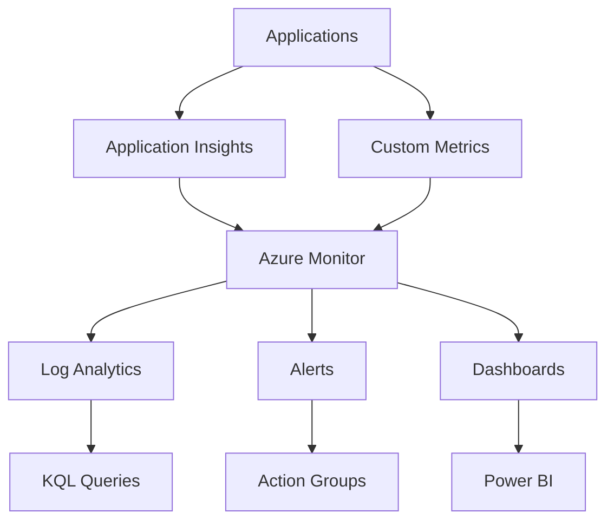

# Monitoring Setup Guide

Comprehensive monitoring configuration for the Mastery AI Code Development Workshop.

## 📊 Monitoring Architecture



## 🔧 Base Configuration

### Application Insights Setup
```bash
# Create Application Insights
az monitor app-insights component create \
  --app workshop-insights \
  --location eastus \
  --resource-group workshop-rg \
  --workspace "/subscriptions/{sub-id}/resourceGroups/{rg}/providers/Microsoft.OperationalInsights/workspaces/{workspace-name}"
```

### SDK Integration

#### Python (Modules 1-20)
```python
# requirements.txt
opencensus-ext-azure==1.1.9
opencensus-ext-logging==0.1.1

# main.py
from opencensus.ext.azure import metrics_exporter
from opencensus.ext.azure.log_exporter import AzureLogHandler
import logging

# Configure logging
logger = logging.getLogger(__name__)
logger.addHandler(AzureLogHandler(
    connection_string='InstrumentationKey=your-key'
))

# Configure metrics
exporter = metrics_exporter.new_metrics_exporter(
    connection_string='InstrumentationKey=your-key'
)

# Track custom events
logger.info('Workshop module started', extra={
    'custom_dimensions': {
        'module': 'module-01',
        'user_id': 'student-123',
        'exercise': 'exercise-1'
    }
})
```

#### .NET (Modules 26, 29)
```csharp
// Program.cs
builder.Services.AddApplicationInsightsTelemetry();
builder.Services.AddSingleton<ITelemetryInitializer, WorkshopTelemetryInitializer>();

// Custom telemetry
public class WorkshopTelemetryInitializer : ITelemetryInitializer
{
    public void Initialize(ITelemetry telemetry)
    {
        telemetry.Context.GlobalProperties["Workshop"] = "Mastery-AI";
        telemetry.Context.GlobalProperties["Module"] = Environment.GetEnvironmentVariable("MODULE_NUMBER");
    }
}
```

## 📈 Module-Specific Monitoring

### Modules 1-5: Fundamentals
```python
# Basic performance tracking
import time
from functools import wraps

def track_performance(func):
    @wraps(func)
    def wrapper(*args, **kwargs):
        start = time.time()
        result = func(*args, **kwargs)
        duration = time.time() - start
        
        logger.info(f'{func.__name__} completed', extra={
            'custom_dimensions': {
                'function': func.__name__,
                'duration_ms': duration * 1000,
                'module': 'fundamentals'
            }
        })
        return result
    return wrapper
```

### Modules 6-10: Web Applications
```python
# FastAPI integration
from fastapi import FastAPI, Request
from opencensus.ext.azure.trace_exporter import AzureExporter
from opencensus.trace.samplers import ProbabilitySampler
from opencensus.trace.tracer import Tracer

app = FastAPI()
tracer = Tracer(
    exporter=AzureExporter(connection_string='InstrumentationKey=your-key'),
    sampler=ProbabilitySampler(1.0)
)

@app.middleware("http")
async def add_telemetry(request: Request, call_next):
    with tracer.span(name=f"{request.method} {request.url.path}") as span:
        span.add_attribute("http.method", request.method)
        span.add_attribute("http.path", request.url.path)
        response = await call_next(request)
        span.add_attribute("http.status_code", response.status_code)
        return response
```

### Modules 11-15: Microservices
```yaml
# Kubernetes monitoring with Prometheus
apiVersion: v1
kind: ConfigMap
metadata:
  name: prometheus-config
data:
  prometheus.yml: |
    global:
      scrape_interval: 15s
    scrape_configs:
      - job_name: 'workshop-services'
        kubernetes_sd_configs:
          - role: pod
        relabel_configs:
          - source_labels: [__meta_kubernetes_pod_annotation_prometheus_io_scrape]
            action: keep
            regex: true
          - source_labels: [__meta_kubernetes_pod_label_workshop_module]
            target_label: module
```

### Modules 16-20: Enterprise
```python
# Distributed tracing
from opentelemetry import trace
from opentelemetry.exporter.otlp.proto.grpc.trace_exporter import OTLPSpanExporter
from opentelemetry.sdk.trace import TracerProvider
from opentelemetry.sdk.trace.export import BatchSpanProcessor

# Configure OpenTelemetry
trace.set_tracer_provider(TracerProvider())
tracer = trace.get_tracer(__name__)

# Add OTLP exporter
otlp_exporter = OTLPSpanExporter(
    endpoint="http://otel-collector:4317",
)
span_processor = BatchSpanProcessor(otlp_exporter)
trace.get_tracer_provider().add_span_processor(span_processor)
```

### Modules 21-25: AI Agents
```python
# AI-specific metrics
from azure.monitor import Metric

class AIMetrics:
    def __init__(self, connection_string):
        self.metrics_client = Metric(connection_string)
    
    def track_llm_call(self, model, tokens_used, latency, success):
        self.metrics_client.track_metric(
            name="llm_call",
            value=1,
            properties={
                "model": model,
                "tokens": tokens_used,
                "latency_ms": latency,
                "success": success
            }
        )
    
    def track_agent_interaction(self, agent_type, action, duration):
        self.metrics_client.track_metric(
            name="agent_interaction",
            value=duration,
            properties={
                "agent_type": agent_type,
                "action": action
            }
        )
```

## 🚨 Alerting Configuration

### Basic Alerts
```json
{
  "alerts": [
    {
      "name": "High Error Rate",
      "condition": "exceptions/count > 10 in last 5 minutes",
      "severity": 2,
      "actions": ["email", "teams"]
    },
    {
      "name": "Slow Response Time",
      "condition": "requests/duration > 3000ms for 90th percentile",
      "severity": 3,
      "actions": ["email"]
    },
    {
      "name": "AI Token Limit",
      "condition": "customMetrics/tokens_used > 100000 in last hour",
      "severity": 1,
      "actions": ["email", "sms"]
    }
  ]
}
```

### KQL Alert Queries
```kql
// Failed authentication attempts
SecurityEvent
| where EventID == 4625
| summarize FailedAttempts = count() by Account, Computer
| where FailedAttempts > 5

// Expensive AI operations
customMetrics
| where name == "llm_call"
| extend cost = todouble(customDimensions.tokens) * 0.002
| summarize TotalCost = sum(cost) by bin(timestamp, 1h)
| where TotalCost > 50
```

## 📊 Dashboards

### Student Progress Dashboard
```json
{
  "widgets": [
    {
      "type": "scorecard",
      "title": "Modules Completed",
      "query": "customEvents | where name == 'module_completed' | summarize count() by tostring(customDimensions.student_id)"
    },
    {
      "type": "linechart",
      "title": "Exercise Completion Time",
      "query": "customMetrics | where name == 'exercise_duration' | summarize avg(value) by bin(timestamp, 1h), tostring(customDimensions.module)"
    },
    {
      "type": "piechart",
      "title": "Error Distribution",
      "query": "exceptions | summarize count() by type"
    }
  ]
}
```

### Infrastructure Dashboard
```kql
// Resource utilization
Perf
| where ObjectName == "Processor" and CounterName == "% Processor Time"
| summarize AvgCPU = avg(CounterValue) by Computer, bin(TimeGenerated, 5m)
| render timechart

// Memory usage
Perf
| where ObjectName == "Memory" and CounterName == "Available MBytes"
| summarize AvgMemory = avg(CounterValue) by Computer, bin(TimeGenerated, 5m)
| render timechart
```

## 🔍 Log Queries

### Useful KQL Queries
```kql
// Module completion tracking
customEvents
| where name == "module_completed"
| extend Module = tostring(customDimensions.module)
| extend Duration = todatetime(customDimensions.end_time) - todatetime(customDimensions.start_time)
| summarize AvgDuration = avg(Duration), Completions = count() by Module
| order by Module asc

// Error analysis
exceptions
| where timestamp > ago(1d)
| extend Module = tostring(customDimensions.module)
| summarize ErrorCount = count(), UniqueErrors = dcount(type) by Module, type
| order by ErrorCount desc

// Performance analysis
requests
| where timestamp > ago(1h)
| summarize percentiles(duration, 50, 90, 99) by name
| order by percentile_duration_99 desc
```

## 🛠️ Troubleshooting

### Common Issues

#### Missing Telemetry
```python
# Debug telemetry
import logging
logging.basicConfig(level=logging.DEBUG)
logging.getLogger('opencensus').setLevel(logging.DEBUG)

# Verify connection
from azure.monitor import validate_instrumentation_key
is_valid = validate_instrumentation_key("your-key")
```

#### High Costs
```kql
// Identify high-volume telemetry
union *
| summarize Count = count(), Size = sum(estimate_data_size(*)) by $table
| order by Size desc
```

## 📚 Best Practices

1. **Sampling**: Use adaptive sampling for high-volume apps
2. **Custom Dimensions**: Add context to all telemetry
3. **Correlation**: Use operation IDs for request tracking
4. **Retention**: Configure appropriate data retention
5. **Costs**: Monitor ingestion volume

## 🔗 Integration Points

- **GitHub Actions**: Send deployment markers
- **Azure DevOps**: Link work items to telemetry
- **Power BI**: Create executive dashboards
- **Teams**: Send alerts to channels
- **PagerDuty**: Escalate critical issues

Remember: Good monitoring is the foundation of operational excellence!
