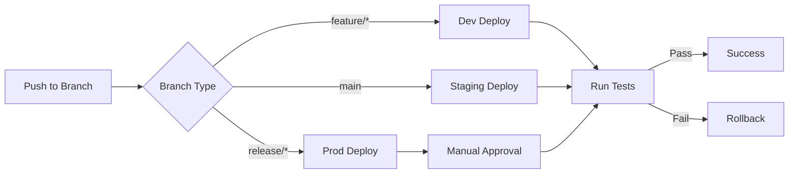

# 🔄 GitHub Actions Workflows

This directory contains reusable GitHub Actions workflows for the Mastery AI Workshop CI/CD pipeline.

## 📋 Available Workflows

### deploy-module.yml
Reusable workflow for deploying individual workshop modules to Azure.

**Features:**
- Environment-specific deployments
- Infrastructure provisioning
- Application deployment
- Automated testing
- Rollback capabilities

## 🚀 Using Reusable Workflows

### In Your Workflow
```yaml
name: Deploy Module

on:
  push:
    branches: [main]
    paths:
      - 'modules/module-01/**'

jobs:
  deploy:
    uses: ./.github/workflows/deploy-module.yml
    with:
      module-number: 01
      environment: dev
    secrets:
      AZURE_CREDENTIALS: ${{ secrets.AZURE_CREDENTIALS }}
```

### Workflow Inputs
```yaml
inputs:
  module-number:
    description: 'Module number to deploy (01-30)'
    required: true
    type: string
  
  environment:
    description: 'Target environment (dev/staging/prod)'
    required: true
    type: string
    default: 'dev'
  
  run-tests:
    description: 'Run tests after deployment'
    required: false
    type: boolean
    default: true
```

## 📁 Workflow Structure

### Standard Workflow Pattern
```yaml
name: Workflow Name
description: Clear description of workflow purpose

on:
  workflow_call:  # For reusable workflows
    inputs:
      # Define inputs
    secrets:
      # Define required secrets

jobs:
  validate:
    # Pre-deployment validation
    
  deploy:
    # Main deployment logic
    
  test:
    # Post-deployment testing
    
  rollback:
    # Rollback on failure
    if: failure()
```

## 🔧 Creating New Workflows

### Workflow Template
```yaml
name: New Reusable Workflow

on:
  workflow_call:
    inputs:
      parameter-name:
        description: 'Parameter description'
        required: true
        type: string
    secrets:
      SECRET_NAME:
        description: 'Secret description'
        required: true

env:
  # Global environment variables
  AZURE_REGION: 'eastus'

jobs:
  job-name:
    runs-on: ubuntu-latest
    
    steps:
      - name: Checkout code
        uses: actions/checkout@v4
      
      - name: Your step here
        run: |
          echo "Implementing workflow logic"
```

## 🔐 Required Secrets

### Repository Secrets
Configure these in Settings → Secrets → Actions:

| Secret Name | Description | Example |
|-------------|-------------|---------|
| AZURE_CREDENTIALS | Service principal credentials | `{"clientId":"...","clientSecret":"..."}` |
| AZURE_SUBSCRIPTION_ID | Azure subscription ID | `12345678-1234-1234-1234-123456789012` |
| GITHUB_TOKEN | Auto-provided by GitHub | Automatic |

### Environment Secrets
Configure per environment:
- Development
- Staging
- Production

## 🏷️ Best Practices

### 1. Idempotency
Make workflows idempotent:
```yaml
- name: Check if resource exists
  id: check
  run: |
    exists=$(az resource show --name $RESOURCE_NAME 2>/dev/null || echo "false")
    echo "exists=$exists" >> $GITHUB_OUTPUT

- name: Create resource
  if: steps.check.outputs.exists == 'false'
  run: |
    az resource create --name $RESOURCE_NAME
```

### 2. Error Handling
```yaml
- name: Deploy with retry
  uses: nick-invision/retry@v2
  with:
    timeout_minutes: 10
    max_attempts: 3
    command: |
      az deployment group create \
        --resource-group $RG_NAME \
        --template-file template.json
```

### 3. Caching
```yaml
- name: Cache dependencies
  uses: actions/cache@v3
  with:
    path: ~/.cache
    key: ${{ runner.os }}-${{ hashFiles('**/requirements.txt') }}
```

### 4. Artifacts
```yaml
- name: Upload deployment logs
  uses: actions/upload-artifact@v3
  if: always()
  with:
    name: deployment-logs
    path: logs/
    retention-days: 7
```

## 📊 Workflow Matrix

### Multi-Environment Deployment
```yaml
strategy:
  matrix:
    environment: [dev, staging, prod]
    module: [01, 02, 03]
  
  jobs:
    deploy:
      uses: ./.github/workflows/deploy-module.yml
      with:
        module-number: ${{ matrix.module }}
        environment: ${{ matrix.environment }}
```

## 🔄 CI/CD Pipeline



## 📝 Workflow Documentation

Each workflow should include:
1. **Purpose**: Clear description
2. **Triggers**: When it runs
3. **Inputs**: Required parameters
4. **Secrets**: Required secrets
5. **Outputs**: What it produces
6. **Example**: Usage example

## 🐛 Debugging Workflows

### Enable Debug Logging
1. Set secret `ACTIONS_STEP_DEBUG` to `true`
2. Set secret `ACTIONS_RUNNER_DEBUG` to `true`

### Local Testing
```bash
# Using act (https://github.com/nektos/act)
act -W .github/workflows/workflow.yml
```

## 📚 Resources

- [GitHub Actions Documentation](https://docs.github.com/actions)
- [Reusable Workflows](https://docs.github.com/actions/using-workflows/reusing-workflows)
- [Azure Actions](https://github.com/Azure/actions)
- [Action Marketplace](https://github.com/marketplace?type=actions)

## 🤝 Contributing

To add new workflows:
1. Create workflow file in this directory
2. Follow naming convention: `action-purpose.yml`
3. Include comprehensive documentation
4. Test in dev environment first
5. Update this README
