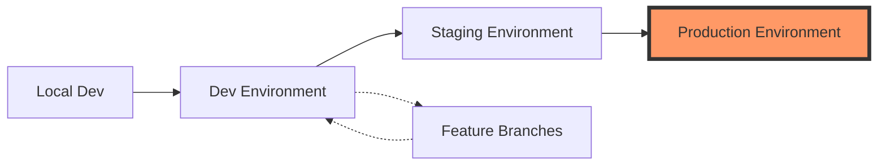

# Terraform Environments

This directory contains environment-specific Terraform configurations for the Mastery AI Workshop.

## 🌍 Available Environments

| Environment | Purpose | Status | Folder |
|-------------|---------|--------|--------|
| Development | Developer testing, experiments | ✅ Active | [dev/](./dev/) |
| Staging | Pre-production validation | ✅ Active | [staging/](./staging/) |
| Production | Live workshop environment | ✅ Active | [prod/](./prod/) |

## 📋 Environment Overview

### Development (dev)
- **Purpose**: Rapid iteration and testing
- **Characteristics**:
  - Minimal resources
  - Cost-optimized
  - Auto-shutdown enabled
  - Relaxed security policies
- **Target Users**: Developers, individual learners

### Staging
- **Purpose**: Production validation
- **Characteristics**:
  - Production-like configuration
  - Full feature set
  - Performance testing ready
  - Security hardened
- **Target Users**: QA team, workshop instructors

### Production (prod)
- **Purpose**: Live workshop delivery
- **Characteristics**:
  - High availability
  - Full redundancy
  - Maximum security
  - Complete monitoring
- **Target Users**: Workshop participants

## 🚀 Deployment Flow



## 📁 Environment Structure

Each environment contains:
```
environment-name/
├── README.md           # Environment-specific documentation
├── main.tf            # Main configuration
├── variables.tf       # Variable definitions
├── outputs.tf         # Output values
├── backend.tf         # State storage configuration
├── terraform.tfvars.example  # Example variables
└── .terraform.lock.hcl      # Lock file (committed)
```

## 🔧 Working with Environments

### Switching Environments
```bash
# Navigate to environment
cd environments/dev

# Initialize
terraform init

# Plan changes
terraform plan

# Apply changes
terraform apply
```

### Environment Variables
Each environment uses specific variables:
```bash
# Development
export TF_VAR_environment="dev"
export TF_VAR_enable_auto_shutdown=true

# Staging
export TF_VAR_environment="staging"
export TF_VAR_enable_monitoring=true

# Production
export TF_VAR_environment="prod"
export TF_VAR_enable_high_availability=true
```

## 🔒 State Management

Each environment has isolated state:

| Environment | Storage Account | Container | Key |
|-------------|-----------------|-----------|-----|
| dev | stmasteryaitfstate | tfstate | dev.terraform.tfstate |
| staging | stmasteryaitfstate | tfstate | staging.terraform.tfstate |
| prod | stmasteryaitfstateprod | tfstate-prod | prod.terraform.tfstate |

## 📊 Resource Allocation

### Development
- **Compute**: Basic tiers, single instances
- **Storage**: LRS replication
- **Network**: Simple configuration
- **AI Services**: Minimal capacity

### Staging
- **Compute**: Standard tiers, limited redundancy
- **Storage**: ZRS replication
- **Network**: Production-like with some relaxations
- **AI Services**: Production capacity

### Production
- **Compute**: Premium tiers, full redundancy
- **Storage**: GRS/GZRS replication
- **Network**: Complete security, private endpoints
- **AI Services**: Maximum capacity, multi-region

## 🏷️ Tagging Strategy

All environments use consistent base tags:
```hcl
locals {
  base_tags = {
    Project     = "MasteryAIWorkshop"
    ManagedBy   = "Terraform"
    Repository  = "github.com/your-org/mastery-ai-workshop"
    CostCenter  = var.cost_center
  }
  
  environment_tags = {
    Environment = var.environment
    Purpose     = var.environment_purpose
  }
  
  tags = merge(local.base_tags, local.environment_tags, var.additional_tags)
}
```

## 💰 Cost Management

### Estimated Monthly Costs
- **Development**: $200-500
- **Staging**: $800-1500
- **Production**: $3000-5000

### Cost Optimization
1. **Dev**: Auto-shutdown, spot instances
2. **Staging**: Scheduled scaling, reserved capacity
3. **Production**: Reserved instances, autoscaling

## 🔄 Promotion Process

### Dev → Staging
1. Complete testing in dev
2. Create PR with changes
3. Review and approve
4. Merge to staging branch
5. Automated deployment

### Staging → Production
1. Complete UAT in staging
2. Performance validation
3. Security review
4. Change board approval
5. Scheduled deployment

## 📝 Environment-Specific Features

### Development Only
- Simplified authentication
- Public endpoints allowed
- Relaxed network policies
- Debug logging enabled

### Staging & Production
- Multi-factor authentication
- Private endpoints only
- Strict network policies
- Structured logging

### Production Only
- Geo-redundancy
- Automated backups
- Disaster recovery
- 24/7 monitoring

## 🚨 Important Notes

1. **Never** copy production data to lower environments
2. **Always** test changes in dev first
3. **Follow** the promotion process
4. **Document** any environment-specific changes
5. **Monitor** costs regularly

## 📚 Additional Resources

- [Environment Isolation Best Practices](https://www.terraform.io/docs/cloud/workspaces/index.html)
- [Azure Environment Strategy](https://docs.microsoft.com/azure/cloud-adoption-framework/ready/enterprise-scale/testing-approach)
- [Cost Management Guidelines](../../../docs/cost-optimization.md)
