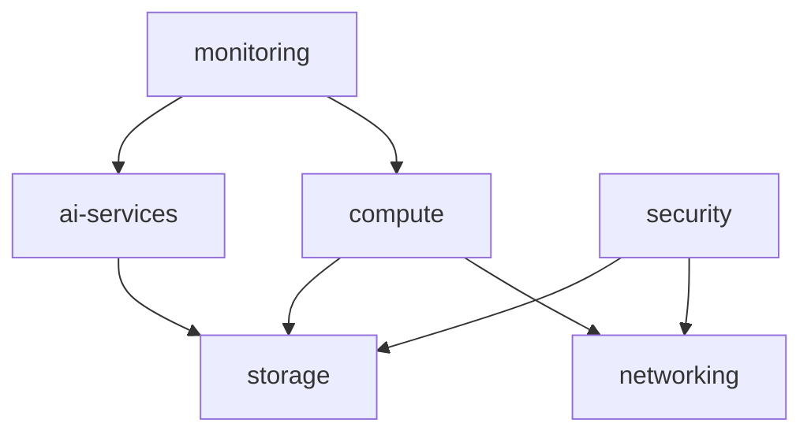

# Terraform Modules

This directory contains reusable Terraform modules for the Mastery AI Workshop infrastructure.

## 📦 Module Catalog

### Core Infrastructure

| Module | Description | Status |
|--------|-------------|--------|
| [ai-services](./ai-services/) | Azure AI services (OpenAI, Search, Cosmos DB) | ✅ Ready |
| [compute](./compute/) | Compute resources (AKS, Functions, Containers) | ✅ Ready |
| [networking](./networking/) | Network infrastructure (VNet, NSG, Private Endpoints) | ✅ Ready |
| [storage](./storage/) | Storage solutions (Accounts, SQL, Redis) | ✅ Ready |
| [monitoring](./monitoring/) | Observability stack (Log Analytics, App Insights) | ✅ Ready |

### Planned Modules

| Module | Description | Status |
|--------|-------------|--------|
| security | Key Vault, Managed Identity, RBAC | 🚧 Planned |
| devops | GitHub integration, pipelines | 🚧 Planned |
| governance | Policies, blueprints, compliance | 🚧 Planned |

## 🚀 Using Modules

### Basic Usage
```hcl
module "ai_services" {
  source = "./modules/ai-services"
  
  resource_group_name = azurerm_resource_group.main.name
  location           = azurerm_resource_group.main.location
  environment        = "dev"
  project_name       = "masteryai"
  
  # Module-specific configuration
  openai_config = {
    sku_name = "S0"
    deployments = [...]
  }
  
  tags = local.common_tags
}
```

### Remote Module Usage
```hcl
module "networking" {
  source = "git::https://github.com/your-org/terraform-modules.git//networking?ref=v1.0.0"
  
  # Configuration
}
```

## 📐 Module Structure

Each module follows this standard structure:
```
module-name/
├── README.md           # Module documentation
├── main.tf            # Main resource definitions
├── variables.tf       # Input variable declarations
├── outputs.tf         # Output value declarations
├── versions.tf        # Provider version constraints
├── examples/          # Usage examples
│   └── basic/
│       ├── main.tf
│       └── outputs.tf
└── tests/             # Module tests
    └── basic_test.go
```

## 🔧 Module Development Guidelines

### 1. Naming Conventions
- Use lowercase with hyphens
- Be descriptive but concise
- Follow `resource-type` pattern

### 2. Input Variables
```hcl
variable "resource_group_name" {
  description = "Name of the resource group"
  type        = string
  validation {
    condition     = length(var.resource_group_name) > 0
    error_message = "Resource group name cannot be empty."
  }
}
```

### 3. Resource Naming
```hcl
locals {
  name_prefix = "${var.project_name}-${var.environment}"
  
  # Use consistent naming
  storage_account_name = "${replace(local.name_prefix, "-", "")}${var.unique_suffix}"
}
```

### 4. Outputs
```hcl
output "resource_id" {
  description = "The ID of the created resource"
  value       = azurerm_resource.main.id
}

output "connection_string" {
  description = "Connection string for the resource"
  value       = azurerm_resource.main.connection_string
  sensitive   = true
}
```

### 5. Tagging Strategy
```hcl
variable "tags" {
  description = "A mapping of tags to assign to resources"
  type        = map(string)
  default     = {}
}

# Merge with default tags
locals {
  tags = merge(
    var.tags,
    {
      Module      = "module-name"
      ManagedBy   = "Terraform"
      Environment = var.environment
    }
  )
}
```

## 🧪 Testing Modules

### Unit Tests
```bash
cd modules/module-name/tests
go test -v
```

### Integration Tests
```bash
# Test with example configuration
cd modules/module-name/examples/basic
terraform init
terraform plan
terraform apply -auto-approve
terraform destroy -auto-approve
```

### Validation
```bash
# Validate module syntax
terraform fmt -check -recursive modules/
terraform validate
```

## 📊 Module Versioning

### Semantic Versioning
- **MAJOR**: Breaking changes
- **MINOR**: New features (backward compatible)
- **PATCH**: Bug fixes

### Tagging Releases
```bash
git tag -a "modules/ai-services/v1.0.0" -m "Initial release"
git push origin "modules/ai-services/v1.0.0"
```

## 🔍 Module Dependencies



## 📚 Best Practices

1. **Modularity**: Keep modules focused on a single concern
2. **Flexibility**: Use variables for customization
3. **Defaults**: Provide sensible defaults
4. **Documentation**: Include comprehensive README
5. **Examples**: Provide working examples
6. **Testing**: Include automated tests
7. **Versioning**: Use semantic versioning
8. **Security**: Never hardcode secrets

## 🤝 Contributing

To contribute a new module:
1. Follow the module structure
2. Include documentation
3. Add examples
4. Write tests
5. Submit PR with description

## 📖 Additional Resources

- [Terraform Module Registry](https://registry.terraform.io/browse/modules)
- [Azure Terraform Modules](https://github.com/Azure/terraform-azurerm-modules)
- [Module Best Practices](https://www.terraform.io/docs/modules/index.html)
