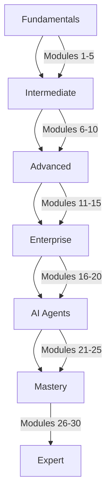

# 📚 Workshop Modules

Welcome to the **Mastery AI Code Development Workshop** modules! This directory contains 30 comprehensive modules that will take you from AI development fundamentals to advanced multi-agent orchestration.

## 🎯 Learning Path Overview

### 🟢 **Fundamentals Track** (Modules 1-5)
Perfect for beginners, these modules introduce core AI development concepts with GitHub Copilot.

| Module | Title | Duration |
|--------|-------|----------|
| [Module 01](./module-01/) | Introduction to AI-Powered Development | 3 hours |
| [Module 02](./module-02/) | GitHub Copilot Core Features | 3 hours |
| [Module 03](./module-03/) | Effective Prompting Techniques | 3 hours |
| [Module 04](./module-04/) | AI-Assisted Debugging and Testing | 3 hours |
| [Module 05](./module-05/) | Documentation and Code Quality | 3 hours |

### 🔵 **Intermediate Track** (Modules 6-10)
Build real applications using AI assistance across multiple files and frameworks.

| Module | Title | Duration |
|--------|-------|----------|
| [Module 06](./module-06/) | Multi-File Projects and Workspaces | 3 hours |
| [Module 07](./module-07/) | Building Web Applications with AI | 3 hours |
| [Module 08](./module-08/) | API Development and Integration | 3 hours |
| [Module 09](./module-09/) | Database Design and Optimization | 3 hours |
| [Module 10](./module-10/) | Real-time and Event-Driven Systems | 3 hours |

### 🟠 **Advanced Track** (Modules 11-15)
Master cloud-native architectures and enterprise patterns with AI assistance.

| Module | Title | Duration |
|--------|-------|----------|
| [Module 11](./module-11/) | Microservices Architecture | 3 hours |
| [Module 12](./module-12/) | Cloud-Native Development | 3 hours |
| [Module 13](./module-13/) | Infrastructure as Code | 3 hours |
| [Module 14](./module-14/) | CI/CD with GitHub Actions | 3 hours |
| [Module 15](./module-15/) | Performance and Scalability | 3 hours |

### 🔴 **Enterprise Track** (Modules 16-20)
Enterprise-grade security, integration patterns, and production deployment strategies.

| Module | Title | Duration |
|--------|-------|----------|
| [Module 16](./module-16/) | Security Implementation | 3 hours |
| [Module 17](./module-17/) | GitHub Models and AI Integration | 3 hours |
| [Module 18](./module-18/) | Enterprise Integration Patterns | 3 hours |
| [Module 19](./module-19/) | Monitoring and Observability | 3 hours |
| [Module 20](./module-20/) | Production Deployment Strategies | 3 hours |

### 🟣 **AI Agents Track** (Modules 21-25)
Deep dive into building AI agents and implementing the Model Context Protocol.

| Module | Title | Duration |
|--------|-------|----------|
| [Module 21](./module-21/) | Introduction to AI Agents | 3 hours |
| [Module 22](./module-22/) | Building Custom Agents | 3 hours |
| [Module 23](./module-23/) | Model Context Protocol (MCP) | 3 hours |
| [Module 24](./module-24/) | Multi-Agent Orchestration | 3 hours |
| [Module 25](./module-25/) | Advanced Agent Patterns | 3 hours |

### ⭐ **Enterprise Mastery** (Modules 26-28)
Specialized tracks for enterprise technologies and modernization.

| Module | Title | Duration |
|--------|-------|----------|
| [Module 26](./module-26/) | Enterprise .NET Development | 3 hours |
| [Module 27](./module-27/) | COBOL Modernization | 3 hours |
| [Module 28](./module-28/) | Shift-Left Security & DevOps | 3 hours |

### 🏆 **Mastery Validation** (Modules 29-30)
Prove your mastery with comprehensive reviews and challenges.

| Module | Title | Duration |
|--------|-------|----------|
| [Module 29](./module-29/) | Complete Enterprise Review | 3 hours |
| [Module 30](./module-30/) | Ultimate Mastery Challenge | 3 hours |

## 📋 Module Structure

Each module follows a consistent structure:

```
module-XX/
├── README.md                 # Module overview and objectives
├── prerequisites.md          # Module-specific requirements
├── exercises/               # Hands-on exercises
│   ├── exercise1-easy/      # ⭐ Beginner exercise (30-45 min)
│   ├── exercise2-medium/    # ⭐⭐ Intermediate exercise (45-60 min)
│   └── exercise3-hard/      # ⭐⭐⭐ Advanced exercise (60-90 min)
├── best-practices.md        # Production patterns and tips
├── resources/               # Additional resources
│   ├── slides/             # Presentation materials
│   ├── diagrams/           # Architecture diagrams
│   └── code-samples/       # Reference implementations
└── troubleshooting.md      # Common issues and solutions
```

## 🚀 Getting Started

1. **Check Prerequisites**: Review the [global prerequisites](../PREREQUISITES.md) and module-specific requirements
2. **Set Up Environment**: Run the setup script for your module
3. **Follow the Path**: Complete modules in order for the best learning experience
4. **Practice**: Each exercise builds on previous knowledge
5. **Apply**: Use the independent project to solidify your learning

## 💡 Learning Tips

- **Take Your Time**: Each module is designed for ~3 hours, but go at your own pace
- **Practice Actively**: Type out code examples rather than copying
- **Experiment**: Try variations of the exercises
- **Ask Questions**: Use GitHub Discussions for help
- **Review**: Revisit earlier modules to reinforce concepts

## 🎯 Success Metrics

Track your progress:
- [ ] Complete all exercises in each module
- [ ] Pass the self-assessment quizzes
- [ ] Build the independent project
- [ ] Apply concepts to real work
- [ ] Share your learning with others

## 🛠️ Technology Stack

Primary technologies covered:
- **Languages**: Python (primary), JavaScript/TypeScript, C#/.NET, COBOL
- **AI Tools**: GitHub Copilot, GitHub Models, Azure OpenAI
- **Cloud**: Azure (AI Foundry, Functions, AKS, Cosmos DB)
- **DevOps**: GitHub Actions, Docker, Kubernetes
- **Protocols**: Model Context Protocol (MCP), REST, GraphQL

## 📈 Skill Progression



## 🤝 Contributing

Found an issue or want to improve a module? Please:
1. Check existing issues
2. Create a detailed bug report or enhancement request
3. Submit a pull request with improvements

## 📞 Support

- **Module Issues**: Check the module's troubleshooting.md
- **General Questions**: See the [FAQ](../FAQ.md)
- **Technical Problems**: Review [TROUBLESHOOTING.md](../TROUBLESHOOTING.md)
- **Community**: Join GitHub Discussions

---

**Ready to begin?** Start with [Module 01](./module-01/) and begin your journey to AI development mastery! 🚀
