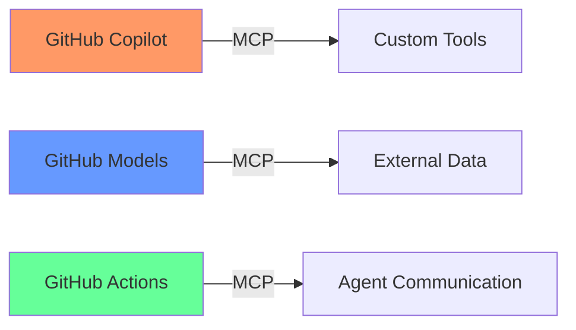
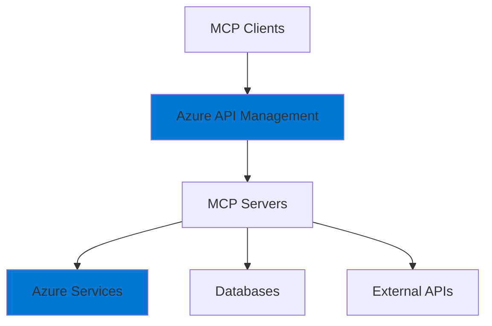

# 🔌 Model Context Protocol (MCP) - Workshop Integration Guide

## What is MCP and Why It Matters

Model Context Protocol (MCP) is the standardized way for AI agents to communicate with external systems and tools. It's becoming the universal language for AI integration, making it essential for modern developers.

## 🎯 MCP Learning Journey

### First Introduction (Module 3)
**Basic Awareness**
- Understanding context in AI
- How models access information
- Simple context examples

### Practical Usage (Module 17)
**GitHub Models Integration**
- Using MCP-enabled models
- Basic tool calling
- Context window management

### Deep Dive (Module 23)
**Complete MCP Mastery**
- Protocol architecture
- Building MCP servers
- Creating MCP clients
- Security implementation

### Advanced Application (Modules 24-25)
**Enterprise Implementation**
- Multi-agent MCP communication
- Complex tool orchestration
- Production deployment

## 📊 MCP Coverage by Module

| Module | MCP Coverage | Depth | Practical Application |
|--------|--------------|-------|----------------------|
| 3 | Context concepts | Basic | Prompting with context |
| 17 | MCP consumption | Medium | Using MCP-enabled models |
| 21 | Agent integration | Medium | Agents using MCP tools |
| 22 | Custom tools | Advanced | Building MCP tools |
| **23** | **Full MCP** | **Expert** | **Complete implementation** |
| 24 | Orchestration | Expert | Multi-agent MCP |
| 25 | Patterns | Expert | Advanced MCP patterns |
| 26-30 | Applied MCP | Expert | Enterprise usage |

## 🛠️ MCP Skills Progression

### Level 1: MCP Consumer (Modules 1-20)
```javascript
// Using MCP-enabled tools
const result = await mcp.callTool('database-query', {
  query: 'SELECT * FROM users'
});
```

### Level 2: MCP Developer (Module 23)
```javascript
// Building MCP servers
class CustomMCPServer {
  async handleRequest(method, params) {
    switch(method) {
      case 'tools/list':
        return this.getAvailableTools();
      case 'tools/call':
        return this.executeTool(params);
    }
  }
}
```

### Level 3: MCP Architect (Modules 24-25)
```javascript
// Orchestrating MCP systems
class MCPOrchestrator {
  async coordinateAgents(workflow) {
    const agents = await this.initializeAgents();
    const context = await this.establishMCPContext();
    return this.executeWorkflow(agents, context);
  }
}
```

## 🔗 MCP Integration Points

### With GitHub Ecosystem


### With Azure Services


## 💡 Why MCP is Revolutionary

### 1. **Standardization**
- One protocol for all AI tools
- Consistent integration patterns
- Reduced complexity

### 2. **Flexibility**
- Any language implementation
- Any deployment model
- Any security approach

### 3. **Scalability**
- From single tools to enterprise
- Distributed architectures
- High-performance scenarios

### 4. **Security**
- Built-in authentication
- Encrypted communication
- Audit capabilities

## 📚 MCP Learning Resources by Module

### Module 23 Focus Areas
1. **MCP Fundamentals**
   - Protocol specification
   - Message formats
   - Transport mechanisms

2. **Server Development**
   - Request handling
   - Tool registration
   - Error management

3. **Client Implementation**
   - Connection management
   - Request formatting
   - Response processing

4. **Security & Production**
   - Authentication methods
   - Rate limiting
   - Monitoring

## 🎯 MCP Practical Projects

### After Module 23
**Build These MCP Servers**:
1. **Database MCP Server**: Secure database access
2. **API MCP Gateway**: REST API integration
3. **File System MCP**: Safe file operations
4. **Custom Tool Server**: Domain-specific tools

### After Module 24
**Multi-Agent MCP Systems**:
1. **Distributed Search**: Agents querying multiple sources
2. **Data Pipeline**: Agents processing data streams
3. **Workflow Automation**: Complex business processes

### After Module 25
**Enterprise MCP Platform**:
1. **MCP Service Mesh**: Full enterprise integration
2. **MCP Security Gateway**: Enterprise authentication
3. **MCP Monitoring**: Complete observability

## 🔍 MCP Best Practices Taught

### Design Principles
- ✅ Stateless servers
- ✅ Idempotent operations  
- ✅ Clear error messages
- ✅ Comprehensive logging

### Security First
- ✅ Always authenticate
- ✅ Validate all inputs
- ✅ Rate limit requests
- ✅ Audit all actions

### Performance
- ✅ Async operations
- ✅ Connection pooling
- ✅ Response caching
- ✅ Load balancing

## 📊 MCP Mastery Metrics

After completing MCP modules, you'll be able to:

| Skill | Proficiency | Real-World Application |
|-------|-------------|------------------------|
| Read MCP specs | 100% | Understand any MCP system |
| Build MCP servers | 95% | Create production servers |
| Implement clients | 95% | Integrate any MCP service |
| Debug MCP issues | 90% | Troubleshoot complex problems |
| Design MCP systems | 85% | Architect enterprise solutions |

## 🚀 The MCP Advantage

### For Developers
- **Universal Integration**: Connect any AI to any system
- **Career Growth**: Rare and valuable skill
- **Innovation Power**: Build things not possible before

### For Organizations  
- **Vendor Independence**: Not locked to specific AI providers
- **Future Proof**: Standard protocol adoption
- **Cost Efficiency**: Reuse integrations across AI models

## 🎓 MCP Certification Path

Completing the MCP modules provides:
1. **MCP Developer Certificate** (Module 23)
2. **MCP Architect Certificate** (Modules 24-25)
3. **MCP Enterprise Specialist** (Full workshop)

---

## 🌟 Why MCP Matters for Your Future

MCP is becoming the HTTP of AI - a fundamental protocol that every AI developer must master. By deeply integrating MCP throughout the workshop, you'll be prepared for:

- **The AI Integration Era**: Where every system talks to AI
- **Agent Ecosystems**: Where agents collaborate seamlessly
- **Enterprise AI**: Where security and standards matter
- **Innovation Opportunities**: Where new possibilities emerge

**Master MCP, Master the Future of AI Development!** 🚀