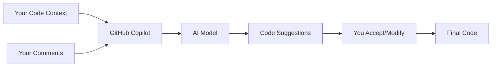

# Module 01: Introduction to AI-Powered Development 🚀

## Welcome to Your AI Development Journey!

This is where your transformation begins. In this foundational module, you'll set up GitHub Copilot, write your first AI-assisted code, and learn the fundamental principles that will accelerate your development speed by 2-3x immediately.

### Duration
- **Total Time**: 3 hours
- **Lecture/Demo**: 45 minutes
- **Hands-on Exercises**: 2 hours 15 minutes

### Track
- 🟢 Fundamentals Track (Modules 1-5)

## 🎯 Learning Objectives

By the end of this module, you will be able to:

1. **Set Up GitHub Copilot** - Configure your development environment for AI-powered coding
2. **Write AI-Assisted Code** - Generate your first functions and classes with Copilot
3. **Master Basic Prompts** - Understand how to communicate effectively with AI
4. **Understand AI Pair Programming** - Learn the fundamentals of human-AI collaboration
5. **Apply Best Practices** - Start using AI responsibly and effectively

## 🔧 Prerequisites

Before starting this module, ensure you have:
- ✅ Basic programming knowledge (any language)
- ✅ VS Code installed
- ✅ GitHub account with Copilot subscription
- ✅ Git installed and configured
- ✅ Python 3.8+ installed

See [prerequisites.md](prerequisites.md) for detailed setup instructions.

## 📚 Module Content

### Part 1: Understanding AI-Powered Development (45 minutes)

#### What is GitHub Copilot?
GitHub Copilot is your AI pair programmer that helps you write code faster and with less effort. It draws context from comments and code to suggest individual lines and whole functions instantly.

#### How Does It Work?

#### Key Concepts
- **Context-Aware Suggestions**: Copilot understands your project
- **Natural Language to Code**: Write comments, get code
- **Multi-Language Support**: Works with Python, JavaScript, TypeScript, and more
- **Learning Tool**: Discover new APIs and patterns

### Part 2: Hands-on Exercises (2 hours 15 minutes)

#### Exercise 1: Hello AI World (⭐ Easy - 30 minutes)
Your first AI-assisted program

#### Exercise 2: Smart Calculator (⭐⭐ Medium - 45 minutes)
Build a calculator with natural language input

#### Exercise 3: Personal Assistant (⭐⭐⭐ Hard - 60 minutes)
Create a CLI tool that manages tasks with AI

### Part 3: Best Practices

Learn production-ready patterns for:
- Writing effective prompts
- Reviewing AI-generated code
- Security considerations
- Performance optimization

## 🛠️ Tools and Technologies

- **GitHub Copilot**: AI pair programmer
- **VS Code**: Primary IDE
- **Python**: Programming language for exercises
- **Git**: Version control

## 📖 Resources

### Official Documentation
- [GitHub Copilot Documentation](https://docs.github.com/copilot)
- [VS Code Copilot Guide](https://code.visualstudio.com/docs/copilot/overview)
- [GitHub Copilot Best Practices](https://github.blog/2023-06-20-how-to-write-better-prompts-for-github-copilot/)

### Additional Learning
- [Microsoft Learn: GitHub Copilot Fundamentals](https://learn.microsoft.com/training/modules/introduction-to-github-copilot/)
- [GitHub Skills: Copilot](https://skills.github.com/)

## 🎯 Success Criteria

You'll know you've mastered this module when you can:
- ✅ Generate complete functions from comments
- ✅ Use Copilot to explore new libraries
- ✅ Write code 2x faster than before
- ✅ Identify when to accept, modify, or reject suggestions
- ✅ Apply security best practices to AI-generated code

## 🚀 Ready to Start?

1. Complete the [prerequisites](prerequisites.md)
2. Begin with [Exercise 1](exercises/exercise1-easy/README.md)
3. Share your progress in the discussion forum
4. Get ready to transform how you code!

---

> 💡 **Remember**: GitHub Copilot is a tool to enhance your abilities, not replace your thinking. Always review and understand the code it generates.

## 🏆 Module Completion

Upon completing all exercises and the independent project, you'll earn:
- **AI Development Beginner** badge
- Access to Module 2: Mastering GitHub Copilot
- Certificate of completion

Happy coding with AI! 🎉