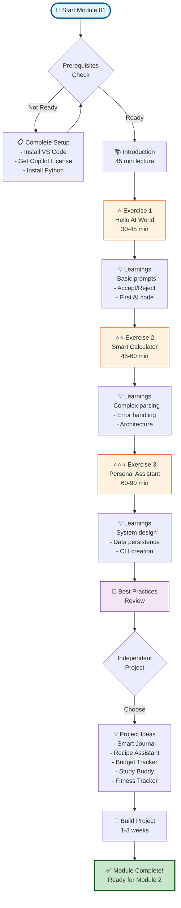
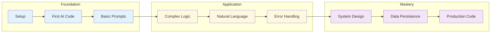
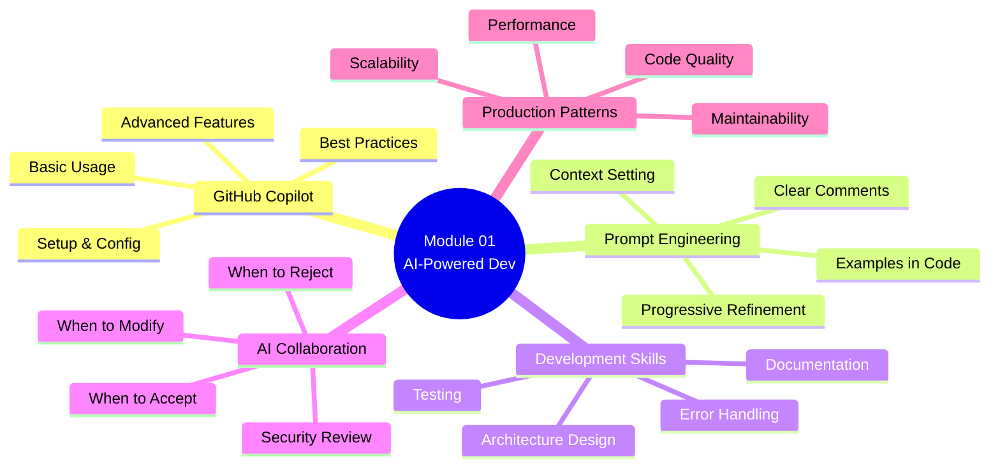
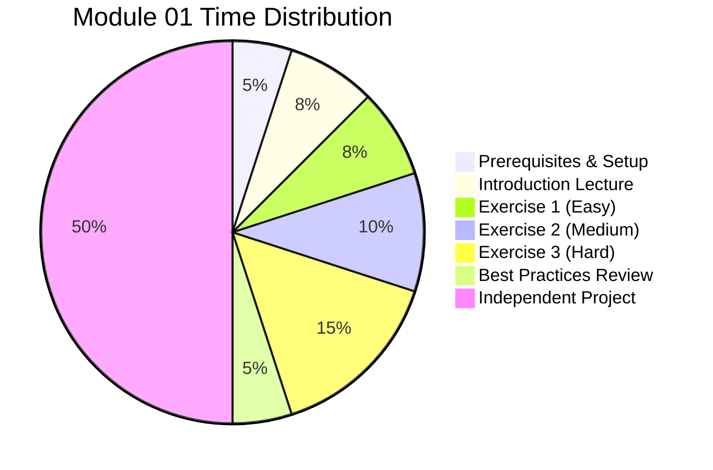
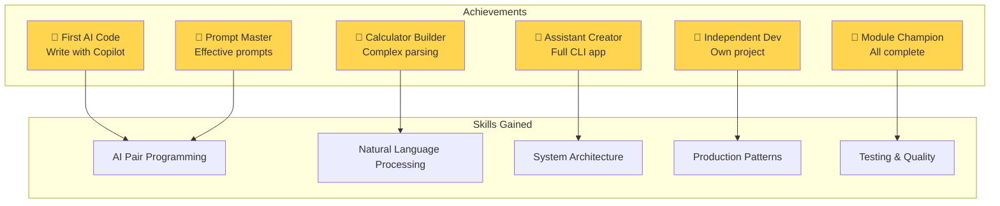
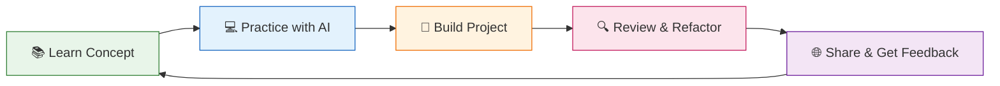
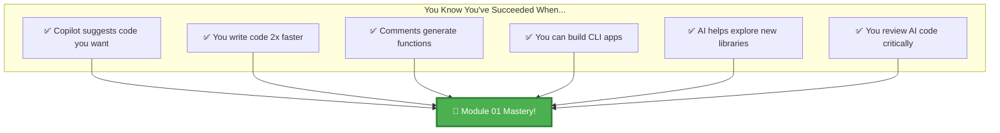
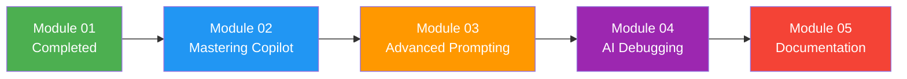

# Module 01: Visual Learning Journey 🗺️

## Your Path Through AI-Powered Development

## 🎯 Learning Progression

## 💡 Skill Development Map

## 📊 Time Investment Breakdown

## 🏆 Achievement Unlocks

## 🔄 Continuous Learning Cycle

## 🎯 Module 01 Success Metrics

## 🚀 Next Steps

After completing Module 01, you're ready for:

---

## 🎉 Congratulations!

You've completed your visual journey through Module 01. These diagrams represent your learning path and the skills you've gained. Keep this as a reference as you continue your AI development mastery journey!

**Remember**: Every expert was once a beginner. You've taken the first crucial steps! 🌟