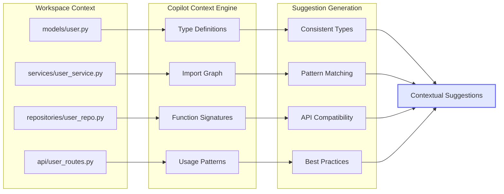
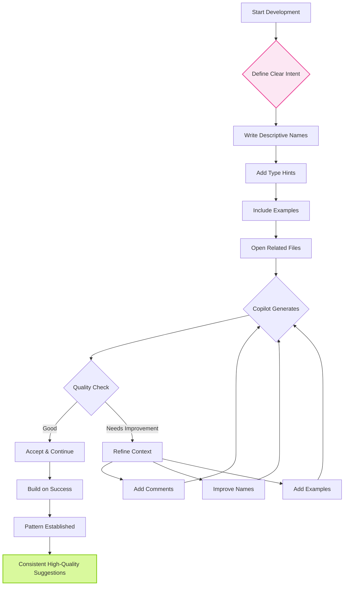
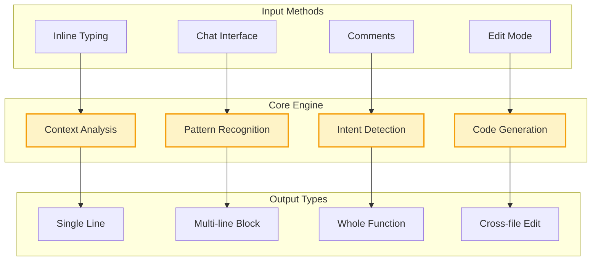
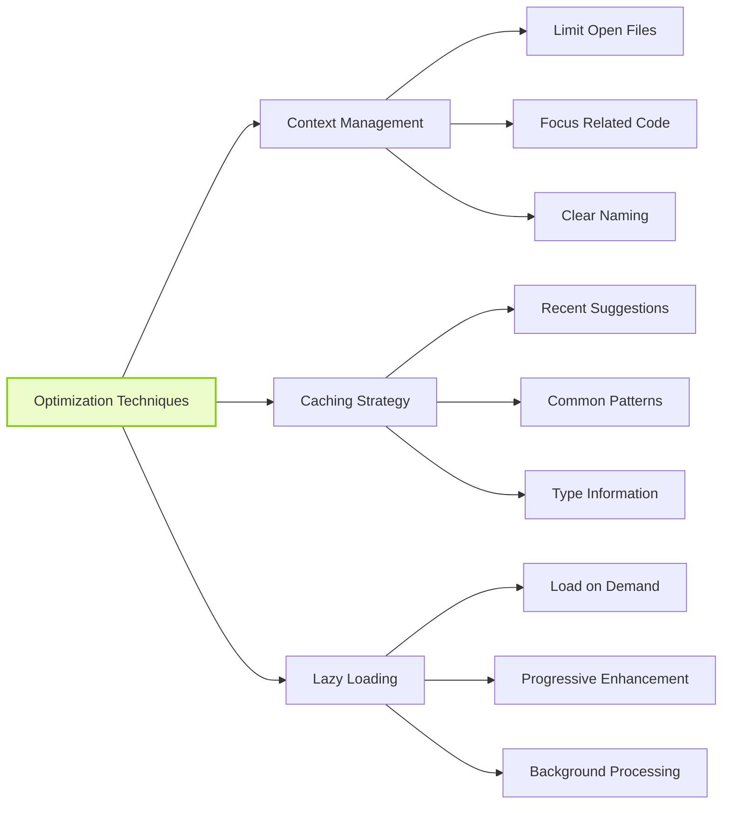

# GitHub Copilot Workflow and Architecture Details

## 🔄 Copilot Suggestion Flow

```mermaid
graph TB
    A[Developer Types Code] --> B{Context Gathering}
    B --> C[Active File Content]
    B --> D[Open Files]
    B --> E[Recent Edits]
    B --> F[Language/Framework]
    
    C --> G[Context Window<br/>~2048 tokens]
    D --> G
    E --> G
    F --> G
    
    G --> H[AI Model Processing]
    H --> I[Intent Analysis]
    I --> J[Code Generation]
    J --> K[Multiple Candidates]
    
    K --> L[Ranking & Filtering]
    L --> M{Quality Check}
    
    M -->|High Quality| N[Primary Suggestion]
    M -->|Alternative| O[Secondary Suggestions]
    M -->|Low Quality| P[No Suggestion]
    
    N --> Q[Ghost Text Display]
    O --> R[Available via Alt+]]
    
    Q --> S{Developer Action}
    S -->|Tab| T[Accept Suggestion]
    S -->|Continue Typing| U[Refine Context]
    S -->|Esc| V[Dismiss]
    S -->|Alt+]| R
    
    T --> W[Code Inserted]
    U --> A
    V --> A
    R --> Q
    
    style A fill:#e0f2fe,stroke:#0284c7,stroke-width:2px
    style H fill:#fef3c7,stroke:#f59e0b,stroke-width:2px
    style W fill:#d9f99d,stroke:#84cc16,stroke-width:2px
```

## 🏗️ Multi-File Context Architecture



## 🎯 Context Optimization Strategy



## 📊 Feature Interaction Matrix



## 🔍 Detailed Component Breakdown

### Context Sources
1. **Active File Context**
   - Current cursor position
   - Surrounding code (before and after)
   - Function/class scope
   - Import statements

2. **Workspace Context**
   - All open files in editor
   - Recently edited files
   - Project structure
   - File relationships

3. **Language Context**
   - Language-specific patterns
   - Framework conventions
   - Standard library knowledge
   - Common idioms

### Processing Pipeline
1. **Tokenization**
   - Break code into meaningful tokens
   - Identify syntax elements
   - Preserve semantic meaning

2. **Context Window Management**
   - Prioritize relevant context
   - Trim to fit token limit
   - Maintain coherence

3. **Model Inference**
   - Generate multiple completions
   - Score based on context fit
   - Filter inappropriate content

### Quality Factors
- **Relevance**: How well suggestion fits context
- **Correctness**: Syntactic and semantic validity
- **Completeness**: Full implementation vs partial
- **Style**: Consistency with existing code

## 🚀 Performance Optimization



## 📈 Metrics and Monitoring

### Key Performance Indicators
- **Suggestion Latency**: Time to first suggestion
- **Acceptance Rate**: Percentage of suggestions accepted
- **Modification Rate**: How often accepted code is modified
- **Context Quality**: Relevance of suggestions to task

### Improvement Strategies
1. **Track Patterns**: Monitor which contexts produce best results
2. **Refine Prompts**: Iterate on comment and naming strategies
3. **Optimize Workspace**: Arrange files for better context
4. **Learn from Rejections**: Understand why suggestions were dismissed

---

## 🎓 Educational Insights

Understanding these workflows helps you:
1. **Provide Better Context**: Know what Copilot needs
2. **Optimize Performance**: Reduce latency and improve quality
3. **Debug Issues**: Understand why suggestions might fail
4. **Master Advanced Features**: Leverage full capabilities

Remember: Copilot is a sophisticated system that improves with better input. The more you understand its architecture, the better you can utilize its features!