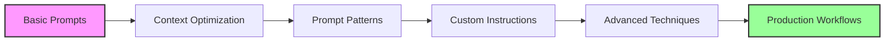

[🏠 Workshop](../../README.md) > [📚 Modules](../README.md) > [Module 3](README.md)

<div align="center">

[⬅️ Module 02: GitHub Copilot Core Features](../module-02/README.md) | **📖 Module 3: Effective Prompting Techniques** | [Module 04: AI-Assisted Debugging and Testing ➡️](../module-04/README.md)

</div>

---

# Module 03: Effective Prompting Techniques

## 🎯 Module Overview

Welcome to Module 03! This module dives deep into the art and science of effective prompting for GitHub Copilot. You'll learn how to optimize context, craft precise prompts, and use custom instructions to maximize AI assistance. Master these techniques to transform Copilot from a simple autocomplete tool into a powerful development partner.

### Duration
- **Total Time**: 3 hours
- **Lecture/Demo**: 30 minutes
- **Hands-on Exercises**: 2 hours 30 minutes

### Track
- 🟢 Fundamentals Track (Modules 1-5)

## 🎓 Learning Objectives

By the end of this module, you will be able to:

1. **Optimize Context for Better Suggestions**
   - Structure code for optimal AI understanding
   - Manage context window effectively
   - Use comments and documentation strategically

2. **Craft Precise and Effective Prompts**
   - Write clear, specific instructions
   - Use natural language effectively
   - Iterate and refine prompts for better results

3. **Implement Custom Instructions**
   - Configure Copilot settings for your workflow
   - Create reusable prompt patterns
   - Build project-specific instructions

4. **Debug and Improve AI Suggestions**
   - Identify why suggestions might be suboptimal
   - Adjust context to improve results
   - Create feedback loops for continuous improvement

## 🔧 Prerequisites

- ✅ Completed Module 01: Introduction to AI-Powered Development
- ✅ Completed Module 02: GitHub Copilot Core Features
- ✅ Basic programming knowledge in Python
- ✅ GitHub Copilot installed and configured
- ✅ Understanding of basic Copilot features

See [prerequisites.md](prerequisites.md) for detailed setup instructions.

## 📚 Key Concepts

### 1. Context Window Management

The context window is the amount of code and information Copilot considers when generating suggestions. Understanding how to manage it is crucial:

- **Local Context**: The immediate code around your cursor
- **File Context**: The entire file you're working in
- **Workspace Context**: Related files in your project
- **Custom Context**: Additional information you provide

### 2. Prompt Engineering Principles

Effective prompts follow these principles:

1. **Clarity**: Be specific about what you want
2. **Context**: Provide necessary background information
3. **Constraints**: Specify requirements and limitations
4. **Examples**: Show desired input/output patterns
5. **Iteration**: Refine based on results

### 3. Custom Instructions

GitHub Copilot allows customization through:

- **Comments**: Strategic placement of guiding comments
- **Documentation**: Well-structured docstrings and READMEs
- **Patterns**: Consistent coding patterns in your project
- **Configuration**: VS Code settings and workspace configuration

## 🏗️ Module Structure

```
module-03-effective-prompting/
├── README.md                    # This file
├── prerequisites.md             # Setup requirements
├── exercises/
│   ├── exercise1-easy/         # Context Optimization Workshop
│   ├── exercise2-medium/       # Prompt Pattern Library
│   └── exercise3-hard/         # Custom Instruction System
├── best-practices.md           # Production patterns
├── resources/
│   ├── prompt-templates/       # Reusable prompt patterns
│   ├── context-examples/       # Context optimization examples
│   └── cheat-sheet.md         # Quick reference guide
├── troubleshooting.md          # Common issues and solutions
└── project/                    # Independent project
    └── README.md
```

## 📝 Exercises Overview

### Exercise 1: Context Optimization Workshop (⭐ Easy)
- **Duration**: 30-45 minutes
- **Goal**: Master context window management
- **Skills**: Code organization, strategic comments, context control

### Exercise 2: Prompt Pattern Library (⭐⭐ Medium)
- **Duration**: 45-60 minutes
- **Goal**: Build a library of effective prompt patterns
- **Skills**: Pattern recognition, template creation, reusability

### Exercise 3: Custom Instruction System (⭐⭐⭐ Hard)
- **Duration**: 60-90 minutes
- **Goal**: Create a complete custom instruction framework
- **Skills**: Advanced configuration, project templates, automation

## 🎯 Learning Path



## 🤖 Key GitHub Copilot Features Covered

### Core Features
- Context window manipulation
- Multi-file context awareness
- Custom instruction processing
- Pattern recognition and learning

### Advanced Techniques
- Prompt chaining
- Context injection
- Template-based generation
- Iterative refinement

## 💡 Real-World Applications

After completing this module, you'll be able to:

1. **Accelerate Development**
   - Generate complex code structures quickly
   - Create consistent implementations
   - Reduce boilerplate writing time

2. **Improve Code Quality**
   - Generate better documentation
   - Maintain consistent patterns
   - Catch edge cases early

3. **Team Productivity**
   - Share effective prompts
   - Standardize AI usage
   - Create team knowledge bases

## 🚀 Quick Start

1. **Set up your environment**:
   ```bash
   cd modules/module-03-effective-prompting
   ./scripts/setup-module03.sh
   ```

2. **Open the first exercise**:
   ```bash
   cd exercises/exercise1-easy
   code .
   ```

3. **Follow the exercise instructions**:
   - Read the README in each exercise folder
   - Complete the hands-on activities
   - Run the validation scripts

## 🎓 Instructor Notes

### Live Demo Topics
1. Context window visualization
2. Real-time prompt refinement
3. Custom instruction examples
4. Common pitfalls and solutions

### Discussion Points
- Balancing context vs. performance
- Ethical considerations in prompt engineering
- Team standardization strategies
- Future of AI-assisted development

## 📊 Success Metrics

You'll know you've mastered this module when you can:
- [ ] Control Copilot's context window effectively
- [ ] Write prompts that generate correct code 80%+ of the time
- [ ] Create reusable prompt patterns
- [ ] Configure custom instructions for projects
- [ ] Debug and improve suboptimal suggestions

## 🆘 Getting Help

- **Module Issues**: See [troubleshooting.md](troubleshooting.md)
- **Questions**: Post in GitHub Discussions
- **Live Support**: Office hours Tuesday/Thursday 2-3 PM PT
- **Emergency**: Tag @module-03-support in Slack

## 📚 Additional Resources

### Documentation
- [GitHub Copilot Docs - Getting Better Results](https://docs.github.com/copilot/using-github-copilot/getting-better-results)
- [Prompt Engineering Guide](https://www.promptingguide.ai/)
- [Context Window Best Practices](https://github.blog/2023-copilot-context)

### Videos
- [Mastering GitHub Copilot Context](https://www.youtube.com/watch?v=...)
- [Advanced Prompting Techniques](https://www.youtube.com/watch?v=...)

### Articles
- [The Art of AI Prompting](https://github.blog/ai-prompting)
- [Context Management Strategies](https://docs.github.com/copilot/context)

## ⏭️ What's Next?

After mastering prompting techniques:
- **Module 04**: AI-Assisted Debugging and Testing
- Apply prompting skills to testing
- Learn test generation patterns
- Master debugging with AI

## 🏆 Module Completion

To complete this module:
1. ✅ Complete all three exercises
2. ✅ Pass the validation scripts
3. ✅ Submit the independent project
4. ✅ Score 80%+ on the module quiz

---

🎉 **Ready to become a prompting expert? Let's dive into Exercise 1!**

---

## 🔗 Quick Links

### Module Resources
- [📋 Prerequisites](prerequisites.md)
- [📖 Best Practices](docs/best-practices.md)
- [🔧 Troubleshooting](docs/troubleshooting.md)
- [💡 Prompt Templates](docs/prompt-templates.md)

### Exercises
- [⭐ Exercise 1 - Foundation](exercises/exercise1/README.md)
- [⭐⭐ Exercise 2 - Application](exercises/exercise2/README.md)
- [⭐⭐⭐ Exercise 3 - Mastery](exercises/exercise3/README.md)

### Workshop Resources
- [🏠 Workshop Home](../../README.md)
- [📚 All Modules](../../README.md#-complete-module-overview)
- [🚀 Quick Start](../../QUICKSTART.md)
- [❓ FAQ](../../FAQ.md)
- [🤖 Prompt Guide](../../PROMPT-GUIDE.md)
- [🔧 Troubleshooting](../../TROUBLESHOOTING.md)


---

## 🔗 Quick Links

### Module Resources
- [📋 Prerequisites](prerequisites.md)
- [📖 Best Practices](docs/best-practices.md)
- [🔧 Troubleshooting](docs/troubleshooting.md)
- [💡 Prompt Templates](docs/prompt-templates.md)

### Exercises
- [⭐ Exercise 1 - Foundation](exercises/exercise1/README.md)
- [⭐⭐ Exercise 2 - Application](exercises/exercise2/README.md)
- [⭐⭐⭐ Exercise 3 - Mastery](exercises/exercise3/README.md)

### Workshop Resources
- [🏠 Workshop Home](../../README.md)
- [📚 All Modules](../../README.md#-complete-module-overview)
- [🚀 Quick Start](../../QUICKSTART.md)
- [❓ FAQ](../../FAQ.md)
- [🤖 Prompt Guide](../../PROMPT-GUIDE.md)
- [🔧 Troubleshooting](../../TROUBLESHOOTING.md)


---

## 🔗 Quick Links

### Module Resources
- [📋 Prerequisites](prerequisites.md)
- [📖 Best Practices](docs/best-practices.md)
- [🔧 Troubleshooting](docs/troubleshooting.md)
- [💡 Prompt Templates](docs/prompt-templates.md)

### Exercises
- [⭐ Exercise 1 - Foundation](exercises/exercise1/README.md)
- [⭐⭐ Exercise 2 - Application](exercises/exercise2/README.md)
- [⭐⭐⭐ Exercise 3 - Mastery](exercises/exercise3/README.md)

### Workshop Resources
- [🏠 Workshop Home](../../README.md)
- [📚 All Modules](../../README.md#-complete-module-overview)
- [🚀 Quick Start](../../QUICKSTART.md)
- [❓ FAQ](../../FAQ.md)
- [🤖 Prompt Guide](../../PROMPT-GUIDE.md)
- [🔧 Troubleshooting](../../TROUBLESHOOTING.md)


## 🧭 Quick Navigation

<table>
<tr>
<td valign="top">

### 📖 Module Content
- [Overview](README.md)
- [Prerequisites](prerequisites.md)
- [Setup Guide](docs/setup.md)
- [Troubleshooting](docs/troubleshooting.md)

</td>
<td valign="top">

### 💻 Exercises
- [Exercise 1 - Foundation ⭐](exercises/exercise1/README.md)
- [Exercise 2 - Application ⭐⭐](exercises/exercise2/README.md)
- [Exercise 3 - Mastery ⭐⭐⭐](exercises/exercise3/README.md)
- [Independent Project](project/README.md)

</td>
<td valign="top">

### 📚 Resources
- [Best Practices](docs/best-practices.md)
- [Common Patterns](docs/common-patterns.md)
- [Prompt Templates](docs/prompt-templates.md)
- [Additional Resources](resources/README.md)

</td>
</tr>
</table>


---

## 🌐 Workshop Resources

<div align="center">

| Core Documentation | Learning Resources | Tools & Scripts |
|:------------------:|:-----------------:|:---------------:|
| [🏠 Home](../../README.md) | [🚀 Quick Start](../../QUICKSTART.md) | [🛠️ Scripts](../../scripts/README.md) |
| [📋 Prerequisites](../../PREREQUISITES.md) | [❓ FAQ](../../FAQ.md) | [🔧 Setup](../../scripts/setup-workshop.sh) |
| [📚 All Modules](../README.md) | [🤖 Prompt Guide](../../PROMPT-GUIDE.md) | [✅ Validate](../../scripts/validate-prerequisites.sh) |
| [🗺️ Learning Paths](../../README.md#-learning-paths) | [🔧 Troubleshooting](../../TROUBLESHOOTING.md) | [🧹 Cleanup](../../scripts/cleanup-resources.sh) |

</div>

### 🏷️ Module Categories

<div align="center">

| 🟢 Fundamentals | 🔵 Intermediate | 🟠 Advanced | 🔴 Enterprise | 🟣 AI Agents | ⭐ Mastery |
|:---------------:|:---------------:|:-----------:|:-------------:|:------------:|:----------:|
| Modules 1-5 | Modules 6-10 | Modules 11-15 | Modules 16-20 | Modules 21-25 | Modules 26-30 |

</div>


---

## 🔗 Quick Links

### Module Resources
- [📋 Prerequisites](prerequisites.md)
- [📖 Best Practices](docs/best-practices.md)
- [🔧 Troubleshooting](docs/troubleshooting.md)
- [💡 Prompt Templates](docs/prompt-templates.md)

### Exercises
- [⭐ Exercise 1 - Foundation](exercises/exercise1/README.md)
- [⭐⭐ Exercise 2 - Application](exercises/exercise2/README.md)
- [⭐⭐⭐ Exercise 3 - Mastery](exercises/exercise3/README.md)

### Workshop Resources
- [🏠 Workshop Home](../../README.md)
- [📚 All Modules](../../README.md#-complete-module-overview)
- [🚀 Quick Start](../../QUICKSTART.md)
- [❓ FAQ](../../FAQ.md)
- [🤖 Prompt Guide](../../PROMPT-GUIDE.md)
- [🔧 Troubleshooting](../../TROUBLESHOOTING.md)


## 🧭 Quick Navigation

<table>
<tr>
<td valign="top">

### 📖 Module Content
- [Overview](README.md)
- [Prerequisites](prerequisites.md)
- [Setup Guide](docs/setup.md)
- [Troubleshooting](docs/troubleshooting.md)

</td>
<td valign="top">

### 💻 Exercises
- [Exercise 1 - Foundation ⭐](exercises/exercise1/README.md)
- [Exercise 2 - Application ⭐⭐](exercises/exercise2/README.md)
- [Exercise 3 - Mastery ⭐⭐⭐](exercises/exercise3/README.md)
- [Independent Project](project/README.md)

</td>
<td valign="top">

### 📚 Resources
- [Best Practices](docs/best-practices.md)
- [Common Patterns](docs/common-patterns.md)
- [Prompt Templates](docs/prompt-templates.md)
- [Additional Resources](resources/README.md)

</td>
</tr>
</table>


---

## 🌐 Workshop Resources

<div align="center">

| Core Documentation | Learning Resources | Tools & Scripts |
|:------------------:|:-----------------:|:---------------:|
| [🏠 Home](../../README.md) | [🚀 Quick Start](../../QUICKSTART.md) | [🛠️ Scripts](../../scripts/README.md) |
| [📋 Prerequisites](../../PREREQUISITES.md) | [❓ FAQ](../../FAQ.md) | [🔧 Setup](../../scripts/setup-workshop.sh) |
| [📚 All Modules](../README.md) | [🤖 Prompt Guide](../../PROMPT-GUIDE.md) | [✅ Validate](../../scripts/validate-prerequisites.sh) |
| [🗺️ Learning Paths](../../README.md#-learning-paths) | [🔧 Troubleshooting](../../TROUBLESHOOTING.md) | [🧹 Cleanup](../../scripts/cleanup-resources.sh) |

</div>

### 🏷️ Module Categories

<div align="center">

| 🟢 Fundamentals | 🔵 Intermediate | 🟠 Advanced | 🔴 Enterprise | 🟣 AI Agents | ⭐ Mastery |
|:---------------:|:---------------:|:-----------:|:-------------:|:------------:|:----------:|
| Modules 1-5 | Modules 6-10 | Modules 11-15 | Modules 16-20 | Modules 21-25 | Modules 26-30 |

</div>


---

## 🔗 Quick Links

### Module Resources
- [📋 Prerequisites](prerequisites.md)
- [📖 Best Practices](docs/best-practices.md)
- [🔧 Troubleshooting](docs/troubleshooting.md)
- [💡 Prompt Templates](docs/prompt-templates.md)

### Exercises
- [⭐ Exercise 1 - Foundation](exercises/exercise1/README.md)
- [⭐⭐ Exercise 2 - Application](exercises/exercise2/README.md)
- [⭐⭐⭐ Exercise 3 - Mastery](exercises/exercise3/README.md)

### Workshop Resources
- [🏠 Workshop Home](../../README.md)
- [📚 All Modules](../../README.md#-complete-module-overview)
- [🚀 Quick Start](../../QUICKSTART.md)
- [❓ FAQ](../../FAQ.md)
- [🤖 Prompt Guide](../../PROMPT-GUIDE.md)
- [🔧 Troubleshooting](../../TROUBLESHOOTING.md)


## 🧭 Quick Navigation

<table>
<tr>
<td valign="top">

### 📖 Module Content
- [Overview](README.md)
- [Prerequisites](prerequisites.md)
- [Setup Guide](docs/setup.md)
- [Troubleshooting](docs/troubleshooting.md)

</td>
<td valign="top">

### 💻 Exercises
- [Exercise 1 - Foundation ⭐](exercises/exercise1/README.md)
- [Exercise 2 - Application ⭐⭐](exercises/exercise2/README.md)
- [Exercise 3 - Mastery ⭐⭐⭐](exercises/exercise3/README.md)
- [Independent Project](project/README.md)

</td>
<td valign="top">

### 📚 Resources
- [Best Practices](docs/best-practices.md)
- [Common Patterns](docs/common-patterns.md)
- [Prompt Templates](docs/prompt-templates.md)
- [Additional Resources](resources/README.md)

</td>
</tr>
</table>


---

## 🌐 Workshop Resources

<div align="center">

| Core Documentation | Learning Resources | Tools & Scripts |
|:------------------:|:-----------------:|:---------------:|
| [🏠 Home](../../README.md) | [🚀 Quick Start](../../QUICKSTART.md) | [🛠️ Scripts](../../scripts/README.md) |
| [📋 Prerequisites](../../PREREQUISITES.md) | [❓ FAQ](../../FAQ.md) | [🔧 Setup](../../scripts/setup-workshop.sh) |
| [📚 All Modules](../README.md) | [🤖 Prompt Guide](../../PROMPT-GUIDE.md) | [✅ Validate](../../scripts/validate-prerequisites.sh) |
| [🗺️ Learning Paths](../../README.md#-learning-paths) | [🔧 Troubleshooting](../../TROUBLESHOOTING.md) | [🧹 Cleanup](../../scripts/cleanup-resources.sh) |

</div>

### 🏷️ Module Categories

<div align="center">

| 🟢 Fundamentals | 🔵 Intermediate | 🟠 Advanced | 🔴 Enterprise | 🟣 AI Agents | ⭐ Mastery |
|:---------------:|:---------------:|:-----------:|:-------------:|:------------:|:----------:|
| Modules 1-5 | Modules 6-10 | Modules 11-15 | Modules 16-20 | Modules 21-25 | Modules 26-30 |

</div>

