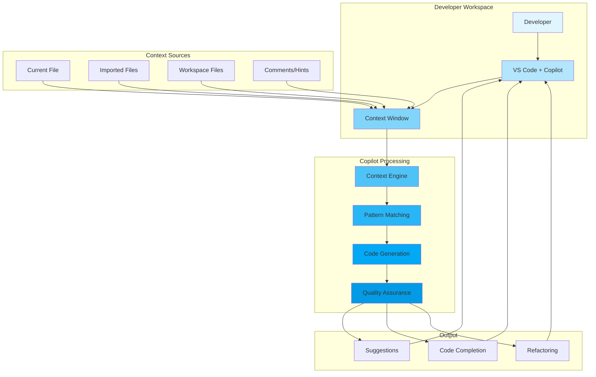
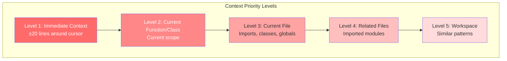
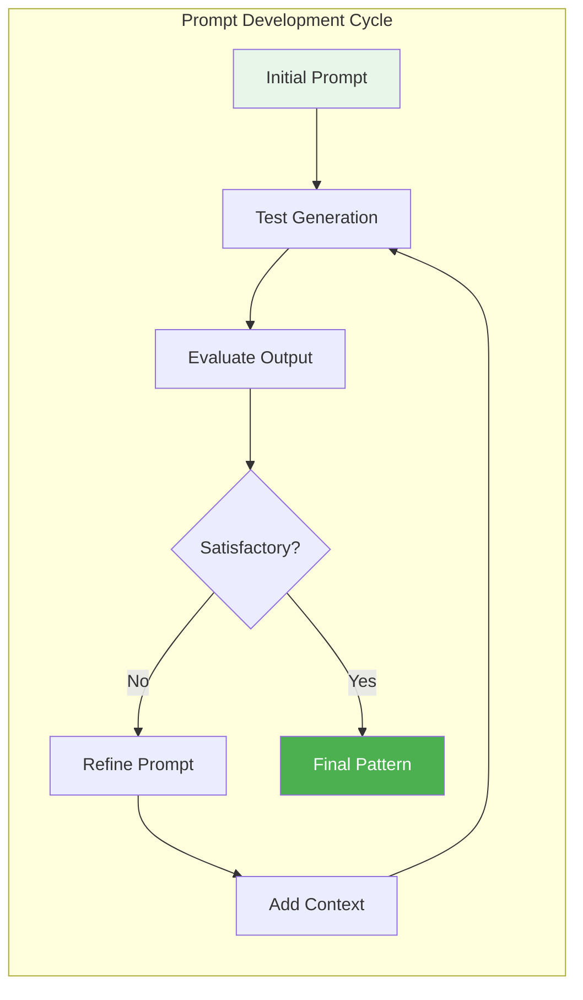
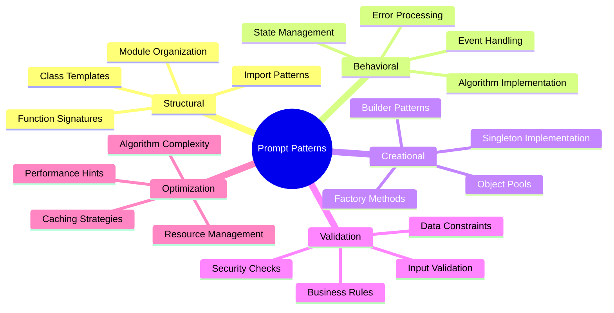
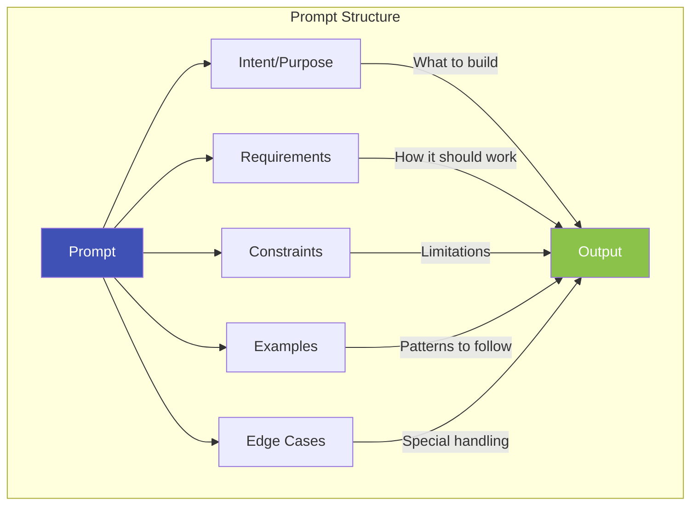
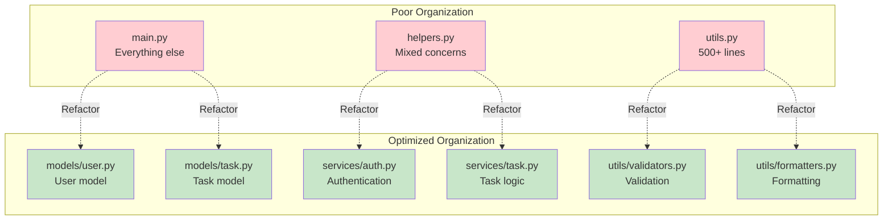
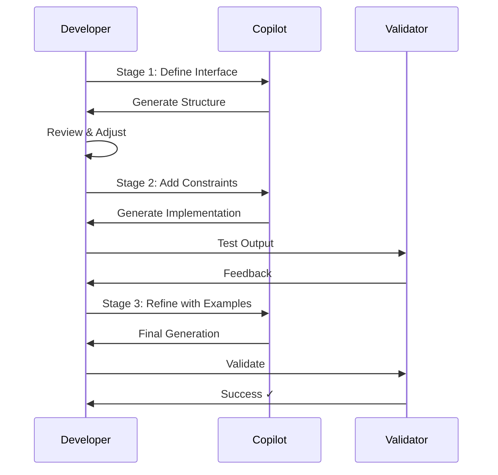
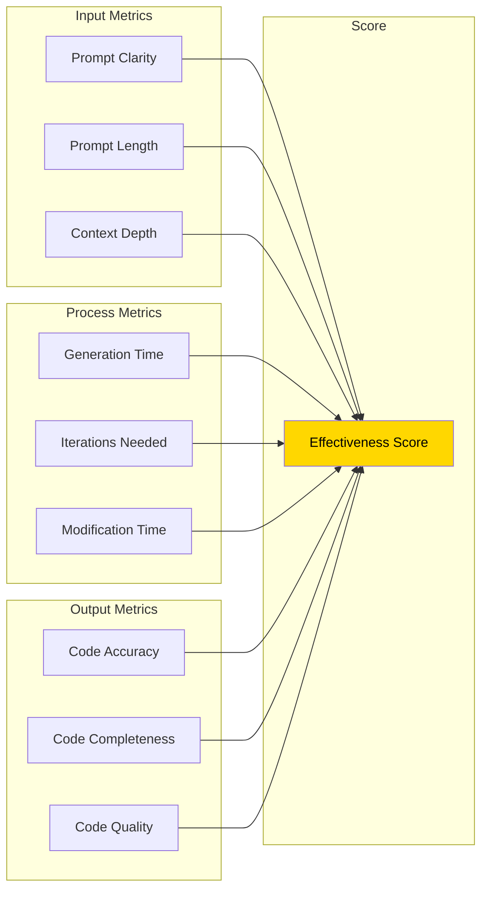
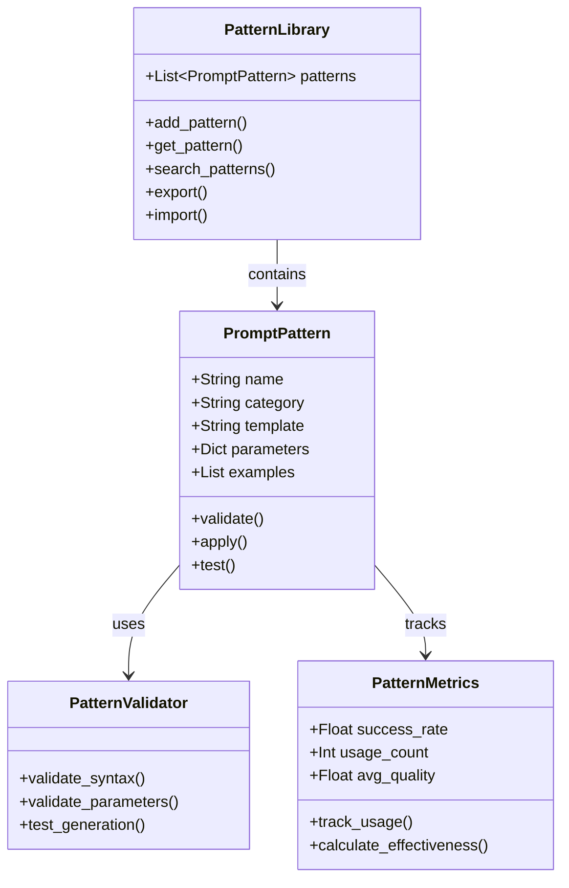
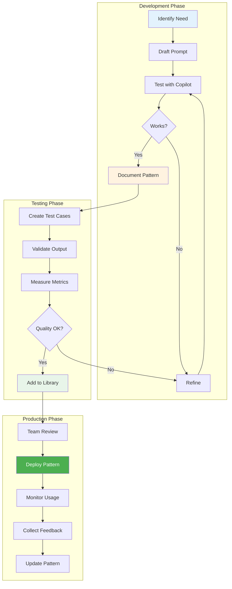

# Module 03: Effective Prompting Techniques - Architecture & Workflow

## 🏗️ Prompt Engineering Architecture

### System Overview



## 📊 Context Window Management

### Context Priority Hierarchy



## 🔄 Prompt Engineering Workflow

### Iterative Refinement Process



## 🎯 Prompt Pattern Categories

### Pattern Classification System



## 📋 Effective Prompt Components

### Anatomy of a Good Prompt



## 🔍 Context Optimization Strategies

### File Organization Impact



## 🚀 Advanced Prompting Techniques

### Multi-Stage Prompt Flow



## 📈 Prompt Effectiveness Metrics

### Measurement Framework



## 🛠️ Implementation Architecture

### Prompt Pattern Library System



## 🎯 Best Practice Workflow

### Production-Ready Prompt Development



## 📊 Context Window Visualization

### Optimal Context Structure

```
┌─────────────────────────────────────────┐
│            IMPORTS SECTION              │
│  • Type hints (typing)                  │
│  • Domain models                        │
│  • Utilities                           │
├─────────────────────────────────────────┤
│           CONSTANTS/CONFIG              │
│  • Configuration values                 │
│  • Enums and constants                 │
├─────────────────────────────────────────┤
│          CLASS DEFINITIONS              │
│  • Data models first                    │
│  • Business logic classes              │
│  • Well-documented                     │
├─────────────────────────────────────────┤
│         PROMPT LOCATION ▼               │
│  ┌───────────────────────────────┐     │
│  │   Context-aware prompt here   │     │
│  │   with clear requirements     │     │
│  └───────────────────────────────┘     │
├─────────────────────────────────────────┤
│         RELATED FUNCTIONS               │
│  • Similar patterns                     │
│  • Examples to follow                   │
└─────────────────────────────────────────┘
```

## 🔑 Key Takeaways

1. **Context is King**: The quality of suggestions directly correlates with context quality
2. **Patterns Matter**: Establish patterns early for consistent generation
3. **Iterate Quickly**: Fast feedback loops improve prompt quality
4. **Measure Success**: Track metrics to improve patterns over time
5. **Share Knowledge**: Build team libraries of effective patterns

---

💡 **Architecture Insight**: Understanding how Copilot processes context and generates suggestions helps you structure your code and prompts for optimal results. The better your mental model of the system, the better your prompts will be!