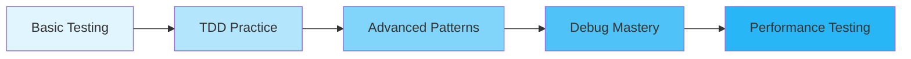

[🏠 Workshop](../../README.md) > [📚 Modules](../README.md) > [Module 4](README.md)

<div align="center">

[⬅️ Module 03: Effective Prompting Techniques](../module-03/README.md) | **📖 Module 4: AI-Assisted Debugging and Testing** | [Module 05: Documentation and Code Quality ➡️](../module-05/README.md)

</div>

---

# Module 04: AI-Assisted Debugging and Testing

## 🎯 Module Overview

Welcome to Module 04! This module transforms how you approach software quality by leveraging GitHub Copilot for test generation, bug detection, and Test-Driven Development (TDD). You'll learn to write comprehensive test suites, identify edge cases, and debug complex issues with AI assistance, fundamentally changing your development workflow.

### Duration
- **Total Time**: 3 hours
- **Lecture/Demo**: 30 minutes
- **Hands-on Exercises**: 2 hours 30 minutes

### Track
- 🟢 Fundamentals Track (Modules 1-5)

## 🎓 Learning Objectives

By the end of this module, you will be able to:

1. **Generate Comprehensive Tests** - Create unit, integration, and edge case tests with Copilot
2. **Practice TDD with AI** - Write tests first, then implementation with AI guidance
3. **Debug Efficiently** - Use Copilot to identify and fix bugs quickly
4. **Optimize Test Coverage** - Achieve high coverage with meaningful tests
5. **Implement Testing Patterns** - Apply best practices for maintainable test suites

## 🔧 Prerequisites

- ✅ Completed Modules 1-3
- ✅ Basic understanding of testing concepts
- ✅ Python 3.11+ installed
- ✅ pytest framework installed
- ✅ VS Code with GitHub Copilot enabled

See [prerequisites.md](prerequisites.md) for detailed setup instructions.

## 📚 Key Concepts

### Test-Driven Development (TDD) with AI
TDD follows the Red-Green-Refactor cycle:
1. **Red**: Write a failing test
2. **Green**: Write minimal code to pass
3. **Refactor**: Improve code quality

With Copilot, this process becomes:
1. **Red**: Describe test intent, let Copilot generate test
2. **Green**: Use Copilot to implement solution
3. **Refactor**: Ask Copilot for optimization suggestions

### Types of Testing with AI

#### Unit Testing
- Test individual functions/methods
- Mock external dependencies
- Focus on single responsibility
- Copilot excels at generating test cases

#### Integration Testing
- Test component interactions
- Verify data flow
- Check API contracts
- AI helps identify integration points

#### Edge Case Testing
- Boundary conditions
- Error scenarios
- Performance limits
- Copilot suggests overlooked cases

### Debugging Strategies

1. **Error Analysis**
   - Paste error messages
   - Get fix suggestions
   - Understand root causes

2. **Code Review**
   - Identify potential bugs
   - Suggest improvements
   - Find security issues

3. **Performance Debugging**
   - Profile code
   - Identify bottlenecks
   - Optimize algorithms

## 🏗️ Module Structure

### Exercise 1: Test Generation Mastery (⭐ Easy)
- Generate unit tests for existing code
- Create parameterized tests
- Mock external dependencies
- **Duration**: 30-45 minutes

### Exercise 2: TDD Shopping Cart (⭐⭐ Medium)
- Build a shopping cart using TDD
- Write tests before implementation
- Handle edge cases
- **Duration**: 45-60 minutes

### Exercise 3: Debug & Optimize API (⭐⭐⭐ Hard)
- Debug a complex REST API
- Improve test coverage
- Performance optimization
- **Duration**: 60-90 minutes

## 🛠️ Tools and Technologies

### Testing Framework
- **pytest** - Main testing framework
- **pytest-cov** - Coverage reporting
- **pytest-mock** - Mocking support
- **pytest-benchmark** - Performance testing

### Debugging Tools
- **Python debugger (pdb)**
- **VS Code debugging**
- **Logging frameworks**
- **Profiling tools**

## 📖 Learning Path



## 🎯 Success Metrics

By module completion, you should:
- ✅ Generate 20+ test cases with Copilot
- ✅ Complete a full TDD cycle
- ✅ Debug 5+ different error types
- ✅ Achieve 90%+ test coverage
- ✅ Refactor code based on test insights

## 🚀 Quick Start

1. **Clone the module**:
   ```bash
   cd modules/module-04-testing-debugging
   ```

2. **Install dependencies**:
   ```bash
   pip install -r requirements.txt
   ```

3. **Run the setup validator**:
   ```bash
   python scripts/validate_setup.py
   ```

4. **Start with Exercise 1**:
   ```bash
   cd exercises/exercise1-easy
   code .
   ```

## 📚 Resources

### Official Documentation
- [pytest Documentation](https://docs.pytest.org/)
- [Python Testing Best Practices](https://docs.python-guide.org/writing/tests/)
- [GitHub Copilot Testing Guide](https://docs.github.com/copilot)

### Module Resources
- [Test Patterns Cheat Sheet](resources/test-patterns.md)
- [Debugging Quick Reference](resources/debugging-guide.md)
- [Coverage Best Practices](resources/coverage-guide.md)

## 🎉 Module Completion

Upon completion, you'll have:
- 🏆 Mastered AI-assisted test generation
- 🏆 Implemented TDD in real projects
- 🏆 Debugged complex applications
- 🏆 Built a comprehensive test suite
- 🏆 Optimized code performance

## ⏭️ Next Steps

After completing this module:
1. Review the [best-practices.md](best-practices.md)
2. Complete the independent project
3. Share your experience in discussions
4. Proceed to Module 05: Documentation and Code Quality

---

💡 **Remember**: Good tests are the foundation of maintainable software. With AI assistance, you can write better tests faster!

---

## 🔗 Quick Links

### Module Resources
- [📋 Prerequisites](prerequisites.md)
- [📖 Best Practices](docs/best-practices.md)
- [🔧 Troubleshooting](docs/troubleshooting.md)
- [💡 Prompt Templates](docs/prompt-templates.md)

### Exercises
- [⭐ Exercise 1 - Foundation](exercises/exercise1/README.md)
- [⭐⭐ Exercise 2 - Application](exercises/exercise2/README.md)
- [⭐⭐⭐ Exercise 3 - Mastery](exercises/exercise3/README.md)

### Workshop Resources
- [🏠 Workshop Home](../../README.md)
- [📚 All Modules](../../README.md#-complete-module-overview)
- [🚀 Quick Start](../../QUICKSTART.md)
- [❓ FAQ](../../FAQ.md)
- [🤖 Prompt Guide](../../PROMPT-GUIDE.md)
- [🔧 Troubleshooting](../../TROUBLESHOOTING.md)


---

## 🔗 Quick Links

### Module Resources
- [📋 Prerequisites](prerequisites.md)
- [📖 Best Practices](docs/best-practices.md)
- [🔧 Troubleshooting](docs/troubleshooting.md)
- [💡 Prompt Templates](docs/prompt-templates.md)

### Exercises
- [⭐ Exercise 1 - Foundation](exercises/exercise1/README.md)
- [⭐⭐ Exercise 2 - Application](exercises/exercise2/README.md)
- [⭐⭐⭐ Exercise 3 - Mastery](exercises/exercise3/README.md)

### Workshop Resources
- [🏠 Workshop Home](../../README.md)
- [📚 All Modules](../../README.md#-complete-module-overview)
- [🚀 Quick Start](../../QUICKSTART.md)
- [❓ FAQ](../../FAQ.md)
- [🤖 Prompt Guide](../../PROMPT-GUIDE.md)
- [🔧 Troubleshooting](../../TROUBLESHOOTING.md)


---

## 🔗 Quick Links

### Module Resources
- [📋 Prerequisites](prerequisites.md)
- [📖 Best Practices](docs/best-practices.md)
- [🔧 Troubleshooting](docs/troubleshooting.md)
- [💡 Prompt Templates](docs/prompt-templates.md)

### Exercises
- [⭐ Exercise 1 - Foundation](exercises/exercise1/README.md)
- [⭐⭐ Exercise 2 - Application](exercises/exercise2/README.md)
- [⭐⭐⭐ Exercise 3 - Mastery](exercises/exercise3/README.md)

### Workshop Resources
- [🏠 Workshop Home](../../README.md)
- [📚 All Modules](../../README.md#-complete-module-overview)
- [🚀 Quick Start](../../QUICKSTART.md)
- [❓ FAQ](../../FAQ.md)
- [🤖 Prompt Guide](../../PROMPT-GUIDE.md)
- [🔧 Troubleshooting](../../TROUBLESHOOTING.md)


## 🧭 Quick Navigation

<table>
<tr>
<td valign="top">

### 📖 Module Content
- [Overview](README.md)
- [Prerequisites](prerequisites.md)
- [Setup Guide](docs/setup.md)
- [Troubleshooting](docs/troubleshooting.md)

</td>
<td valign="top">

### 💻 Exercises
- [Exercise 1 - Foundation ⭐](exercises/exercise1/README.md)
- [Exercise 2 - Application ⭐⭐](exercises/exercise2/README.md)
- [Exercise 3 - Mastery ⭐⭐⭐](exercises/exercise3/README.md)
- [Independent Project](project/README.md)

</td>
<td valign="top">

### 📚 Resources
- [Best Practices](docs/best-practices.md)
- [Common Patterns](docs/common-patterns.md)
- [Prompt Templates](docs/prompt-templates.md)
- [Additional Resources](resources/README.md)

</td>
</tr>
</table>


---

## 🌐 Workshop Resources

<div align="center">

| Core Documentation | Learning Resources | Tools & Scripts |
|:------------------:|:-----------------:|:---------------:|
| [🏠 Home](../../README.md) | [🚀 Quick Start](../../QUICKSTART.md) | [🛠️ Scripts](../../scripts/README.md) |
| [📋 Prerequisites](../../PREREQUISITES.md) | [❓ FAQ](../../FAQ.md) | [🔧 Setup](../../scripts/setup-workshop.sh) |
| [📚 All Modules](../README.md) | [🤖 Prompt Guide](../../PROMPT-GUIDE.md) | [✅ Validate](../../scripts/validate-prerequisites.sh) |
| [🗺️ Learning Paths](../../README.md#-learning-paths) | [🔧 Troubleshooting](../../TROUBLESHOOTING.md) | [🧹 Cleanup](../../scripts/cleanup-resources.sh) |

</div>

### 🏷️ Module Categories

<div align="center">

| 🟢 Fundamentals | 🔵 Intermediate | 🟠 Advanced | 🔴 Enterprise | 🟣 AI Agents | ⭐ Mastery |
|:---------------:|:---------------:|:-----------:|:-------------:|:------------:|:----------:|
| Modules 1-5 | Modules 6-10 | Modules 11-15 | Modules 16-20 | Modules 21-25 | Modules 26-30 |

</div>


---

## 🔗 Quick Links

### Module Resources
- [📋 Prerequisites](prerequisites.md)
- [📖 Best Practices](docs/best-practices.md)
- [🔧 Troubleshooting](docs/troubleshooting.md)
- [💡 Prompt Templates](docs/prompt-templates.md)

### Exercises
- [⭐ Exercise 1 - Foundation](exercises/exercise1/README.md)
- [⭐⭐ Exercise 2 - Application](exercises/exercise2/README.md)
- [⭐⭐⭐ Exercise 3 - Mastery](exercises/exercise3/README.md)

### Workshop Resources
- [🏠 Workshop Home](../../README.md)
- [📚 All Modules](../../README.md#-complete-module-overview)
- [🚀 Quick Start](../../QUICKSTART.md)
- [❓ FAQ](../../FAQ.md)
- [🤖 Prompt Guide](../../PROMPT-GUIDE.md)
- [🔧 Troubleshooting](../../TROUBLESHOOTING.md)


## 🧭 Quick Navigation

<table>
<tr>
<td valign="top">

### 📖 Module Content
- [Overview](README.md)
- [Prerequisites](prerequisites.md)
- [Setup Guide](docs/setup.md)
- [Troubleshooting](docs/troubleshooting.md)

</td>
<td valign="top">

### 💻 Exercises
- [Exercise 1 - Foundation ⭐](exercises/exercise1/README.md)
- [Exercise 2 - Application ⭐⭐](exercises/exercise2/README.md)
- [Exercise 3 - Mastery ⭐⭐⭐](exercises/exercise3/README.md)
- [Independent Project](project/README.md)

</td>
<td valign="top">

### 📚 Resources
- [Best Practices](docs/best-practices.md)
- [Common Patterns](docs/common-patterns.md)
- [Prompt Templates](docs/prompt-templates.md)
- [Additional Resources](resources/README.md)

</td>
</tr>
</table>


---

## 🌐 Workshop Resources

<div align="center">

| Core Documentation | Learning Resources | Tools & Scripts |
|:------------------:|:-----------------:|:---------------:|
| [🏠 Home](../../README.md) | [🚀 Quick Start](../../QUICKSTART.md) | [🛠️ Scripts](../../scripts/README.md) |
| [📋 Prerequisites](../../PREREQUISITES.md) | [❓ FAQ](../../FAQ.md) | [🔧 Setup](../../scripts/setup-workshop.sh) |
| [📚 All Modules](../README.md) | [🤖 Prompt Guide](../../PROMPT-GUIDE.md) | [✅ Validate](../../scripts/validate-prerequisites.sh) |
| [🗺️ Learning Paths](../../README.md#-learning-paths) | [🔧 Troubleshooting](../../TROUBLESHOOTING.md) | [🧹 Cleanup](../../scripts/cleanup-resources.sh) |

</div>

### 🏷️ Module Categories

<div align="center">

| 🟢 Fundamentals | 🔵 Intermediate | 🟠 Advanced | 🔴 Enterprise | 🟣 AI Agents | ⭐ Mastery |
|:---------------:|:---------------:|:-----------:|:-------------:|:------------:|:----------:|
| Modules 1-5 | Modules 6-10 | Modules 11-15 | Modules 16-20 | Modules 21-25 | Modules 26-30 |

</div>


---

## 🔗 Quick Links

### Module Resources
- [📋 Prerequisites](prerequisites.md)
- [📖 Best Practices](docs/best-practices.md)
- [🔧 Troubleshooting](docs/troubleshooting.md)
- [💡 Prompt Templates](docs/prompt-templates.md)

### Exercises
- [⭐ Exercise 1 - Foundation](exercises/exercise1/README.md)
- [⭐⭐ Exercise 2 - Application](exercises/exercise2/README.md)
- [⭐⭐⭐ Exercise 3 - Mastery](exercises/exercise3/README.md)

### Workshop Resources
- [🏠 Workshop Home](../../README.md)
- [📚 All Modules](../../README.md#-complete-module-overview)
- [🚀 Quick Start](../../QUICKSTART.md)
- [❓ FAQ](../../FAQ.md)
- [🤖 Prompt Guide](../../PROMPT-GUIDE.md)
- [🔧 Troubleshooting](../../TROUBLESHOOTING.md)


## 🧭 Quick Navigation

<table>
<tr>
<td valign="top">

### 📖 Module Content
- [Overview](README.md)
- [Prerequisites](prerequisites.md)
- [Setup Guide](docs/setup.md)
- [Troubleshooting](docs/troubleshooting.md)

</td>
<td valign="top">

### 💻 Exercises
- [Exercise 1 - Foundation ⭐](exercises/exercise1/README.md)
- [Exercise 2 - Application ⭐⭐](exercises/exercise2/README.md)
- [Exercise 3 - Mastery ⭐⭐⭐](exercises/exercise3/README.md)
- [Independent Project](project/README.md)

</td>
<td valign="top">

### 📚 Resources
- [Best Practices](docs/best-practices.md)
- [Common Patterns](docs/common-patterns.md)
- [Prompt Templates](docs/prompt-templates.md)
- [Additional Resources](resources/README.md)

</td>
</tr>
</table>


---

## 🌐 Workshop Resources

<div align="center">

| Core Documentation | Learning Resources | Tools & Scripts |
|:------------------:|:-----------------:|:---------------:|
| [🏠 Home](../../README.md) | [🚀 Quick Start](../../QUICKSTART.md) | [🛠️ Scripts](../../scripts/README.md) |
| [📋 Prerequisites](../../PREREQUISITES.md) | [❓ FAQ](../../FAQ.md) | [🔧 Setup](../../scripts/setup-workshop.sh) |
| [📚 All Modules](../README.md) | [🤖 Prompt Guide](../../PROMPT-GUIDE.md) | [✅ Validate](../../scripts/validate-prerequisites.sh) |
| [🗺️ Learning Paths](../../README.md#-learning-paths) | [🔧 Troubleshooting](../../TROUBLESHOOTING.md) | [🧹 Cleanup](../../scripts/cleanup-resources.sh) |

</div>

### 🏷️ Module Categories

<div align="center">

| 🟢 Fundamentals | 🔵 Intermediate | 🟠 Advanced | 🔴 Enterprise | 🟣 AI Agents | ⭐ Mastery |
|:---------------:|:---------------:|:-----------:|:-------------:|:------------:|:----------:|
| Modules 1-5 | Modules 6-10 | Modules 11-15 | Modules 16-20 | Modules 21-25 | Modules 26-30 |

</div>

