# Module 04: Architecture and Workflow Diagrams

## 🏗️ Testing Architecture Overview

## 🔄 TDD Workflow with AI

```mermaid
graph LR
    subgraph "TDD Cycle"
        RED[Write Failing Test<br/>🔴 RED]
        GREEN[Write Code to Pass<br/>🟢 GREEN]
        REFACTOR[Improve Code<br/>🔵 REFACTOR]
    end
    
    subgraph "AI Assistance"
        COPILOT1[Copilot:<br/>Generate Test Cases]
        COPILOT2[Copilot:<br/>Implement Solution]
        COPILOT3[Copilot:<br/>Suggest Improvements]
    end
    
    subgraph "Validation"
        RUN1[Run Test<br/>Verify Failure]
        RUN2[Run Test<br/>Verify Pass]
        RUN3[Run All Tests<br/>Ensure No Breaks]
    end
    
    RED --> RUN1
    RUN1 --> GREEN
    GREEN --> RUN2
    RUN2 --> REFACTOR
    REFACTOR --> RUN3
    RUN3 --> RED
    
    COPILOT1 -.-> RED
    COPILOT2 -.-> GREEN
    COPILOT3 -.-> REFACTOR
    
    style RED fill:#ff6b6b
    style GREEN fill:#51cf66
    style REFACTOR fill:#339af0
    style COPILOT1 fill:#ffe066
    style COPILOT2 fill:#ffe066
    style COPILOT3 fill:#ffe066
```

## 🐛 Debugging Workflow

## 📊 Test Coverage Analysis Flow

```mermaid
graph TD
    subgraph "Coverage Collection"
        RUN[Run Tests with Coverage<br/>pytest --cov]
        COLLECT[Collect Coverage Data<br/>.coverage file]
    end
    
    subgraph "Coverage Analysis"
        REPORT[Generate Reports]
        REPORT --> TERM[Terminal Report<br/>Quick Overview]
        REPORT --> HTML[HTML Report<br/>Detailed View]
        REPORT --> XML[XML Report<br/>CI Integration]
    end
    
    subgraph "Coverage Improvement"
        ANALYZE[Analyze Gaps]
        MISSING[Identify Missing<br/>- Lines<br/>- Branches<br/>- Functions]
        PRIORITIZE[Prioritize<br/>- Critical Paths<br/>- Business Logic<br/>- Error Handling]
        WRITE[Write New Tests<br/>With Copilot]
    end
    
    subgraph "Quality Gates"
        CHECK{Coverage > 80%?}
        PASS[✅ Deploy]
        FAIL[❌ Add Tests]
    end
    
    RUN --> COLLECT
    COLLECT --> REPORT
    
    HTML --> ANALYZE
    ANALYZE --> MISSING
    MISSING --> PRIORITIZE
    PRIORITIZE --> WRITE
    WRITE --> RUN
    
    TERM --> CHECK
    CHECK -->|Yes| PASS
    CHECK -->|No| FAIL
    FAIL --> ANALYZE
    
    style RUN fill:#81c784
    style CHECK fill:#ffd93d
    style PASS fill:#51cf66
    style FAIL fill:#ff6b6b
```

## 🏛️ Testing Pyramid with AI

```mermaid
graph TB
    subgraph "Testing Pyramid"
        E2E[End-to-End Tests<br/>10%<br/>🤖 AI: Generate user flows]
        INT[Integration Tests<br/>20%<br/>🤖 AI: Mock external services]
        UNIT[Unit Tests<br/>70%<br/>🤖 AI: Generate test cases]
    end
    
    subgraph "Characteristics"
        E2E_CHAR[- Slow<br/>- Expensive<br/>- Realistic<br/>- Brittle]
        INT_CHAR[- Medium Speed<br/>- Some Mocks<br/>- API Tests<br/>- DB Tests]
        UNIT_CHAR[- Fast<br/>- Isolated<br/>- Many Tests<br/>- Easy to Write]
    end
    
    subgraph "AI Assistance Level"
        E2E_AI[Low AI Help<br/>Complex Scenarios]
        INT_AI[Medium AI Help<br/>Service Mocking]
        UNIT_AI[High AI Help<br/>Test Generation]
    end
    
    E2E --> E2E_CHAR
    INT --> INT_CHAR
    UNIT --> UNIT_CHAR
    
    E2E --> E2E_AI
    INT --> INT_AI
    UNIT --> UNIT_AI
    
    style E2E fill:#ff6b6b
    style INT fill:#ffd93d
    style UNIT fill:#51cf66
```

## 🔍 Debugging Decision Tree

```mermaid
flowchart TD
    START[Bug Reported] --> REPRO{Can Reproduce?}
    
    REPRO -->|No| MORE_INFO[Gather More Info<br/>- Environment<br/>- Steps<br/>- Data]
    MORE_INFO --> REPRO
    
    REPRO -->|Yes| ISOLATE[Create Minimal Case]
    ISOLATE --> TEST{Have Test?}
    
    TEST -->|No| WRITE_TEST[Write Failing Test<br/>🤖 Use Copilot]
    TEST -->|Yes| TYPE{Error Type?}
    WRITE_TEST --> TYPE
    
    TYPE --> DATA[Data Error<br/>- Validation<br/>- Type Mismatch<br/>- Null/Undefined]
    TYPE --> LOGIC[Logic Error<br/>- Wrong Algorithm<br/>- Edge Case<br/>- Race Condition]
    TYPE --> INTEGRATION[Integration Error<br/>- API Changes<br/>- DB Schema<br/>- Dependencies]
    
    DATA --> DEBUG_DATA[Debug Strategy:<br/>- Log inputs<br/>- Validate early<br/>- Type checking]
    LOGIC --> DEBUG_LOGIC[Debug Strategy:<br/>- Step through<br/>- Add assertions<br/>- Simplify logic]
    INTEGRATION --> DEBUG_INT[Debug Strategy:<br/>- Check versions<br/>- Mock services<br/>- Integration tests]
    
    DEBUG_DATA --> FIX[Implement Fix<br/>🤖 Copilot Assists]
    DEBUG_LOGIC --> FIX
    DEBUG_INT --> FIX
    
    FIX --> VERIFY[Run All Tests]
    VERIFY --> PASS{All Pass?}
    
    PASS -->|No| DEBUG_NEW[Debug New Failure]
    DEBUG_NEW --> FIX
    PASS -->|Yes| DONE[✅ Bug Fixed<br/>Deploy]
    
    style START fill:#ff6b6b
    style DONE fill:#51cf66
    style WRITE_TEST fill:#ffd93d
    style FIX fill:#339af0
```

## 🎯 Module 04 Learning Path

## 📈 Key Metrics and Goals

---

## 🎓 Visual Summary

These diagrams illustrate the key concepts and workflows in Module 04:

1. **Testing Architecture**: Shows how different testing layers integrate with tools and CI/CD
2. **TDD Workflow**: Demonstrates the Red-Green-Refactor cycle with AI assistance
3. **Debugging Workflow**: Maps out systematic debugging approach
4. **Coverage Analysis**: Shows the coverage improvement cycle
5. **Testing Pyramid**: Illustrates the balance of test types
6. **Debugging Decision Tree**: Provides a systematic approach to fixing bugs
7. **Learning Path**: Shows progression through the module
8. **Key Metrics**: Defines success criteria

Use these diagrams as reference while working through the exercises!