# Module 05 Architecture Overview

## System Architecture Diagram

## Component Details

### 📝 Documentation Generator

The Documentation Generator is responsible for creating and maintaining code documentation:

**Key Components:**
- **AST Parser**: Analyzes Python code structure
- **Doc Generator**: Creates docstrings and documentation
- **Formatters**: Support Google, NumPy, and Sphinx styles
- **README Generator**: Creates project documentation

### 🔨 Refactoring Assistant

The Refactoring Assistant identifies and fixes code quality issues:

**Key Components:**
- **Smell Detectors**: Identify code quality issues
- **Refactoring Patterns**: Library of transformations
- **Validation Engine**: Ensures safe refactoring
- **Rollback Mechanism**: Reverts failed changes

### 📊 Quality Automation System

The Quality System provides comprehensive monitoring and enforcement:

## Data Flow Architecture

### Quality Metrics Flow

```mermaid
flowchart TD
    A[Source Code] --> B{Parse AST}
    B --> C[Extract Metrics]
    
    C --> D[Lines of Code]
    C --> E[Cyclomatic Complexity]
    C --> F[Documentation Coverage]
    C --> G[Test Coverage]
    C --> H[Code Duplication]
    
    D --> I[Weighted Score]
    E --> I
    F --> I
    G --> I
    H --> I
    
    I --> J[Overall Quality]
    J --> K{Threshold Check}
    
    K -->|Pass| L[✅ Deploy]
    K -->|Fail| M[❌ Block]
    
    M --> N[Generate Report]
    N --> O[Suggest Fixes]
```

### Real-time Monitoring Architecture

## Technology Stack

### Core Technologies
- **Language**: Python 3.11+
- **AST Processing**: Built-in `ast` module
- **Async**: `asyncio` for concurrent processing
- **Type Checking**: `mypy` with strict mode

### Storage & Caching
- **Database**: PostgreSQL for metrics history
- **Cache**: Redis for real-time data
- **File Storage**: Local filesystem with Git integration

### Web Technologies
- **API**: FastAPI for REST endpoints
- **WebSocket**: Socket.IO for real-time updates
- **Dashboard**: Flask + Plotly for visualization
- **Frontend**: Bootstrap + D3.js for interactive charts

### AI Integration
- **GitHub Copilot**: Code suggestions and generation
- **Machine Learning**: scikit-learn for predictions
- **NLP**: Basic text analysis for documentation

### DevOps & Deployment
- **Containers**: Docker & Docker Compose
- **Orchestration**: Kubernetes ready
- **CI/CD**: GitHub Actions integration
- **Monitoring**: Prometheus metrics export

## Security Architecture

## Deployment Architecture

## Performance Considerations

### Optimization Strategies
1. **Caching**: Cache AST parsing results
2. **Batching**: Process files in optimized batches
3. **Parallelization**: Use async/await throughout
4. **Lazy Loading**: Load large datasets on demand
5. **Indexing**: Database indexes on frequently queried fields

### Scalability Design
- Horizontal scaling via Kubernetes
- Stateless API servers
- Distributed task queue (Celery)
- Read replicas for database
- CDN for static assets

## Key Design Decisions

### 1. Modular Architecture
Each component (documentation, refactoring, quality) is independent but can work together through well-defined interfaces.

### 2. Event-Driven Design
File changes trigger events that flow through the system, enabling real-time monitoring and reactive processing.

### 3. Plugin System
Extensible architecture allows adding new quality rules, refactoring patterns, and documentation formats.

### 4. AI Integration Points
Strategic integration of AI for suggestions, predictions, and automated improvements while maintaining deterministic core logic.

---

*This architecture is designed for scalability, maintainability, and extensibility, embodying the best practices taught throughout Module 05.*