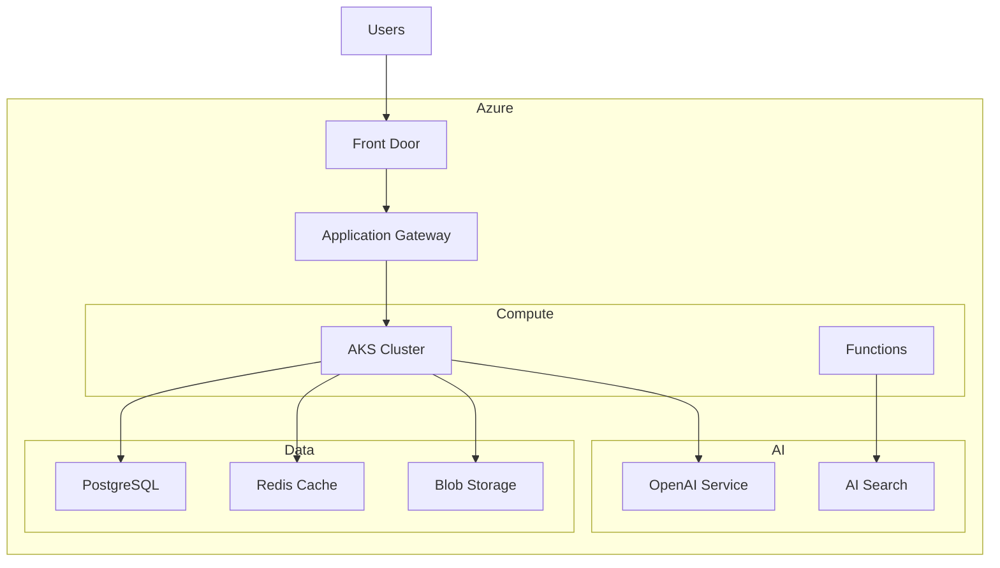

# Module 07: Deployment Guide

## 🚀 Overview

This guide provides comprehensive deployment instructions for all three exercises in Module 07. Each application can be deployed using multiple approaches, from simple local deployment to full cloud-native production setups.

## 📋 Table of Contents

1. [Prerequisites](#prerequisites)
2. [Exercise 1: Todo Application](#exercise-1-todo-application)
3. [Exercise 2: Blog Platform](#exercise-2-blog-platform)
4. [Exercise 3: AI Dashboard](#exercise-3-ai-dashboard)
5. [Production Best Practices](#production-best-practices)
6. [Monitoring & Maintenance](#monitoring--maintenance)
7. [Cost Optimization](#cost-optimization)
8. [Troubleshooting](#troubleshooting)

## Prerequisites

### Required Tools
```bash
# Azure CLI
curl -sL https://aka.ms/InstallAzureCLIDeb | sudo bash

# Docker & Docker Compose
curl -fsSL https://get.docker.com -o get-docker.sh
sh get-docker.sh

# GitHub CLI
brew install gh  # macOS
# or
curl -fsSL https://cli.github.com/packages/githubcli-archive-keyring.gpg | sudo dd of=/usr/share/keyrings/githubcli-archive-keyring.gpg
```

### Azure Resources
- Active Azure subscription
- Resource Group created
- Service Principal for deployments

## Exercise 1: Todo Application

### Local Deployment

```bash
# Backend
cd backend
python -m venv venv
source venv/bin/activate
pip install -r requirements.txt
uvicorn app.main:app --host 0.0.0.0 --port 8000

# Frontend
cd frontend
npm install
npm run build
npm run preview
```

### Docker Deployment

```yaml
# docker-compose.yml
version: '3.8'

services:
  backend:
    build: ./backend
    ports:
      - "8000:8000"
    environment:
      - DATABASE_URL=sqlite:///./todos.db
    volumes:
      - ./data:/app/data

  frontend:
    build: ./frontend
    ports:
      - "3000:80"
    depends_on:
      - backend
```

```bash
docker-compose up -d
```

### Azure App Service Deployment

#### Backend Deployment
```bash
# Create App Service Plan
az appservice plan create \
  --name todo-app-plan \
  --resource-group myResourceGroup \
  --sku B1 \
  --is-linux

# Create Web App
az webapp create \
  --resource-group myResourceGroup \
  --plan todo-app-plan \
  --name todo-backend-$RANDOM \
  --runtime "PYTHON|3.11"

# Configure deployment
az webapp config appsettings set \
  --resource-group myResourceGroup \
  --name todo-backend \
  --settings DATABASE_URL="sqlite:///home/data/todos.db"

# Deploy code
az webapp deployment source config-local-git \
  --name todo-backend \
  --resource-group myResourceGroup

# Push to Azure
git remote add azure <deployment-url>
git push azure main
```

#### Frontend Deployment (Static Web Apps)
```bash
# Create Static Web App
az staticwebapp create \
  --name todo-frontend \
  --resource-group myResourceGroup \
  --source https://github.com/yourrepo/todo-app \
  --location "West Europe" \
  --branch main \
  --app-location "/frontend" \
  --api-location "" \
  --output-location "dist"
```

### GitHub Actions CI/CD

```yaml
# .github/workflows/deploy-todo-app.yml
name: Deploy Todo App

on:
  push:
    branches: [main]
    paths:
      - 'modules/module-07/exercises/exercise1-todo-app/**'

jobs:
  deploy-backend:
    runs-on: ubuntu-latest
    steps:
      - uses: actions/checkout@v3
      
      - name: Set up Python
        uses: actions/setup-python@v4
        with:
          python-version: '3.11'
      
      - name: Deploy to Azure Web App
        uses: azure/webapps-deploy@v2
        with:
          app-name: 'todo-backend'
          publish-profile: ${{ secrets.AZURE_WEBAPP_PUBLISH_PROFILE }}
          package: './modules/module-07/exercises/exercise1-todo-app/backend'

  deploy-frontend:
    runs-on: ubuntu-latest
    steps:
      - uses: actions/checkout@v3
      
      - name: Build and Deploy
        uses: Azure/static-web-apps-deploy@v1
        with:
          azure_static_web_apps_api_token: ${{ secrets.AZURE_STATIC_WEB_APPS_API_TOKEN }}
          repo_token: ${{ secrets.GITHUB_TOKEN }}
          action: "upload"
          app_location: "/modules/module-07/exercises/exercise1-todo-app/frontend"
          output_location: "dist"
```

## Exercise 2: Blog Platform

### Production Architecture



### Kubernetes Deployment

```yaml
# k8s/blog-deployment.yaml
apiVersion: apps/v1
kind: Deployment
metadata:
  name: blog-backend
spec:
  replicas: 3
  selector:
    matchLabels:
      app: blog-backend
  template:
    metadata:
      labels:
        app: blog-backend
    spec:
      containers:
      - name: backend
        image: myregistry.azurecr.io/blog-backend:latest
        ports:
        - containerPort: 8000
        env:
        - name: DATABASE_URL
          valueFrom:
            secretKeyRef:
              name: blog-secrets
              key: database-url
        - name: OPENAI_API_KEY
          valueFrom:
            secretKeyRef:
              name: blog-secrets
              key: openai-key
        resources:
          requests:
            memory: "256Mi"
            cpu: "250m"
          limits:
            memory: "512Mi"
            cpu: "500m"
---
apiVersion: v1
kind: Service
metadata:
  name: blog-backend-service
spec:
  selector:
    app: blog-backend
  ports:
  - port: 80
    targetPort: 8000
  type: LoadBalancer
```

### Terraform Infrastructure

```hcl
# infrastructure/main.tf
terraform {
  required_providers {
    azurerm = {
      source  = "hashicorp/azurerm"
      version = "~> 3.0"
    }
  }
}

provider "azurerm" {
  features {}
}

resource "azurerm_resource_group" "blog" {
  name     = "blog-platform-rg"
  location = "West Europe"
}

# PostgreSQL Database
resource "azurerm_postgresql_flexible_server" "blog" {
  name                = "blog-db-${random_string.suffix.result}"
  resource_group_name = azurerm_resource_group.blog.name
  location            = azurerm_resource_group.blog.location
  version             = "15"
  sku_name            = "B_Standard_B2s"
  storage_mb          = 32768

  administrator_login    = "blogadmin"
  administrator_password = random_password.db_password.result
}

# Redis Cache
resource "azurerm_redis_cache" "blog" {
  name                = "blog-cache-${random_string.suffix.result}"
  location            = azurerm_resource_group.blog.location
  resource_group_name = azurerm_resource_group.blog.name
  capacity            = 0
  family              = "C"
  sku_name            = "Basic"
}

# AKS Cluster
resource "azurerm_kubernetes_cluster" "blog" {
  name                = "blog-aks"
  location            = azurerm_resource_group.blog.location
  resource_group_name = azurerm_resource_group.blog.name
  dns_prefix          = "blogaks"

  default_node_pool {
    name       = "default"
    node_count = 2
    vm_size    = "Standard_D2_v2"
  }

  identity {
    type = "SystemAssigned"
  }
}

# Output values
output "kube_config" {
  value = azurerm_kubernetes_cluster.blog.kube_config_raw
  sensitive = true
}
```

### Deploy with Terraform

```bash
# Initialize Terraform
terraform init

# Plan deployment
terraform plan -out=tfplan

# Apply configuration
terraform apply tfplan

# Get AKS credentials
az aks get-credentials --resource-group blog-platform-rg --name blog-aks

# Deploy to Kubernetes
kubectl apply -f k8s/
```

## Exercise 3: AI Dashboard

### Azure Container Instances (Quick Deploy)

```bash
# Deploy backend
az container create \
  --resource-group myResourceGroup \
  --name ai-dashboard-backend \
  --image myregistry.azurecr.io/ai-dashboard-backend:latest \
  --cpu 1 \
  --memory 1.5 \
  --port 8000 \
  --environment-variables \
    DATABASE_URL=$DATABASE_URL \
    OPENAI_API_KEY=$OPENAI_API_KEY \
    REDIS_URL=$REDIS_URL

# Deploy frontend
az container create \
  --resource-group myResourceGroup \
  --name ai-dashboard-frontend \
  --image myregistry.azurecr.io/ai-dashboard-frontend:latest \
  --cpu 0.5 \
  --memory 0.5 \
  --port 80
```

### Full Production Setup

```yaml
# docker-compose.prod.yml
version: '3.8'

services:
  nginx:
    image: nginx:alpine
    volumes:
      - ./nginx.conf:/etc/nginx/nginx.conf
    ports:
      - "80:80"
      - "443:443"
    depends_on:
      - backend
      - frontend

  backend:
    image: ${REGISTRY}/ai-dashboard-backend:${VERSION}
    deploy:
      replicas: 3
      resources:
        limits:
          cpus: '1'
          memory: 1G
    environment:
      - DATABASE_URL=${DATABASE_URL}
      - REDIS_URL=${REDIS_URL}
      - OPENAI_API_KEY=${OPENAI_API_KEY}
    healthcheck:
      test: ["CMD", "curl", "-f", "http://localhost:8000/health"]
      interval: 30s
      timeout: 10s
      retries: 3

  frontend:
    image: ${REGISTRY}/ai-dashboard-frontend:${VERSION}
    deploy:
      replicas: 2
      resources:
        limits:
          cpus: '0.5'
          memory: 512M
    environment:
      - REACT_APP_API_URL=https://api.dashboard.com

  celery:
    image: ${REGISTRY}/ai-dashboard-backend:${VERSION}
    command: celery -A app.celery worker --loglevel=info
    deploy:
      replicas: 2
    environment:
      - DATABASE_URL=${DATABASE_URL}
      - REDIS_URL=${REDIS_URL}
      - OPENAI_API_KEY=${OPENAI_API_KEY}

  prometheus:
    image: prom/prometheus
    volumes:
      - ./prometheus.yml:/etc/prometheus/prometheus.yml
    ports:
      - "9090:9090"

  grafana:
    image: grafana/grafana
    environment:
      - GF_SECURITY_ADMIN_PASSWORD=${GRAFANA_PASSWORD}
    ports:
      - "3001:3000"
```

### Azure Bicep Deployment

```bicep
// main.bicep
param location string = resourceGroup().location
param appName string = 'ai-dashboard'

// App Service Plan
resource appServicePlan 'Microsoft.Web/serverfarms@2022-03-01' = {
  name: '${appName}-plan'
  location: location
  sku: {
    name: 'P1v3'
    tier: 'PremiumV3'
  }
  kind: 'linux'
  properties: {
    reserved: true
  }
}

// Backend Web App
resource backendApp 'Microsoft.Web/sites@2022-03-01' = {
  name: '${appName}-backend'
  location: location
  properties: {
    serverFarmId: appServicePlan.id
    siteConfig: {
      linuxFxVersion: 'PYTHON|3.11'
      appSettings: [
        {
          name: 'DATABASE_URL'
          value: '@Microsoft.KeyVault(SecretUri=${keyVault.properties.vaultUri}secrets/database-url/)'
        }
        {
          name: 'OPENAI_API_KEY'
          value: '@Microsoft.KeyVault(SecretUri=${keyVault.properties.vaultUri}secrets/openai-key/)'
        }
      ]
    }
  }
}

// Frontend Static Web App
resource frontendApp 'Microsoft.Web/staticSites@2022-03-01' = {
  name: '${appName}-frontend'
  location: location
  sku: {
    name: 'Standard'
  }
  properties: {
    repositoryUrl: 'https://github.com/yourrepo/ai-dashboard'
    branch: 'main'
    buildProperties: {
      appLocation: '/frontend'
      outputLocation: 'dist'
    }
  }
}

// Key Vault
resource keyVault 'Microsoft.KeyVault/vaults@2022-07-01' = {
  name: '${appName}-kv-${uniqueString(resourceGroup().id)}'
  location: location
  properties: {
    sku: {
      family: 'A'
      name: 'standard'
    }
    tenantId: subscription().tenantId
    accessPolicies: []
  }
}
```

Deploy with Bicep:
```bash
# Create deployment
az deployment group create \
  --resource-group myResourceGroup \
  --template-file main.bicep \
  --parameters appName=ai-dashboard
```

## Production Best Practices

### 1. Security
```yaml
# security-headers.yaml
apiVersion: v1
kind: ConfigMap
metadata:
  name: security-headers
data:
  X-Frame-Options: "DENY"
  X-Content-Type-Options: "nosniff"
  X-XSS-Protection: "1; mode=block"
  Strict-Transport-Security: "max-age=31536000; includeSubDomains"
  Content-Security-Policy: "default-src 'self'"
```

### 2. Auto-scaling
```yaml
# hpa.yaml
apiVersion: autoscaling/v2
kind: HorizontalPodAutoscaler
metadata:
  name: backend-hpa
spec:
  scaleTargetRef:
    apiVersion: apps/v1
    kind: Deployment
    name: backend
  minReplicas: 2
  maxReplicas: 10
  metrics:
  - type: Resource
    resource:
      name: cpu
      target:
        type: Utilization
        averageUtilization: 70
  - type: Resource
    resource:
      name: memory
      target:
        type: Utilization
        averageUtilization: 80
```

### 3. Health Checks
```python
# app/health.py
from fastapi import APIRouter, status
from sqlalchemy import text

router = APIRouter()

@router.get("/health")
async def health_check():
    return {"status": "healthy"}

@router.get("/health/ready")
async def readiness_check(db: Session = Depends(get_db)):
    try:
        # Check database
        db.execute(text("SELECT 1"))
        
        # Check Redis
        redis_client.ping()
        
        # Check external services
        await check_openai_api()
        
        return {"status": "ready"}
    except Exception as e:
        return JSONResponse(
            status_code=status.HTTP_503_SERVICE_UNAVAILABLE,
            content={"status": "not ready", "error": str(e)}
        )
```

## Monitoring & Maintenance

### Application Insights Setup
```bash
# Install Application Insights
az monitor app-insights component create \
  --app ai-dashboard-insights \
  --location westeurope \
  --resource-group myResourceGroup

# Get instrumentation key
az monitor app-insights component show \
  --app ai-dashboard-insights \
  --resource-group myResourceGroup \
  --query instrumentationKey
```

### Logging Configuration
```python
# app/logging_config.py
import logging
from opencensus.ext.azure.log_exporter import AzureLogHandler

logger = logging.getLogger(__name__)
logger.addHandler(AzureLogHandler(
    connection_string=f'InstrumentationKey={INSTRUMENTATION_KEY}'
))
```

### Alerts Setup
```bash
# CPU Alert
az monitor metrics alert create \
  --name high-cpu-alert \
  --resource-group myResourceGroup \
  --scopes $WEBAPP_ID \
  --condition "avg Percentage CPU > 80" \
  --description "Alert when CPU exceeds 80%"
```

## Cost Optimization

### 1. Use Spot Instances
```yaml
# For AKS node pools
az aks nodepool add \
  --resource-group myResourceGroup \
  --cluster-name myAKSCluster \
  --name spotnodepool \
  --priority Spot \
  --eviction-policy Delete \
  --spot-max-price -1 \
  --node-count 1 \
  --node-vm-size Standard_D2s_v3
```

### 2. Implement Caching
```python
from functools import lru_cache
import redis

redis_client = redis.Redis.from_url(REDIS_URL)

@lru_cache(maxsize=100)
def get_cached_data(key: str):
    cached = redis_client.get(key)
    if cached:
        return json.loads(cached)
    
    data = expensive_calculation()
    redis_client.setex(key, 3600, json.dumps(data))
    return data
```

### 3. Schedule Scaling
```yaml
# Scale down during off-hours
apiVersion: batch/v1
kind: CronJob
metadata:
  name: scale-down
spec:
  schedule: "0 20 * * *"  # 8 PM daily
  jobTemplate:
    spec:
      template:
        spec:
          containers:
          - name: kubectl
            image: bitnami/kubectl
            command:
            - kubectl
            - scale
            - deployment/backend
            - --replicas=1
```

## Troubleshooting

### Common Issues

#### 1. Database Connection Issues
```bash
# Test connection
az postgres flexible-server connect \
  --name myserver \
  --admin-user myadmin \
  --admin-password $PASSWORD

# Check firewall rules
az postgres flexible-server firewall-rule list \
  --resource-group myResourceGroup \
  --server-name myserver
```

#### 2. Container Registry Access
```bash
# Login to ACR
az acr login --name myregistry

# Check permissions
az acr show --name myregistry --query loginServer

# Grant AKS access to ACR
az aks update \
  --name myAKSCluster \
  --resource-group myResourceGroup \
  --attach-acr myregistry
```

#### 3. SSL/TLS Issues
```bash
# Generate Let's Encrypt certificate
certbot certonly --webroot \
  -w /var/www/html \
  -d dashboard.example.com \
  --email admin@example.com \
  --agree-tos
```

### Debug Commands
```bash
# Check pod logs
kubectl logs -f deployment/backend

# Exec into container
kubectl exec -it deployment/backend -- /bin/bash

# Check events
kubectl get events --sort-by=.metadata.creationTimestamp

# Port forward for debugging
kubectl port-forward deployment/backend 8000:8000
```

## Rollback Procedures

```bash
# Kubernetes rollback
kubectl rollout undo deployment/backend

# Azure App Service
az webapp deployment slot swap \
  --resource-group myResourceGroup \
  --name myapp \
  --slot staging \
  --target-slot production

# Database rollback
alembic downgrade -1
```

## Performance Testing

```bash
# Load testing with k6
k6 run --vus 100 --duration 30s loadtest.js

# Stress testing
artillery quick --count 50 --num 100 https://api.dashboard.com
```

## Backup Strategies

```bash
# Database backup
az postgres flexible-server backup list \
  --resource-group myResourceGroup \
  --server-name myserver

# Create manual backup
pg_dump $DATABASE_URL > backup_$(date +%Y%m%d).sql

# Automated backup script
#!/bin/bash
BACKUP_DIR="/backups"
DB_NAME="dashboard"
DATE=$(date +%Y%m%d_%H%M%S)

pg_dump $DATABASE_URL | gzip > $BACKUP_DIR/backup_$DATE.sql.gz

# Keep only last 7 days
find $BACKUP_DIR -name "backup_*.sql.gz" -mtime +7 -delete
```

## Summary

This deployment guide covers:
- ✅ Local development setup
- ✅ Docker containerization
- ✅ Azure cloud deployment
- ✅ Kubernetes orchestration
- ✅ CI/CD pipelines
- ✅ Infrastructure as Code
- ✅ Monitoring and alerting
- ✅ Security best practices
- ✅ Cost optimization
- ✅ Troubleshooting procedures

Choose the deployment method that best fits your requirements and scale accordingly. Start with simple deployments and gradually move to more complex setups as your application grows.

For additional support, refer to:
- [Azure Documentation](https://docs.microsoft.com/azure)
- [Kubernetes Documentation](https://kubernetes.io/docs)
- [Docker Documentation](https://docs.docker.com)
- [GitHub Actions Documentation](https://docs.github.com/actions)