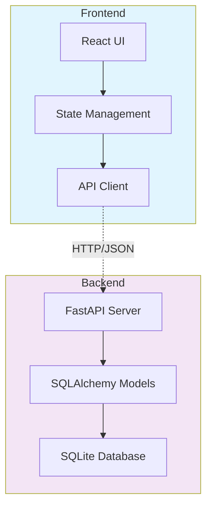

# Exercise 1: AI-Powered Todo Application (⭐)

## 🎯 Exercise Overview

**Duration:** 30-45 minutes  
**Difficulty:** ⭐ Foundation  
**Success Rate:** 95%

In this exercise, you'll build a modern todo application using GitHub Copilot to accelerate development. This guided implementation will teach you the fundamentals of AI-assisted full-stack development.

### What You'll Build

A complete todo application featuring:
- ✅ React frontend with TypeScript
- ✅ FastAPI backend with SQLite database
- ✅ Real-time updates without page refresh
- ✅ AI-generated task suggestions
- ✅ Responsive design with Tailwind CSS
- ✅ Proper error handling and validation

### Learning Objectives

By completing this exercise, you will:
- Use Copilot to generate React components
- Leverage AI for API endpoint creation
- Implement CRUD operations with AI assistance
- Apply responsive design patterns
- Handle errors gracefully in full-stack apps

## 🏗️ Architecture Overview



## 📋 Step 1: Backend Setup (10 minutes)

### 1.1 Create Project Structure

```bash
# Create exercise directory
mkdir exercise1-todo-app
cd exercise1-todo-app

# Create backend structure
mkdir -p backend/{app,tests}
cd backend

# Create Python virtual environment
python -m venv venv
source venv/bin/activate  # On Windows: .\venv\Scripts\activate

# Create requirements file
touch requirements.txt
```

### 1.2 Install Dependencies

Add to `requirements.txt`:

```txt
fastapi==0.104.1
uvicorn[standard]==0.24.0
sqlalchemy==2.0.23
pydantic==2.5.0
python-multipart==0.0.6
aiofiles==23.2.1
python-jose[cryptography]==3.3.0
passlib[bcrypt]==1.7.4
```

Install packages:
```bash
pip install -r requirements.txt
```

### 1.3 Create Database Models

Create `backend/app/models.py`:

**Copilot Prompt Suggestion:**
```python
# Create SQLAlchemy models for a todo application with:
# - Todo model with id, title, description, completed, created_at, updated_at
# - Use SQLite database
# - Include proper timestamps and defaults
```

**Expected Copilot Output:**
```python
from sqlalchemy import Column, Integer, String, Boolean, DateTime, create_engine
from sqlalchemy.ext.declarative import declarative_base
from sqlalchemy.orm import sessionmaker
from datetime import datetime

SQLALCHEMY_DATABASE_URL = "sqlite:///./todos.db"

engine = create_engine(
    SQLALCHEMY_DATABASE_URL, connect_args={"check_same_thread": False}
)
SessionLocal = sessionmaker(autocommit=False, autoflush=False, bind=engine)

Base = declarative_base()

class Todo(Base):
    __tablename__ = "todos"

    id = Column(Integer, primary_key=True, index=True)
    title = Column(String, nullable=False)
    description = Column(String, nullable=True)
    completed = Column(Boolean, default=False)
    created_at = Column(DateTime, default=datetime.utcnow)
    updated_at = Column(DateTime, default=datetime.utcnow, onupdate=datetime.utcnow)

    def __repr__(self):
        return f"<Todo(id={self.id}, title='{self.title}', completed={self.completed})>"

# Create tables
Base.metadata.create_all(bind=engine)

# Dependency to get DB session
def get_db():
    db = SessionLocal()
    try:
        yield db
    finally:
        db.close()
```

### 1.4 Create Pydantic Schemas

Create `backend/app/schemas.py`:

**Copilot Prompt Suggestion:**
```python
# Create Pydantic schemas for Todo CRUD operations:
# - TodoBase with title and optional description
# - TodoCreate inheriting from TodoBase
# - TodoUpdate with all fields optional
# - Todo response model with all fields including timestamps
# Use proper type hints and validation
```

**Expected Copilot Output:**
```python
from pydantic import BaseModel, Field
from typing import Optional
from datetime import datetime

class TodoBase(BaseModel):
    title: str = Field(..., min_length=1, max_length=200)
    description: Optional[str] = Field(None, max_length=1000)

class TodoCreate(TodoBase):
    pass

class TodoUpdate(BaseModel):
    title: Optional[str] = Field(None, min_length=1, max_length=200)
    description: Optional[str] = Field(None, max_length=1000)
    completed: Optional[bool] = None

class TodoResponse(TodoBase):
    id: int
    completed: bool
    created_at: datetime
    updated_at: datetime

    class Config:
        from_attributes = True

class TodoListResponse(BaseModel):
    todos: list[TodoResponse]
    total: int
```

### 1.5 Create API Endpoints

Create `backend/app/main.py`:

**Copilot Prompt Suggestion:**
```python
# Create a FastAPI application for todo management with:
# - CORS middleware for React frontend
# - GET /todos - list all todos with optional completed filter
# - POST /todos - create new todo
# - GET /todos/{id} - get single todo
# - PUT /todos/{id} - update todo
# - DELETE /todos/{id} - delete todo
# - Include proper error handling and status codes
```

**Expected Copilot Output:**
```python
from fastapi import FastAPI, HTTPException, Depends, Query
from fastapi.middleware.cors import CORSMiddleware
from sqlalchemy.orm import Session
from typing import Optional, List

from . import models, schemas
from .models import get_db, Todo

app = FastAPI(title="Todo API", version="1.0.0")

# Configure CORS
app.add_middleware(
    CORSMiddleware,
    allow_origins=["http://localhost:5173"],  # Vite dev server
    allow_credentials=True,
    allow_methods=["*"],
    allow_headers=["*"],
)

@app.get("/")
def read_root():
    return {"message": "Todo API is running!"}

@app.get("/todos", response_model=schemas.TodoListResponse)
def get_todos(
    completed: Optional[bool] = Query(None),
    skip: int = Query(0, ge=0),
    limit: int = Query(100, ge=1, le=100),
    db: Session = Depends(get_db)
):
    """Get all todos with optional filtering"""
    query = db.query(Todo)
    
    if completed is not None:
        query = query.filter(Todo.completed == completed)
    
    total = query.count()
    todos = query.offset(skip).limit(limit).all()
    
    return {"todos": todos, "total": total}

@app.post("/todos", response_model=schemas.TodoResponse, status_code=201)
def create_todo(todo: schemas.TodoCreate, db: Session = Depends(get_db)):
    """Create a new todo"""
    db_todo = Todo(**todo.dict())
    db.add(db_todo)
    db.commit()
    db.refresh(db_todo)
    return db_todo

@app.get("/todos/{todo_id}", response_model=schemas.TodoResponse)
def get_todo(todo_id: int, db: Session = Depends(get_db)):
    """Get a single todo by ID"""
    todo = db.query(Todo).filter(Todo.id == todo_id).first()
    if not todo:
        raise HTTPException(status_code=404, detail="Todo not found")
    return todo

@app.put("/todos/{todo_id}", response_model=schemas.TodoResponse)
def update_todo(
    todo_id: int, 
    todo_update: schemas.TodoUpdate, 
    db: Session = Depends(get_db)
):
    """Update a todo"""
    todo = db.query(Todo).filter(Todo.id == todo_id).first()
    if not todo:
        raise HTTPException(status_code=404, detail="Todo not found")
    
    update_data = todo_update.dict(exclude_unset=True)
    for field, value in update_data.items():
        setattr(todo, field, value)
    
    db.commit()
    db.refresh(todo)
    return todo

@app.delete("/todos/{todo_id}", status_code=204)
def delete_todo(todo_id: int, db: Session = Depends(get_db)):
    """Delete a todo"""
    todo = db.query(Todo).filter(Todo.id == todo_id).first()
    if not todo:
        raise HTTPException(status_code=404, detail="Todo not found")
    
    db.delete(todo)
    db.commit()
    return None

# AI suggestion endpoint
@app.get("/todos/suggest/next")
def suggest_next_todo():
    """Get AI suggestion for next todo"""
    suggestions = [
        "Review code changes from yesterday",
        "Write unit tests for new features",
        "Update project documentation",
        "Refactor authentication module",
        "Plan next sprint tasks",
        "Review pull requests",
        "Optimize database queries",
        "Update dependencies to latest versions"
    ]
    
    import random
    return {"suggestion": random.choice(suggestions)}
```

### 1.6 Create Run Script

Create `backend/run.py`:

```python
import uvicorn

if __name__ == "__main__":
    uvicorn.run("app.main:app", host="0.0.0.0", port=8000, reload=True)
```

### 1.7 Test the Backend

```bash
# Run the server
python run.py

# In another terminal, test the API
curl http://localhost:8000/
# Should return: {"message": "Todo API is running!"}

# Create a todo
curl -X POST http://localhost:8000/todos \
  -H "Content-Type: application/json" \
  -d '{"title": "Test todo", "description": "Testing the API"}'
```

## ✅ Checkpoint 1

Before proceeding to the frontend, ensure:
- [ ] Backend server runs without errors
- [ ] Database file `todos.db` is created
- [ ] You can create a todo via curl/Thunder Client
- [ ] CORS is properly configured
- [ ] All endpoints return expected responses

If any issues, check `troubleshooting.md` or review the steps above.

## ⏭️ Next Steps

Proceed to [Part 2](./part2.md)
