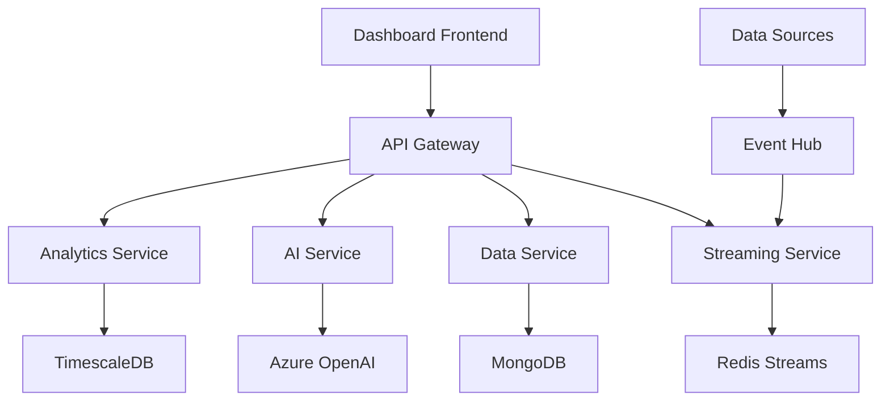

# Exercise 3: AI-Powered Analytics Dashboard

## 📋 Overview

Build a sophisticated analytics dashboard that integrates AI capabilities for data visualization, predictive analytics, and intelligent insights. This advanced exercise combines full-stack development with machine learning, real-time data processing, and modern visualization techniques.

## 🎯 Learning Objectives

By completing this exercise, you will:

- ✅ Integrate Azure AI services (OpenAI, Cognitive Services)
- ✅ Build real-time data pipelines with WebSockets
- ✅ Create interactive data visualizations
- ✅ Implement predictive analytics features
- ✅ Design responsive dashboard layouts
- ✅ Handle streaming data efficiently
- ✅ Deploy scalable microservices architecture
- ✅ Implement advanced security measures

## 📁 Structure

```
exercise3-ai-dashboard/
├── README.md                       # This file
├── instructions/                   # Step-by-step guides
│   ├── part1.md                   # Dashboard setup
│   ├── part2.md                   # AI integration
│   ├── part3.md                   # Real-time features
│   └── part4.md                   # Advanced analytics
├── starter/                        # Starting templates
│   ├── services/                  # Microservices
│   │   ├── api-gateway/          # API Gateway
│   │   ├── analytics-service/    # Analytics processing
│   │   ├── ai-service/           # AI integration
│   │   └── data-service/         # Data management
│   ├── dashboard/                 # Frontend application
│   │   ├── src/
│   │   └── package.json
│   └── infrastructure/            # Docker & K8s configs
├── solution/                       # Complete implementation
│   ├── services/                  # All microservices
│   │   ├── api-gateway/
│   │   │   ├── src/
│   │   │   └── Dockerfile
│   │   ├── analytics-service/
│   │   │   ├── src/
│   │   │   ├── ml-models/
│   │   │   └── Dockerfile
│   │   ├── ai-service/
│   │   │   ├── src/
│   │   │   ├── prompts/
│   │   │   └── Dockerfile
│   │   └── streaming-service/
│   │       ├── src/
│   │       └── Dockerfile
│   ├── dashboard/                 # Complete dashboard
│   │   ├── src/
│   │   │   ├── components/
│   │   │   ├── features/
│   │   │   ├── hooks/
│   │   │   ├── services/
│   │   │   └── utils/
│   │   └── tests/
│   ├── infrastructure/
│   │   ├── kubernetes/
│   │   ├── terraform/
│   │   └── monitoring/
│   └── docs/                      # Documentation
│       ├── architecture.md
│       ├── api-reference.md
│       └── deployment.md
├── tests/                          # Test suites
│   ├── integration/
│   ├── load/
│   └── security/
└── troubleshooting.md             # Common issues & solutions
```

## 🚀 Getting Started

### Prerequisites

1. **Development Tools**:
   ```bash
   node --version    # 18.x+
   python --version  # 3.9+
   docker --version  # 20.x+
   kubectl version   # 1.25+
   ```

2. **Azure Services**:
   - Azure OpenAI access
   - Azure Cosmos DB
   - Azure Event Hubs
   - Azure Container Registry
   - Azure Kubernetes Service

3. **API Keys**:
   - OpenAI API key
   - Azure subscription
   - GitHub account
   - DataDog/New Relic (optional)

### Quick Start

1. **Clone and setup**:
   ```bash
   cd exercise3-ai-dashboard
   ./scripts/setup-environment.sh
   ```

2. **Configure services**:
   ```bash
   # Copy environment templates
   cp .env.example .env
   
   # Configure each service
   cd services/ai-service
   cp .env.example .env
   # Add your OpenAI API key
   ```

3. **Start with Docker Compose** (development):
   ```bash
   docker-compose up -d
   ```

4. **Access the dashboard**:
   - Dashboard: http://localhost:3000
   - API Gateway: http://localhost:8080
   - GraphQL Playground: http://localhost:8080/graphql
   - Swagger Docs: http://localhost:8080/api-docs

## 📚 Exercise Parts

### Part 1: Dashboard Foundation (2 hours)
- Set up responsive dashboard layout
- Implement authentication system
- Create basic visualization components
- Connect to backend services
- Add state management

### Part 2: AI Integration (2.5 hours)
- Integrate OpenAI for insights
- Implement natural language queries
- Add sentiment analysis
- Create AI-powered recommendations
- Build chatbot assistant

### Part 3: Real-time Features (2 hours)
- Implement WebSocket connections
- Add live data streaming
- Create real-time notifications
- Build collaborative features
- Handle connection resilience

### Part 4: Advanced Analytics (2.5 hours)
- Implement predictive models
- Create custom visualizations
- Add anomaly detection
- Build data export features
- Implement caching strategies

## 🎨 Features to Implement

### Core Dashboard Features
- 📊 **Data Visualization**
  - Interactive charts (line, bar, pie, scatter)
  - Heatmaps and treemaps
  - Geographic maps
  - Custom KPI cards
  - Responsive grid layout

- 🤖 **AI Capabilities**
  - Natural language data queries
  - Automated insights generation
  - Predictive analytics
  - Anomaly detection
  - Smart alerts

- 🔄 **Real-time Updates**
  - Live data streaming
  - Real-time collaboration
  - Push notifications
  - Activity feeds
  - Status indicators

### Advanced Features
- 📈 **Analytics Engine**
  - Time series analysis
  - Cohort analysis
  - Funnel visualization
  - A/B test results
  - Custom metrics

- 🔐 **Security & Compliance**
  - Role-based access control
  - Audit logging
  - Data encryption
  - GDPR compliance
  - SSO integration

- 🚀 **Performance**
  - Data virtualization
  - Lazy loading
  - Query optimization
  - CDN integration
  - Progressive loading

## 🏗️ Architecture

### Microservices Design



### Technology Stack

#### Frontend
- **Framework**: React 18 with TypeScript
- **UI Library**: Ant Design / Material-UI
- **Charts**: D3.js, Chart.js, Recharts
- **State**: Redux Toolkit + RTK Query
- **Real-time**: Socket.io-client
- **Testing**: Jest, React Testing Library

#### Backend Services
- **API Gateway**: Kong / Express Gateway
- **Analytics**: Python FastAPI + Pandas
- **AI Service**: Node.js + OpenAI SDK
- **Streaming**: Node.js + Socket.io
- **Queue**: RabbitMQ / Azure Service Bus

#### Data Layer
- **Time Series**: TimescaleDB
- **Document Store**: MongoDB
- **Cache**: Redis
- **Search**: Elasticsearch
- **Stream Processing**: Apache Kafka

#### Infrastructure
- **Containers**: Docker
- **Orchestration**: Kubernetes
- **Service Mesh**: Istio (optional)
- **Monitoring**: Prometheus + Grafana
- **Logging**: ELK Stack

## 📊 Key Metrics & Performance

### Performance Targets
- **Dashboard Load**: < 2 seconds
- **Data Refresh**: < 100ms
- **AI Response**: < 3 seconds
- **Concurrent Users**: 10,000+
- **Data Points**: 1M+ per dashboard

### Monitoring Metrics
- API response times
- WebSocket connection health
- AI service latency
- Database query performance
- Cache hit rates

## 🛠️ Troubleshooting

### Common Issues

1. **Service Discovery**:
   ```bash
   # Check service health
   kubectl get services
   kubectl describe service api-gateway
   ```

2. **WebSocket Issues**:
   ```bash
   # Test WebSocket connection
   wscat -c ws://localhost:8080/socket.io/
   ```

3. **AI Service Errors**:
   ```bash
   # Check API key
   curl http://localhost:8080/api/ai/health
   
   # View logs
   docker logs ai-service
   ```

### Debug Tools

```bash
# Port forwarding for debugging
kubectl port-forward service/analytics-service 9000:80

# View real-time logs
stern analytics-service

# Performance profiling
artillery quick -n 100 http://localhost:8080/api/analytics
```

## 🏆 Bonus Challenges

1. **Machine Learning Pipeline**: Automated model training
2. **Voice Interface**: Add voice commands
3. **AR Visualization**: 3D data visualization
4. **Blockchain Integration**: Immutable audit logs
5. **Edge Computing**: Process data at edge nodes

## 📖 Resources

### Documentation
- 📚 [Azure OpenAI Documentation](https://docs.microsoft.com/azure/cognitive-services/openai/)
- 📊 [D3.js Gallery](https://d3-graph-gallery.com/)
- 🏗️ [Microservices Patterns](https://microservices.io/)
- 🔄 [WebSocket Guide](https://socket.io/docs/v4/)
- 🎨 [Dashboard Design Patterns](https://www.dashboarddesignpatterns.com/)

### Learning Resources
- 🎓 [Full Stack Deep Learning](https://fullstackdeeplearning.com/)
- 📈 [Data Visualization Course](https://www.coursera.org/learn/datavisualization)
- 🤖 [AI Engineering Guide](https://github.com/microsoft/AI-Engineering-Playbook)

## 🤝 Need Help?

1. Check solution code and documentation
2. Review service logs
3. Use debugging tools
4. Post in course discussions
5. Check Stack Overflow

## ⏭️ Next Steps

After completing this exercise:
1. Add more AI models
2. Implement advanced visualizations
3. Scale to production
4. Add mobile app
5. Open source your dashboard

---

**Remember**: Building AI-powered applications requires balancing sophistication with usability. Start with core features, ensure reliability, then add intelligence incrementally! 🚀🤖
