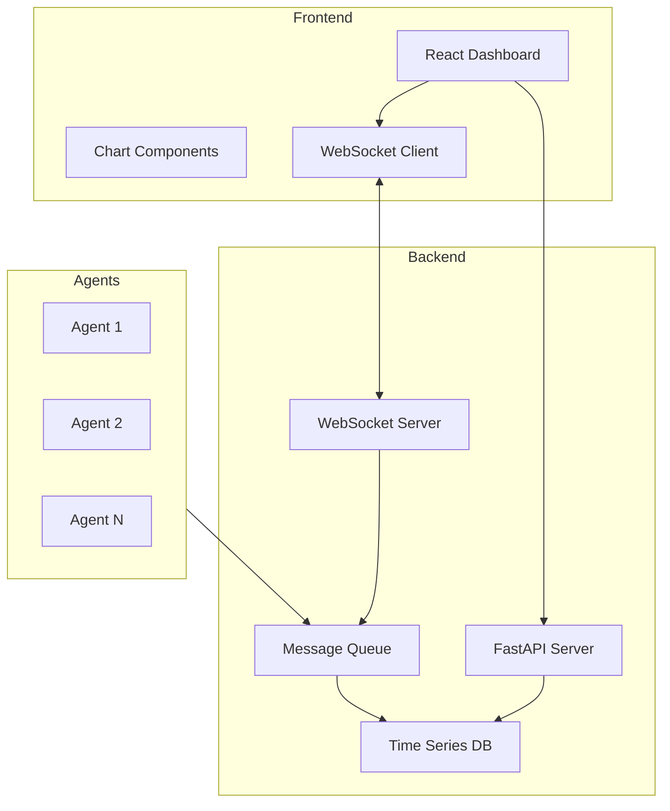

# Exercise 3: AI Operations Dashboard (⭐⭐⭐ Hard)

## Overview

In this advanced exercise, you'll build a production-ready AI operations dashboard for monitoring multi-agent systems. This challenging exercise combines real-time data visualization, complex state management, and enterprise-grade features.

## Learning Objectives

- Build real-time data visualization dashboards
- Implement WebSocket connections for live updates
- Create complex monitoring interfaces
- Handle high-frequency data updates efficiently
- Deploy production-ready applications

## Instructions

The complete instructions for this exercise are divided into parts:

1. **Part 1**: [Backend Infrastructure and WebSockets](./instructions/part1.md)
2. **Part 2**: [Dashboard Components and Visualizations](./instructions/part2.md)
3. **Part 3**: [Agent Monitoring and Alerts](./instructions/part3.md)
4. **Part 4**: [Performance Optimization and Deployment](./instructions/part4.md)

## Project Structure

```
exercise3-ai-dashboard/
├── README.md          # This file
├── instructions/      # Step-by-step guides
│   ├── part1.md      # Backend & WebSockets
│   ├── part2.md      # Dashboard UI
│   ├── part3.md      # Monitoring features
│   └── part4.md      # Optimization & deploy
├── starter/          # Starting code templates
│   ├── backend/
│   └── frontend/
├── solution/         # Complete working solution
│   ├── backend/
│   └── frontend/
└── tests/           # Validation tests
    ├── backend/
    ├── frontend/
    └── e2e/
```

## Prerequisites

- Completed Exercises 1 & 2 or equivalent experience
- Understanding of WebSockets and real-time data
- Knowledge of data visualization libraries
- Experience with performance optimization
- GitHub Copilot enabled in VS Code

## Quick Start

```bash
# Navigate to exercise directory
cd exercises/exercise3-ai-dashboard

# Run setup script
./setup.sh

# Start development
code .
```

## Duration

**Expected Time**: 60-90 minutes
- Infrastructure Setup: 20 minutes
- Dashboard Development: 30 minutes
- Monitoring Features: 20 minutes
- Optimization & Deploy: 20 minutes

## Key Features

- **Real-Time Monitoring**
  - Live metrics streaming via WebSockets
  - Agent status and health checks
  - Performance metrics visualization
  - Historical data analysis

- **Dashboard Components**
  - Customizable widget system
  - Drag-and-drop layout
  - Responsive grid system
  - Dark/light theme support

- **Alert Management**
  - Configurable alert rules
  - Real-time notifications
  - Alert history and analytics
  - Integration with external services

- **Performance Features**
  - Data virtualization for large datasets
  - Efficient re-rendering strategies
  - Caching and memoization
  - Load balancing support

## Architecture



## Success Criteria

- [ ] Real-time metrics update without page refresh
- [ ] Dashboard handles 1000+ metrics per second
- [ ] Alerts trigger within 1 second of threshold breach
- [ ] UI remains responsive with large datasets
- [ ] Successfully deploys to cloud platform
- [ ] All performance benchmarks pass
