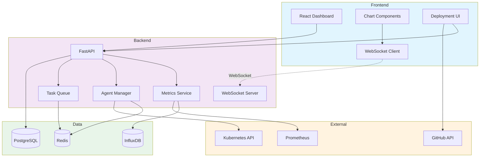

# Exercise 3: AI Operations Dashboard (⭐⭐⭐)

## 🎯 Exercise Overview

**Duration:** 60-90 minutes  
**Difficulty:** ⭐⭐⭐ Mastery  
**Success Rate:** 60%

In this challenging exercise, you'll build a production-ready AI operations dashboard that monitors multi-agent systems. This complex application demonstrates advanced full-stack patterns with real-time updates, data visualization, and deployment automation.

### What You'll Build

A comprehensive monitoring dashboard featuring:
- 📊 Real-time metrics visualization
- 🤖 Multi-agent system monitoring
- 🚨 Alert management and notifications
- 📈 Performance analytics and trends
- 🚀 Deployment automation interface
- 🔐 Role-based access control

### Learning Objectives

By completing this exercise, you will:
- Build complex real-time applications
- Implement WebSocket connections
- Create interactive data visualizations
- Handle high-frequency data updates
- Design production monitoring systems
- Deploy containerized applications

## 🏗️ Architecture Overview



## 📋 Step 1: Advanced Backend Setup (20 minutes)

### 1.1 Project Structure

```bash
# Create exercise directory
mkdir exercise3-ai-dashboard
cd exercise3-ai-dashboard

# Create comprehensive backend structure
mkdir -p backend/{app,tests,scripts}
mkdir -p backend/app/{api,core,models,schemas,services,workers}
mkdir -p backend/app/api/{v1,websocket}
cd backend

# Setup Python environment
python -m venv venv
source venv/bin/activate  # Windows: .\venv\Scripts\activate
```

### 1.2 Enhanced Dependencies

Create `requirements.txt`:

```txt
# Core
fastapi==0.104.1
uvicorn[standard]==0.24.0
websockets==12.0

# Database
sqlalchemy==2.0.23
alembic==1.12.1
asyncpg==0.29.0
redis==5.0.1

# Async
aioredis==2.0.1
celery==5.3.4
aio-pika==9.3.0

# Monitoring
prometheus-client==0.19.0
influxdb-client==1.38.0

# Data Processing
pandas==2.1.3
numpy==1.26.2

# Utilities
pydantic==2.5.0
pydantic-settings==2.1.0
python-jose[cryptography]==3.3.0
passlib[bcrypt]==1.7.4
httpx==0.25.2
tenacity==8.2.3

# Kubernetes
kubernetes==28.1.0
```

Install:
```bash
pip install -r requirements.txt
```

### 1.3 Configuration with Environment Management

Create `backend/app/core/config.py`:

**Copilot Prompt Suggestion:**
```python
# Create advanced configuration with:
# - Multiple environment support (dev, staging, prod)
# - Redis connection settings
# - InfluxDB configuration
# - WebSocket settings
# - Kubernetes config
# - Monitoring endpoints
# - Rate limiting settings
# - Feature flags
# Use Pydantic Settings with validation
```

**Expected Copilot Output:**
```python
from pydantic_settings import BaseSettings
from pydantic import Field, validator
from typing import List, Dict, Optional
from enum import Enum
import secrets

class Environment(str, Enum):
    DEVELOPMENT = "development"
    STAGING = "staging"
    PRODUCTION = "production"

class Settings(BaseSettings):
    # Application
    APP_NAME: str = "AI Operations Dashboard"
    VERSION: str = "1.0.0"
    ENVIRONMENT: Environment = Environment.DEVELOPMENT
    DEBUG: bool = Field(default=True)
    API_PREFIX: str = "/api/v1"
    
    # Security
    SECRET_KEY: str = Field(default_factory=lambda: secrets.token_urlsafe(32))
    ALGORITHM: str = "HS256"
    ACCESS_TOKEN_EXPIRE_MINUTES: int = 60
    
    # Database
    POSTGRES_HOST: str = "localhost"
    POSTGRES_PORT: int = 5432
    POSTGRES_USER: str = "dashboard_user"
    POSTGRES_PASSWORD: str = "dashboard_pass"
    POSTGRES_DB: str = "ai_dashboard"
    
    @property
    def DATABASE_URL(self) -> str:
        return f"postgresql+asyncpg://{self.POSTGRES_USER}:{self.POSTGRES_PASSWORD}@{self.POSTGRES_HOST}:{self.POSTGRES_PORT}/{self.POSTGRES_DB}"
    
    # Redis
    REDIS_HOST: str = "localhost"
    REDIS_PORT: int = 6379
    REDIS_PASSWORD: Optional[str] = None
    REDIS_DB: int = 0
    
    @property
    def REDIS_URL(self) -> str:
        auth = f":{self.REDIS_PASSWORD}@" if self.REDIS_PASSWORD else ""
        return f"redis://{auth}{self.REDIS_HOST}:{self.REDIS_PORT}/{self.REDIS_DB}"
    
    # InfluxDB (Time Series)
    INFLUXDB_URL: str = "http://localhost:8086"
    INFLUXDB_TOKEN: str = "your-influxdb-token"
    INFLUXDB_ORG: str = "ai-dashboard"
    INFLUXDB_BUCKET: str = "metrics"
    
    # WebSocket
    WS_MESSAGE_QUEUE: str = "ws:messages"
    WS_HEARTBEAT_INTERVAL: int = 30
    WS_MAX_CONNECTIONS_PER_USER: int = 5
    
    # Kubernetes
    K8S_IN_CLUSTER: bool = False
    K8S_CONFIG_FILE: Optional[str] = None
    K8S_NAMESPACE: str = "ai-agents"
    
    # Monitoring
    PROMETHEUS_METRICS_PATH: str = "/metrics"
    ENABLE_METRICS: bool = True
    METRICS_RETENTION_DAYS: int = 30
    
    # Rate Limiting
    RATE_LIMIT_ENABLED: bool = True
    RATE_LIMIT_PER_MINUTE: int = 60
    RATE_LIMIT_PER_HOUR: int = 1000
    
    # Agent Configuration
    AGENT_HEALTH_CHECK_INTERVAL: int = 30
    AGENT_TIMEOUT_SECONDS: int = 300
    MAX_AGENTS_PER_USER: int = 10
    
    # GitHub Integration
    GITHUB_TOKEN: Optional[str] = None
    GITHUB_WEBHOOK_SECRET: Optional[str] = None
    
    # Feature Flags
    FEATURES: Dict[str, bool] = {
        "auto_scaling": True,
        "advanced_analytics": True,
        "deployment_automation": True,
        "ai_recommendations": False,
    }
    
    # CORS
    ALLOWED_ORIGINS: List[str] = [
        "http://localhost:5173",
        "http://localhost:3000",
    ]
    
    @validator("ENVIRONMENT", pre=True)
    def validate_environment(cls, v):
        if isinstance(v, str):
            return Environment(v.lower())
        return v
    
    class Config:
        env_file = ".env"
        case_sensitive = True

settings = Settings()

# Environment-specific overrides
if settings.ENVIRONMENT == Environment.PRODUCTION:
    settings.DEBUG = False
    settings.RATE_LIMIT_PER_MINUTE = 30
elif settings.ENVIRONMENT == Environment.STAGING:
    settings.DEBUG = False
```

### 1.4 Advanced Database Models

Create `backend/app/models/models.py`:

**Copilot Prompt Suggestion:**
```python
# Create comprehensive models for AI dashboard:
# - User with roles and permissions
# - Agent: id, name, type, status, config, owner_id, created_at
# - Deployment: id, agent_id, version, status, k8s_deployment, created_at
# - Metric: id, agent_id, metric_type, value, timestamp, tags
# - Alert: id, agent_id, severity, message, status, created_at, resolved_at
# - AuditLog: id, user_id, action, resource, timestamp, details
# Include indexes, constraints, and relationships
```

**Expected Copilot Output:**
```python
from sqlalchemy import Column, Integer, String, Boolean, DateTime, Float, JSON, Text, ForeignKey, Enum, Index
from sqlalchemy.ext.declarative import declarative_base
from sqlalchemy.orm import relationship
from sqlalchemy.sql import func
from datetime import datetime
import enum
from typing import Optional

Base = declarative_base()

class UserRole(str, enum.Enum):
    ADMIN = "admin"
    DEVELOPER = "developer"
    VIEWER = "viewer"

class AgentStatus(str, enum.Enum):
    RUNNING = "running"
    STOPPED = "stopped"
    ERROR = "error"
    DEPLOYING = "deploying"
    SCALING = "scaling"

class DeploymentStatus(str, enum.Enum):
    PENDING = "pending"
    IN_PROGRESS = "in_progress"
    COMPLETED = "completed"
    FAILED = "failed"
    ROLLED_BACK = "rolled_back"

class AlertSeverity(str, enum.Enum):
    INFO = "info"
    WARNING = "warning"
    ERROR = "error"
    CRITICAL = "critical"

class AlertStatus(str, enum.Enum):
    ACTIVE = "active"
    ACKNOWLEDGED = "acknowledged"
    RESOLVED = "resolved"

class User(Base):
    __tablename__ = "users"
    
    id = Column(Integer, primary_key=True, index=True)
    username = Column(String(50), unique=True, index=True, nullable=False)
    email = Column(String(100), unique=True, index=True, nullable=False)
    hashed_password = Column(String, nullable=False)
    role = Column(Enum(UserRole), default=UserRole.VIEWER, nullable=False)
    is_active = Column(Boolean, default=True)
    api_key = Column(String(64), unique=True, index=True)
    created_at = Column(DateTime(timezone=True), server_default=func.now())
    last_login = Column(DateTime(timezone=True))
    
    # Relationships
    agents = relationship("Agent", back_populates="owner", cascade="all, delete-orphan")
    audit_logs = relationship("AuditLog", back_populates="user", cascade="all, delete-orphan")

class Agent(Base):
    __tablename__ = "agents"
    
    id = Column(Integer, primary_key=True, index=True)
    name = Column(String(100), nullable=False)
    type = Column(String(50), nullable=False)  # llm, classifier, extractor, etc.
    status = Column(Enum(AgentStatus), default=AgentStatus.STOPPED, nullable=False)
    config = Column(JSON, default={})
    metadata = Column(JSON, default={})
    owner_id = Column(Integer, ForeignKey("users.id", ondelete="CASCADE"), nullable=False)
    k8s_deployment = Column(String(100))
    replica_count = Column(Integer, default=1)
    cpu_limit = Column(String(10), default="500m")
    memory_limit = Column(String(10), default="512Mi")
    created_at = Column(DateTime(timezone=True), server_default=func.now())
    updated_at = Column(DateTime(timezone=True), server_default=func.now(), onupdate=func.now())
    last_health_check = Column(DateTime(timezone=True))
    
    # Relationships
    owner = relationship("User", back_populates="agents")
    deployments = relationship("Deployment", back_populates="agent", cascade="all, delete-orphan")
    metrics = relationship("Metric", back_populates="agent", cascade="all, delete-orphan")
    alerts = relationship("Alert", back_populates="agent", cascade="all, delete-orphan")
    
    # Indexes
    __table_args__ = (
        Index("idx_agent_owner_status", "owner_id", "status"),
        Index("idx_agent_type", "type"),
    )

class Deployment(Base):
    __tablename__ = "deployments"
    
    id = Column(Integer, primary_key=True, index=True)
    agent_id = Column(Integer, ForeignKey("agents.id", ondelete="CASCADE"), nullable=False)
    version = Column(String(50), nullable=False)
    status = Column(Enum(DeploymentStatus), default=DeploymentStatus.PENDING, nullable=False)
    k8s_deployment = Column(String(100))
    manifest = Column(JSON)
    error_message = Column(Text)
    created_at = Column(DateTime(timezone=True), server_default=func.now())
    started_at = Column(DateTime(timezone=True))
    completed_at = Column(DateTime(timezone=True))
    created_by_id = Column(Integer, ForeignKey("users.id"))
    
    # Relationships
    agent = relationship("Agent", back_populates="deployments")
    created_by = relationship("User")
    
    # Indexes
    __table_args__ = (
        Index("idx_deployment_agent_status", "agent_id", "status"),
        Index("idx_deployment_created", "created_at"),
    )

class Metric(Base):
    __tablename__ = "metrics"
    
    id = Column(Integer, primary_key=True, index=True)
    agent_id = Column(Integer, ForeignKey("agents.id", ondelete="CASCADE"), nullable=False)
    metric_type = Column(String(50), nullable=False)  # cpu, memory, requests, errors, latency
    value = Column(Float, nullable=False)
    unit = Column(String(20))  # percentage, bytes, count, milliseconds
    tags = Column(JSON, default={})
    timestamp = Column(DateTime(timezone=True), server_default=func.now(), index=True)
    
    # Relationships
    agent = relationship("Agent", back_populates="metrics")
    
    # Indexes
    __table_args__ = (
        Index("idx_metric_agent_type_time", "agent_id", "metric_type", "timestamp"),
        Index("idx_metric_timestamp", "timestamp"),
    )

class Alert(Base):
    __tablename__ = "alerts"
    
    id = Column(Integer, primary_key=True, index=True)
    agent_id = Column(Integer, ForeignKey("agents.id", ondelete="CASCADE"), nullable=False)
    severity = Column(Enum(AlertSeverity), nullable=False)
    status = Column(Enum(AlertStatus), default=AlertStatus.ACTIVE, nullable=False)
    title = Column(String(200), nullable=False)
    message = Column(Text, nullable=False)
    details = Column(JSON, default={})
    created_at = Column(DateTime(timezone=True), server_default=func.now())
    acknowledged_at = Column(DateTime(timezone=True))
    acknowledged_by_id = Column(Integer, ForeignKey("users.id"))
    resolved_at = Column(DateTime(timezone=True))
    resolved_by_id = Column(Integer, ForeignKey("users.id"))
    
    # Relationships
    agent = relationship("Agent", back_populates="alerts")
    acknowledged_by = relationship("User", foreign_keys=[acknowledged_by_id])
    resolved_by = relationship("User", foreign_keys=[resolved_by_id])
    
    # Indexes
    __table_args__ = (
        Index("idx_alert_agent_status", "agent_id", "status"),
        Index("idx_alert_severity_status", "severity", "status"),
        Index("idx_alert_created", "created_at"),
    )

class AuditLog(Base):
    __tablename__ = "audit_logs"
    
    id = Column(Integer, primary_key=True, index=True)
    user_id = Column(Integer, ForeignKey("users.id"), nullable=False)
    action = Column(String(50), nullable=False)  # create, update, delete, deploy, scale
    resource_type = Column(String(50), nullable=False)  # agent, deployment, alert
    resource_id = Column(Integer)
    details = Column(JSON, default={})
    ip_address = Column(String(45))
    user_agent = Column(String(200))
    timestamp = Column(DateTime(timezone=True), server_default=func.now(), index=True)
    
    # Relationships
    user = relationship("User", back_populates="audit_logs")
    
    # Indexes
    __table_args__ = (
        Index("idx_audit_user_timestamp", "user_id", "timestamp"),
        Index("idx_audit_resource", "resource_type", "resource_id"),
        Index("idx_audit_action", "action"),
    )
```

## ✅ Checkpoint 1

Before proceeding, ensure:
- [ ] Advanced project structure is created
- [ ] All dependencies are installed
- [ ] Configuration supports multiple environments
- [ ] Database models cover all requirements
- [ ] Relationships and indexes are properly defined

Continue to Part 2 for services and API implementation...