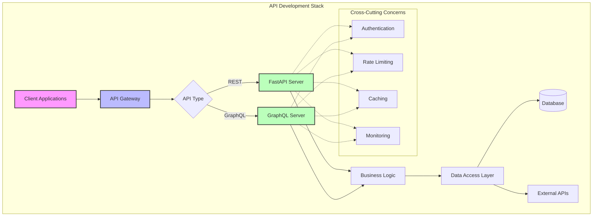

[🏠 Workshop](../../README.md) > [📚 Modules](../README.md) > [Module 8](README.md)

<div align="center">

[⬅️ Module 07: Building Web Applications with AI](../module-07/README.md) | **📖 Module 8: API Development and Integration** | [Module 09: Database Design and Optimization ➡️](../module-09/README.md)

</div>

---

# Module 08: API Development and Integration

## 🎯 Module Overview

Master the art of API development using AI-powered assistance. Learn to design, build, and integrate RESTful and GraphQL APIs with GitHub Copilot as your coding companion. This module bridges frontend and backend development, teaching you to create production-ready APIs that power modern applications.

**Duration:** 3 hours  
**Track:** 🔵 Intermediate  
**Prerequisites:** Modules 1-7 completed

## 🎓 Learning Objectives

By the end of this module, you will:

1. **Design RESTful APIs** with proper resource modeling and HTTP semantics
2. **Build GraphQL APIs** with schemas, resolvers, and subscriptions
3. **Implement authentication** and authorization patterns
4. **Integrate external APIs** with proper error handling
5. **Generate API documentation** automatically with AI assistance
6. **Test APIs comprehensively** using AI-generated test suites
7. **Optimize API performance** with caching and rate limiting
8. **Deploy APIs** with monitoring and observability

## 🏗️ Module Architecture



## 📚 What You'll Learn

### Part 1: RESTful API Development
- Resource-oriented design principles
- HTTP methods and status codes
- Request/response patterns
- Pagination and filtering
- Error handling standards
- OpenAPI/Swagger documentation

### Part 2: GraphQL Development
- Schema design and SDL
- Query and mutation resolvers
- Real-time subscriptions
- DataLoader pattern
- Schema stitching
- GraphQL best practices

### Part 3: Integration & Production
- API authentication (JWT, OAuth 2.0)
- Rate limiting and throttling
- Caching strategies
- API versioning
- Monitoring and metrics
- Deployment patterns

## 🎯 Exercises

### Exercise 1: RESTful Task API (⭐ Easy - 45 minutes)
Build a complete REST API for task management with CRUD operations, proper HTTP semantics, and automated documentation.

### Exercise 2: GraphQL Social API (⭐⭐ Medium - 60 minutes)  
Create a GraphQL API for a social platform with complex relationships, efficient data loading, and real-time subscriptions.

### Exercise 3: Enterprise API Gateway (⭐⭐⭐ Hard - 90 minutes)
Implement a production-ready API gateway that integrates multiple services, handles authentication, implements rate limiting, and provides comprehensive monitoring.

## 🛠️ Technologies Used

- **Frameworks**: FastAPI (REST), Strawberry (GraphQL)
- **Testing**: pytest, httpx, pytest-asyncio
- **Documentation**: OpenAPI/Swagger, GraphQL Playground
- **Authentication**: PyJWT, python-jose
- **Caching**: Redis, aiocache
- **Monitoring**: Prometheus, OpenTelemetry
- **Deployment**: Docker, Kubernetes

## 📁 Module Structure

```
module-08-api-development/
├── README.md                    # This file
├── prerequisites.md             # Setup requirements
├── exercises/
│   ├── exercise1-rest-api/
│   │   ├── instructions/
│   │   │   ├── part1.md        # Setup and design
│   │   │   └── part2.md        # Implementation
│   │   ├── starter/            # Starting code
│   │   ├── solution/           # Complete solution
│   │   └── tests/              # Test suite
│   ├── exercise2-graphql-api/
│   │   ├── instructions/
│   │   ├── starter/
│   │   ├── solution/
│   │   └── tests/
│   └── exercise3-api-gateway/
│       ├── instructions/
│       ├── starter/
│       ├── solution/
│       └── tests/
├── best-practices.md           # Production patterns
├── resources/                  # Additional materials
│   ├── api-design-guide.pdf
│   ├── http-status-codes.md
│   └── graphql-patterns.md
└── troubleshooting.md         # Common issues

```

## 🚀 Getting Started

1. **Review Prerequisites**: Ensure your environment is properly configured
2. **Read Conceptual Overview**: Understand API design principles
3. **Complete Exercises**: Work through each exercise progressively
4. **Apply Best Practices**: Review production patterns
5. **Build Your Project**: Create your own API using learned concepts

## 📊 Success Metrics

- **Exercise Completion**: All three exercises completed with tests passing
- **Code Quality**: APIs follow RESTful/GraphQL best practices
- **Performance**: APIs respond within acceptable latency (< 100ms)
- **Documentation**: Comprehensive API documentation generated
- **Security**: Authentication and authorization properly implemented

## 🤝 AI Assistance Tips

- Use Copilot to generate boilerplate API endpoints
- Ask for best practices when designing schemas
- Generate comprehensive test cases for each endpoint
- Request optimization suggestions for slow queries
- Get help with complex authentication flows

## 📖 Additional Resources

- [FastAPI Documentation](https://fastapi.tiangolo.com/)
- [GraphQL Official Documentation](https://graphql.org/learn/)
- [REST API Design Best Practices](https://docs.microsoft.com/en-us/azure/architecture/best-practices/api-design)
- [Azure API Management](https://docs.microsoft.com/en-us/azure/api-management/)
- [GitHub REST API Guidelines](https://docs.github.com/en/rest)

## ⏭️ Next Steps

After completing this module, you'll be ready for:
- **Module 9**: Database Design and Optimization
- **Module 10**: Real-time and Event-Driven Systems
- **Module 11**: Microservices Architecture

---

🎉 **Congratulations on starting Module 8!** You're building the skills to create APIs that power modern applications. Let's dive in!

---

## 🔗 Quick Links

### Module Resources
- [📋 Prerequisites](prerequisites.md)
- [📖 Best Practices](docs/best-practices.md)
- [🔧 Troubleshooting](docs/troubleshooting.md)
- [💡 Prompt Templates](docs/prompt-templates.md)

### Exercises
- [⭐ Exercise 1 - Foundation](exercises/exercise1/README.md)
- [⭐⭐ Exercise 2 - Application](exercises/exercise2/README.md)
- [⭐⭐⭐ Exercise 3 - Mastery](exercises/exercise3/README.md)

### Workshop Resources
- [🏠 Workshop Home](../../README.md)
- [📚 All Modules](../../README.md#-complete-module-overview)
- [🚀 Quick Start](../../QUICKSTART.md)
- [❓ FAQ](../../FAQ.md)
- [🤖 Prompt Guide](../../PROMPT-GUIDE.md)
- [🔧 Troubleshooting](../../TROUBLESHOOTING.md)


---

## 🔗 Quick Links

### Module Resources
- [📋 Prerequisites](prerequisites.md)
- [📖 Best Practices](docs/best-practices.md)
- [🔧 Troubleshooting](docs/troubleshooting.md)
- [💡 Prompt Templates](docs/prompt-templates.md)

### Exercises
- [⭐ Exercise 1 - Foundation](exercises/exercise1/README.md)
- [⭐⭐ Exercise 2 - Application](exercises/exercise2/README.md)
- [⭐⭐⭐ Exercise 3 - Mastery](exercises/exercise3/README.md)

### Workshop Resources
- [🏠 Workshop Home](../../README.md)
- [📚 All Modules](../../README.md#-complete-module-overview)
- [🚀 Quick Start](../../QUICKSTART.md)
- [❓ FAQ](../../FAQ.md)
- [🤖 Prompt Guide](../../PROMPT-GUIDE.md)
- [🔧 Troubleshooting](../../TROUBLESHOOTING.md)


---

## 🔗 Quick Links

### Module Resources
- [📋 Prerequisites](prerequisites.md)
- [📖 Best Practices](docs/best-practices.md)
- [🔧 Troubleshooting](docs/troubleshooting.md)
- [💡 Prompt Templates](docs/prompt-templates.md)

### Exercises
- [⭐ Exercise 1 - Foundation](exercises/exercise1/README.md)
- [⭐⭐ Exercise 2 - Application](exercises/exercise2/README.md)
- [⭐⭐⭐ Exercise 3 - Mastery](exercises/exercise3/README.md)

### Workshop Resources
- [🏠 Workshop Home](../../README.md)
- [📚 All Modules](../../README.md#-complete-module-overview)
- [🚀 Quick Start](../../QUICKSTART.md)
- [❓ FAQ](../../FAQ.md)
- [🤖 Prompt Guide](../../PROMPT-GUIDE.md)
- [🔧 Troubleshooting](../../TROUBLESHOOTING.md)


## 🧭 Quick Navigation

<table>
<tr>
<td valign="top">

### 📖 Module Content
- [Overview](README.md)
- [Prerequisites](prerequisites.md)
- [Setup Guide](docs/setup.md)
- [Troubleshooting](docs/troubleshooting.md)

</td>
<td valign="top">

### 💻 Exercises
- [Exercise 1 - Foundation ⭐](exercises/exercise1/README.md)
- [Exercise 2 - Application ⭐⭐](exercises/exercise2/README.md)
- [Exercise 3 - Mastery ⭐⭐⭐](exercises/exercise3/README.md)
- [Independent Project](project/README.md)

</td>
<td valign="top">

### 📚 Resources
- [Best Practices](docs/best-practices.md)
- [Common Patterns](docs/common-patterns.md)
- [Prompt Templates](docs/prompt-templates.md)
- [Additional Resources](resources/README.md)

</td>
</tr>
</table>


---

## 🌐 Workshop Resources

<div align="center">

| Core Documentation | Learning Resources | Tools & Scripts |
|:------------------:|:-----------------:|:---------------:|
| [🏠 Home](../../README.md) | [🚀 Quick Start](../../QUICKSTART.md) | [🛠️ Scripts](../../scripts/README.md) |
| [📋 Prerequisites](../../PREREQUISITES.md) | [❓ FAQ](../../FAQ.md) | [🔧 Setup](../../scripts/setup-workshop.sh) |
| [📚 All Modules](../README.md) | [🤖 Prompt Guide](../../PROMPT-GUIDE.md) | [✅ Validate](../../scripts/validate-prerequisites.sh) |
| [🗺️ Learning Paths](../../README.md#-learning-paths) | [🔧 Troubleshooting](../../TROUBLESHOOTING.md) | [🧹 Cleanup](../../scripts/cleanup-resources.sh) |

</div>

### 🏷️ Module Categories

<div align="center">

| 🟢 Fundamentals | 🔵 Intermediate | 🟠 Advanced | 🔴 Enterprise | 🟣 AI Agents | ⭐ Mastery |
|:---------------:|:---------------:|:-----------:|:-------------:|:------------:|:----------:|
| Modules 1-5 | Modules 6-10 | Modules 11-15 | Modules 16-20 | Modules 21-25 | Modules 26-30 |

</div>


---

## 🔗 Quick Links

### Module Resources
- [📋 Prerequisites](prerequisites.md)
- [📖 Best Practices](docs/best-practices.md)
- [🔧 Troubleshooting](docs/troubleshooting.md)
- [💡 Prompt Templates](docs/prompt-templates.md)

### Exercises
- [⭐ Exercise 1 - Foundation](exercises/exercise1/README.md)
- [⭐⭐ Exercise 2 - Application](exercises/exercise2/README.md)
- [⭐⭐⭐ Exercise 3 - Mastery](exercises/exercise3/README.md)

### Workshop Resources
- [🏠 Workshop Home](../../README.md)
- [📚 All Modules](../../README.md#-complete-module-overview)
- [🚀 Quick Start](../../QUICKSTART.md)
- [❓ FAQ](../../FAQ.md)
- [🤖 Prompt Guide](../../PROMPT-GUIDE.md)
- [🔧 Troubleshooting](../../TROUBLESHOOTING.md)


## 🧭 Quick Navigation

<table>
<tr>
<td valign="top">

### 📖 Module Content
- [Overview](README.md)
- [Prerequisites](prerequisites.md)
- [Setup Guide](docs/setup.md)
- [Troubleshooting](docs/troubleshooting.md)

</td>
<td valign="top">

### 💻 Exercises
- [Exercise 1 - Foundation ⭐](exercises/exercise1/README.md)
- [Exercise 2 - Application ⭐⭐](exercises/exercise2/README.md)
- [Exercise 3 - Mastery ⭐⭐⭐](exercises/exercise3/README.md)
- [Independent Project](project/README.md)

</td>
<td valign="top">

### 📚 Resources
- [Best Practices](docs/best-practices.md)
- [Common Patterns](docs/common-patterns.md)
- [Prompt Templates](docs/prompt-templates.md)
- [Additional Resources](resources/README.md)

</td>
</tr>
</table>


---

## 🌐 Workshop Resources

<div align="center">

| Core Documentation | Learning Resources | Tools & Scripts |
|:------------------:|:-----------------:|:---------------:|
| [🏠 Home](../../README.md) | [🚀 Quick Start](../../QUICKSTART.md) | [🛠️ Scripts](../../scripts/README.md) |
| [📋 Prerequisites](../../PREREQUISITES.md) | [❓ FAQ](../../FAQ.md) | [🔧 Setup](../../scripts/setup-workshop.sh) |
| [📚 All Modules](../README.md) | [🤖 Prompt Guide](../../PROMPT-GUIDE.md) | [✅ Validate](../../scripts/validate-prerequisites.sh) |
| [🗺️ Learning Paths](../../README.md#-learning-paths) | [🔧 Troubleshooting](../../TROUBLESHOOTING.md) | [🧹 Cleanup](../../scripts/cleanup-resources.sh) |

</div>

### 🏷️ Module Categories

<div align="center">

| 🟢 Fundamentals | 🔵 Intermediate | 🟠 Advanced | 🔴 Enterprise | 🟣 AI Agents | ⭐ Mastery |
|:---------------:|:---------------:|:-----------:|:-------------:|:------------:|:----------:|
| Modules 1-5 | Modules 6-10 | Modules 11-15 | Modules 16-20 | Modules 21-25 | Modules 26-30 |

</div>


---

## 🔗 Quick Links

### Module Resources
- [📋 Prerequisites](prerequisites.md)
- [📖 Best Practices](docs/best-practices.md)
- [🔧 Troubleshooting](docs/troubleshooting.md)
- [💡 Prompt Templates](docs/prompt-templates.md)

### Exercises
- [⭐ Exercise 1 - Foundation](exercises/exercise1/README.md)
- [⭐⭐ Exercise 2 - Application](exercises/exercise2/README.md)
- [⭐⭐⭐ Exercise 3 - Mastery](exercises/exercise3/README.md)

### Workshop Resources
- [🏠 Workshop Home](../../README.md)
- [📚 All Modules](../../README.md#-complete-module-overview)
- [🚀 Quick Start](../../QUICKSTART.md)
- [❓ FAQ](../../FAQ.md)
- [🤖 Prompt Guide](../../PROMPT-GUIDE.md)
- [🔧 Troubleshooting](../../TROUBLESHOOTING.md)


## 🧭 Quick Navigation

<table>
<tr>
<td valign="top">

### 📖 Module Content
- [Overview](README.md)
- [Prerequisites](prerequisites.md)
- [Setup Guide](docs/setup.md)
- [Troubleshooting](docs/troubleshooting.md)

</td>
<td valign="top">

### 💻 Exercises
- [Exercise 1 - Foundation ⭐](exercises/exercise1/README.md)
- [Exercise 2 - Application ⭐⭐](exercises/exercise2/README.md)
- [Exercise 3 - Mastery ⭐⭐⭐](exercises/exercise3/README.md)
- [Independent Project](project/README.md)

</td>
<td valign="top">

### 📚 Resources
- [Best Practices](docs/best-practices.md)
- [Common Patterns](docs/common-patterns.md)
- [Prompt Templates](docs/prompt-templates.md)
- [Additional Resources](resources/README.md)

</td>
</tr>
</table>


---

## 🌐 Workshop Resources

<div align="center">

| Core Documentation | Learning Resources | Tools & Scripts |
|:------------------:|:-----------------:|:---------------:|
| [🏠 Home](../../README.md) | [🚀 Quick Start](../../QUICKSTART.md) | [🛠️ Scripts](../../scripts/README.md) |
| [📋 Prerequisites](../../PREREQUISITES.md) | [❓ FAQ](../../FAQ.md) | [🔧 Setup](../../scripts/setup-workshop.sh) |
| [📚 All Modules](../README.md) | [🤖 Prompt Guide](../../PROMPT-GUIDE.md) | [✅ Validate](../../scripts/validate-prerequisites.sh) |
| [🗺️ Learning Paths](../../README.md#-learning-paths) | [🔧 Troubleshooting](../../TROUBLESHOOTING.md) | [🧹 Cleanup](../../scripts/cleanup-resources.sh) |

</div>

### 🏷️ Module Categories

<div align="center">

| 🟢 Fundamentals | 🔵 Intermediate | 🟠 Advanced | 🔴 Enterprise | 🟣 AI Agents | ⭐ Mastery |
|:---------------:|:---------------:|:-----------:|:-------------:|:------------:|:----------:|
| Modules 1-5 | Modules 6-10 | Modules 11-15 | Modules 16-20 | Modules 21-25 | Modules 26-30 |

</div>

