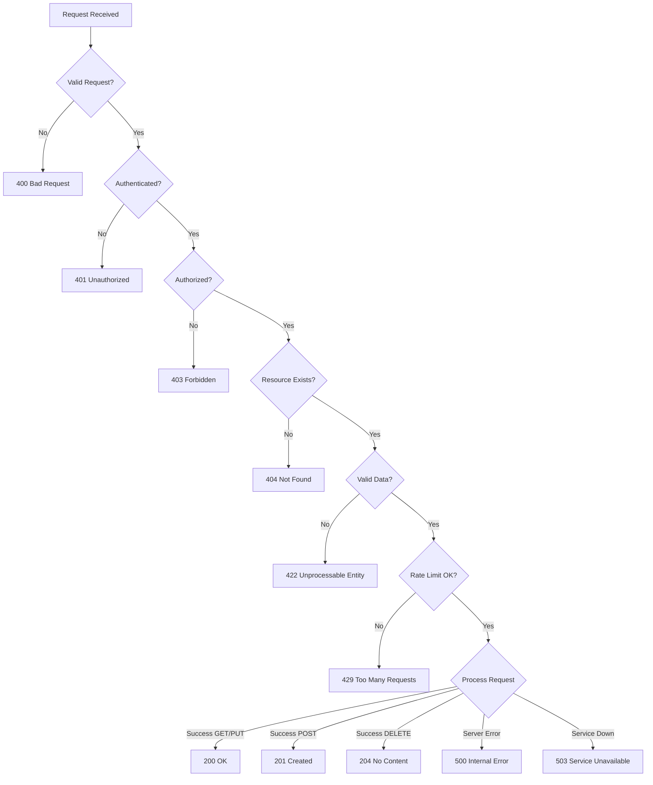

# HTTP Status Codes Reference

## 🟢 2xx Success

### 200 OK
- **Use Case**: Successful GET, PUT, PATCH requests
- **Example**: Fetching a resource, updating a resource
```python
@router.get("/users/{user_id}")
async def get_user(user_id: UUID):
    user = await fetch_user(user_id)
    return user  # FastAPI returns 200 by default
```

### 201 Created
- **Use Case**: Successful POST request that creates a resource
- **Example**: Creating a new user, task, or post
```python
@router.post("/users", status_code=status.HTTP_201_CREATED)
async def create_user(user: UserCreate):
    new_user = await create_user_in_db(user)
    return new_user
```

### 202 Accepted
- **Use Case**: Request accepted for asynchronous processing
- **Example**: Starting a long-running job
```python
@router.post("/jobs", status_code=status.HTTP_202_ACCEPTED)
async def start_job(job: JobCreate):
    job_id = await queue_job(job)
    return {"job_id": job_id, "status": "queued"}
```

### 204 No Content
- **Use Case**: Successful DELETE requests or updates with no response body
- **Example**: Deleting a resource
```python
@router.delete("/users/{user_id}", status_code=status.HTTP_204_NO_CONTENT)
async def delete_user(user_id: UUID):
    await remove_user(user_id)
    # No return statement needed
```

## 🟡 3xx Redirection

### 301 Moved Permanently
- **Use Case**: Resource has permanently moved to a new location
```python
@router.get("/old-endpoint")
async def old_endpoint():
    return RedirectResponse(url="/new-endpoint", status_code=301)
```

### 302 Found (Temporary Redirect)
- **Use Case**: Temporary redirect to another resource
```python
@router.get("/login-required")
async def protected_resource():
    return RedirectResponse(url="/login", status_code=302)
```

### 304 Not Modified
- **Use Case**: Cached response is still valid
```python
@router.get("/static-content")
async def get_content(request: Request):
    if request.headers.get("If-None-Match") == current_etag:
        return Response(status_code=304)
    return content
```

## 🔴 4xx Client Errors

### 400 Bad Request
- **Use Case**: Invalid request syntax or invalid request message framing
- **Example**: Malformed JSON, missing required fields
```python
@router.post("/users")
async def create_user(user: UserCreate):
    if not user.email or "@" not in user.email:
        raise HTTPException(
            status_code=400,
            detail="Invalid email format"
        )
```

### 401 Unauthorized
- **Use Case**: Missing or invalid authentication credentials
- **Example**: No token provided, expired token
```python
@router.get("/protected")
async def protected_route(token: str = Depends(oauth2_scheme)):
    if not token:
        raise HTTPException(
            status_code=401,
            detail="Authentication required",
            headers={"WWW-Authenticate": "Bearer"}
        )
```

### 403 Forbidden
- **Use Case**: Authenticated but not authorized for this resource
- **Example**: User trying to access admin resources
```python
@router.delete("/admin/users/{user_id}")
async def delete_user(user_id: UUID, current_user: User = Depends(get_current_user)):
    if not current_user.is_admin:
        raise HTTPException(
            status_code=403,
            detail="Insufficient permissions"
        )
```

### 404 Not Found
- **Use Case**: Resource doesn't exist
- **Example**: Requesting non-existent user or item
```python
@router.get("/users/{user_id}")
async def get_user(user_id: UUID):
    user = await fetch_user(user_id)
    if not user:
        raise HTTPException(
            status_code=404,
            detail=f"User {user_id} not found"
        )
    return user
```

### 405 Method Not Allowed
- **Use Case**: HTTP method not supported for this endpoint
- **Example**: POST to a GET-only endpoint
```python
# FastAPI handles this automatically
# If you only define GET, POST will return 405
```

### 409 Conflict
- **Use Case**: Request conflicts with current state
- **Example**: Creating duplicate resource
```python
@router.post("/users")
async def create_user(user: UserCreate):
    existing = await get_user_by_email(user.email)
    if existing:
        raise HTTPException(
            status_code=409,
            detail="User with this email already exists"
        )
```

### 410 Gone
- **Use Case**: Resource existed but has been permanently deleted
```python
@router.get("/archived/{item_id}")
async def get_archived(item_id: UUID):
    if await was_permanently_deleted(item_id):
        raise HTTPException(
            status_code=410,
            detail="This resource has been permanently deleted"
        )
```

### 422 Unprocessable Entity
- **Use Case**: Request understood but contains invalid data
- **Example**: Validation errors (FastAPI default for Pydantic errors)
```python
# FastAPI automatically returns 422 for validation errors
@router.post("/users")
async def create_user(user: UserCreate):  # Pydantic validation
    return await save_user(user)
```

### 429 Too Many Requests
- **Use Case**: Rate limit exceeded
- **Example**: Too many API calls
```python
@router.get("/limited")
async def rate_limited_endpoint():
    if await check_rate_limit_exceeded():
        raise HTTPException(
            status_code=429,
            detail="Rate limit exceeded",
            headers={
                "Retry-After": "60",
                "X-RateLimit-Limit": "100",
                "X-RateLimit-Remaining": "0"
            }
        )
```

## 🔥 5xx Server Errors

### 500 Internal Server Error
- **Use Case**: Unexpected server error
- **Example**: Unhandled exception
```python
@app.exception_handler(Exception)
async def general_exception_handler(request: Request, exc: Exception):
    logger.error(f"Unhandled exception: {exc}", exc_info=True)
    return JSONResponse(
        status_code=500,
        content={"detail": "Internal server error"}
    )
```

### 502 Bad Gateway
- **Use Case**: Invalid response from upstream server
- **Example**: API gateway can't reach backend service
```python
@router.get("/proxy/{service}")
async def proxy_request(service: str):
    try:
        response = await call_backend_service(service)
    except httpx.HTTPError:
        raise HTTPException(
            status_code=502,
            detail=f"Failed to reach {service} service"
        )
```

### 503 Service Unavailable
- **Use Case**: Service temporarily unavailable
- **Example**: Maintenance mode, circuit breaker open
```python
@router.get("/health")
async def health_check():
    if await is_maintenance_mode():
        raise HTTPException(
            status_code=503,
            detail="Service under maintenance",
            headers={"Retry-After": "3600"}
        )
```

### 504 Gateway Timeout
- **Use Case**: Gateway didn't receive timely response
- **Example**: Upstream service timeout
```python
@router.get("/slow-service")
async def proxy_slow_service():
    try:
        response = await call_service_with_timeout(timeout=30)
    except asyncio.TimeoutError:
        raise HTTPException(
            status_code=504,
            detail="Upstream service timeout"
        )
```

## 📊 Status Code Decision Tree



## 💡 Best Practices

### 1. Be Consistent
```python
# Define a standard error response format
class ErrorResponse(BaseModel):
    error: dict = {
        "code": str,
        "message": str,
        "details": Optional[Any]
    }
```

### 2. Use Appropriate Status Codes
```python
# ✅ Good
@router.post("/users", status_code=201)
@router.delete("/users/{id}", status_code=204)

# ❌ Bad - Using 200 for everything
@router.post("/users")  # Should be 201
@router.delete("/users/{id}")  # Should be 204
```

### 3. Include Helpful Error Messages
```python
# ✅ Good
raise HTTPException(
    status_code=404,
    detail={
        "error": {
            "code": "USER_NOT_FOUND",
            "message": f"User with ID {user_id} not found",
            "suggestion": "Check if the user ID is correct"
        }
    }
)

# ❌ Bad
raise HTTPException(status_code=404, detail="Not found")
```

### 4. Add Relevant Headers
```python
# Rate limiting headers
response.headers["X-RateLimit-Limit"] = "100"
response.headers["X-RateLimit-Remaining"] = "75"
response.headers["X-RateLimit-Reset"] = "1609459200"

# Cache headers
response.headers["Cache-Control"] = "public, max-age=3600"
response.headers["ETag"] = f'"{content_hash}"'

# CORS headers
response.headers["Access-Control-Allow-Origin"] = "*"
```

## 🔗 Additional Resources

- [MDN HTTP Status Codes](https://developer.mozilla.org/en-US/docs/Web/HTTP/Status)
- [RFC 7231 - HTTP/1.1 Semantics](https://tools.ietf.org/html/rfc7231)
- [REST API Tutorial - HTTP Status Codes](https://www.restapitutorial.com/httpstatuscodes.html)