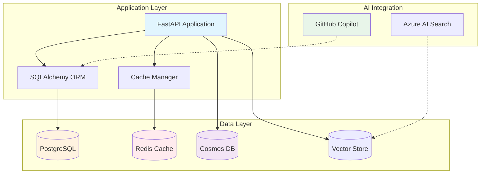

# Module 09: Database Design and Optimization

## 🎯 Module Overview

Master the art of database design and optimization with AI-powered assistance. Learn how to design efficient schemas, write optimized queries, implement performance improvements, and leverage GitHub Copilot to accelerate database development tasks.

**Duration**: 3 hours  
**Track**: 🔵 Intermediate  
**Prerequisites**: Completion of Modules 1-8

## 🎓 Learning Objectives

By the end of this module, you will be able to:

1. **Design efficient database schemas** using AI-assisted normalization and optimization techniques
2. **Generate complex SQL queries** with GitHub Copilot's assistance
3. **Implement performance optimization** strategies for both relational and NoSQL databases
4. **Create database migrations** with proper versioning and rollback strategies
5. **Build data access layers** with automatic query generation and type safety
6. **Monitor and analyze** database performance using AI-powered insights

## 🛠️ Technologies Covered

### Databases
- **PostgreSQL** - Primary relational database
- **Redis** - Caching and session storage
- **Azure Cosmos DB** - NoSQL with vector search capabilities
- **SQLite** - Development and testing

### Tools & Libraries
- **SQLAlchemy** - ORM and database toolkit
- **Alembic** - Database migration tool
- **psycopg2** - PostgreSQL adapter
- **redis-py** - Redis client
- **pgvector** - Vector similarity search

### AI Integration
- **GitHub Copilot** - Schema design, query generation
- **Azure AI Search** - Vector search capabilities
- **Query optimization** - AI-powered analysis

## 📚 Module Structure

### Part 1: Database Design Fundamentals (45 minutes)
- Understanding data modeling with AI assistance
- Normalization and denormalization strategies
- Schema design patterns and anti-patterns
- Using Copilot for entity relationship diagrams

### Part 2: Query Optimization and Performance (45 minutes)
- Writing efficient queries with Copilot
- Understanding query execution plans
- Index strategies and optimization
- Caching patterns with Redis

### Part 3: Advanced Topics (45 minutes)
- Vector databases and similarity search
- Database migrations and versioning
- Connection pooling and scaling
- Monitoring and performance tuning

### Part 4: Hands-on Exercises (45 minutes)
- Three progressive exercises
- Real-world scenarios
- Production-ready implementations

## 🎯 Exercises Overview

### Exercise 1: E-Commerce Database Schema (⭐ Easy)
Design and implement a complete e-commerce database schema with products, users, orders, and inventory tracking.

**Skills**: Schema design, relationships, constraints  
**Duration**: 30-45 minutes

### Exercise 2: Query Performance Optimization (⭐⭐ Medium)
Optimize a slow-performing application by analyzing queries, adding indexes, and implementing caching strategies.

**Skills**: Query analysis, indexing, caching  
**Duration**: 45-60 minutes

### Exercise 3: Real-time Analytics System (⭐⭐⭐ Hard)
Build a real-time analytics system with vector search, time-series data, and multi-database architecture.

**Skills**: Advanced queries, vector search, scaling  
**Duration**: 60-90 minutes

## 🚀 Getting Started

### 1. Environment Setup
```bash
# Clone the module repository
git clone https://github.com/your-org/mastery-ai-workshop.git
cd modules/module-09-database-optimization

# Run setup script
./scripts/setup-module-09.sh
```

### 2. Verify Prerequisites
```bash
# Check all requirements
python scripts/check_prerequisites.py

# Expected output:
# ✅ Python 3.11+ installed
# ✅ PostgreSQL 15+ running
# ✅ Redis server available
# ✅ Required Python packages installed
# ✅ GitHub Copilot active
```

### 3. Start Learning
1. Read through the conceptual overview
2. Complete exercises in order
3. Review best practices
4. Implement the independent project

## 📊 Architecture Overview



## 🎓 Skills You'll Master

### Database Design
- [ ] Entity-relationship modeling
- [ ] Normalization (1NF, 2NF, 3NF, BCNF)
- [ ] Schema versioning strategies
- [ ] Multi-tenant architectures

### Query Optimization
- [ ] Query plan analysis
- [ ] Index selection and tuning
- [ ] Query rewriting techniques
- [ ] Batch processing patterns

### Performance Tuning
- [ ] Connection pooling
- [ ] Caching strategies
- [ ] Read replicas and sharding
- [ ] Monitoring and metrics

### AI-Powered Development
- [ ] AI-assisted schema generation
- [ ] Automated query optimization
- [ ] Intelligent caching decisions
- [ ] Performance prediction

## 📖 Additional Resources

### Official Documentation
- [PostgreSQL Documentation](https://www.postgresql.org/docs/)
- [Redis Documentation](https://redis.io/documentation)
- [Azure Cosmos DB Docs](https://learn.microsoft.com/azure/cosmos-db/)
- [SQLAlchemy Tutorial](https://docs.sqlalchemy.org/tutorial/)

### Recommended Learning
- [Microsoft Learn: Database Design](https://learn.microsoft.com/training/modules/design-a-database/)
- [Azure Database Services](https://learn.microsoft.com/azure/architecture/data-guide/)
- [GitHub Copilot for SQL](https://github.blog/2023-06-29-github-copilot-for-sql/)

## 🎯 Success Criteria

You've mastered this module when you can:

1. ✅ Design normalized database schemas for complex applications
2. ✅ Write optimized queries that scale to millions of records
3. ✅ Implement effective caching strategies
4. ✅ Perform database migrations without downtime
5. ✅ Use AI to accelerate database development tasks
6. ✅ Monitor and optimize database performance

## 🚦 Next Steps

After completing this module:
1. Review the [best-practices.md](./best-practices.md) document
2. Complete the independent project
3. Share your solutions in the discussion forum
4. Proceed to Module 10: Real-time and Event-Driven Systems

---

**Remember**: Database design is the foundation of scalable applications. Take time to understand the concepts deeply, as they'll be crucial for all future modules.

🤖 **Pro Tip**: Let GitHub Copilot help you generate boilerplate code, but always understand and review what it creates. The best database designs come from understanding your data and use cases!
