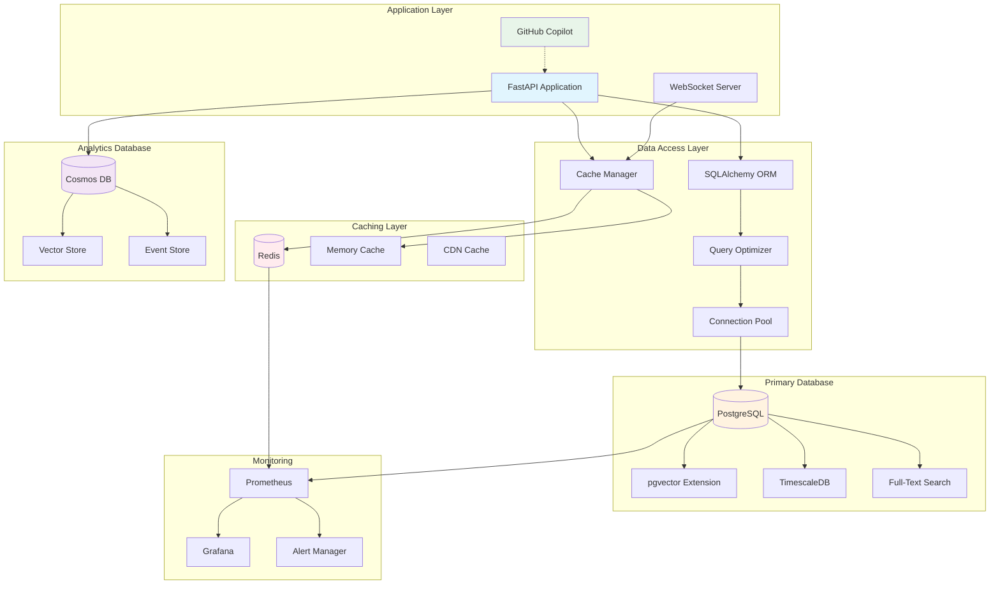
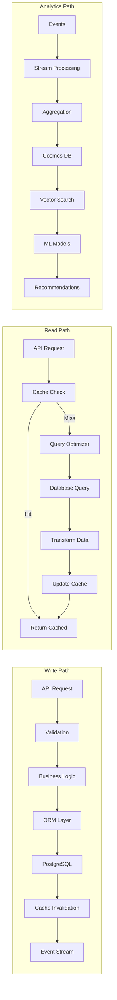
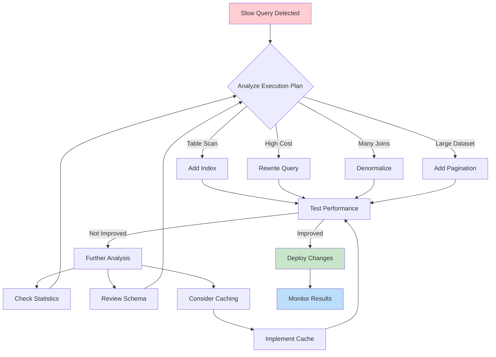
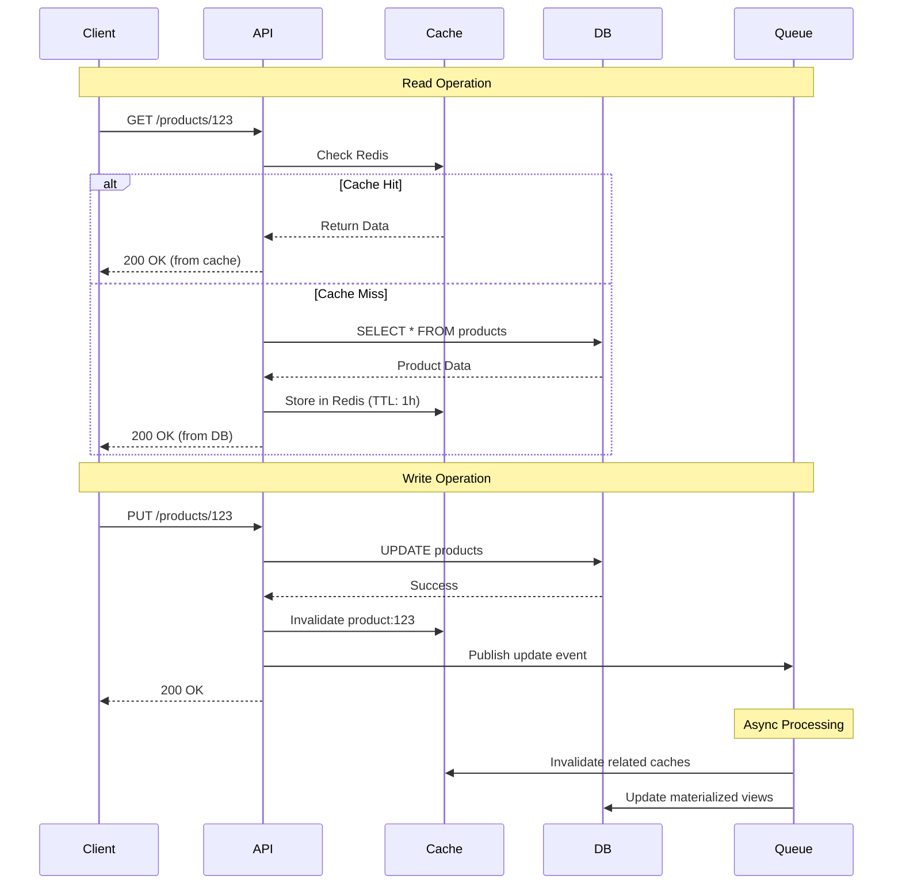
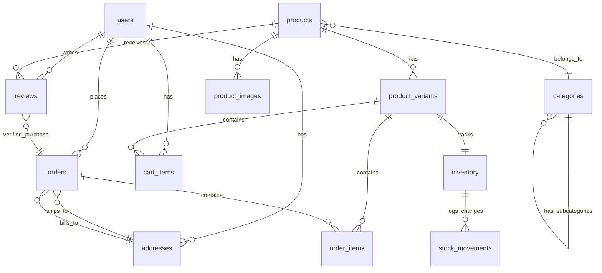
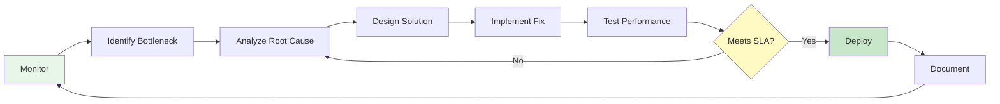
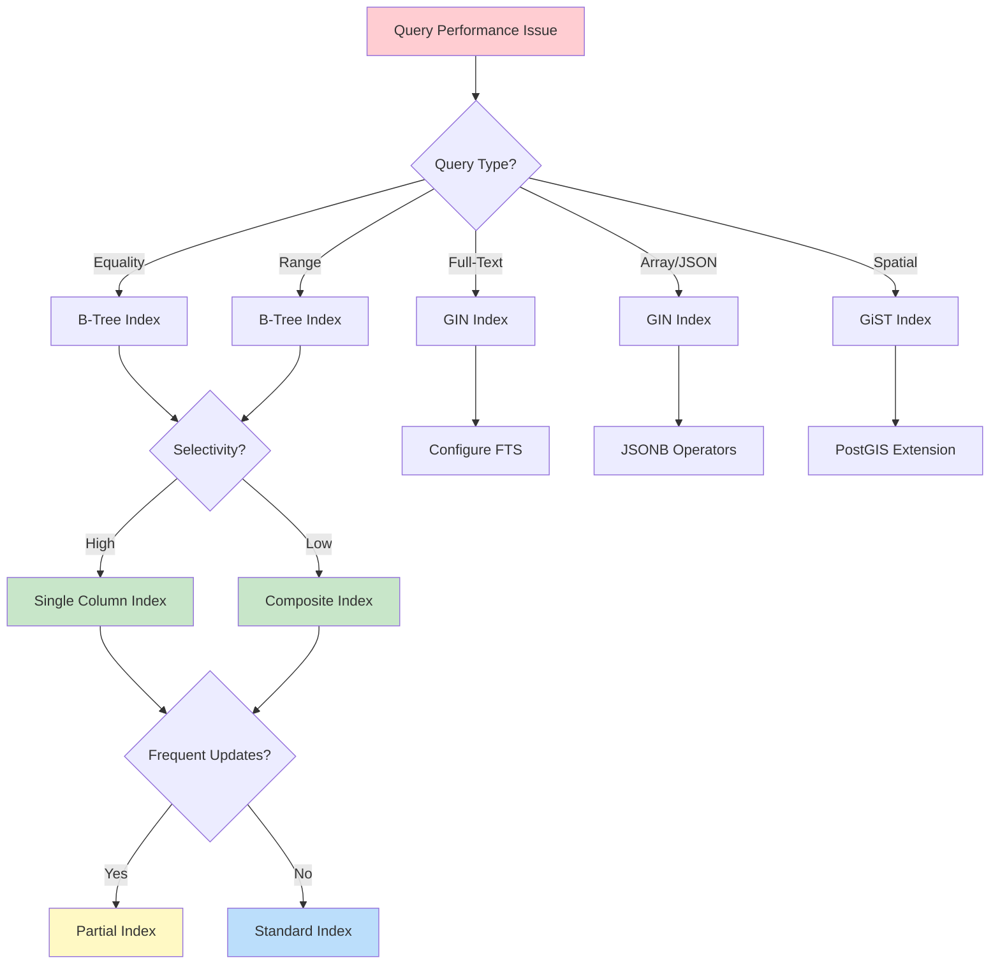

# Module 09: Database Architecture Overview

## System Architecture Diagram

## Data Flow Diagram

## Query Optimization Process

## Caching Strategy Diagram

## Database Schema Relationships

## Performance Optimization Lifecycle

## Index Strategy Decision Tree

