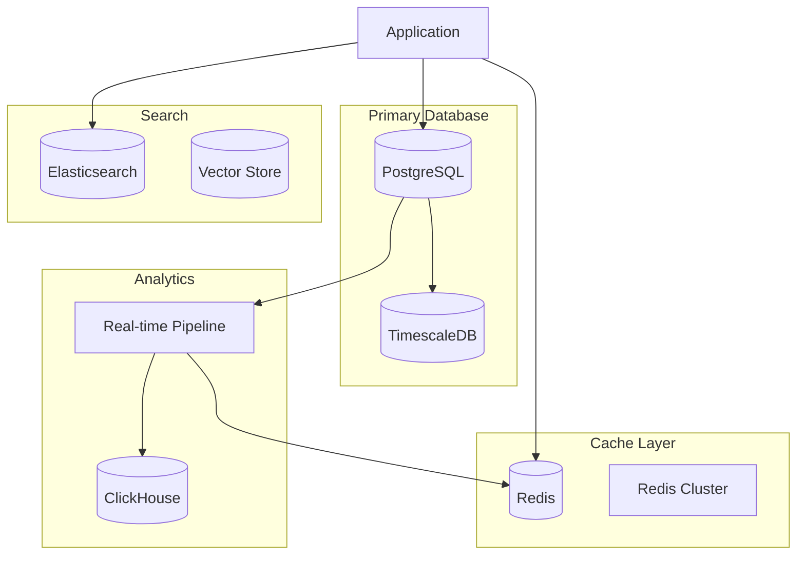

# Module 09: Independent Project - Social Media Analytics Platform

## 🎯 Project Overview

Build a complete database backend for a social media analytics platform that tracks user engagement, content performance, and provides real-time insights. This project will test all skills learned in Module 09.

**Estimated Time**: 4-6 hours  
**Difficulty**: 🔥 Challenging  
**Skills Applied**: All Module 09 concepts

## 📋 Requirements

### Functional Requirements

1. **User Management**
   - User profiles with followers/following
   - Authentication tokens
   - User activity tracking
   - Engagement metrics

2. **Content Management**
   - Posts with text, images, videos
   - Comments and nested replies
   - Likes, shares, bookmarks
   - Hashtags and mentions

3. **Analytics Dashboard**
   - Real-time engagement metrics
   - Content performance tracking
   - Follower growth analysis
   - Trending hashtags
   - Viral content detection

4. **Search & Discovery**
   - Full-text search on posts
   - User search
   - Hashtag trending
   - Content recommendations

5. **Performance Requirements**
   - Support 1M+ users
   - Handle 10K+ requests/second
   - Real-time updates (<1s latency)
   - 99.9% uptime

## 🏗️ Technical Specifications

### Database Architecture



### Core Tables

```sql
-- Users and relationships
CREATE TABLE users (
    id BIGSERIAL PRIMARY KEY,
    username VARCHAR(50) UNIQUE NOT NULL,
    email VARCHAR(255) UNIQUE NOT NULL,
    display_name VARCHAR(100),
    bio TEXT,
    avatar_url VARCHAR(500),
    verified BOOLEAN DEFAULT FALSE,
    created_at TIMESTAMPTZ DEFAULT CURRENT_TIMESTAMP,
    updated_at TIMESTAMPTZ DEFAULT CURRENT_TIMESTAMP
);

CREATE TABLE follows (
    follower_id BIGINT REFERENCES users(id),
    following_id BIGINT REFERENCES users(id),
    created_at TIMESTAMPTZ DEFAULT CURRENT_TIMESTAMP,
    PRIMARY KEY (follower_id, following_id)
);

-- Content
CREATE TABLE posts (
    id BIGSERIAL PRIMARY KEY,
    user_id BIGINT REFERENCES users(id),
    content TEXT,
    media_urls JSONB,
    visibility VARCHAR(20) DEFAULT 'public',
    reply_to_id BIGINT REFERENCES posts(id),
    created_at TIMESTAMPTZ DEFAULT CURRENT_TIMESTAMP,
    updated_at TIMESTAMPTZ DEFAULT CURRENT_TIMESTAMP
);

-- Engagement
CREATE TABLE engagements (
    id BIGSERIAL PRIMARY KEY,
    user_id BIGINT REFERENCES users(id),
    post_id BIGINT REFERENCES posts(id),
    engagement_type VARCHAR(20), -- like, share, bookmark
    created_at TIMESTAMPTZ DEFAULT CURRENT_TIMESTAMP,
    UNIQUE(user_id, post_id, engagement_type)
);

-- Analytics time-series
CREATE TABLE post_metrics (
    time TIMESTAMPTZ NOT NULL,
    post_id BIGINT,
    views INT DEFAULT 0,
    likes INT DEFAULT 0,
    shares INT DEFAULT 0,
    comments INT DEFAULT 0,
    reach INT DEFAULT 0
);

SELECT create_hypertable('post_metrics', 'time');
```

## 🚀 Implementation Tasks

### Phase 1: Database Design (1 hour)

1. **Design Complete Schema**
   - All tables with proper relationships
   - Constraints and validations
   - Audit trails for changes
   - Soft deletes where appropriate

2. **Create Indexes**
   - Primary and foreign keys
   - Search optimization indexes
   - Covering indexes for common queries
   - Partial indexes for filtered data

3. **Implement Triggers**
   - Update timestamps
   - Maintain counters
   - Data validation
   - Cascade operations

**Copilot Prompt**:
```python
# Design a complete social media database schema with:
# - User profiles and relationships (followers/following)
# - Posts with multimedia support and threading
# - Engagement tracking (likes, shares, comments)
# - Hashtags and mentions system
# - Analytics tables for metrics
# - Full-text search preparation
# Include all constraints, indexes, and triggers
```

### Phase 2: Query Optimization (1 hour)

1. **Feed Generation**
   - User's home feed (followers' posts)
   - Trending feed algorithm
   - Personalized recommendations
   - Pagination with cursor

2. **Analytics Queries**
   - Engagement rate calculations
   - Growth metrics
   - Content performance
   - User activity patterns

3. **Search Implementation**
   - Full-text search setup
   - Hashtag search
   - User search with ranking
   - Autocomplete suggestions

**Copilot Prompt**:
```python
# Create optimized queries for:
# 1. Home feed with posts from followed users
# 2. Trending posts based on engagement
# 3. User analytics dashboard
# 4. Search with relevance ranking
# Target: All queries <100ms at scale
```

### Phase 3: Caching Strategy (1 hour)

1. **Redis Implementation**
   - User session caching
   - Feed caching with TTL
   - Counter caches
   - Leaderboards

2. **Cache Patterns**
   - Write-through for counters
   - Cache-aside for feeds
   - Pub/sub for real-time
   - Cache warming strategies

3. **Invalidation Logic**
   - Smart invalidation
   - Cascade updates
   - Version-based caching
   - Partial invalidation

**Copilot Prompt**:
```python
# Implement Redis caching for:
# - User feeds (home, trending, explore)
# - Engagement counters with real-time updates
# - Search results caching
# - Session management
# Include TTL strategies and invalidation logic
```

### Phase 4: Real-time Features (1 hour)

1. **Event Streaming**
   - New post notifications
   - Real-time engagement updates
   - Follower notifications
   - Mention alerts

2. **Analytics Pipeline**
   - Stream processing
   - Real-time aggregations
   - Anomaly detection
   - Trend identification

3. **WebSocket Integration**
   - Live feed updates
   - Typing indicators
   - Online presence
   - Push notifications

**Copilot Prompt**:
```python
# Build real-time features:
# - WebSocket server for live updates
# - Event streaming for notifications
# - Real-time analytics dashboard
# - Presence system
# Use Redis pub/sub and PostgreSQL LISTEN/NOTIFY
```

### Phase 5: Advanced Features (1-2 hours)

1. **Recommendation System**
   - Content-based filtering
   - Collaborative filtering
   - Hybrid approach
   - A/B testing framework

2. **Vector Search**
   - Content embeddings
   - Similar posts
   - User similarity
   - Semantic search

3. **Performance Monitoring**
   - Query performance tracking
   - Cache hit rates
   - API latency metrics
   - Resource utilization

**Copilot Prompt**:
```python
# Implement advanced features:
# - ML-based content recommendations
# - Vector similarity search for posts
# - Performance monitoring dashboard
# - Auto-scaling triggers
# Include monitoring and alerting
```

## 📊 Success Criteria

Your implementation should achieve:

### Performance Metrics
- [ ] Feed generation: <50ms
- [ ] Post creation: <100ms
- [ ] Search results: <100ms
- [ ] Analytics queries: <200ms
- [ ] Real-time updates: <1s

### Scalability Tests
- [ ] 1M+ users in database
- [ ] 10M+ posts
- [ ] 100M+ engagements
- [ ] 10K concurrent connections
- [ ] 1K writes/second

### Feature Completeness
- [ ] All CRUD operations
- [ ] Complex analytics
- [ ] Real-time updates
- [ ] Search functionality
- [ ] Caching layer

## 🧪 Testing Requirements

1. **Unit Tests**
   - Schema validation
   - Query correctness
   - Cache operations
   - Business logic

2. **Integration Tests**
   - End-to-end workflows
   - Cache consistency
   - Real-time features
   - Search accuracy

3. **Performance Tests**
   - Load testing with Locust
   - Query benchmarks
   - Cache effectiveness
   - Scaling limits

4. **Chaos Testing**
   - Database failover
   - Cache failures
   - Network issues
   - Recovery time

## 📝 Deliverables

1. **Database Schema**
   - Complete DDL scripts
   - Migration files
   - Seed data scripts
   - ER diagram

2. **Application Code**
   - Models and ORM
   - API endpoints
   - Caching layer
   - Real-time handlers

3. **Documentation**
   - Architecture decisions
   - API documentation
   - Performance reports
   - Deployment guide

4. **Performance Report**
   - Benchmark results
   - Optimization process
   - Bottleneck analysis
   - Scaling recommendations

## 🎯 Stretch Goals

If you complete the main project, try these advanced challenges:

1. **Multi-region Deployment**
   - Geographic distribution
   - Cross-region replication
   - Latency optimization
   - Conflict resolution

2. **Machine Learning Integration**
   - Content moderation
   - Spam detection
   - Trending prediction
   - User clustering

3. **GraphQL API**
   - Efficient query resolution
   - DataLoader pattern
   - Subscription support
   - Query complexity analysis

4. **Event Sourcing**
   - Complete audit trail
   - Time travel queries
   - Event replay
   - CQRS implementation

## 🔗 Resources

- [Twitter's Engineering Blog](https://blog.twitter.com/engineering)
- [High Scalability](http://highscalability.com/)
- [System Design Primer](https://github.com/donnemartin/system-design-primer)
- [Database Internals Book](https://www.databass.dev/)

## 💡 Tips for Success

1. **Start Simple**: Get basic functionality working first
2. **Measure Everything**: Use benchmarks to guide optimization
3. **Cache Wisely**: Not everything needs caching
4. **Think in Batches**: Batch operations for efficiency
5. **Plan for Failure**: Design for resilience

Good luck! This project will challenge you to apply everything you've learned about database design and optimization. Remember to use GitHub Copilot to accelerate your development, but always understand and validate the generated code.

**Submission**: Create a GitHub repository with your implementation and share the link in the workshop discussion forum. Include a comprehensive README with setup instructions and performance results.