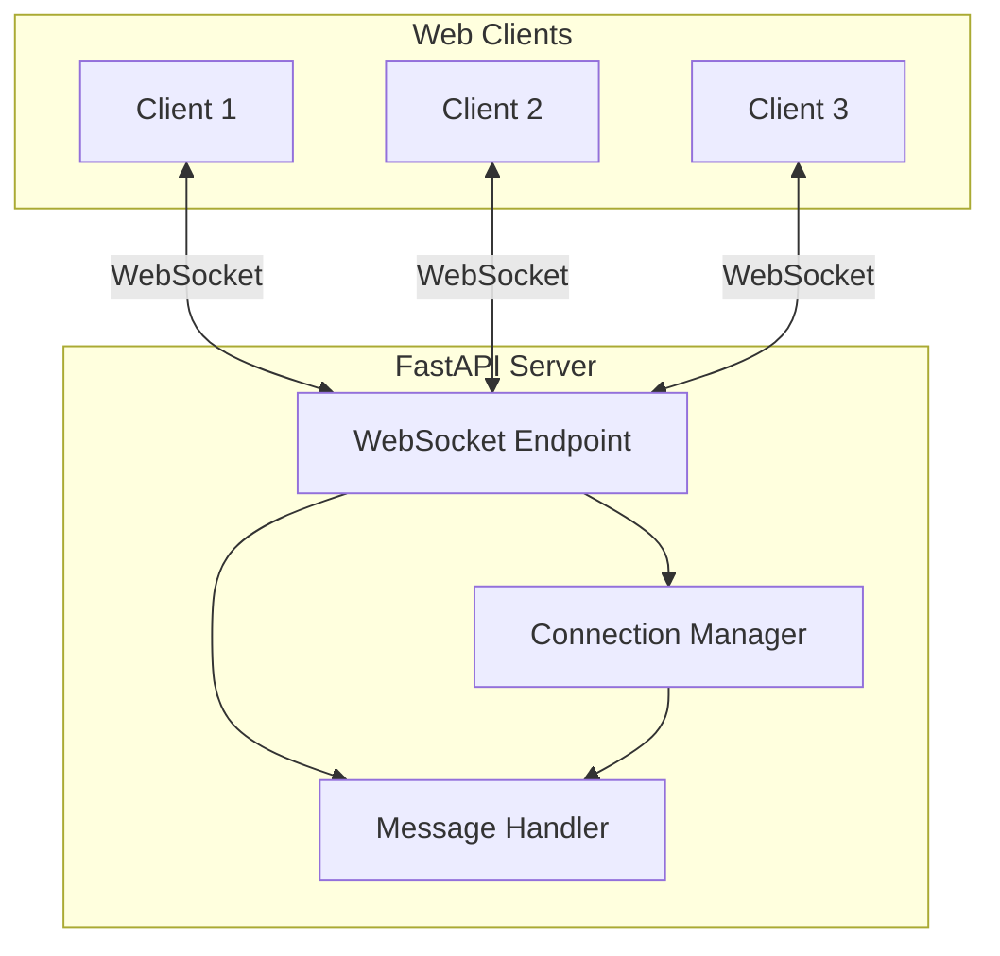

# Exercise 1: Real-time WebSocket Chat Application (⭐)

## 🎯 Exercise Overview

Build a real-time chat application using WebSockets and FastAPI. This foundational exercise teaches WebSocket basics, connection management, and message broadcasting - essential skills for any real-time application.

### Duration: 30-45 minutes

### Objectives
- Implement WebSocket server with FastAPI
- Create connection management system
- Build message broadcasting functionality
- Handle client connections/disconnections
- Create simple web client interface

### Success Metrics
- ✅ Multiple clients can connect simultaneously
- ✅ Messages broadcast to all connected clients
- ✅ Graceful handling of disconnections
- ✅ Client shows connection status
- ✅ Messages include timestamps and sender info

## 🏗️ Architecture Overview



## 📝 Step-by-Step Instructions

### Step 1: Project Setup

Create the project structure:
```bash
mkdir exercise1-websocket-chat
cd exercise1-websocket-chat

# Create files
touch main.py
touch connection_manager.py
touch static/index.html
touch static/chat.js
touch requirements.txt
```

Create `requirements.txt`:
```text
fastapi==0.104.1
uvicorn[standard]==0.24.0
python-multipart==0.0.6
```

Install dependencies:
```bash
pip install -r requirements.txt
```

### Step 2: Create Connection Manager

**Copilot Prompt Suggestion:**
```python
# Create a WebSocket connection manager class that:
# - Maintains a list of active connections
# - Has methods to connect/disconnect clients
# - Can broadcast messages to all connected clients
# - Handles connection errors gracefully
# Include type hints and async methods
```

**Expected Output:**
```python
# connection_manager.py
from typing import List
from fastapi import WebSocket

class ConnectionManager:
    def __init__(self):
        self.active_connections: List[WebSocket] = []

    async def connect(self, websocket: WebSocket):
        """Accept WebSocket connection and add to active connections"""
        await websocket.accept()
        self.active_connections.append(websocket)

    def disconnect(self, websocket: WebSocket):
        """Remove WebSocket from active connections"""
        self.active_connections.remove(websocket)

    async def send_personal_message(self, message: str, websocket: WebSocket):
        """Send message to specific WebSocket"""
        await websocket.send_text(message)

    async def broadcast(self, message: str):
        """Send message to all connected clients"""
        for connection in self.active_connections:
            try:
                await connection.send_text(message)
            except Exception:
                # Connection might be closed, continue with others
                pass
```

### Step 3: Create FastAPI Application

**Copilot Prompt Suggestion:**
```python
# Create a FastAPI application with:
# - WebSocket endpoint at /ws/{client_id}
# - Static file serving for HTML/JS
# - Connection manager instance
# - Message handling with JSON format
# - Proper error handling for disconnections
# Include connection/disconnection notifications
```

**Expected Output:**
```python
# main.py
from fastapi import FastAPI, WebSocket, WebSocketDisconnect
from fastapi.staticfiles import StaticFiles
from fastapi.responses import HTMLResponse
from datetime import datetime
import json
from connection_manager import ConnectionManager

app = FastAPI()
manager = ConnectionManager()

# Mount static files
app.mount("/static", StaticFiles(directory="static"), name="static")

@app.get("/")
async def get():
    """Serve the chat interface"""
    with open("static/index.html", "r") as f:
        return HTMLResponse(content=f.read())

@app.websocket("/ws/{client_id}")
async def websocket_endpoint(websocket: WebSocket, client_id: str):
    """WebSocket endpoint for chat communication"""
    await manager.connect(websocket)
    
    # Notify all clients about new connection
    connection_message = {
        "type": "connection",
        "client_id": client_id,
        "message": f"{client_id} joined the chat",
        "timestamp": datetime.now().isoformat()
    }
    await manager.broadcast(json.dumps(connection_message))
    
    try:
        while True:
            # Receive message from client
            data = await websocket.receive_text()
            
            # Create message object
            message_data = {
                "type": "message",
                "client_id": client_id,
                "message": data,
                "timestamp": datetime.now().isoformat()
            }
            
            # Broadcast to all connected clients
            await manager.broadcast(json.dumps(message_data))
            
    except WebSocketDisconnect:
        manager.disconnect(websocket)
        
        # Notify remaining clients about disconnection
        disconnection_message = {
            "type": "disconnection",
            "client_id": client_id,
            "message": f"{client_id} left the chat",
            "timestamp": datetime.now().isoformat()
        }
        await manager.broadcast(json.dumps(disconnection_message))
```

### Step 4: Create HTML Client Interface

**Copilot Prompt Suggestion:**
```html
<!-- Create a modern chat interface with:
- Input field for username
- Chat message display area
- Message input field
- Send button
- Connection status indicator
- Auto-scroll to latest messages
- Responsive design with Tailwind CSS
Include proper form handling and validation -->
```

**Expected Output:**
```html
<!-- static/index.html -->
<!DOCTYPE html>
<html lang="en">
<head>
    <meta charset="UTF-8">
    <meta name="viewport" content="width=device-width, initial-scale=1.0">
    <title>WebSocket Chat - Module 10</title>
    <script src="https://cdn.tailwindcss.com"></script>
</head>
<body class="bg-gray-100">
    <div class="container mx-auto p-4 max-w-4xl">
        <h1 class="text-3xl font-bold mb-6 text-center">Real-time WebSocket Chat</h1>
        
        <!-- Connection Status -->
        <div class="mb-4">
            <div id="status" class="inline-flex items-center px-3 py-1 rounded-full text-sm">
                <span class="w-2 h-2 rounded-full mr-2" id="status-dot"></span>
                <span id="status-text">Disconnected</span>
            </div>
        </div>

        <!-- Username Input -->
        <div id="username-section" class="mb-6">
            <div class="flex gap-2">
                <input 
                    type="text" 
                    id="username" 
                    placeholder="Enter your username" 
                    class="flex-1 px-4 py-2 border rounded-lg focus:outline-none focus:ring-2 focus:ring-blue-500"
                    maxlength="20"
                >
                <button 
                    onclick="connect()" 
                    id="connect-btn"
                    class="px-6 py-2 bg-blue-500 text-white rounded-lg hover:bg-blue-600 transition"
                >
                    Connect
                </button>
            </div>
        </div>

        <!-- Chat Container -->
        <div id="chat-section" class="hidden">
            <!-- Messages Display -->
            <div 
                id="messages" 
                class="bg-white rounded-lg shadow-md p-4 h-96 overflow-y-auto mb-4 space-y-2"
            >
                <!-- Messages will appear here -->
            </div>

            <!-- Message Input -->
            <div class="flex gap-2">
                <input 
                    type="text" 
                    id="messageInput" 
                    placeholder="Type a message..." 
                    class="flex-1 px-4 py-2 border rounded-lg focus:outline-none focus:ring-2 focus:ring-blue-500"
                    onkeypress="handleKeyPress(event)"
                    disabled
                >
                <button 
                    onclick="sendMessage()" 
                    id="send-btn"
                    class="px-6 py-2 bg-blue-500 text-white rounded-lg hover:bg-blue-600 transition disabled:opacity-50"
                    disabled
                >
                    Send
                </button>
            </div>
        </div>
    </div>

    <script src="/static/chat.js"></script>
</body>
</html>
```

[Continue to Part 2 for JavaScript implementation and testing...]
