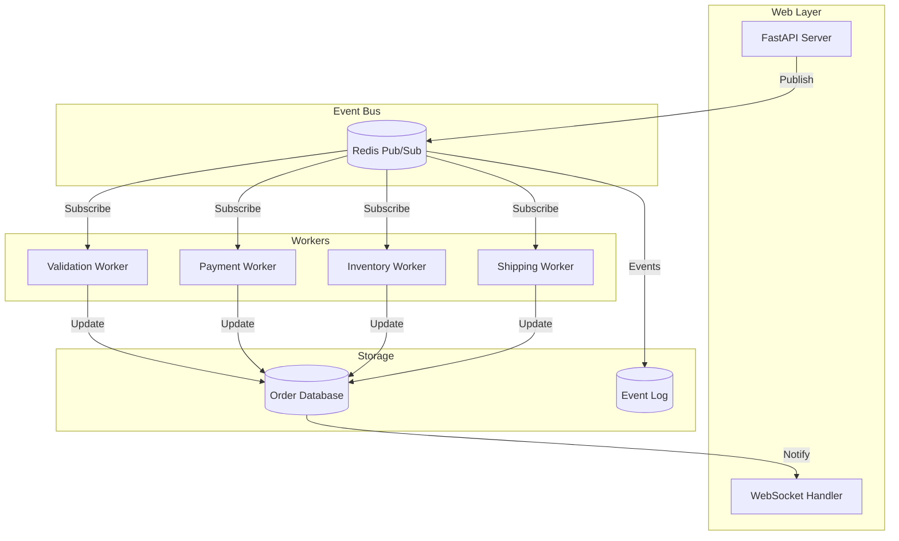

# Exercise 2: Event-Driven Order Processing System (⭐⭐)

## 🎯 Exercise Overview

Build a scalable event-driven order processing system using Redis Pub/Sub, background workers, and real-time status updates. This exercise demonstrates how modern applications handle asynchronous workflows, event sourcing, and microservice communication patterns.

### Duration: 45-60 minutes

### Objectives
- Implement event-driven architecture with Redis
- Create asynchronous order processing pipeline
- Build background workers for different tasks
- Implement real-time status updates via WebSocket
- Handle distributed system challenges

### Success Metrics
- ✅ Orders processed through multiple stages
- ✅ Real-time status updates to clients
- ✅ Resilient to worker failures
- ✅ Concurrent order processing
- ✅ Event history maintained

## 🏗️ Architecture Overview



## 📝 Step-by-Step Instructions

### Step 1: Project Setup

Create the project structure:
```bash
mkdir exercise2-event-system
cd exercise2-event-system

# Create directories
mkdir workers
mkdir models
mkdir static

# Create files
touch main.py
touch models/order.py
touch models/events.py
touch workers/validation_worker.py
touch workers/payment_worker.py
touch workers/inventory_worker.py
touch workers/shipping_worker.py
touch event_bus.py
touch database.py
touch requirements.txt
```

Create `requirements.txt`:
```text
fastapi==0.104.1
uvicorn[standard]==0.24.0
redis==5.0.1
aioredis==2.0.1
pydantic==2.5.0
python-multipart==0.0.6
sqlalchemy==2.0.23
aiosqlite==0.19.0
```

Install dependencies:
```bash
pip install -r requirements.txt
```

### Step 2: Define Data Models

**Copilot Prompt Suggestion:**
```python
# Create Pydantic models for:
# 1. Order with fields: id, customer_email, items (list), total_amount, status, created_at, updated_at
# 2. OrderItem with: product_id, name, quantity, price
# 3. OrderEvent with: order_id, event_type, status, message, timestamp, metadata
# 4. OrderStatus enum: pending, validating, payment_processing, inventory_check, shipping, completed, failed
# Include validation and JSON serialization
```

**Expected Output:**
```python
# models/order.py
from pydantic import BaseModel, EmailStr, Field
from typing import List, Optional, Dict, Any
from datetime import datetime
from enum import Enum
import uuid

class OrderStatus(str, Enum):
    PENDING = "pending"
    VALIDATING = "validating" 
    PAYMENT_PROCESSING = "payment_processing"
    INVENTORY_CHECK = "inventory_check"
    SHIPPING = "shipping"
    COMPLETED = "completed"
    FAILED = "failed"

class OrderItem(BaseModel):
    product_id: str
    name: str
    quantity: int = Field(gt=0)
    price: float = Field(gt=0)

class Order(BaseModel):
    id: str = Field(default_factory=lambda: str(uuid.uuid4()))
    customer_email: EmailStr
    items: List[OrderItem]
    total_amount: float = Field(gt=0)
    status: OrderStatus = OrderStatus.PENDING
    created_at: datetime = Field(default_factory=datetime.utcnow)
    updated_at: datetime = Field(default_factory=datetime.utcnow)
    
    def calculate_total(self) -> float:
        return sum(item.price * item.quantity for item in self.items)
    
    class Config:
        json_encoders = {
            datetime: lambda v: v.isoformat()
        }
```

```python
# models/events.py
from pydantic import BaseModel, Field
from typing import Optional, Dict, Any
from datetime import datetime
from enum import Enum

class EventType(str, Enum):
    ORDER_CREATED = "order_created"
    ORDER_VALIDATED = "order_validated"
    PAYMENT_PROCESSED = "payment_processed"
    INVENTORY_RESERVED = "inventory_reserved"
    SHIPMENT_CREATED = "shipment_created"
    ORDER_COMPLETED = "order_completed"
    ORDER_FAILED = "order_failed"

class OrderEvent(BaseModel):
    order_id: str
    event_type: EventType
    status: str
    message: str
    timestamp: datetime = Field(default_factory=datetime.utcnow)
    metadata: Optional[Dict[str, Any]] = {}
    
    class Config:
        json_encoders = {
            datetime: lambda v: v.isoformat()
        }
```

### Step 3: Create Event Bus

**Copilot Prompt Suggestion:**
```python
# Create an event bus class using Redis pub/sub that:
# - Publishes events to specific channels
# - Subscribes to channels with async handlers
# - Maintains connection pool
# - Handles reconnection on failure
# - Logs all events for audit trail
# - Supports multiple subscribers per channel
# Include error handling and connection management
```

**Expected Output:**
```python
# event_bus.py
import aioredis
import json
import asyncio
from typing import Dict, List, Callable, Any
from datetime import datetime
import logging

logger = logging.getLogger(__name__)

class EventBus:
    def __init__(self, redis_url: str = "redis://localhost:6379"):
        self.redis_url = redis_url
        self.redis = None
        self.pubsub = None
        self.subscribers: Dict[str, List[Callable]] = {}
        self.running = False
        
    async def connect(self):
        """Establish Redis connection"""
        try:
            self.redis = await aioredis.from_url(
                self.redis_url,
                encoding="utf-8",
                decode_responses=True
            )
            self.pubsub = self.redis.pubsub()
            logger.info("Connected to Redis event bus")
        except Exception as e:
            logger.error(f"Failed to connect to Redis: {e}")
            raise
    
    async def disconnect(self):
        """Close Redis connections"""
        if self.pubsub:
            await self.pubsub.close()
        if self.redis:
            await self.redis.close()
    
    async def publish(self, channel: str, event: Dict[str, Any]):
        """Publish event to channel"""
        try:
            # Add timestamp if not present
            if 'timestamp' not in event:
                event['timestamp'] = datetime.utcnow().isoformat()
            
            # Log event for audit
            await self._log_event(channel, event)
            
            # Publish to Redis
            message = json.dumps(event)
            await self.redis.publish(channel, message)
            logger.info(f"Published event to {channel}: {event.get('event_type', 'unknown')}")
            
        except Exception as e:
            logger.error(f"Failed to publish event: {e}")
            raise
    
    def subscribe(self, channel: str, handler: Callable):
        """Register handler for channel events"""
        if channel not in self.subscribers:
            self.subscribers[channel] = []
        self.subscribers[channel].append(handler)
        logger.info(f"Subscribed handler to channel: {channel}")
    
    async def start_listening(self):
        """Start listening for events"""
        self.running = True
        
        # Subscribe to all channels
        channels = list(self.subscribers.keys())
        if not channels:
            logger.warning("No channels to subscribe to")
            return
            
        await self.pubsub.subscribe(*channels)
        logger.info(f"Listening to channels: {channels}")
        
        # Process messages
        while self.running:
            try:
                message = await self.pubsub.get_message(
                    ignore_subscribe_messages=True,
                    timeout=1.0
                )
                
                if message:
                    await self._handle_message(message)
                    
            except asyncio.CancelledError:
                break
            except Exception as e:
                logger.error(f"Error processing message: {e}")
                await asyncio.sleep(1)  # Brief pause before retry
    
    async def _handle_message(self, message: Dict[str, Any]):
        """Process received message"""
        channel = message['channel']
        data = json.loads(message['data'])
        
        handlers = self.subscribers.get(channel, [])
        for handler in handlers:
            try:
                if asyncio.iscoroutinefunction(handler):
                    await handler(data)
                else:
                    handler(data)
            except Exception as e:
                logger.error(f"Handler error for {channel}: {e}")
    
    async def _log_event(self, channel: str, event: Dict[str, Any]):
        """Log event for audit trail"""
        log_entry = {
            "channel": channel,
            "event": event,
            "timestamp": datetime.utcnow().isoformat()
        }
        # In production, write to persistent storage
        await self.redis.lpush("event_log", json.dumps(log_entry))
        await self.redis.ltrim("event_log", 0, 9999)  # Keep last 10k events
    
    def stop(self):
        """Stop listening for events"""
        self.running = False
```

### Step 4: Create Database Layer

**Copilot Prompt Suggestion:**
```python
# Create an async database manager using SQLAlchemy that:
# - Uses SQLite for simplicity (async with aiosqlite)
# - Has orders table with all Order model fields
# - Has events table for event sourcing
# - Provides methods: create_order, update_order, get_order, get_order_events
# - Handles concurrent updates safely
# - Broadcasts order updates via callback
# Include proper session management and error handling
```

**Expected Output:**
```python
# database.py
from sqlalchemy.ext.asyncio import create_async_engine, AsyncSession
from sqlalchemy.orm import declarative_base, sessionmaker
from sqlalchemy import Column, String, Float, DateTime, JSON, Integer
from datetime import datetime
from typing import Optional, List, Callable
import json
from models.order import Order, OrderStatus
from models.events import OrderEvent

Base = declarative_base()

class OrderDB(Base):
    __tablename__ = "orders"
    
    id = Column(String, primary_key=True)
    customer_email = Column(String, nullable=False)
    items = Column(JSON, nullable=False)
    total_amount = Column(Float, nullable=False)
    status = Column(String, nullable=False)
    created_at = Column(DateTime, default=datetime.utcnow)
    updated_at = Column(DateTime, default=datetime.utcnow, onupdate=datetime.utcnow)

class EventDB(Base):
    __tablename__ = "events"
    
    id = Column(Integer, primary_key=True, autoincrement=True)
    order_id = Column(String, nullable=False)
    event_type = Column(String, nullable=False)
    status = Column(String, nullable=False)
    message = Column(String, nullable=False)
    timestamp = Column(DateTime, default=datetime.utcnow)
    metadata = Column(JSON, default={})

class Database:
    def __init__(self, database_url: str = "sqlite+aiosqlite:///./orders.db"):
        self.engine = create_async_engine(database_url, echo=False)
        self.async_session = sessionmaker(
            self.engine, class_=AsyncSession, expire_on_commit=False
        )
        self.update_callback: Optional[Callable] = None
    
    async def init_db(self):
        """Initialize database tables"""
        async with self.engine.begin() as conn:
            await conn.run_sync(Base.metadata.create_all)
    
    def set_update_callback(self, callback: Callable):
        """Set callback for order updates"""
        self.update_callback = callback
    
    async def create_order(self, order: Order) -> Order:
        """Create new order"""
        async with self.async_session() as session:
            db_order = OrderDB(
                id=order.id,
                customer_email=order.customer_email,
                items=[item.dict() for item in order.items],
                total_amount=order.total_amount,
                status=order.status.value,
                created_at=order.created_at,
                updated_at=order.updated_at
            )
            session.add(db_order)
            await session.commit()
            
            # Notify update
            if self.update_callback:
                await self.update_callback(order)
            
            return order
    
    async def update_order(self, order_id: str, status: OrderStatus, event: Optional[OrderEvent] = None) -> Optional[Order]:
        """Update order status and log event"""
        async with self.async_session() as session:
            # Update order
            result = await session.execute(
                f"SELECT * FROM orders WHERE id = '{order_id}'"
            )
            db_order = result.fetchone()
            
            if not db_order:
                return None
            
            # Update status
            await session.execute(
                f"UPDATE orders SET status = '{status.value}', updated_at = '{datetime.utcnow().isoformat()}' WHERE id = '{order_id}'"
            )
            
            # Log event if provided
            if event:
                db_event = EventDB(
                    order_id=event.order_id,
                    event_type=event.event_type.value,
                    status=event.status,
                    message=event.message,
                    timestamp=event.timestamp,
                    metadata=event.metadata
                )
                session.add(db_event)
            
            await session.commit()
            
            # Convert to Order model
            order = Order(
                id=db_order.id,
                customer_email=db_order.customer_email,
                items=db_order.items,
                total_amount=db_order.total_amount,
                status=status,
                created_at=db_order.created_at,
                updated_at=datetime.utcnow()
            )
            
            # Notify update
            if self.update_callback:
                await self.update_callback(order)
            
            return order
    
    async def get_order(self, order_id: str) -> Optional[Order]:
        """Get order by ID"""
        async with self.async_session() as session:
            result = await session.execute(
                f"SELECT * FROM orders WHERE id = '{order_id}'"
            )
            db_order = result.fetchone()
            
            if not db_order:
                return None
            
            return Order(
                id=db_order.id,
                customer_email=db_order.customer_email,
                items=db_order.items,
                total_amount=db_order.total_amount,
                status=OrderStatus(db_order.status),
                created_at=db_order.created_at,
                updated_at=db_order.updated_at
            )
    
    async def get_order_events(self, order_id: str) -> List[OrderEvent]:
        """Get all events for an order"""
        async with self.async_session() as session:
            result = await session.execute(
                f"SELECT * FROM events WHERE order_id = '{order_id}' ORDER BY timestamp"
            )
            events = result.fetchall()
            
            return [
                OrderEvent(
                    order_id=event.order_id,
                    event_type=event.event_type,
                    status=event.status,
                    message=event.message,
                    timestamp=event.timestamp,
                    metadata=event.metadata
                )
                for event in events
            ]
```

[Continue to Part 2 for Workers and API implementation...]
