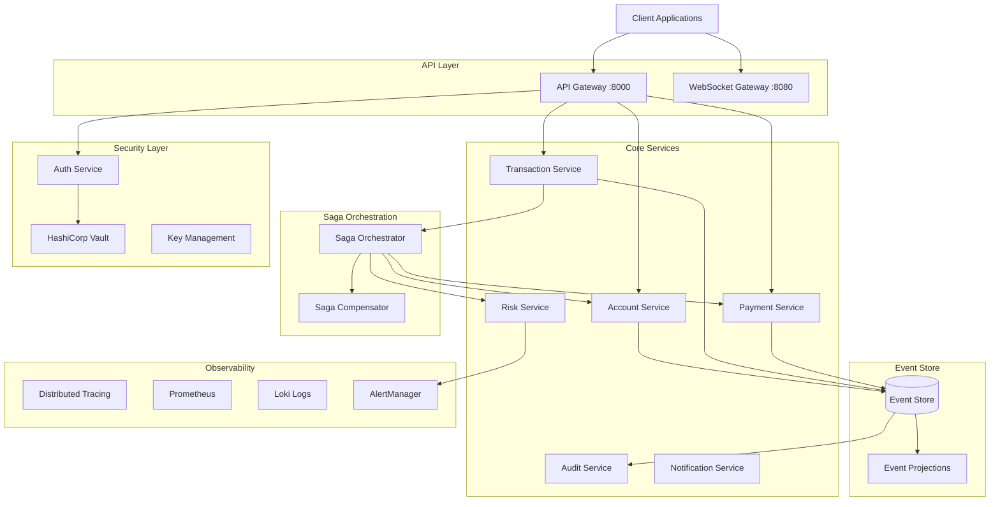

# Exercise 3: Mastery - Production-Ready Financial Platform ⭐⭐⭐

## Overview
**Duration**: 60-90 minutes  
**Difficulty**: ⭐⭐⭐ (Hard)  
**Success Rate**: 60%

In this exercise, you'll build a production-ready financial services platform with complete observability, security, resilience patterns, and distributed transaction handling using saga patterns. This represents enterprise-grade microservices with all the complexities of real financial systems.

## 🎯 Learning Objectives

By completing this exercise, you will:
1. Implement the Saga pattern for distributed transactions
2. Add comprehensive security between services
3. Implement circuit breakers and bulkheads
4. Add distributed tracing with OpenTelemetry
5. Implement CQRS and Event Sourcing patterns
6. Add chaos engineering readiness
7. Implement zero-downtime deployment strategies
8. Build a complete observability stack

## 📋 Prerequisites

- Completed Exercises 1 and 2
- Understanding of distributed transactions
- Knowledge of security patterns
- Familiarity with CQRS/Event Sourcing

## 🏗️ Architecture Overview



## 📁 Project Structure

```
exercise3-mastery/
├── api-gateway/
│   ├── app/
│   │   ├── security/
│   │   │   ├── jwt_handler.py
│   │   │   ├── mtls.py
│   │   │   └── api_key.py
│   │   ├── resilience/
│   │   │   ├── circuit_breaker.py
│   │   │   ├── bulkhead.py
│   │   │   └── retry.py
│   │   └── tracing/
│   │       └── opentelemetry.py
├── services/
│   ├── account-service/
│   │   ├── domain/
│   │   │   ├── aggregates/
│   │   │   ├── events/
│   │   │   └── commands/
│   │   ├── infrastructure/
│   │   │   ├── repositories/
│   │   │   └── event_store/
│   │   └── application/
│   │       ├── handlers/
│   │       └── projections/
│   ├── transaction-service/
│   ├── payment-service/
│   ├── saga-orchestrator/
│   └── risk-service/
├── infrastructure/
│   ├── kubernetes/
│   │   ├── deployments/
│   │   ├── services/
│   │   └── configmaps/
│   ├── terraform/
│   │   └── modules/
│   ├── monitoring/
│   │   ├── prometheus/
│   │   ├── grafana/
│   │   └── alerts/
│   └── security/
│       ├── policies/
│       └── certificates/
├── chaos/
│   ├── experiments/
│   └── scenarios/
└── tests/
    ├── integration/
    ├── performance/
    └── security/
```

## 🚀 Step-by-Step Instructions

### Step 1: Implement Event Sourcing Foundation

#### 1.1 Create Event Store Interface

Create `shared/event_store/interface.py`:

**Copilot Prompt Suggestion:**
```python
# Create an event store interface that:
# - Stores events with strong consistency
# - Supports event streams per aggregate
# - Implements optimistic concurrency control
# - Supports snapshots for performance
# - Provides event subscription mechanism
# - Includes global ordering
# - Supports event replay
```

**Expected Output:**
```python
from abc import ABC, abstractmethod
from typing import List, Optional, AsyncIterator, Callable, Any
from dataclasses import dataclass
from datetime import datetime
from uuid import UUID
import asyncio

@dataclass
class Event:
    aggregate_id: UUID
    aggregate_type: str
    event_type: str
    event_data: dict
    event_version: int
    event_id: UUID
    timestamp: datetime
    metadata: dict = None
    correlation_id: Optional[UUID] = None
    causation_id: Optional[UUID] = None

@dataclass
class EventStream:
    aggregate_id: UUID
    aggregate_type: str
    version: int
    events: List[Event]

@dataclass
class Snapshot:
    aggregate_id: UUID
    aggregate_type: str
    data: dict
    version: int
    timestamp: datetime

class OptimisticConcurrencyException(Exception):
    """Raised when expected version doesn't match current version"""
    pass

class EventStore(ABC):
    @abstractmethod
    async def append_events(
        self,
        aggregate_id: UUID,
        aggregate_type: str,
        events: List[dict],
        expected_version: int,
        metadata: dict = None
    ) -> int:
        """Append events to stream with optimistic concurrency control"""
        pass
    
    @abstractmethod
    async def get_events(
        self,
        aggregate_id: UUID,
        from_version: int = 0,
        to_version: Optional[int] = None
    ) -> List[Event]:
        """Get events for an aggregate"""
        pass
    
    @abstractmethod
    async def get_events_by_type(
        self,
        event_type: str,
        from_timestamp: Optional[datetime] = None,
        limit: int = 1000
    ) -> List[Event]:
        """Get events by type across all aggregates"""
        pass
    
    @abstractmethod
    async def save_snapshot(
        self,
        aggregate_id: UUID,
        aggregate_type: str,
        snapshot_data: dict,
        version: int
    ) -> None:
        """Save aggregate snapshot"""
        pass
    
    @abstractmethod
    async def get_snapshot(
        self,
        aggregate_id: UUID
    ) -> Optional[Snapshot]:
        """Get latest snapshot for aggregate"""
        pass
    
    @abstractmethod
    async def subscribe(
        self,
        event_types: List[str],
        handler: Callable[[Event], None],
        from_position: Optional[int] = None
    ) -> asyncio.Task:
        """Subscribe to events in real-time"""
        pass
    
    @abstractmethod
    async def get_global_position(self) -> int:
        """Get current global position in event stream"""
        pass
```

#### 1.2 Create PostgreSQL Event Store Implementation

Create `shared/event_store/postgres_store.py`:

**Copilot Prompt Suggestion:**
```python
# Implement PostgreSQL event store with:
# - JSONB for event data
# - Transactional append with version check
# - Efficient indexing for queries
# - NOTIFY/LISTEN for subscriptions
# - Partitioning for scalability
# - Compression for old events
```

### Step 2: Implement Saga Pattern

#### 2.1 Create Saga Orchestrator

Create `services/saga-orchestrator/app/orchestrator.py`:

**Copilot Prompt Suggestion:**
```python
# Create a saga orchestrator that:
# - Defines saga steps with compensations
# - Tracks saga state persistently
# - Handles timeouts and retries
# - Implements forward recovery and compensations
# - Supports both orchestration and choreography
# - Provides saga monitoring and metrics
```

**Expected Output:**
```python
from typing import List, Dict, Any, Optional, Callable, Awaitable
from dataclasses import dataclass, field
from enum import Enum
from uuid import UUID, uuid4
from datetime import datetime, timedelta
import asyncio
import logging
from shared.event_store.interface import EventStore

logger = logging.getLogger(__name__)

class SagaState(Enum):
    PENDING = "pending"
    RUNNING = "running"
    COMPENSATING = "compensating"
    COMPLETED = "completed"
    FAILED = "failed"
    COMPENSATED = "compensated"

@dataclass
class SagaStep:
    name: str
    action: Callable[..., Awaitable[Any]]
    compensation: Callable[..., Awaitable[Any]]
    timeout: timedelta = timedelta(seconds=30)
    retry_attempts: int = 3
    retry_delay: timedelta = timedelta(seconds=1)

@dataclass
class SagaDefinition:
    name: str
    steps: List[SagaStep]
    timeout: timedelta = timedelta(minutes=5)

@dataclass
class SagaInstance:
    saga_id: UUID = field(default_factory=uuid4)
    definition_name: str = ""
    state: SagaState = SagaState.PENDING
    current_step: int = 0
    context: Dict[str, Any] = field(default_factory=dict)
    step_results: List[Dict[str, Any]] = field(default_factory=list)
    errors: List[str] = field(default_factory=list)
    started_at: datetime = field(default_factory=datetime.utcnow)
    completed_at: Optional[datetime] = None

class SagaOrchestrator:
    def __init__(self, event_store: EventStore):
        self.event_store = event_store
        self.definitions: Dict[str, SagaDefinition] = {}
        self.running_sagas: Dict[UUID, SagaInstance] = {}
    
    def register_saga(self, definition: SagaDefinition):
        """Register a saga definition"""
        self.definitions[definition.name] = definition
        logger.info(f"Registered saga: {definition.name}")
    
    async def start_saga(
        self,
        definition_name: str,
        initial_context: Dict[str, Any]
    ) -> UUID:
        """Start a new saga instance"""
        if definition_name not in self.definitions:
            raise ValueError(f"Unknown saga definition: {definition_name}")
        
        saga = SagaInstance(
            definition_name=definition_name,
            context=initial_context
        )
        
        self.running_sagas[saga.saga_id] = saga
        
        # Persist saga started event
        await self._emit_saga_event(saga, "SagaStarted", initial_context)
        
        # Start execution
        asyncio.create_task(self._execute_saga(saga))
        
        return saga.saga_id
    
    async def _execute_saga(self, saga: SagaInstance):
        """Execute saga steps"""
        definition = self.definitions[saga.definition_name]
        saga.state = SagaState.RUNNING
        
        try:
            # Set overall saga timeout
            await asyncio.wait_for(
                self._run_steps(saga, definition),
                timeout=definition.timeout.total_seconds()
            )
            
            saga.state = SagaState.COMPLETED
            saga.completed_at = datetime.utcnow()
            await self._emit_saga_event(saga, "SagaCompleted", {})
            
        except asyncio.TimeoutError:
            logger.error(f"Saga {saga.saga_id} timed out")
            saga.errors.append("Saga timeout")
            await self._compensate_saga(saga, definition)
            
        except Exception as e:
            logger.error(f"Saga {saga.saga_id} failed: {e}")
            saga.errors.append(str(e))
            await self._compensate_saga(saga, definition)
        
        finally:
            del self.running_sagas[saga.saga_id]
    
    async def _run_steps(self, saga: SagaInstance, definition: SagaDefinition):
        """Run saga steps forward"""
        for i, step in enumerate(definition.steps):
            saga.current_step = i
            
            try:
                # Execute step with retry
                result = await self._execute_step_with_retry(
                    step,
                    saga.context
                )
                
                saga.step_results.append({
                    "step": step.name,
                    "result": result,
                    "timestamp": datetime.utcnow().isoformat()
                })
                
                # Update context with result
                saga.context[f"{step.name}_result"] = result
                
                # Emit step completed event
                await self._emit_saga_event(
                    saga,
                    "StepCompleted",
                    {"step": step.name, "result": result}
                )
                
            except Exception as e:
                logger.error(f"Step {step.name} failed: {e}")
                raise
    
    async def _execute_step_with_retry(
        self,
        step: SagaStep,
        context: Dict[str, Any]
    ) -> Any:
        """Execute a step with retry logic"""
        last_error = None
        
        for attempt in range(step.retry_attempts):
            try:
                # Execute with timeout
                result = await asyncio.wait_for(
                    step.action(**context),
                    timeout=step.timeout.total_seconds()
                )
                return result
                
            except asyncio.TimeoutError:
                last_error = f"Step {step.name} timed out"
                logger.warning(f"{last_error} (attempt {attempt + 1})")
                
            except Exception as e:
                last_error = str(e)
                logger.warning(
                    f"Step {step.name} failed (attempt {attempt + 1}): {e}"
                )
            
            if attempt < step.retry_attempts - 1:
                await asyncio.sleep(
                    step.retry_delay.total_seconds() * (2 ** attempt)
                )
        
        raise Exception(f"Step {step.name} failed after {step.retry_attempts} attempts: {last_error}")
    
    async def _compensate_saga(self, saga: SagaInstance, definition: SagaDefinition):
        """Run compensations in reverse order"""
        saga.state = SagaState.COMPENSATING
        await self._emit_saga_event(saga, "SagaCompensating", {})
        
        # Compensate in reverse order
        for i in range(saga.current_step, -1, -1):
            step = definition.steps[i]
            
            try:
                await step.compensation(**saga.context)
                
                await self._emit_saga_event(
                    saga,
                    "StepCompensated",
                    {"step": step.name}
                )
                
            except Exception as e:
                logger.error(f"Compensation for {step.name} failed: {e}")
                saga.errors.append(f"Compensation failed: {step.name}")
        
        saga.state = SagaState.COMPENSATED
        saga.completed_at = datetime.utcnow()
        await self._emit_saga_event(saga, "SagaCompensated", {})
    
    async def _emit_saga_event(
        self,
        saga: SagaInstance,
        event_type: str,
        data: Dict[str, Any]
    ):
        """Emit saga event to event store"""
        await self.event_store.append_events(
            aggregate_id=saga.saga_id,
            aggregate_type="Saga",
            events=[{
                "type": event_type,
                "data": {
                    **data,
                    "saga_id": str(saga.saga_id),
                    "definition_name": saga.definition_name,
                    "state": saga.state.value,
                    "current_step": saga.current_step
                }
            }],
            expected_version=-1  # Sagas don't use versioning
        )
    
    def get_saga_status(self, saga_id: UUID) -> Optional[Dict[str, Any]]:
        """Get current saga status"""
        saga = self.running_sagas.get(saga_id)
        if not saga:
            return None
        
        return {
            "saga_id": str(saga.saga_id),
            "definition_name": saga.definition_name,
            "state": saga.state.value,
            "current_step": saga.current_step,
            "started_at": saga.started_at.isoformat(),
            "errors": saga.errors
        }
```

#### 2.2 Create Payment Transfer Saga

Create `services/saga-orchestrator/app/sagas/payment_transfer.py`:

**Copilot Prompt Suggestion:**
```python
# Create a payment transfer saga that:
# - Validates source account balance
# - Reserves funds in source account
# - Performs risk assessment
# - Executes transfer
# - Updates both accounts
# - Sends notifications
# With compensations for each step
```

### Step 3: Implement Security Layer

#### 3.1 Service-to-Service mTLS

Create `shared/security/mtls.py`:

**Copilot Prompt Suggestion:**
```python
# Implement mutual TLS for service communication:
# - Certificate generation and validation
# - Certificate rotation
# - Client certificate extraction
# - Service identity verification
# - Certificate revocation checking
```

This continues in Part 2...
---

## 🔗 Navigation

[← Back to Exercise](../README.md) | [🏠 Module Home](../../../../README.md) | [Next: Part 2 →](part2.md)

## 📚 Quick Links

- [Prerequisites](../../../../prerequisites.md)
- [Module Resources](../../../../README.md#resources)
- [Troubleshooting Guide](../../../../troubleshooting.md)
- [Solution Code](../solution/)
