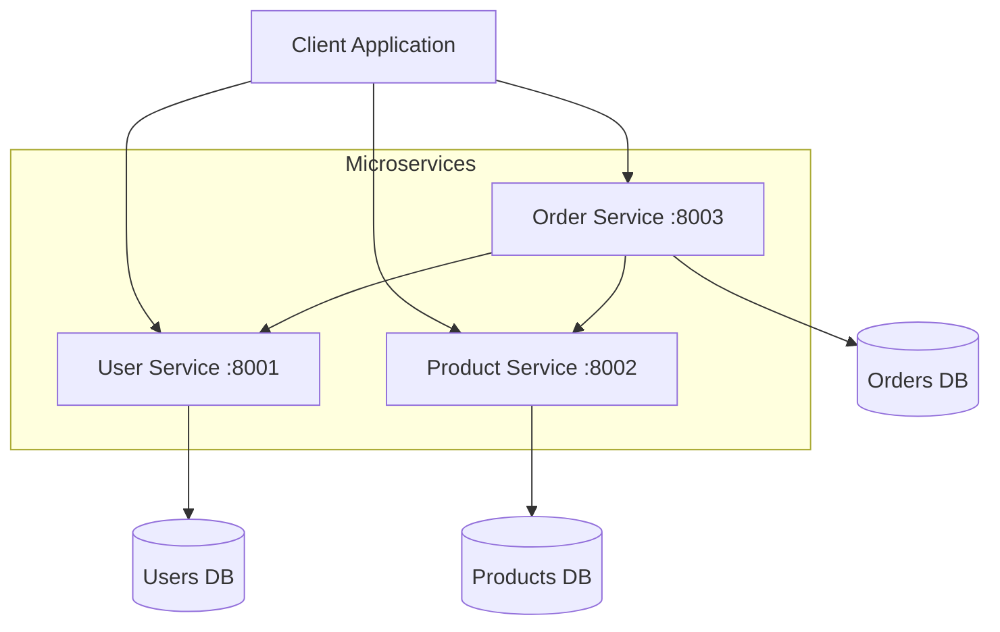

# Exercise 1: Foundation - Service Decomposition ⭐

## Overview
**Duration**: 30-45 minutes  
**Difficulty**: ⭐ (Easy)  
**Success Rate**: 95%

In this exercise, you'll decompose a monolithic e-commerce application into three microservices: User Service, Product Service, and Order Service. You'll learn the fundamentals of service boundaries and implement basic REST communication between services.

## 🎯 Learning Objectives

By completing this exercise, you will:
1. Identify service boundaries using domain-driven design
2. Create three independent microservices with FastAPI
3. Implement REST communication between services
4. Containerize services with Docker
5. Run services together with Docker Compose
6. Use GitHub Copilot to accelerate development

## 📋 Prerequisites

- Completed Module 10
- Docker Desktop running
- Python environment activated
- VS Code with GitHub Copilot enabled

## 🏗️ Architecture Overview



## 📁 Project Structure

```
exercise1-foundation/
├── user-service/
│   ├── app/
│   │   ├── __init__.py
│   │   ├── main.py
│   │   ├── models.py
│   │   ├── database.py
│   │   └── routers/
│   │       └── users.py
│   ├── Dockerfile
│   └── requirements.txt
├── product-service/
│   ├── app/
│   │   ├── __init__.py
│   │   ├── main.py
│   │   ├── models.py
│   │   ├── database.py
│   │   └── routers/
│   │       └── products.py
│   ├── Dockerfile
│   └── requirements.txt
├── order-service/
│   ├── app/
│   │   ├── __init__.py
│   │   ├── main.py
│   │   ├── models.py
│   │   ├── database.py
│   │   ├── clients/
│   │   │   ├── user_client.py
│   │   │   └── product_client.py
│   │   └── routers/
│   │       └── orders.py
│   ├── Dockerfile
│   └── requirements.txt
├── docker-compose.yml
└── README.md
```

## 🚀 Step-by-Step Instructions

### Step 1: Set Up the Project Structure

Create the directory structure for all three services:

```bash
mkdir -p exercise1-foundation/{user-service,product-service,order-service}
cd exercise1-foundation
```

### Step 2: Create the User Service

#### 2.1 Create User Service Files

```bash
cd user-service
mkdir -p app/routers
touch app/__init__.py app/main.py app/models.py app/database.py app/routers/users.py
touch Dockerfile requirements.txt
```

#### 2.2 Define User Models

Create `app/models.py`:

**Copilot Prompt Suggestion:**
```python
# Create Pydantic models for a user service with:
# - User model with id (UUID), username, email, full_name, created_at
# - UserCreate model for creating users (without id and created_at)
# - UserUpdate model for updating users (all fields optional)
# Include proper validation for email
```

**Expected Output:**
```python
from pydantic import BaseModel, EmailStr, Field
from datetime import datetime
from typing import Optional
from uuid import UUID, uuid4

class UserBase(BaseModel):
    username: str = Field(..., min_length=3, max_length=50)
    email: EmailStr
    full_name: str = Field(..., min_length=1, max_length=100)

class UserCreate(UserBase):
    password: str = Field(..., min_length=8)

class UserUpdate(BaseModel):
    username: Optional[str] = Field(None, min_length=3, max_length=50)
    email: Optional[EmailStr] = None
    full_name: Optional[str] = Field(None, min_length=1, max_length=100)
    password: Optional[str] = Field(None, min_length=8)

class User(UserBase):
    id: UUID = Field(default_factory=uuid4)
    created_at: datetime = Field(default_factory=datetime.utcnow)
    
    class Config:
        from_attributes = True
```

#### 2.3 Create Database Layer

Create `app/database.py`:

**Copilot Prompt Suggestion:**
```python
# Create an in-memory database for users using a dictionary
# Include functions to:
# - Store users by ID
# - Get user by ID
# - Get user by username
# - List all users
# - Update user
# - Delete user
# Use asyncio locks for thread safety
```

**Expected Output:**
```python
from typing import Dict, Optional, List
from uuid import UUID
import asyncio
from .models import User, UserCreate, UserUpdate
from datetime import datetime

class UserDatabase:
    def __init__(self):
        self.users: Dict[UUID, User] = {}
        self.lock = asyncio.Lock()
    
    async def create_user(self, user_data: UserCreate) -> User:
        async with self.lock:
            # Check if username already exists
            for user in self.users.values():
                if user.username == user_data.username:
                    raise ValueError("Username already exists")
                if user.email == user_data.email:
                    raise ValueError("Email already exists")
            
            user = User(
                **user_data.dict(),
                id=UUID(),
                created_at=datetime.utcnow()
            )
            self.users[user.id] = user
            return user
    
    async def get_user(self, user_id: UUID) -> Optional[User]:
        async with self.lock:
            return self.users.get(user_id)
    
    async def get_user_by_username(self, username: str) -> Optional[User]:
        async with self.lock:
            for user in self.users.values():
                if user.username == username:
                    return user
            return None
    
    async def list_users(self, skip: int = 0, limit: int = 100) -> List[User]:
        async with self.lock:
            users = list(self.users.values())
            return users[skip:skip + limit]
    
    async def update_user(self, user_id: UUID, user_update: UserUpdate) -> Optional[User]:
        async with self.lock:
            if user_id not in self.users:
                return None
            
            user = self.users[user_id]
            update_data = user_update.dict(exclude_unset=True)
            
            for field, value in update_data.items():
                setattr(user, field, value)
            
            return user
    
    async def delete_user(self, user_id: UUID) -> bool:
        async with self.lock:
            if user_id in self.users:
                del self.users[user_id]
                return True
            return False

# Global database instance
db = UserDatabase()
```

#### 2.4 Create User Routes

Create `app/routers/users.py`:

**Copilot Prompt Suggestion:**
```python
# Create FastAPI router for user operations:
# - POST /users - create user
# - GET /users - list users with pagination
# - GET /users/{user_id} - get specific user
# - PUT /users/{user_id} - update user
# - DELETE /users/{user_id} - delete user
# Include proper error handling and status codes
```

**Expected Output:**
```python
from fastapi import APIRouter, HTTPException, Query
from typing import List
from uuid import UUID
from ..models import User, UserCreate, UserUpdate
from ..database import db

router = APIRouter(prefix="/users", tags=["users"])

@router.post("/", response_model=User, status_code=201)
async def create_user(user: UserCreate):
    try:
        return await db.create_user(user)
    except ValueError as e:
        raise HTTPException(status_code=400, detail=str(e))

@router.get("/", response_model=List[User])
async def list_users(
    skip: int = Query(0, ge=0),
    limit: int = Query(100, ge=1, le=1000)
):
    return await db.list_users(skip=skip, limit=limit)

@router.get("/{user_id}", response_model=User)
async def get_user(user_id: UUID):
    user = await db.get_user(user_id)
    if not user:
        raise HTTPException(status_code=404, detail="User not found")
    return user

@router.put("/{user_id}", response_model=User)
async def update_user(user_id: UUID, user_update: UserUpdate):
    user = await db.update_user(user_id, user_update)
    if not user:
        raise HTTPException(status_code=404, detail="User not found")
    return user

@router.delete("/{user_id}", status_code=204)
async def delete_user(user_id: UUID):
    deleted = await db.delete_user(user_id)
    if not deleted:
        raise HTTPException(status_code=404, detail="User not found")
```

#### 2.5 Create Main Application

Create `app/main.py`:

**Copilot Prompt Suggestion:**
```python
# Create a FastAPI application for the user service that:
# - Has title "User Service" and version "1.0.0"
# - Includes health check endpoint at /health
# - Includes the users router
# - Has CORS enabled for all origins (development only)
# - Includes basic middleware for logging
```

**Expected Output:**
```python
from fastapi import FastAPI
from fastapi.middleware.cors import CORSMiddleware
import logging
from .routers import users
from datetime import datetime

# Configure logging
logging.basicConfig(level=logging.INFO)
logger = logging.getLogger(__name__)

app = FastAPI(
    title="User Service",
    description="Microservice for user management",
    version="1.0.0"
)

# Configure CORS (development only - restrict in production)
app.add_middleware(
    CORSMiddleware,
    allow_origins=["*"],
    allow_credentials=True,
    allow_methods=["*"],
    allow_headers=["*"],
)

# Include routers
app.include_router(users.router, prefix="/api")

@app.get("/health")
async def health_check():
    return {
        "status": "healthy",
        "service": "user-service",
        "timestamp": datetime.utcnow().isoformat()
    }

@app.on_event("startup")
async def startup_event():
    logger.info("User Service starting up...")

@app.on_event("shutdown")
async def shutdown_event():
    logger.info("User Service shutting down...")
```

#### 2.6 Create Requirements File

Create `requirements.txt`:

```txt
fastapi==0.104.1
uvicorn[standard]==0.24.0
pydantic[email]==2.5.0
httpx==0.25.1
```

#### 2.7 Create Dockerfile

Create `Dockerfile`:

**Copilot Prompt Suggestion:**
```dockerfile
# Create a multi-stage Dockerfile for Python FastAPI service that:
# - Uses Python 3.11 slim base image
# - Installs dependencies in a separate stage
# - Copies only necessary files to final stage
# - Runs as non-root user
# - Exposes port 8000
# - Uses uvicorn with proper production settings
```

**Expected Output:**
```dockerfile
# Build stage
FROM python:3.11-slim as builder

WORKDIR /app

# Install dependencies
COPY requirements.txt .
RUN pip install --user --no-cache-dir -r requirements.txt

# Runtime stage
FROM python:3.11-slim

WORKDIR /app

# Create non-root user
RUN useradd -m -u 1000 appuser

# Copy dependencies from builder
COPY --from=builder /root/.local /home/appuser/.local

# Copy application
COPY --chown=appuser:appuser ./app ./app

# Switch to non-root user
USER appuser

# Update PATH
ENV PATH=/home/appuser/.local/bin:$PATH

# Expose port
EXPOSE 8000

# Run the application
CMD ["uvicorn", "app.main:app", "--host", "0.0.0.0", "--port", "8000"]
```

### Step 3: Create the Product Service

The Product Service follows a similar pattern. Navigate to the product-service directory:

```bash
cd ../product-service
mkdir -p app/routers
touch app/__init__.py app/main.py app/models.py app/database.py app/routers/products.py
touch Dockerfile requirements.txt
```

Create `app/models.py`:

**Copilot Prompt Suggestion:**
```python
# Create Pydantic models for a product service with:
# - Product model with id (UUID), name, description, price (Decimal), 
#   stock_quantity, category, created_at, updated_at
# - ProductCreate model for creating products
# - ProductUpdate model for updating products (all fields optional)
# Include validation for price (must be positive) and stock (non-negative)
```

Create `app/database.py` with similar structure to User Service but for products.

Create `app/routers/products.py` with CRUD operations for products.

Create `app/main.py` with FastAPI setup for Product Service (port 8002).

Use the same `requirements.txt` and similar `Dockerfile`.

### Step 4: Create the Order Service

The Order Service is more complex as it needs to communicate with other services.

```bash
cd ../order-service
mkdir -p app/{routers,clients}
touch app/__init__.py app/main.py app/models.py app/database.py
touch app/routers/orders.py app/clients/user_client.py app/clients/product_client.py
touch Dockerfile requirements.txt
```

This section continues in Part 2...