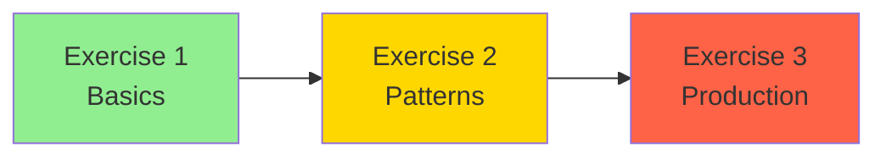

# Module 11: Quick Start Guide 🚀

Get up and running with microservices in 5 minutes!

## 🎯 Quick Setup

### 1. Clone and Navigate
```bash
cd modules/microservices-architecture
```

### 2. Run Setup Script
```bash
chmod +x scripts/setup-module-11.sh
./scripts/setup-module-11.sh
```

### 3. Activate Python Environment
```bash
source venv/bin/activate  # Linux/macOS
# or
.\venv\Scripts\activate  # Windows
```

### 4. Start Infrastructure
```bash
docker compose -f docker-compose.sample.yml up -d
```

Wait for services to be healthy:
```bash
docker compose -f docker-compose.sample.yml ps
```

## 🏃 Exercise 1: Quick Start

### Option A: Use Starter Code
```bash
cd exercises/exercise1-foundation/starter
code .  # Open in VS Code
```

### Option B: Start from Scratch
```bash
cd exercises/exercise1-foundation
mkdir my-solution && cd my-solution
```

### Create Your First Microservice

1. **Create a simple User Service:**

```python
# user-service/app/main.py
from fastapi import FastAPI
from pydantic import BaseModel
from typing import Dict
from uuid import uuid4

app = FastAPI(title="User Service")

# In-memory storage
users: Dict[str, dict] = {}

class UserCreate(BaseModel):
    username: str
    email: str

@app.post("/api/users")
async def create_user(user: UserCreate):
    user_id = str(uuid4())
    users[user_id] = {"id": user_id, **user.dict()}
    return users[user_id]

@app.get("/health")
async def health():
    return {"status": "healthy"}
```

2. **Create a Dockerfile:**

```dockerfile
FROM python:3.11-slim
WORKDIR /app
RUN pip install fastapi uvicorn
COPY . .
CMD ["uvicorn", "app.main:app", "--host", "0.0.0.0", "--port", "8000"]
```

3. **Run the service:**

```bash
docker build -t user-service .
docker run -p 8001:8000 user-service
```

4. **Test it:**

```bash
# Health check
curl http://localhost:8001/health

# Create a user
curl -X POST http://localhost:8001/api/users \
  -H "Content-Type: application/json" \
  -d '{"username": "testuser", "email": "test@example.com"}'
```

## 🎯 Copilot Pro Tips

### 1. Service Creation Pattern
```python
# Type this comment and let Copilot complete:
# Create a FastAPI service for managing products with:
# - CRUD operations
# - In-memory database
# - Pydantic models
# - Health check endpoint
```

### 2. Docker Compose Generation
```yaml
# Type this comment in docker-compose.yml:
# Create a docker-compose with:
# - 3 microservices (user, product, order)
# - Redis for caching
# - RabbitMQ for messaging
# - Custom network
# - Health checks
```

### 3. Inter-Service Communication
```python
# Type this comment for service client:
# Create an async HTTP client that:
# - Calls user service to validate user exists
# - Includes retry logic with exponential backoff
# - Handles errors gracefully
# - Uses circuit breaker pattern
```

## 🔍 Quick Validation

Run the validation script:
```bash
python exercises/exercise1-foundation/tests/test_validation.py
```

## 🆘 Quick Troubleshooting

### Service Won't Start?
```bash
# Check logs
docker logs user-service

# Check port availability
lsof -i :8001
```

### Can't Connect Between Services?
```bash
# Verify network
docker network inspect microservices-network

# Test from inside container
docker exec -it order-service curl http://user-service:8000/health
```

### RabbitMQ Connection Issues?
```bash
# Access management UI
open http://localhost:15672
# Login: admin/admin123
```

## 📊 Quick Monitoring

### View All Services
```bash
docker compose ps
```

### Check Service Health
```bash
for port in 8001 8002 8003; do
  echo "Service on port $port:"
  curl -s http://localhost:$port/health | jq .
done
```

### View Logs
```bash
# All services
docker compose logs -f

# Specific service
docker compose logs -f user-service
```

## 🎉 Next Steps

1. ✅ Complete Exercise 1
2. 📚 Read `best-practices.md`
3. 🚀 Move to Exercise 2 (API Gateway)
4. 💡 Experiment with Copilot suggestions

## 💻 VS Code Shortcuts

- **Copilot Suggestions**: `Tab` to accept, `Esc` to dismiss
- **Multiple Suggestions**: `Alt+]` next, `Alt+[` previous
- **Copilot Chat**: `Ctrl+I` (inline), `Ctrl+Shift+I` (sidebar)
- **Run Tests**: `Ctrl+Shift+T`

## 🎓 Learning Path



Ready to build microservices? Let's go! 🚀