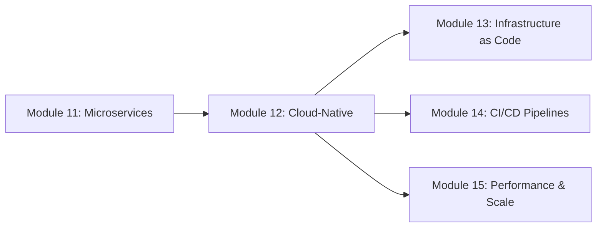

# Module 12: Cloud-Native Development 🟠 Advanced

## Overview

Master cloud-native development patterns using containers, Kubernetes, and serverless architectures. This module transforms you from traditional application developer to cloud-native architect, leveraging GitHub Copilot to accelerate container creation, Kubernetes manifest generation, and serverless function development.

## 🎯 Learning Objectives

By the end of this module, you will:

1. **Containerize applications** with Docker using AI-assisted Dockerfile creation
2. **Deploy to Kubernetes** with GitHub Copilot-generated manifests
3. **Build serverless functions** for Azure Functions with AI optimization
4. **Implement microservices patterns** with service mesh and API gateway
5. **Create cloud-native CI/CD pipelines** with GitHub Actions
6. **Monitor and scale** cloud-native applications effectively

## 📚 Prerequisites

- Completed Module 11 (Microservices Architecture)
- Basic understanding of:
  - Docker fundamentals
  - Cloud computing concepts
  - RESTful API design
  - Python async programming
- Azure subscription with credits
- Docker Desktop installed and running
- kubectl CLI installed

## 🛠️ Technology Stack

- **Languages**: Python 3.11+, YAML
- **Container**: Docker, Docker Compose
- **Orchestration**: Kubernetes (AKS)
- **Serverless**: Azure Functions
- **Service Mesh**: Linkerd/Istio basics
- **Monitoring**: Prometheus, Grafana
- **CI/CD**: GitHub Actions, ACR

## 📋 Module Structure

### Part 1: Container Fundamentals (45 minutes)
- Dockerfile best practices with Copilot
- Multi-stage builds for optimization
- Container security scanning
- Local development with Docker Compose

### Part 2: Kubernetes Deployment (60 minutes)
- AKS cluster setup and management
- Manifest generation with Copilot
- Service discovery and load balancing
- ConfigMaps and Secrets management

### Part 3: Serverless Architecture (75 minutes)
- Azure Functions development
- Event-driven patterns
- Durable Functions for orchestration
- Hybrid cloud-native architectures

## 🎮 Hands-On Exercises

### Exercise 1: Containerize a Microservice (⭐ Easy)
**Duration**: 30-45 minutes  
Build and optimize a Docker container for a Python microservice with health checks and graceful shutdown.

### Exercise 2: Deploy to Kubernetes (⭐⭐ Medium)
**Duration**: 45-60 minutes  
Create a complete Kubernetes deployment with auto-scaling, rolling updates, and monitoring.

### Exercise 3: Event-Driven Serverless System (⭐⭐⭐ Hard)
**Duration**: 60-90 minutes  
Build a production-ready event processing system combining AKS microservices and Azure Functions.

## 🚀 Real-World Applications

This module prepares you for:
- Modernizing legacy applications
- Building scalable SaaS platforms
- Implementing event-driven architectures
- Creating resilient distributed systems
- Optimizing cloud costs
- Enabling DevOps transformation

## 📊 Success Metrics

- Deploy 3 containerized services
- Achieve 99.9% uptime in AKS
- Process 1M+ events via serverless
- Reduce deployment time by 80%
- Implement zero-downtime updates
- Pass security compliance checks

## 🔗 Learning Path



## 📚 Resources

- [Azure Kubernetes Service Documentation](https://learn.microsoft.com/azure/aks/)
- [Azure Functions Developer Guide](https://learn.microsoft.com/azure/azure-functions/)
- [Docker Best Practices](https://docs.docker.com/develop/dev-best-practices/)
- [Kubernetes Patterns](https://kubernetes.io/docs/concepts/cluster-administration/manage-deployment/)
- [Cloud Native Computing Foundation](https://www.cncf.io/)

## 🎓 Skills You'll Gain

- **Container Orchestration**: Production Kubernetes management
- **Serverless Development**: Event-driven architecture design
- **Cloud-Native Patterns**: 12-factor app implementation
- **DevOps Practices**: GitOps and progressive delivery
- **Observability**: Distributed tracing and monitoring
- **Cost Optimization**: Right-sizing and auto-scaling

## ⚡ Quick Start

```bash
# Clone module resources
git clone https://github.com/workshop/module-12-cloud-native
cd module-12-cloud-native

# Set up environment
./scripts/setup-module-12.sh

# Verify prerequisites
./scripts/verify-cloud-native.sh

# Start Exercise 1
cd exercises/exercise1-containerize
code .
```

## 🏆 Module Completion

To complete this module, you must:
- [ ] Complete all three exercises with passing tests
- [ ] Deploy a working application to AKS
- [ ] Implement serverless event processing
- [ ] Pass the security scan on all containers
- [ ] Submit your independent project
- [ ] Complete the module assessment

## 💡 Pro Tips

1. **Use Copilot for Dockerfile optimization** - It knows best practices
2. **Generate Kubernetes manifests incrementally** - Start simple, add features
3. **Test locally with Kind/Minikube** before deploying to AKS
4. **Monitor costs** - Set up budget alerts early
5. **Implement health checks** from the start
6. **Use GitHub Actions** for automated deployments

## 🔄 Continuous Learning

After this module:
- Explore service mesh patterns
- Study advanced Kubernetes operators
- Learn about GitOps with Flux/ArgoCD
- Investigate edge computing scenarios
- Consider CNCF certification path

---

**Duration**: 3 hours | **Track**: 🟠 Advanced | **Difficulty**: High

Ready to go cloud-native? Let's containerize, orchestrate, and scale! 🚀
