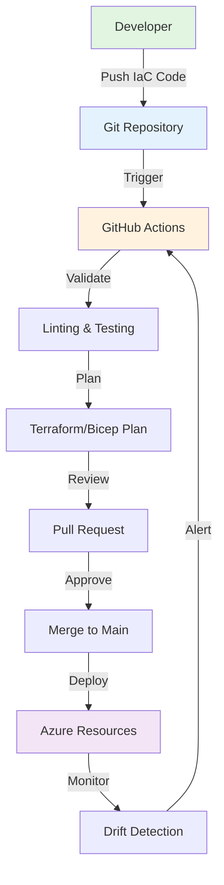

[🏠 Workshop](../../README.md) > [📚 Modules](../README.md) > [Module 13](README.md)

<div align="center">

[⬅️ Module 12: Cloud-Native Development](../module-12/README.md) | **📖 Module 13: Infrastructure as Code** | [Module 14: CI/CD with GitHub Actions ➡️](../module-14/README.md)

</div>

---

# Module 13: Infrastructure as Code

## 🎯 Module Overview

Welcome to Module 13 of the Mastery AI Code Development Workshop! This module focuses on Infrastructure as Code (IaC), teaching you how to manage cloud infrastructure using declarative configuration files with AI assistance. You'll master Terraform, Azure Bicep, and GitOps automation patterns.

### Track Information
- **Track**: 🟠 Advanced
- **Duration**: 3 hours
- **Prerequisites**: Modules 1-12 completed

## 🎓 Learning Objectives

By the end of this module, you will:

1. **Understand IaC Principles**
   - Declarative vs imperative infrastructure
   - State management and idempotency
   - Version control for infrastructure

2. **Master Azure Bicep**
   - Write modular Bicep templates
   - Use parameters and outputs effectively
   - Leverage AI for Bicep development

3. **Implement Terraform Solutions**
   - Create multi-environment configurations
   - Manage Terraform state securely
   - Build reusable modules

4. **Automate with GitOps**
   - Implement GitOps workflows
   - Automate infrastructure deployment
   - Handle rollbacks and drift detection

5. **Apply Best Practices**
   - Security-first infrastructure design
   - Cost optimization strategies
   - Production-ready patterns

## 📋 Module Structure

### Part 1: Conceptual Foundation (45 minutes)
- Infrastructure as Code fundamentals
- Comparing Bicep vs Terraform
- GitOps principles and benefits
- AI-assisted IaC development

### Part 2: Hands-on Exercises (2 hours)
- **Exercise 1** (⭐): Deploy Azure resources with Bicep
- **Exercise 2** (⭐⭐): Multi-environment Terraform setup
- **Exercise 3** (⭐⭐⭐): Complete GitOps pipeline

### Part 3: Best Practices & Review (15 minutes)
- Production patterns
- Security considerations
- Cost optimization
- Troubleshooting guide

## 🛠️ Technologies Covered

### Infrastructure as Code Tools
- **Azure Bicep**: Native Azure IaC language
- **Terraform**: Multi-cloud IaC tool
- **GitHub Actions**: CI/CD automation
- **Azure Resource Manager**: Deployment engine

### AI Integration
- **GitHub Copilot**: IaC code generation
- **Copilot Chat**: Template optimization
- **AI-assisted debugging**: Configuration troubleshooting

### GitOps Stack
- **Git**: Version control
- **GitHub Actions**: Automation workflows
- **Azure DevOps**: Alternative pipeline option
- **Policy as Code**: Compliance automation

## 🏗️ What You'll Build

Throughout this module, you'll create:

1. **Bicep Templates**
   - Modular resource definitions
   - Parameter files for environments
   - Nested template structures

2. **Terraform Configurations**
   - Provider configurations
   - Resource definitions
   - State management setup

3. **GitOps Pipeline**
   - Automated deployment workflows
   - Environment promotion
   - Drift detection and remediation

## 🎨 Architecture Overview



## 📚 Exercise Overview

### Exercise 1: Bicep Fundamentals (⭐)
**Duration**: 30-45 minutes
- Create your first Bicep template
- Deploy a web app with database
- Use Copilot for template generation
- **Success Rate**: 95%

### Exercise 2: Terraform Multi-Environment (⭐⭐)
**Duration**: 45-60 minutes
- Set up Terraform workspace structure
- Create dev, staging, and prod environments
- Implement remote state management
- **Success Rate**: 80%

### Exercise 3: GitOps Automation (⭐⭐⭐)
**Duration**: 60-90 minutes
- Build complete GitOps pipeline
- Implement automatic deployments
- Add policy validation and security scanning
- **Success Rate**: 60%

## 🚀 Getting Started

1. **Verify Prerequisites**
   ```bash
   cd infrastructure-as-code
   ./scripts/check-prerequisites.sh
   ```

2. **Set Up Environment**
   ```bash
   # Install required tools
   ./scripts/setup-module.sh
   
   # Verify installations
   az --version
   terraform --version
   bicep --version
   ```

3. **Configure Azure Access**
   ```bash
   # Login to Azure
   az login
   
   # Set default subscription
   az account set --subscription "Your-Subscription-Name"
   ```

4. **Start Learning**
   - Read the conceptual overview in `docs/concepts.md`
   - Begin with Exercise 1 in `exercises/exercise1-bicep-basics/`
   - Use Copilot actively throughout the exercises

## 🎯 Success Criteria

You've mastered this module when you can:
- ✅ Write IaC templates from scratch with AI assistance
- ✅ Deploy multi-environment infrastructure automatically
- ✅ Implement GitOps workflows for any project
- ✅ Troubleshoot IaC deployment issues efficiently
- ✅ Apply security and cost optimization best practices

## 🔗 Resources

### Official Documentation
- [Azure Bicep Documentation](https://learn.microsoft.com/azure/azure-resource-manager/bicep/)
- [Terraform Azure Provider](https://registry.terraform.io/providers/hashicorp/azurerm/latest/docs)
- [GitHub Actions for Azure](https://github.com/Azure/actions)
- [GitOps with GitHub](https://docs.github.com/en/actions/deployment/about-deployments/deploying-with-github-actions)

### Workshop Resources
- [Best Practices Guide](./best-practices.md)
- [Troubleshooting Guide](./troubleshooting.md)
- [Module Discussion Forum](https://github.com/workshop/discussions/module-13)

## ⚡ Pro Tips

1. **Use Copilot Effectively**
   - Describe your infrastructure needs clearly
   - Ask for best practices and security considerations
   - Request explanations for generated configurations

2. **Start Small**
   - Begin with simple resources
   - Gradually add complexity
   - Test incrementally

3. **Version Everything**
   - Commit all IaC code
   - Tag releases properly
   - Document changes clearly

## 🎉 Ready to Begin?

Infrastructure as Code is a fundamental skill for modern cloud development. This module will transform how you think about and manage infrastructure. Let's build reliable, repeatable, and automated infrastructure together!

**Next Step**: Read the [prerequisites](./prerequisites.md) and ensure your environment is ready.

---

*Remember: The best infrastructure is invisible to users but visible to operators. Let's build infrastructure that scales, secures, and serves!*

---

## 🔗 Quick Links

### Module Resources
- [📋 Prerequisites](prerequisites.md)
- [📖 Best Practices](docs/best-practices.md)
- [🔧 Troubleshooting](docs/troubleshooting.md)
- [💡 Prompt Templates](docs/prompt-templates.md)

### Exercises
- [⭐ Exercise 1 - Foundation](exercises/exercise1/README.md)
- [⭐⭐ Exercise 2 - Application](exercises/exercise2/README.md)
- [⭐⭐⭐ Exercise 3 - Mastery](exercises/exercise3/README.md)

### Workshop Resources
- [🏠 Workshop Home](../../README.md)
- [📚 All Modules](../../README.md#-complete-module-overview)
- [🚀 Quick Start](../../QUICKSTART.md)
- [❓ FAQ](../../FAQ.md)
- [🤖 Prompt Guide](../../PROMPT-GUIDE.md)
- [🔧 Troubleshooting](../../TROUBLESHOOTING.md)


---

## 🔗 Quick Links

### Module Resources
- [📋 Prerequisites](prerequisites.md)
- [📖 Best Practices](docs/best-practices.md)
- [🔧 Troubleshooting](docs/troubleshooting.md)
- [💡 Prompt Templates](docs/prompt-templates.md)

### Exercises
- [⭐ Exercise 1 - Foundation](exercises/exercise1/README.md)
- [⭐⭐ Exercise 2 - Application](exercises/exercise2/README.md)
- [⭐⭐⭐ Exercise 3 - Mastery](exercises/exercise3/README.md)

### Workshop Resources
- [🏠 Workshop Home](../../README.md)
- [📚 All Modules](../../README.md#-complete-module-overview)
- [🚀 Quick Start](../../QUICKSTART.md)
- [❓ FAQ](../../FAQ.md)
- [🤖 Prompt Guide](../../PROMPT-GUIDE.md)
- [🔧 Troubleshooting](../../TROUBLESHOOTING.md)


---

## 🔗 Quick Links

### Module Resources
- [📋 Prerequisites](prerequisites.md)
- [📖 Best Practices](docs/best-practices.md)
- [🔧 Troubleshooting](docs/troubleshooting.md)
- [💡 Prompt Templates](docs/prompt-templates.md)

### Exercises
- [⭐ Exercise 1 - Foundation](exercises/exercise1/README.md)
- [⭐⭐ Exercise 2 - Application](exercises/exercise2/README.md)
- [⭐⭐⭐ Exercise 3 - Mastery](exercises/exercise3/README.md)

### Workshop Resources
- [🏠 Workshop Home](../../README.md)
- [📚 All Modules](../../README.md#-complete-module-overview)
- [🚀 Quick Start](../../QUICKSTART.md)
- [❓ FAQ](../../FAQ.md)
- [🤖 Prompt Guide](../../PROMPT-GUIDE.md)
- [🔧 Troubleshooting](../../TROUBLESHOOTING.md)


## 🧭 Quick Navigation

<table>
<tr>
<td valign="top">

### 📖 Module Content
- [Overview](README.md)
- [Prerequisites](prerequisites.md)
- [Setup Guide](docs/setup.md)
- [Troubleshooting](docs/troubleshooting.md)

</td>
<td valign="top">

### 💻 Exercises
- [Exercise 1 - Foundation ⭐](exercises/exercise1/README.md)
- [Exercise 2 - Application ⭐⭐](exercises/exercise2/README.md)
- [Exercise 3 - Mastery ⭐⭐⭐](exercises/exercise3/README.md)
- [Independent Project](project/README.md)

</td>
<td valign="top">

### 📚 Resources
- [Best Practices](docs/best-practices.md)
- [Common Patterns](docs/common-patterns.md)
- [Prompt Templates](docs/prompt-templates.md)
- [Additional Resources](resources/README.md)

</td>
</tr>
</table>


---

## 🌐 Workshop Resources

<div align="center">

| Core Documentation | Learning Resources | Tools & Scripts |
|:------------------:|:-----------------:|:---------------:|
| [🏠 Home](../../README.md) | [🚀 Quick Start](../../QUICKSTART.md) | [🛠️ Scripts](../../scripts/README.md) |
| [📋 Prerequisites](../../PREREQUISITES.md) | [❓ FAQ](../../FAQ.md) | [🔧 Setup](../../scripts/setup-workshop.sh) |
| [📚 All Modules](../README.md) | [🤖 Prompt Guide](../../PROMPT-GUIDE.md) | [✅ Validate](../../scripts/validate-prerequisites.sh) |
| [🗺️ Learning Paths](../../README.md#-learning-paths) | [🔧 Troubleshooting](../../TROUBLESHOOTING.md) | [🧹 Cleanup](../../scripts/cleanup-resources.sh) |

</div>

### 🏷️ Module Categories

<div align="center">

| 🟢 Fundamentals | 🔵 Intermediate | 🟠 Advanced | 🔴 Enterprise | 🟣 AI Agents | ⭐ Mastery |
|:---------------:|:---------------:|:-----------:|:-------------:|:------------:|:----------:|
| Modules 1-5 | Modules 6-10 | Modules 11-15 | Modules 16-20 | Modules 21-25 | Modules 26-30 |

</div>


---

## 🔗 Quick Links

### Module Resources
- [📋 Prerequisites](prerequisites.md)
- [📖 Best Practices](docs/best-practices.md)
- [🔧 Troubleshooting](docs/troubleshooting.md)
- [💡 Prompt Templates](docs/prompt-templates.md)

### Exercises
- [⭐ Exercise 1 - Foundation](exercises/exercise1/README.md)
- [⭐⭐ Exercise 2 - Application](exercises/exercise2/README.md)
- [⭐⭐⭐ Exercise 3 - Mastery](exercises/exercise3/README.md)

### Workshop Resources
- [🏠 Workshop Home](../../README.md)
- [📚 All Modules](../../README.md#-complete-module-overview)
- [🚀 Quick Start](../../QUICKSTART.md)
- [❓ FAQ](../../FAQ.md)
- [🤖 Prompt Guide](../../PROMPT-GUIDE.md)
- [🔧 Troubleshooting](../../TROUBLESHOOTING.md)


## 🧭 Quick Navigation

<table>
<tr>
<td valign="top">

### 📖 Module Content
- [Overview](README.md)
- [Prerequisites](prerequisites.md)
- [Setup Guide](docs/setup.md)
- [Troubleshooting](docs/troubleshooting.md)

</td>
<td valign="top">

### 💻 Exercises
- [Exercise 1 - Foundation ⭐](exercises/exercise1/README.md)
- [Exercise 2 - Application ⭐⭐](exercises/exercise2/README.md)
- [Exercise 3 - Mastery ⭐⭐⭐](exercises/exercise3/README.md)
- [Independent Project](project/README.md)

</td>
<td valign="top">

### 📚 Resources
- [Best Practices](docs/best-practices.md)
- [Common Patterns](docs/common-patterns.md)
- [Prompt Templates](docs/prompt-templates.md)
- [Additional Resources](resources/README.md)

</td>
</tr>
</table>


---

## 🌐 Workshop Resources

<div align="center">

| Core Documentation | Learning Resources | Tools & Scripts |
|:------------------:|:-----------------:|:---------------:|
| [🏠 Home](../../README.md) | [🚀 Quick Start](../../QUICKSTART.md) | [🛠️ Scripts](../../scripts/README.md) |
| [📋 Prerequisites](../../PREREQUISITES.md) | [❓ FAQ](../../FAQ.md) | [🔧 Setup](../../scripts/setup-workshop.sh) |
| [📚 All Modules](../README.md) | [🤖 Prompt Guide](../../PROMPT-GUIDE.md) | [✅ Validate](../../scripts/validate-prerequisites.sh) |
| [🗺️ Learning Paths](../../README.md#-learning-paths) | [🔧 Troubleshooting](../../TROUBLESHOOTING.md) | [🧹 Cleanup](../../scripts/cleanup-resources.sh) |

</div>

### 🏷️ Module Categories

<div align="center">

| 🟢 Fundamentals | 🔵 Intermediate | 🟠 Advanced | 🔴 Enterprise | 🟣 AI Agents | ⭐ Mastery |
|:---------------:|:---------------:|:-----------:|:-------------:|:------------:|:----------:|
| Modules 1-5 | Modules 6-10 | Modules 11-15 | Modules 16-20 | Modules 21-25 | Modules 26-30 |

</div>


---

## 🔗 Quick Links

### Module Resources
- [📋 Prerequisites](prerequisites.md)
- [📖 Best Practices](docs/best-practices.md)
- [🔧 Troubleshooting](docs/troubleshooting.md)
- [💡 Prompt Templates](docs/prompt-templates.md)

### Exercises
- [⭐ Exercise 1 - Foundation](exercises/exercise1/README.md)
- [⭐⭐ Exercise 2 - Application](exercises/exercise2/README.md)
- [⭐⭐⭐ Exercise 3 - Mastery](exercises/exercise3/README.md)

### Workshop Resources
- [🏠 Workshop Home](../../README.md)
- [📚 All Modules](../../README.md#-complete-module-overview)
- [🚀 Quick Start](../../QUICKSTART.md)
- [❓ FAQ](../../FAQ.md)
- [🤖 Prompt Guide](../../PROMPT-GUIDE.md)
- [🔧 Troubleshooting](../../TROUBLESHOOTING.md)


## 🧭 Quick Navigation

<table>
<tr>
<td valign="top">

### 📖 Module Content
- [Overview](README.md)
- [Prerequisites](prerequisites.md)
- [Setup Guide](docs/setup.md)
- [Troubleshooting](docs/troubleshooting.md)

</td>
<td valign="top">

### 💻 Exercises
- [Exercise 1 - Foundation ⭐](exercises/exercise1/README.md)
- [Exercise 2 - Application ⭐⭐](exercises/exercise2/README.md)
- [Exercise 3 - Mastery ⭐⭐⭐](exercises/exercise3/README.md)
- [Independent Project](project/README.md)

</td>
<td valign="top">

### 📚 Resources
- [Best Practices](docs/best-practices.md)
- [Common Patterns](docs/common-patterns.md)
- [Prompt Templates](docs/prompt-templates.md)
- [Additional Resources](resources/README.md)

</td>
</tr>
</table>


---

## 🌐 Workshop Resources

<div align="center">

| Core Documentation | Learning Resources | Tools & Scripts |
|:------------------:|:-----------------:|:---------------:|
| [🏠 Home](../../README.md) | [🚀 Quick Start](../../QUICKSTART.md) | [🛠️ Scripts](../../scripts/README.md) |
| [📋 Prerequisites](../../PREREQUISITES.md) | [❓ FAQ](../../FAQ.md) | [🔧 Setup](../../scripts/setup-workshop.sh) |
| [📚 All Modules](../README.md) | [🤖 Prompt Guide](../../PROMPT-GUIDE.md) | [✅ Validate](../../scripts/validate-prerequisites.sh) |
| [🗺️ Learning Paths](../../README.md#-learning-paths) | [🔧 Troubleshooting](../../TROUBLESHOOTING.md) | [🧹 Cleanup](../../scripts/cleanup-resources.sh) |

</div>

### 🏷️ Module Categories

<div align="center">

| 🟢 Fundamentals | 🔵 Intermediate | 🟠 Advanced | 🔴 Enterprise | 🟣 AI Agents | ⭐ Mastery |
|:---------------:|:---------------:|:-----------:|:-------------:|:------------:|:----------:|
| Modules 1-5 | Modules 6-10 | Modules 11-15 | Modules 16-20 | Modules 21-25 | Modules 26-30 |

</div>

