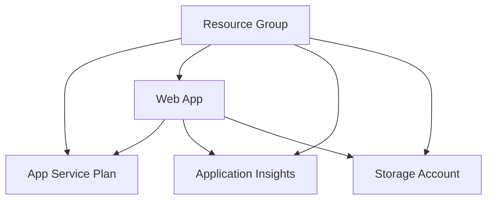
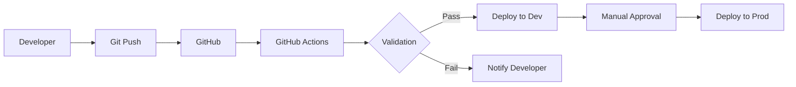

# Module 13: Infrastructure as Code with Bicep and GitHub Actions

## 🎯 Module Overview

Master Infrastructure as Code (IaC) using Azure Bicep and automate deployments with GitHub Actions. This module teaches you to manage cloud infrastructure declaratively, implement GitOps practices, and create reusable, version-controlled infrastructure templates.

## 📚 Learning Objectives

By the end of this module, you will:
- ✅ Write Azure Bicep templates for complex infrastructure
- ✅ Implement parameterization and modularization strategies
- ✅ Create reusable Bicep modules for common patterns
- ✅ Automate infrastructure deployments with GitHub Actions
- ✅ Implement GitOps for infrastructure management
- ✅ Apply security best practices in IaC
- ✅ Create multi-environment deployment pipelines
- ✅ Validate and test infrastructure deployments

## 🔧 Prerequisites

- Completed Module 12 (Cloud-Native Development)
- Azure CLI installed and configured
- GitHub account with repository access
- Basic understanding of:
  - Azure resources (App Service, Storage, etc.)
  - YAML syntax
  - Git version control

## 📂 Module Structure

```
module-13/
├── README.md                 # This file
├── prerequisites.md          # Detailed prerequisites
├── scripts/                  # Module utilities
│   ├── setup-module.sh      # Environment setup
│   ├── cleanup-resources.sh # Resource cleanup
│   ├── validate-deployment.sh # Deployment validation
│   ├── check-prerequisites-script.sh # Prerequisites check
│   └── validate-module-13.sh # Complete module validation
├── exercises/               # Hands-on exercises
│   ├── exercise1-bicep-basics/    # ⭐ Easy
│   ├── exercise2-gitops-automation/ # ⭐⭐ Medium
│   └── exercise3-enterprise-iac/    # ⭐⭐⭐ Hard
├── best-practices.md        # Production patterns
├── troubleshooting.md       # Common issues
├── deployment-guide.md      # Detailed deployment guide
├── architecture-guide.md    # IaC architecture patterns
└── resources/               # Additional materials
    ├── templates/          # Reusable Bicep modules
    │   ├── webapp.bicep
    │   ├── monitoring.bicep
    │   └── keyvault.bicep
    └── workflows/          # GitHub Actions workflows
        └── bicep-deployment.yml
```

## 🎓 Exercises

### Exercise 1: Bicep Basics (⭐ Easy - 30-45 minutes)
**Objective**: Create your first Bicep template for a web application infrastructure.

**You'll Learn**:
- Bicep syntax and structure
- Parameters and variables
- Resource dependencies
- Outputs for integration
- Environment-specific deployments

**Key Tasks**:
1. Create parameterized Bicep template
2. Deploy App Service with Application Insights
3. Implement proper tagging strategy
4. Create deployment scripts

### Exercise 2: GitOps Automation (⭐⭐ Medium - 45-60 minutes)
**Objective**: Implement automated infrastructure deployments using GitHub Actions.

**You'll Learn**:
- GitHub Actions for IaC
- Multi-environment pipelines
- Secret management
- Deployment gates and approvals
- Infrastructure validation

**Key Tasks**:
1. Create GitHub Actions workflow
2. Implement environment promotion
3. Add deployment validations
4. Configure manual approvals

### Exercise 3: Enterprise Infrastructure (⭐⭐⭐ Hard - 60-90 minutes)
**Objective**: Build a complete enterprise-grade infrastructure with networking, security, and monitoring.

**You'll Learn**:
- Complex Bicep patterns
- Module composition
- Network architecture
- Security implementations
- Cost optimization

**Key Tasks**:
1. Create modular infrastructure
2. Implement hub-spoke network
3. Add security controls
4. Configure monitoring

## 🚀 Quick Start

1. **Setup Environment**:
   ```bash
   cd module-13
   ./scripts/setup-module.sh
   ```

2. **Start First Exercise**:
   ```bash
   cd exercises/exercise1-bicep-basics
   code .
   ```

3. **Follow Instructions**:
   - Read `instructions/part1.md`
   - Complete the starter template
   - Deploy and validate

## 💻 Key Technologies

- **Azure Bicep**: Domain-specific language for Azure IaC
- **GitHub Actions**: CI/CD automation platform
- **Azure Resource Manager**: Deployment and management service
- **Azure CLI**: Command-line interface for Azure
- **VS Code Bicep Extension**: Enhanced development experience

## 🔌 Copilot Integration Tips

### Effective Prompts for IaC:
```
"Create a Bicep template for Azure App Service with:
- Parameterized SKU selection
- Application Insights integration
- Managed identity enabled
- Custom domain support
Include proper descriptions and validation"
```

### GitHub Actions Automation:
```
"Create a GitHub Actions workflow that:
- Validates Bicep templates on PR
- Deploys to dev on merge to main
- Requires approval for production
- Runs infrastructure tests
Include proper secret handling"
```

## 📊 Architecture Patterns

### Basic Web App Infrastructure


### GitOps Flow


## 🛡️ Security Considerations

1. **Secret Management**:
   - Use GitHub Secrets for sensitive data
   - Implement Azure Key Vault references
   - Never commit secrets to repository

2. **Access Control**:
   - Use managed identities
   - Implement RBAC
   - Limit deployment permissions

3. **Network Security**:
   - Enable HTTPS only
   - Configure firewall rules
   - Implement private endpoints

## 🔍 Validation and Testing

Run validation after each exercise:
```bash
./scripts/validate-deployment.sh -g <resource-group>
```

## 🎯 Success Criteria

You've mastered this module when you can:
- [ ] Write complex Bicep templates from scratch
- [ ] Create reusable infrastructure modules
- [ ] Implement complete GitOps workflows
- [ ] Debug deployment failures effectively
- [ ] Apply IaC best practices consistently
- [ ] Automate multi-environment deployments

## 🚨 Common Pitfalls

1. **Hardcoding Values**: Always use parameters
2. **Missing Dependencies**: Let Bicep infer when possible
3. **Ignoring Costs**: Use appropriate SKUs for learning
4. **Poor Naming**: Follow consistent conventions
5. **No Cleanup**: Always clean up resources

## 🧹 Cleanup

After completing exercises:
```bash
# Clean specific resource group
./scripts/cleanup-resources.sh -g rg-module13-exercise1

# Clean all module resources
./scripts/cleanup-resources.sh --all
```

## 📚 Additional Resources

- [Azure Bicep Documentation](https://docs.microsoft.com/azure/azure-resource-manager/bicep/)
- [GitHub Actions for Azure](https://docs.github.com/actions/deployment/deploying-to-azure)
- [Azure Architecture Center](https://docs.microsoft.com/azure/architecture/)
- [IaC Best Practices](https://docs.microsoft.com/azure/cloud-adoption-framework/ready/considerations/infrastructure-as-code)

## 🎊 Completion

Congratulations on completing Module 13! You've gained essential IaC skills:
- ✅ Azure Bicep mastery
- ✅ GitOps implementation
- ✅ Automated deployments
- ✅ Enterprise patterns

**Next Step**: Proceed to Module 14 - CI/CD with GitHub Actions for advanced pipeline patterns!

---

💡 **Remember**: Infrastructure as Code is not just about automation—it's about reliability, repeatability, and collaboration. Keep your templates simple, modular, and well-documented!