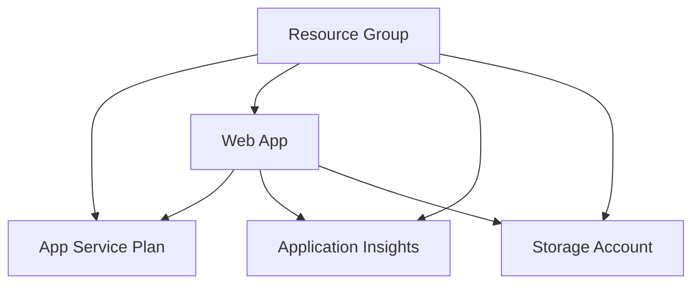
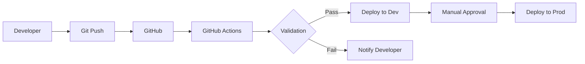

# Module 13: Infrastructure as Code with Bicep and GitHub Actions

## 🎯 Module Overview

Master Infrastructure as Code (IaC) using Azure Bicep and automate deployments with GitHub Actions. This module teaches you to manage cloud infrastructure declaratively, implement GitOps practices, and create reusable, version-controlled infrastructure templates.

## 📚 Learning Objectives

By the end of this module, you will:
- ✅ Write Azure Bicep templates for complex infrastructure
- ✅ Implement parameterization and modularization strategies
- ✅ Create reusable Bicep modules for common patterns
- ✅ Automate infrastructure deployments with GitHub Actions
- ✅ Implement GitOps for infrastructure management
- ✅ Apply security best practices in IaC
- ✅ Create multi-environment deployment pipelines
- ✅ Validate and test infrastructure deployments

## 🔧 Prerequisites

- Completed Module 12 (Cloud-Native Development)
- Azure CLI installed and configured
- GitHub account with repository access
- Basic understanding of:
  - Azure resources (App Service, Storage, etc.)
  - YAML syntax
  - Git version control

## 📂 Module Structure

```
module-13/
├── README.md                 # This file
├── prerequisites.md          # Detailed prerequisites
├── scripts/                  # Module utilities
│   ├── setup-module.sh      # Environment setup
│   ├── cleanup-resources.sh # Resource cleanup
│   ├── validate-deployment.sh # Deployment validation
│   ├── check-prerequisites-script.sh # Prerequisites check
│   └── validate-module-13.sh # Complete module validation
├── exercises/               # Hands-on exercises
│   ├── exercise1-bicep-basics/    # ⭐ Easy
│   ├── exercise2-gitops-automation/ # ⭐⭐ Medium
│   └── exercise3-enterprise-iac/    # ⭐⭐⭐ Hard
├── best-practices.md        # Production patterns
├── troubleshooting.md       # Common issues
├── deployment-guide.md      # Detailed deployment guide
├── architecture-guide.md    # IaC architecture patterns
└── resources/               # Additional materials
    ├── templates/          # Reusable Bicep modules
    │   ├── webapp.bicep
    │   ├── monitoring.bicep
    │   └── keyvault.bicep
    └── workflows/          # GitHub Actions workflows
        └── bicep-deployment.yml
```

## 🎓 Exercises

### Exercise 1: Bicep Basics (⭐ Easy - 30-45 minutes)
**Objective**: Create your first Bicep template for a web application infrastructure.

**You'll Learn**:
- Bicep syntax and structure
- Parameters and variables
- Resource dependencies
- Outputs for integration
- Environment-specific deployments

**Key Tasks**:
1. Create parameterized Bicep template
2. Deploy App Service with Application Insights
3. Implement proper tagging strategy
4. Create deployment scripts

### Exercise 2: GitOps Automation (⭐⭐ Medium - 45-60 minutes)
**Objective**: Implement automated infrastructure deployments using GitHub Actions.

**You'll Learn**:
- GitHub Actions for IaC
- Multi-environment pipelines
- Secret management
- Deployment gates and approvals
- Infrastructure validation

**Key Tasks**:
1. Create GitHub Actions workflow
2. Implement environment promotion
3. Add deployment validations
4. Configure manual approvals

### Exercise 3: Enterprise Infrastructure (⭐⭐⭐ Hard - 60-90 minutes)
**Objective**: Build a complete enterprise-grade infrastructure with networking, security, and monitoring.

**You'll Learn**:
- Complex Bicep patterns
- Module composition
- Network architecture
- Security implementations
- Cost optimization

**Key Tasks**:
1. Create modular infrastructure
2. Implement hub-spoke network
3. Add security controls
4. Configure monitoring

## 🚀 Quick Start

1. **Setup Environment**:
   ```bash
   cd module-13
   ./scripts/setup-module.sh
   ```

2. **Start First Exercise**:
   ```bash
   cd exercises/exercise1-bicep-basics
   code .
   ```

3. **Follow Instructions**:
   - Read `instructions/part1.md`
   - Complete the starter template
   - Deploy and validate

## 💻 Key Technologies

- **Azure Bicep**: Domain-specific language for Azure IaC
- **GitHub Actions**: CI/CD automation platform
- **Azure Resource Manager**: Deployment and management service
- **Azure CLI**: Command-line interface for Azure
- **VS Code Bicep Extension**: Enhanced development experience

## 🔌 Copilot Integration Tips

### Effective Prompts for IaC:
```
"Create a Bicep template for Azure App Service with:
- Parameterized SKU selection
- Application Insights integration
- Managed identity enabled
- Custom domain support
Include proper descriptions and validation"
```

### GitHub Actions Automation:
```
"Create a GitHub Actions workflow that:
- Validates Bicep templates on PR
- Deploys to dev on merge to main
- Requires approval for production
- Runs infrastructure tests
Include proper secret handling"
```

## 📊 Architecture Patterns

### Basic Web App Infrastructure


### GitOps Flow


## 🛡️ Security Considerations

1. **Secret Management**:
   - Use GitHub Secrets for sensitive data
   - Implement Azure Key Vault references
   - Never commit secrets to repository

2. **Access Control**:
   - Use managed identities
   - Implement RBAC
   - Limit deployment permissions

3. **Network Security**:
   - Enable HTTPS only
   - Configure firewall rules
   - Implement private endpoints

## 🔍 Validation and Testing

Run validation after each exercise:
```bash
./scripts/validate-deployment.sh -g <resource-group>
```

## 🎯 Success Criteria

You've mastered this module when you can:
- [ ] Write complex Bicep templates from scratch
- [ ] Create reusable infrastructure modules
- [ ] Implement complete GitOps workflows
- [ ] Debug deployment failures effectively
- [ ] Apply IaC best practices consistently
- [ ] Automate multi-environment deployments

## 🚨 Common Pitfalls

1. **Hardcoding Values**: Always use parameters
2. **Missing Dependencies**: Let Bicep infer when possible
3. **Ignoring Costs**: Use appropriate SKUs for learning
4. **Poor Naming**: Follow consistent conventions
5. **No Cleanup**: Always clean up resources

## 🧹 Cleanup

After completing exercises:
```bash
# Clean specific resource group
./scripts/cleanup-resources.sh -g rg-module13-exercise1

# Clean all module resources
./scripts/cleanup-resources.sh --all
```

## 📚 Resources

### Official Documentation
- 📖 **Microsoft Azure**
  - [Azure Bicep Documentation](https://learn.microsoft.com/en-us/azure/azure-resource-manager/bicep/)
  - [Azure Resource Manager](https://learn.microsoft.com/en-us/azure/azure-resource-manager/)
  - [Azure Architecture Center](https://learn.microsoft.com/en-us/azure/architecture/)
  - [Azure Well-Architected Framework](https://learn.microsoft.com/en-us/azure/well-architected/)
  - [Azure Cloud Adoption Framework](https://learn.microsoft.com/en-us/azure/cloud-adoption-framework/)

- 🚀 **GitHub Resources**
  - [GitHub Actions Documentation](https://docs.github.com/en/actions)
  - [GitHub Actions for Azure](https://github.com/Azure/actions)
  - [GitHub Actions Marketplace](https://github.com/marketplace?type=actions)
  - [GitHub Security Best Practices](https://docs.github.com/en/actions/security-guides)

### Learning Resources
- 🎓 **Courses & Tutorials**
  - [Microsoft Learn - Bicep](https://learn.microsoft.com/en-us/training/paths/fundamentals-bicep/)
  - [Azure Bicep - Zero to Hero](https://github.com/Azure/bicep/blob/main/docs/tutorial/01-simple-template.md)
  - [GitHub Actions - Getting Started](https://learn.microsoft.com/en-us/training/modules/introduction-to-github-actions/)
  - [Infrastructure as Code on Azure](https://learn.microsoft.com/en-us/training/paths/bicep-azure-pipelines/)

- 📹 **Video Resources**
  - [Azure Bicep Tutorial Series](https://www.youtube.com/playlist?list=PLeh9xH-kbPPY9aXCmZfvh1l3lYn3R4PLu)
  - [GitHub Actions Tutorial](https://www.youtube.com/watch?v=R8_veQiYBjI)
  - [Azure Friday - Bicep](https://learn.microsoft.com/en-us/shows/azure-friday/learn-everything-about-the-next-generation-of-arm-templates)

### Tools & Extensions
- 🛠️ **VS Code Extensions**
  - [Bicep](https://marketplace.visualstudio.com/items?itemName=ms-azuretools.vscode-bicep)
  - [Azure Account](https://marketplace.visualstudio.com/items?itemName=ms-vscode.azure-account)
  - [Azure Resource Manager Tools](https://marketplace.visualstudio.com/items?itemName=msazurermtools.azurerm-vscode-tools)
  - [GitHub Actions](https://marketplace.visualstudio.com/items?itemName=GitHub.vscode-github-actions)
  - [YAML](https://marketplace.visualstudio.com/items?itemName=redhat.vscode-yaml)

- 🔧 **Command Line Tools**
  - [Azure CLI](https://learn.microsoft.com/en-us/cli/azure/install-azure-cli)
  - [GitHub CLI](https://cli.github.com/)
  - [Bicep CLI](https://learn.microsoft.com/en-us/azure/azure-resource-manager/bicep/install)
  - [Azure PowerShell](https://learn.microsoft.com/en-us/powershell/azure/install-azure-powershell)

### Community & Support
- 💬 **Forums & Communities**
  - [Azure Bicep GitHub](https://github.com/Azure/bicep)
  - [Microsoft Q&A - Bicep](https://learn.microsoft.com/en-us/answers/tags/434/azure-bicep)
  - [Stack Overflow - Azure Bicep](https://stackoverflow.com/questions/tagged/azure-bicep)
  - [Reddit - r/AZURE](https://www.reddit.com/r/AZURE/)
  - [Azure Community](https://azure.microsoft.com/en-us/community/)

- 🤝 **User Groups**
  - [Azure User Groups](https://www.meetup.com/topics/azure/)
  - [GitHub Community Forum](https://github.com/community)
  - [Azure DevOps Community](https://dev.azure.com/community/)

### Templates & Examples
- 📦 **Bicep Samples**
  - [Azure Quickstart Templates](https://github.com/Azure/azure-quickstart-templates/tree/master/quickstarts)
  - [Bicep Examples](https://github.com/Azure/bicep/tree/main/docs/examples)
  - [Azure Verified Modules](https://aka.ms/avm)
  - [Common Azure Resource Types](https://learn.microsoft.com/en-us/azure/templates/)

- 🔄 **GitHub Actions Workflows**
  - [Starter Workflows](https://github.com/actions/starter-workflows)
  - [Azure Login Action](https://github.com/Azure/login)
  - [Azure CLI Action](https://github.com/Azure/cli)
  - [Deploy to Azure Web App](https://github.com/Azure/webapps-deploy)

### Best Practices & Patterns
- 📋 **Guidelines**
  - [Bicep Best Practices](https://learn.microsoft.com/en-us/azure/azure-resource-manager/bicep/best-practices)
  - [GitHub Actions Best Practices](https://docs.github.com/en/actions/guides/best-practices-for-github-actions)
  - [Azure Naming Conventions](https://learn.microsoft.com/en-us/azure/cloud-adoption-framework/ready/azure-best-practices/resource-naming)
  - [Azure Tagging Strategy](https://learn.microsoft.com/en-us/azure/cloud-adoption-framework/ready/azure-best-practices/resource-tagging)

## 🛠️ Setup

### System Requirements
- **Operating System**: Windows 10/11, macOS 10.15+, or Linux (Ubuntu 20.04+)
- **Azure Subscription**: Free tier is sufficient for learning
- **GitHub Account**: Free account with Actions enabled
- **Hardware**: 4GB RAM minimum, 8GB recommended

### Step 1: Install Azure CLI

```bash
# Windows (using winget)
winget install Microsoft.AzureCLI

# macOS (using Homebrew)
brew update && brew install azure-cli

# Linux (Ubuntu/Debian)
curl -sL https://aka.ms/InstallAzureCLIDeb | sudo bash

# Verify installation
az --version
```

### Step 2: Install Bicep

```bash
# Install Bicep CLI (included with Azure CLI)
az bicep install

# Verify installation
az bicep version

# Upgrade to latest version
az bicep upgrade
```

### Step 3: Configure Azure Account

```bash
# Login to Azure
az login

# Set default subscription
az account list --output table
az account set --subscription "YOUR-SUBSCRIPTION-ID"

# Verify current subscription
az account show --output table
```

### Step 4: Install VS Code Extensions

```bash
# Install required extensions
code --install-extension ms-azuretools.vscode-bicep
code --install-extension ms-vscode.azure-account
code --install-extension GitHub.vscode-github-actions
code --install-extension redhat.vscode-yaml

# Optional but recommended
code --install-extension ms-azuretools.vscode-azureresourcegroups
code --install-extension ms-azuretools.vscode-azurestorage
```

### Step 5: Configure GitHub

1. **Create GitHub Account** (if needed)
   - Go to [github.com](https://github.com)
   - Sign up for free account

2. **Generate Personal Access Token**
   ```bash
   # You'll need this for GitHub CLI
   # Go to: Settings > Developer settings > Personal access tokens
   # Create token with 'repo' and 'workflow' scopes
   ```

3. **Install GitHub CLI**
   ```bash
   # Windows
   winget install GitHub.cli

   # macOS
   brew install gh

   # Linux
   curl -fsSL https://cli.github.com/packages/githubcli-archive-keyring.gpg | sudo gpg --dearmor -o /usr/share/keyrings/githubcli-archive-keyring.gpg
   echo "deb [arch=$(dpkg --print-architecture) signed-by=/usr/share/keyrings/githubcli-archive-keyring.gpg] https://cli.github.com/packages stable main" | sudo tee /etc/apt/sources.list.d/github-cli.list > /dev/null
   sudo apt update && sudo apt install gh

   # Authenticate
   gh auth login
   ```

### Step 6: Create Service Principal

```bash
# Create service principal for GitHub Actions
az ad sp create-for-rbac --name "github-actions-sp" \
  --role contributor \
  --scopes /subscriptions/YOUR-SUBSCRIPTION-ID \
  --sdk-auth

# Save the JSON output for GitHub Secrets:
# - AZURE_CLIENT_ID
# - AZURE_CLIENT_SECRET  
# - AZURE_SUBSCRIPTION_ID
# - AZURE_TENANT_ID
```

### Step 7: Validate Setup

```bash
# Run validation script
cd module-13
./scripts/check-prerequisites-script.sh

# Expected output:
# ✅ Azure CLI installed
# ✅ Bicep CLI installed
# ✅ VS Code extensions installed
# ✅ GitHub CLI authenticated
# ✅ Azure subscription active
# ✅ All prerequisites met!
```

### Quick Test

Create a simple Bicep file to test your setup:

```bash
# Create test file
cat > test.bicep << EOF
param location string = resourceGroup().location

resource storageAccount 'Microsoft.Storage/storageAccounts@2023-01-01' = {
  name: 'test\${uniqueString(resourceGroup().id)}'
  location: location
  sku: {
    name: 'Standard_LRS'
  }
  kind: 'StorageV2'
}

output storageAccountName string = storageAccount.name
EOF

# Validate the template
az bicep build --file test.bicep

# Deploy (optional)
az group create --name test-rg --location eastus
az deployment group create --resource-group test-rg --template-file test.bicep

# Clean up
az group delete --name test-rg --yes --no-wait
rm test.bicep
```

### Troubleshooting Common Setup Issues

1. **Azure CLI not found**
   ```bash
   # Add to PATH on Windows
   setx PATH "%PATH%;C:\Program Files (x86)\Microsoft SDKs\Azure\CLI2\wbin"
   
   # Restart terminal after installation
   ```

2. **Bicep not installing**
   ```bash
   # Manual installation
   curl -Lo bicep https://github.com/Azure/bicep/releases/latest/download/bicep-linux-x64
   chmod +x ./bicep
   sudo mv ./bicep /usr/local/bin/bicep
   ```

3. **VS Code extensions not loading**
   - Restart VS Code
   - Check proxy settings if behind corporate firewall
   - Install manually from VSIX files

4. **GitHub Actions permission errors**
   - Ensure service principal has correct role
   - Check repository settings allow Actions
   - Verify secrets are properly set

### 🎉 Setup Complete!

You're now ready to start Module 13! Begin with the first exercise:

```bash
cd exercises/exercise1-bicep-basics
code .
```

---

💡 **Pro Tip**: Keep the [Azure Bicep Playground](https://bicepdemo.z22.web.core.windows.net/) open in a browser tab for quick syntax testing!

## 🎊 Completion

Congratulations on completing Module 13! You've gained essential IaC skills:
- ✅ Azure Bicep mastery
- ✅ GitOps implementation
- ✅ Automated deployments
- ✅ Enterprise patterns

**Next Step**: Proceed to Module 14 - CI/CD with GitHub Actions for advanced pipeline patterns!

---

💡 **Remember**: Infrastructure as Code is not just about automation—it's about reliability, repeatability, and collaboration. Keep your templates simple, modular, and well-documented!


