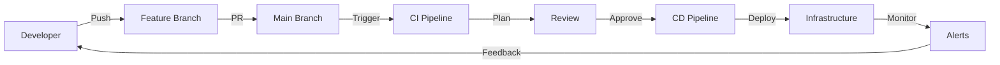
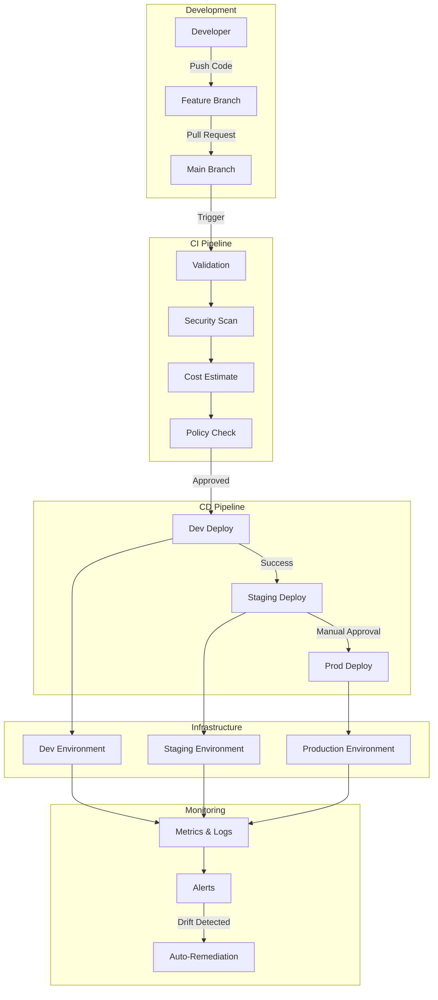

# Module 13 - Complete GitHub Copilot Agent Guide
## Part 3: Exercise 3 (GitOps Pipelines for Automated Deployment)

### 🎯 Learning Objectives

In this comprehensive guide, you'll learn:
- GitOps principles and implementation patterns
- GitHub Actions for Infrastructure as Code
- Automated testing and validation pipelines
- Security scanning and compliance checks
- Multi-environment deployment strategies
- Cost control and approval workflows
- Monitoring and alerting integration
- Rollback and disaster recovery automation

### 🤖 Understanding GitOps with GitHub Copilot

**What is GitOps?**
- Operational framework using Git as single source of truth
- Declarative infrastructure and applications
- Automated deployment based on Git commits
- Continuous reconciliation of desired vs actual state

**Why use Copilot for GitOps?**
- Generate complex pipeline configurations
- Implement security best practices
- Create reusable workflow templates
- Automate compliance checks

---

## 📚 Exercise 3 Overview: Complete GitOps Implementation

In this exercise, you'll build:
1. **CI/CD Pipelines**: Automated infrastructure deployment
2. **Security Scanning**: Policy as code and compliance
3. **Multi-Environment**: Progressive deployment strategies
4. **Cost Control**: Budget checks before deployment
5. **Observability**: Automated monitoring setup

Let's start with understanding GitOps principles.

---

## 🚀 Repository Setup for Exercise 3

### Step 1: GitOps Repository Structure

**💡 Educational Note**: GitOps requires a specific repository structure to support automated deployments, environment promotion, and rollback capabilities.

#### Copilot Agent Prompt:
```markdown
@workspace Create a comprehensive GitOps repository structure that includes:

1. GitHub Actions workflow organization
2. Environment-specific configurations
3. Reusable workflow templates
4. Policy as code structure
5. Secret management approach
6. Documentation for GitOps processes
7. Rollback procedures

Explain why GitOps is crucial for modern infrastructure management.
```

#### Expected Output:
```markdown
# GitOps Repository Structure

## Why GitOps?

1. **Single Source of Truth**: Git contains entire system state
2. **Audit Trail**: Every change is tracked and reviewable
3. **Rollback Capability**: Easy reversion to previous states
4. **Automated Deployment**: Push to deploy methodology
5. **Security**: Reduced access to production systems

## Repository Structure
```
.github/
├── workflows/                    # GitHub Actions workflows
│   ├── 00-pr-validation.yml    # Pull request checks
│   ├── 01-security-scan.yml    # Security scanning
│   ├── 02-cost-estimate.yml    # Cost estimation
│   ├── 03-deploy-dev.yml       # Deploy to dev
│   ├── 04-deploy-staging.yml   # Deploy to staging
│   ├── 05-deploy-prod.yml      # Deploy to production
│   ├── 99-destroy.yml          # Destroy infrastructure
│   └── templates/              # Reusable workflows
│       ├── terraform-plan.yml
│       ├── terraform-apply.yml
│       └── notifications.yml
├── actions/                     # Custom GitHub Actions
│   ├── terraform-plan/
│   ├── cost-check/
│   └── compliance-check/
├── policies/                    # Policy as Code
│   ├── sentinel/               # Terraform Sentinel policies
│   ├── opa/                    # Open Policy Agent
│   └── azure-policy/           # Azure Policy definitions
└── scripts/                     # Supporting scripts
    ├── generate-docs.sh
    ├── update-providers.sh
    └── emergency-rollback.sh

environments/                    # From Exercise 1 & 2
modules/                        # From Exercise 1 & 2
```

## GitOps Flow


```

### Step 2: GitHub Actions Configuration

**💡 Educational Note**: GitHub Actions provides the automation engine for GitOps. We'll create workflows that handle the complete infrastructure lifecycle.

#### Copilot Agent Prompt:
```markdown
@workspace Create a comprehensive GitHub Actions workflow for pull request validation that:

1. Validates Terraform formatting
2. Runs terraform plan for all environments
3. Performs security scanning with tfsec and checkov
4. Estimates costs with infracost
5. Posts results as PR comments
6. Requires approval for high-risk changes
7. Checks for documentation updates
8. Validates commit messages

Include detailed comments explaining each step and why it's important.
```

#### Expected PR Validation Workflow:

**.github/workflows/00-pr-validation.yml:**
```yaml
# =====================================================
# Pull Request Validation Workflow
# =====================================================
# This workflow runs on every PR to ensure code quality,
# security, and cost awareness before merging

name: PR Validation

on:
  pull_request:
    branches: [ main ]
    paths:
      - 'environments/**'
      - 'modules/**'
      - '.github/workflows/**'

# Permissions needed for PR comments and security scanning
permissions:
  contents: read
  pull-requests: write
  security-events: write
  actions: read

# Cancel in-progress runs for the same PR
concurrency:
  group: pr-validation-${{ github.event.pull_request.number }}
  cancel-in-progress: true

jobs:
  # ==================== SETUP ====================
  setup:
    name: Setup and Configuration
    runs-on: ubuntu-latest
    outputs:
      environments: ${{ steps.set-environments.outputs.environments }}
      modules-changed: ${{ steps.changes.outputs.modules }}
      
    steps:
      - name: Checkout Code
        uses: actions/checkout@v4
        with:
          fetch-depth: 0  # Need full history for diff
      
      - name: Detect Changed Files
        id: changes
        uses: dorny/paths-filter@v2
        with:
          filters: |
            modules:
              - 'modules/**'
            dev:
              - 'environments/dev/**'
            staging:
              - 'environments/staging/**'
            prod:
              - 'environments/prod/**'
      
      - name: Set Environments to Test
        id: set-environments
        run: |
          ENVS='[]'
          if [[ "${{ steps.changes.outputs.dev }}" == "true" ]]; then
            ENVS=$(echo $ENVS | jq -c '. += ["dev"]')
          fi
          if [[ "${{ steps.changes.outputs.staging }}" == "true" ]]; then
            ENVS=$(echo $ENVS | jq -c '. += ["staging"]')
          fi
          if [[ "${{ steps.changes.outputs.prod }}" == "true" ]]; then
            ENVS=$(echo $ENVS | jq -c '. += ["prod"]')
          fi
          
          # If modules changed, test all environments
          if [[ "${{ steps.changes.outputs.modules }}" == "true" ]]; then
            ENVS='["dev", "staging", "prod"]'
          fi
          
          echo "environments=$ENVS" >> $GITHUB_OUTPUT
          echo "Testing environments: $ENVS"

  # ==================== FORMATTING ====================
  format-check:
    name: Terraform Format Check
    runs-on: ubuntu-latest
    
    steps:
      - name: Checkout Code
        uses: actions/checkout@v4
      
      - name: Setup Terraform
        uses: hashicorp/setup-terraform@v3
        with:
          terraform_version: 1.6.0
      
      - name: Check Formatting
        id: fmt
        run: |
          # Check all Terraform files
          echo "Checking Terraform formatting..."
          terraform fmt -check -recursive -diff
        continue-on-error: true
      
      - name: Comment PR on Failure
        if: steps.fmt.outcome == 'failure'
        uses: actions/github-script@v7
        with:
          script: |
            github.rest.issues.createComment({
              issue_number: context.issue.number,
              owner: context.repo.owner,
              repo: context.repo.repo,
              body: '❌ **Terraform Format Check Failed**\n\nPlease run `terraform fmt -recursive` to fix formatting issues.'
            })
      
      - name: Fail if Format Check Failed
        if: steps.fmt.outcome == 'failure'
        run: exit 1

  # ==================== VALIDATION ====================
  validate:
    name: Terraform Validation
    runs-on: ubuntu-latest
    needs: [setup, format-check]
    if: needs.setup.outputs.environments != '[]'
    strategy:
      matrix:
        environment: ${{ fromJson(needs.setup.outputs.environments) }}
    
    steps:
      - name: Checkout Code
        uses: actions/checkout@v4
      
      - name: Setup Terraform
        uses: hashicorp/setup-terraform@v3
        with:
          terraform_version: 1.6.0
      
      - name: Configure AWS Credentials
        uses: aws-actions/configure-aws-credentials@v4
        with:
          aws-access-key-id: ${{ secrets.AWS_ACCESS_KEY_ID }}
          aws-secret-access-key: ${{ secrets.AWS_SECRET_ACCESS_KEY }}
          aws-region: us-east-1
      
      - name: Azure Login
        uses: azure/login@v1
        with:
          creds: ${{ secrets.AZURE_CREDENTIALS }}
      
      - name: Terraform Init
        working-directory: environments/${{ matrix.environment }}
        run: |
          terraform init -backend=false
      
      - name: Terraform Validate
        working-directory: environments/${{ matrix.environment }}
        run: |
          terraform validate -no-color

  # ==================== SECURITY SCANNING ====================
  security-scan:
    name: Security Scanning
    runs-on: ubuntu-latest
    needs: [setup]
    
    steps:
      - name: Checkout Code
        uses: actions/checkout@v4
      
      - name: TFSec Security Scan
        uses: aquasecurity/tfsec-pr-commenter-action@v1.3.1
        with:
          github_token: ${{ github.token }}
          tfsec_args: --config-file .tfsec.yml
      
      - name: Checkov Security Scan
        id: checkov
        uses: bridgecrewio/checkov-action@master
        with:
          directory: .
          framework: terraform
          output_format: cli,sarif
          output_file_path: console,results.sarif
          download_external_modules: true
          soft_fail: true
      
      - name: Upload SARIF Results
        if: always()
        uses: github/codeql-action/upload-sarif@v2
        with:
          sarif_file: results.sarif

  # ==================== TERRAFORM PLAN ====================
  terraform-plan:
    name: Terraform Plan
    runs-on: ubuntu-latest
    needs: [setup, validate]
    if: needs.setup.outputs.environments != '[]'
    strategy:
      matrix:
        environment: ${{ fromJson(needs.setup.outputs.environments) }}
    
    steps:
      - name: Checkout Code
        uses: actions/checkout@v4
      
      - name: Setup Terraform
        uses: hashicorp/setup-terraform@v3
        with:
          terraform_version: 1.6.0
      
      - name: Configure AWS Credentials
        uses: aws-actions/configure-aws-credentials@v4
        with:
          aws-access-key-id: ${{ secrets.AWS_ACCESS_KEY_ID }}
          aws-secret-access-key: ${{ secrets.AWS_SECRET_ACCESS_KEY }}
          aws-region: us-east-1
      
      - name: Azure Login
        uses: azure/login@v1
        with:
          creds: ${{ secrets.AZURE_CREDENTIALS }}
      
      - name: Terraform Init
        working-directory: environments/${{ matrix.environment }}
        run: |
          terraform init
      
      - name: Terraform Plan
        id: plan
        working-directory: environments/${{ matrix.environment }}
        run: |
          terraform plan -no-color -out=tfplan \
            -var="owner_email=${{ github.actor }}@example.com" \
            -var="cost_center=GITHUB-PR"
        continue-on-error: true
      
      - name: Save Plan Output
        if: steps.plan.outcome == 'success'
        working-directory: environments/${{ matrix.environment }}
        run: |
          terraform show -no-color tfplan > plan.txt
          
      - name: Upload Plan
        if: steps.plan.outcome == 'success'
        uses: actions/upload-artifact@v3
        with:
          name: tfplan-${{ matrix.environment }}
          path: environments/${{ matrix.environment }}/tfplan
          
      - name: Comment Plan on PR
        uses: actions/github-script@v7
        if: always()
        with:
          script: |
            const output = `#### Terraform Plan 📖 \`${{ matrix.environment }}\`
            #### Terraform Validation 🤖 \`${{ steps.validate.outcome }}\`
            #### Terraform Plan 📖 \`${{ steps.plan.outcome }}\`
            
            <details><summary>Show Plan</summary>
            
            \`\`\`terraform
            ${{ steps.plan.outputs.stdout }}
            \`\`\`
            
            </details>
            
            *Pushed by: @${{ github.actor }}, Action: \`${{ github.event_name }}\`*`;
            
            github.rest.issues.createComment({
              issue_number: context.issue.number,
              owner: context.repo.owner,
              repo: context.repo.repo,
              body: output
            })

  # ==================== COST ESTIMATION ====================
  cost-estimate:
    name: Cost Estimation
    runs-on: ubuntu-latest
    needs: [setup, terraform-plan]
    if: needs.setup.outputs.environments != '[]'
    strategy:
      matrix:
        environment: ${{ fromJson(needs.setup.outputs.environments) }}
    
    steps:
      - name: Checkout Code
        uses: actions/checkout@v4
      
      - name: Download Plan
        uses: actions/download-artifact@v3
        with:
          name: tfplan-${{ matrix.environment }}
          path: environments/${{ matrix.environment }}
      
      - name: Setup Infracost
        uses: infracost/actions/setup@v2
        with:
          api-key: ${{ secrets.INFRACOST_API_KEY }}
      
      - name: Generate Cost Estimate
        working-directory: environments/${{ matrix.environment }}
        run: |
          infracost breakdown \
            --path tfplan \
            --format json \
            --out-file infracost.json
      
      - name: Post Cost Estimate to PR
        uses: infracost/actions/comment@v1
        with:
          path: environments/${{ matrix.environment }}/infracost.json
          behavior: update

  # ==================== DOCUMENTATION CHECK ====================
  docs-check:
    name: Documentation Check
    runs-on: ubuntu-latest
    needs: [setup]
    
    steps:
      - name: Checkout Code
        uses: actions/checkout@v4
      
      - name: Setup Python
        uses: actions/setup-python@v4
        with:
          python-version: '3.11'
      
      - name: Install terraform-docs
        run: |
          pip install terraform-docs
      
      - name: Check Module Documentation
        if: needs.setup.outputs.modules-changed == 'true'
        run: |
          for module in modules/*/; do
            if [[ -d "$module" ]]; then
              echo "Checking documentation for $module"
              terraform-docs markdown table "$module" > "$module/README.md.tmp"
              if ! diff -q "$module/README.md" "$module/README.md.tmp" > /dev/null; then
                echo "Documentation outdated for $module"
                echo "Please run: terraform-docs markdown table $module > $module/README.md"
                exit 1
              fi
            fi
          done

  # ==================== COMPLIANCE CHECK ====================
  compliance-check:
    name: Compliance Check
    runs-on: ubuntu-latest
    needs: [terraform-plan]
    
    steps:
      - name: Checkout Code
        uses: actions/checkout@v4
      
      - name: Setup OPA
        run: |
          curl -L -o opa https://openpolicyagent.org/downloads/latest/opa_linux_amd64
          chmod +x opa
          sudo mv opa /usr/local/bin/
      
      - name: Run Compliance Policies
        run: |
          # Run OPA policies against plan
          for policy in policies/opa/*.rego; do
            echo "Running policy: $policy"
            opa eval -d "$policy" -i environments/dev/tfplan "data.terraform.deny[x]"
          done

  # ==================== FINAL STATUS ====================
  pr-status:
    name: PR Validation Status
    runs-on: ubuntu-latest
    needs: [format-check, validate, security-scan, terraform-plan, cost-estimate, docs-check, compliance-check]
    if: always()
    
    steps:
      - name: Comment Final Status
        uses: actions/github-script@v7
        with:
          script: |
            const needs = ${{ toJson(needs) }};
            let allPassed = true;
            let summary = '## PR Validation Summary\n\n';
            
            for (const [job, result] of Object.entries(needs)) {
              const status = result.result === 'success' ? '✅' : '❌';
              summary += `${status} **${job}**: ${result.result}\n`;
              if (result.result !== 'success') allPassed = false;
            }
            
            summary += '\n';
            summary += allPassed 
              ? '✅ **All checks passed! PR is ready for review.**' 
              : '❌ **Some checks failed. Please fix the issues above.**';
            
            github.rest.issues.createComment({
              issue_number: context.issue.number,
              owner: context.repo.owner,
              repo: context.repo.repo,
              body: summary
            })
```

### Step 3: Deployment Workflows

**💡 Educational Note**: Deployment workflows implement the actual infrastructure changes with proper approvals and safety checks.

#### Copilot Agent Prompt:
```markdown
@workspace Create GitHub Actions workflows for deploying to different environments that:

1. Deploy to dev automatically on merge to main
2. Deploy to staging with manual approval
3. Deploy to production with multiple approvals
4. Include pre-deployment checks
5. Post-deployment validation
6. Rollback capability
7. Notifications to teams
8. Deployment metrics collection

Explain the deployment strategy and safety mechanisms.
```

#### Expected Deployment Workflows:

**.github/workflows/03-deploy-dev.yml:**
```yaml
# =====================================================
# Development Environment Deployment
# =====================================================
# Automatically deploys to dev when changes are merged
# to main branch

name: Deploy to Development

on:
  push:
    branches: [ main ]
    paths:
      - 'environments/dev/**'
      - 'modules/**'
  workflow_dispatch:
    inputs:
      force_deploy:
        description: 'Force deployment even if no changes'
        type: boolean
        default: false

# Ensure only one deployment at a time
concurrency:
  group: deploy-dev
  cancel-in-progress: false

permissions:
  contents: read
  id-token: write  # For OIDC authentication

jobs:
  # ==================== PRE-DEPLOYMENT CHECKS ====================
  pre-deploy-checks:
    name: Pre-Deployment Checks
    runs-on: ubuntu-latest
    outputs:
      should_deploy: ${{ steps.check.outputs.should_deploy }}
    
    steps:
      - name: Checkout Code
        uses: actions/checkout@v4
        with:
          fetch-depth: 2
      
      - name: Check for Changes
        id: check
        run: |
          if [[ "${{ github.event.inputs.force_deploy }}" == "true" ]]; then
            echo "should_deploy=true" >> $GITHUB_OUTPUT
            echo "Force deployment requested"
          else
            # Check if there are relevant changes
            if git diff --name-only HEAD~1 HEAD | grep -E "(environments/dev|modules)/"; then
              echo "should_deploy=true" >> $GITHUB_OUTPUT
              echo "Changes detected in dev environment or modules"
            else
              echo "should_deploy=false" >> $GITHUB_OUTPUT
              echo "No relevant changes detected"
            fi
          fi
      
      - name: Check Deployment Window
        if: steps.check.outputs.should_deploy == 'true'
        run: |
          # Check if we're in a valid deployment window
          HOUR=$(date +%H)
          DAY=$(date +%u)
          
          # No deployments on weekends or outside business hours
          if [[ $DAY -gt 5 ]] || [[ $HOUR -lt 8 ]] || [[ $HOUR -gt 18 ]]; then
            echo "⚠️ WARNING: Deploying outside business hours"
          fi

  # ==================== TERRAFORM PLAN ====================
  terraform-plan:
    name: Terraform Plan
    runs-on: ubuntu-latest
    needs: pre-deploy-checks
    if: needs.pre-deploy-checks.outputs.should_deploy == 'true'
    environment: dev-plan
    
    steps:
      - name: Checkout Code
        uses: actions/checkout@v4
      
      - name: Configure AWS Credentials
        uses: aws-actions/configure-aws-credentials@v4
        with:
          role-to-assume: ${{ secrets.AWS_DEPLOY_ROLE_ARN }}
          aws-region: us-east-1
      
      - name: Azure Login
        uses: azure/login@v1
        with:
          creds: ${{ secrets.AZURE_CREDENTIALS }}
      
      - name: Setup Terraform
        uses: hashicorp/setup-terraform@v3
        with:
          terraform_version: 1.6.0
          terraform_wrapper: false
      
      - name: Terraform Init
        working-directory: environments/dev
        run: |
          terraform init
      
      - name: Terraform Plan
        id: plan
        working-directory: environments/dev
        run: |
          terraform plan -no-color -out=tfplan \
            -var="owner_email=gitops@example.com" \
            -var="cost_center=GITOPS"
      
      - name: Upload Plan
        uses: actions/upload-artifact@v3
        with:
          name: tfplan-dev-${{ github.sha }}
          path: environments/dev/tfplan
          retention-days: 7
      
      - name: Plan Summary
        working-directory: environments/dev
        run: |
          echo "## Terraform Plan Summary" >> $GITHUB_STEP_SUMMARY
          echo "\`\`\`" >> $GITHUB_STEP_SUMMARY
          terraform show -no-color tfplan | grep -E "^  # |^Plan:" >> $GITHUB_STEP_SUMMARY
          echo "\`\`\`" >> $GITHUB_STEP_SUMMARY

  # ==================== DEPLOY ====================
  deploy:
    name: Deploy to Development
    runs-on: ubuntu-latest
    needs: terraform-plan
    environment: dev-deploy
    
    steps:
      - name: Checkout Code
        uses: actions/checkout@v4
      
      - name: Download Plan
        uses: actions/download-artifact@v3
        with:
          name: tfplan-dev-${{ github.sha }}
          path: environments/dev
      
      - name: Configure AWS Credentials
        uses: aws-actions/configure-aws-credentials@v4
        with:
          role-to-assume: ${{ secrets.AWS_DEPLOY_ROLE_ARN }}
          aws-region: us-east-1
      
      - name: Azure Login
        uses: azure/login@v1
        with:
          creds: ${{ secrets.AZURE_CREDENTIALS }}
      
      - name: Setup Terraform
        uses: hashicorp/setup-terraform@v3
        with:
          terraform_version: 1.6.0
          terraform_wrapper: false
      
      - name: Terraform Init
        working-directory: environments/dev
        run: |
          terraform init
      
      - name: Terraform Apply
        id: apply
        working-directory: environments/dev
        run: |
          terraform apply -auto-approve -no-color tfplan
      
      - name: Capture Outputs
        id: outputs
        working-directory: environments/dev
        run: |
          # Capture key outputs for validation
          echo "azure_network_id=$(terraform output -raw azure_network_id)" >> $GITHUB_OUTPUT
          echo "aws_network_id=$(terraform output -raw aws_network_id)" >> $GITHUB_OUTPUT

  # ==================== POST-DEPLOYMENT VALIDATION ====================
  validate-deployment:
    name: Validate Deployment
    runs-on: ubuntu-latest
    needs: deploy
    
    steps:
      - name: Checkout Code
        uses: actions/checkout@v4
      
      - name: Configure AWS Credentials
        uses: aws-actions/configure-aws-credentials@v4
        with:
          role-to-assume: ${{ secrets.AWS_DEPLOY_ROLE_ARN }}
          aws-region: us-east-1
      
      - name: Azure Login
        uses: azure/login@v1
        with:
          creds: ${{ secrets.AZURE_CREDENTIALS }}
      
      - name: Validate Azure Resources
        run: |
          echo "Validating Azure resources..."
          # Check if VNet exists
          az network vnet show \
            --resource-group rg-multicloud-dev-network \
            --name vnet-multicloud-dev \
            --query "provisioningState" -o tsv
      
      - name: Validate AWS Resources
        run: |
          echo "Validating AWS resources..."
          # Check if VPC exists
          aws ec2 describe-vpcs \
            --vpc-ids ${{ needs.deploy.outputs.aws_network_id }} \
            --query "Vpcs[0].State" \
            --output text
      
      - name: Run Smoke Tests
        run: |
          # Run basic connectivity tests
          ./scripts/smoke-tests.sh dev

  # ==================== NOTIFICATIONS ====================
  notify:
    name: Send Notifications
    runs-on: ubuntu-latest
    needs: [deploy, validate-deployment]
    if: always()
    
    steps:
      - name: Send Slack Notification
        uses: 8398a7/action-slack@v3
        with:
          status: ${{ job.status }}
          text: |
            Deployment to Development: ${{ needs.deploy.result }}
            Validation: ${{ needs.validate-deployment.result }}
            Deployed by: ${{ github.actor }}
            Commit: ${{ github.sha }}
        env:
          SLACK_WEBHOOK_URL: ${{ secrets.SLACK_WEBHOOK }}
      
      - name: Create GitHub Deployment
        uses: actions/github-script@v7
        with:
          script: |
            const deployment = await github.rest.repos.createDeployment({
              owner: context.repo.owner,
              repo: context.repo.repo,
              ref: context.sha,
              environment: 'dev',
              description: 'Deployed via GitOps'
            });
            
            await github.rest.repos.createDeploymentStatus({
              owner: context.repo.owner,
              repo: context.repo.repo,
              deployment_id: deployment.data.id,
              state: '${{ needs.validate-deployment.result }}',
              environment_url: 'https://dev.example.com'
            });
```

**.github/workflows/05-deploy-prod.yml:**
```yaml
# =====================================================
# Production Environment Deployment
# =====================================================
# Requires multiple approvals and extensive validation

name: Deploy to Production

on:
  workflow_dispatch:
    inputs:
      deploy_version:
        description: 'Git ref to deploy (tag/branch/SHA)'
        required: true
        default: 'main'
      emergency_deploy:
        description: 'Emergency deployment (skip some checks)'
        type: boolean
        default: false

concurrency:
  group: deploy-prod
  cancel-in-progress: false

permissions:
  contents: read
  id-token: write
  issues: write

jobs:
  # ==================== APPROVAL COLLECTION ====================
  collect-approvals:
    name: Collect Required Approvals
    runs-on: ubuntu-latest
    environment: prod-approve
    
    steps:
      - name: Request Approvals
        uses: actions/github-script@v7
        with:
          script: |
            const issue = await github.rest.issues.create({
              owner: context.repo.owner,
              repo: context.repo.repo,
              title: `Production Deployment Request - ${new Date().toISOString()}`,
              body: `
                ## Production Deployment Request
                
                **Requester**: @${context.actor}
                **Version**: ${{ github.event.inputs.deploy_version }}
                **Emergency**: ${{ github.event.inputs.emergency_deploy }}
                
                ### Required Approvals
                - [ ] Infrastructure Team Lead
                - [ ] Security Team
                - [ ] Product Owner
                
                Please review and comment with your approval.
              `,
              labels: ['deployment', 'production', 'approval-needed']
            });
            
            core.setOutput('issue_number', issue.data.number);

  # ==================== PRE-PRODUCTION CHECKS ====================
  pre-prod-checks:
    name: Pre-Production Checks
    runs-on: ubuntu-latest
    needs: collect-approvals
    
    steps:
      - name: Checkout Code
        uses: actions/checkout@v4
        with:
          ref: ${{ github.event.inputs.deploy_version }}
      
      - name: Verify Staging Deployment
        run: |
          # Ensure staging has been deployed and tested
          echo "Checking staging deployment status..."
          # Add actual staging validation here
      
      - name: Check Change Advisory Board
        if: github.event.inputs.emergency_deploy != 'true'
        run: |
          # Verify CAB approval for non-emergency deployments
          echo "Checking CAB approval..."
      
      - name: Backup Current State
        run: |
          # Backup current production state
          echo "Creating production state backup..."

  # ==================== PRODUCTION PLAN ====================
  terraform-plan-prod:
    name: Terraform Plan Production
    runs-on: ubuntu-latest
    needs: pre-prod-checks
    environment: prod-plan
    
    steps:
      - name: Checkout Code
        uses: actions/checkout@v4
        with:
          ref: ${{ github.event.inputs.deploy_version }}
      
      # ... (similar to dev but with production credentials)
      
      - name: Create Detailed Plan Report
        working-directory: environments/prod
        run: |
          # Generate comprehensive plan report
          terraform show -no-color tfplan > plan-report.txt
          
          # Extract key changes
          echo "## Production Deployment Plan" > plan-summary.md
          echo "### Resources to be created:" >> plan-summary.md
          grep "will be created" plan-report.txt | wc -l >> plan-summary.md
          echo "### Resources to be updated:" >> plan-summary.md
          grep "will be updated" plan-report.txt | wc -l >> plan-summary.md
          echo "### Resources to be destroyed:" >> plan-summary.md
          grep "will be destroyed" plan-report.txt | wc -l >> plan-summary.md
      
      - name: Upload Plan Report
        uses: actions/upload-artifact@v3
        with:
          name: prod-plan-report-${{ github.sha }}
          path: |
            environments/prod/plan-report.txt
            environments/prod/plan-summary.md

  # ==================== FINAL APPROVAL ====================
  final-approval:
    name: Final Production Approval
    runs-on: ubuntu-latest
    needs: terraform-plan-prod
    environment: prod-deploy
    
    steps:
      - name: Display Plan Summary
        run: |
          echo "Waiting for final approval to deploy to production..."
          echo "Please review the plan artifacts before approving."

  # ==================== PRODUCTION DEPLOYMENT ====================
  deploy-prod:
    name: Deploy to Production
    runs-on: ubuntu-latest
    needs: final-approval
    
    steps:
      - name: Checkout Code
        uses: actions/checkout@v4
        with:
          ref: ${{ github.event.inputs.deploy_version }}
      
      - name: Configure Production Credentials
        run: |
          # Use enhanced security for production
          echo "Configuring production credentials..."
      
      - name: Deploy with Canary
        if: github.event.inputs.emergency_deploy != 'true'
        run: |
          # Deploy to canary environment first
          echo "Deploying to canary..."
          # Monitor canary metrics
          sleep 300  # 5 minute canary period
      
      - name: Full Production Deployment
        working-directory: environments/prod
        run: |
          terraform apply -auto-approve tfplan
      
      - name: Tag Release
        uses: actions/github-script@v7
        with:
          script: |
            const date = new Date().toISOString().split('T')[0];
            const tagName = `prod-${date}-${context.sha.substring(0, 7)}`;
            
            await github.rest.git.createRef({
              owner: context.repo.owner,
              repo: context.repo.repo,
              ref: `refs/tags/${tagName}`,
              sha: context.sha
            });

  # ==================== POST-DEPLOYMENT ====================
  post-deploy:
    name: Post-Deployment Tasks
    runs-on: ubuntu-latest
    needs: deploy-prod
    if: always()
    
    steps:
      - name: Update Documentation
        run: |
          # Update deployment documentation
          echo "Updating deployment records..."
      
      - name: Notify Teams
        run: |
          # Send comprehensive notifications
          echo "Sending deployment notifications..."
      
      - name: Start Monitoring Period
        run: |
          # Enhanced monitoring for 24 hours post-deployment
          echo "Initiating enhanced monitoring..."
```

### Step 4: Security and Compliance Workflows

**💡 Educational Note**: Security must be integrated into every stage of the GitOps pipeline. We'll implement policy as code and continuous compliance monitoring.

#### Copilot Agent Prompt:
```markdown
@workspace Create security and compliance workflows that:

1. Implement Sentinel policies for Terraform
2. Use Open Policy Agent for compliance rules
3. Scan for secrets and sensitive data
4. Check for security misconfigurations
5. Validate network security rules
6. Monitor for drift from desired state
7. Generate compliance reports
8. Alert on policy violations

Include example policies and explain their importance.
```

#### Expected Security Implementation:

**.github/workflows/01-security-scan.yml:**
```yaml
# =====================================================
# Security and Compliance Scanning
# =====================================================
# Continuous security validation for infrastructure

name: Security and Compliance

on:
  push:
    branches: [ main, develop ]
  pull_request:
    branches: [ main ]
  schedule:
    - cron: '0 2 * * *'  # Daily at 2 AM
  workflow_dispatch:

permissions:
  contents: read
  security-events: write
  actions: read

jobs:
  # ==================== SECRET SCANNING ====================
  secret-scan:
    name: Secret Scanning
    runs-on: ubuntu-latest
    
    steps:
      - name: Checkout Code
        uses: actions/checkout@v4
        with:
          fetch-depth: 0  # Full history for secret scanning
      
      - name: TruffleHog Secret Scan
        uses: trufflesecurity/trufflehog@main
        with:
          path: ./
          base: ${{ github.event.repository.default_branch }}
          head: HEAD
          extra_args: --debug --only-verified
      
      - name: Gitleaks Secret Scan
        uses: gitleaks/gitleaks-action@v2
        env:
          GITHUB_TOKEN: ${{ secrets.GITHUB_TOKEN }}
          GITLEAKS_LICENSE: ${{ secrets.GITLEAKS_LICENSE }}
      
      - name: GitGuardian Scan
        uses: GitGuardian/ggshield/actions/secret@main
        env:
          GITGUARDIAN_API_KEY: ${{ secrets.GITGUARDIAN_API_KEY }}

  # ==================== INFRASTRUCTURE SECURITY ====================
  infra-security:
    name: Infrastructure Security Scan
    runs-on: ubuntu-latest
    
    steps:
      - name: Checkout Code
        uses: actions/checkout@v4
      
      - name: Setup Python
        uses: actions/setup-python@v4
        with:
          python-version: '3.11'
      
      - name: Install Security Tools
        run: |
          pip install checkov terrascan
          
          # Install tfsec
          curl -s https://raw.githubusercontent.com/aquasecurity/tfsec/master/scripts/install_linux.sh | bash
          
          # Install OPA
          curl -L -o opa https://openpolicyagent.org/downloads/latest/opa_linux_amd64
          chmod +x opa
          sudo mv opa /usr/local/bin/
      
      - name: Run Checkov
        id: checkov
        continue-on-error: true
        run: |
          checkov -d . \
            --framework terraform \
            --output cli \
            --output sarif \
            --output-file-path console,checkov.sarif \
            --download-external-modules true \
            --config-file .checkov.yml
      
      - name: Run TFSec
        id: tfsec
        continue-on-error: true
        run: |
          tfsec . \
            --format sarif \
            --out tfsec.sarif \
            --soft-fail
      
      - name: Run Terrascan
        id: terrascan
        continue-on-error: true
        run: |
          terrascan scan \
            -i terraform \
            -d . \
            --output sarif > terrascan.sarif
      
      - name: Upload SARIF Results
        if: always()
        uses: github/codeql-action/upload-sarif@v2
        with:
          sarif_file: |
            checkov.sarif
            tfsec.sarif
            terrascan.sarif

  # ==================== POLICY VALIDATION ====================
  policy-check:
    name: Policy as Code Validation
    runs-on: ubuntu-latest
    
    steps:
      - name: Checkout Code
        uses: actions/checkout@v4
      
      - name: Setup OPA
        run: |
          curl -L -o opa https://openpolicyagent.org/downloads/latest/opa_linux_amd64
          chmod +x opa
          sudo mv opa /usr/local/bin/
      
      - name: Validate Terraform Against Policies
        run: |
          # Convert Terraform to JSON for OPA evaluation
          for env in environments/*/; do
            if [[ -d "$env" ]]; then
              echo "Checking policies for $env"
              
              # Initialize Terraform
              terraform -chdir="$env" init -backend=false
              
              # Generate plan JSON
              terraform -chdir="$env" plan -out=tfplan
              terraform -chdir="$env" show -json tfplan > "$env/tfplan.json"
              
              # Run OPA policies
              for policy in policies/opa/*.rego; do
                echo "  Running policy: $(basename $policy)"
                opa eval -d "$policy" -i "$env/tfplan.json" \
                  "data.terraform.deny[x]" | jq -r '.result[0].expressions[0].value'
              done
            fi
          done

  # ==================== COMPLIANCE REPORTING ====================
  compliance-report:
    name: Generate Compliance Report
    runs-on: ubuntu-latest
    needs: [secret-scan, infra-security, policy-check]
    if: always()
    
    steps:
      - name: Checkout Code
        uses: actions/checkout@v4
      
      - name: Generate Compliance Report
        run: |
          cat > compliance-report.md << EOF
          # Compliance Report - $(date +%Y-%m-%d)
          
          ## Summary
          - Secret Scanning: ${{ needs.secret-scan.result }}
          - Infrastructure Security: ${{ needs.infra-security.result }}
          - Policy Validation: ${{ needs.policy-check.result }}
          
          ## Detailed Results
          
          ### Security Findings
          $(cat checkov.sarif | jq -r '.runs[0].results | length') Checkov findings
          $(cat tfsec.sarif | jq -r '.runs[0].results | length') TFSec findings
          
          ### Policy Violations
          Check individual policy results in the logs.
          
          ## Recommendations
          1. Address all high-severity findings immediately
          2. Review medium-severity findings for false positives
          3. Update policies as needed for business requirements
          EOF
      
      - name: Upload Report
        uses: actions/upload-artifact@v3
        with:
          name: compliance-report-${{ github.run_id }}
          path: compliance-report.md
      
      - name: Create Issue for Failures
        if: contains(needs.*.result, 'failure')
        uses: actions/github-script@v7
        with:
          script: |
            const issue = await github.rest.issues.create({
              owner: context.repo.owner,
              repo: context.repo.repo,
              title: `Security/Compliance Failures - ${new Date().toISOString().split('T')[0]}`,
              body: `
                ## Security and Compliance Scan Failed
                
                **Run ID**: ${context.runId}
                **Triggered by**: @${context.actor}
                
                ### Failed Checks:
                - Secret Scanning: ${{ needs.secret-scan.result }}
                - Infrastructure Security: ${{ needs.infra-security.result }}
                - Policy Validation: ${{ needs.policy-check.result }}
                
                Please review the [workflow run](${context.serverUrl}/${context.repo.owner}/${context.repo.repo}/actions/runs/${context.runId}) for details.
              `,
              labels: ['security', 'compliance', 'urgent']
            });
```

**policies/opa/terraform-security.rego:**
```rego
# =====================================================
# Terraform Security Policies
# =====================================================
# OPA policies for infrastructure security compliance

package terraform.security

import future.keywords.contains
import future.keywords.if
import future.keywords.in

# Deny public access to storage accounts
deny[msg] {
    resource := input.planned_values.root_module.resources[_]
    resource.type == "azurerm_storage_account"
    resource.values.allow_blob_public_access == true
    msg := sprintf("Storage account '%s' allows public blob access", [resource.name])
}

# Deny unencrypted storage
deny[msg] {
    resource := input.planned_values.root_module.resources[_]
    resource.type == "aws_s3_bucket"
    encryption := resource.values.server_side_encryption_configuration[_]
    encryption.rule[_].apply_server_side_encryption_by_default[_].sse_algorithm != "AES256"
    msg := sprintf("S3 bucket '%s' is not encrypted", [resource.name])
}

# Require HTTPS only
deny[msg] {
    resource := input.planned_values.root_module.resources[_]
    resource.type == "azurerm_app_service"
    resource.values.https_only != true
    msg := sprintf("App Service '%s' does not enforce HTTPS", [resource.name])
}

# Network security rules
deny[msg] {
    resource := input.planned_values.root_module.resources[_]
    resource.type == "azurerm_network_security_rule"
    resource.values.source_address_prefix == "*"
    resource.values.destination_port_range == "*"
    resource.values.access == "Allow"
    msg := sprintf("NSG rule '%s' is too permissive", [resource.name])
}

# Require tags
required_tags := {"Environment", "Owner", "CostCenter", "Project"}

deny[msg] {
    resource := input.planned_values.root_module.resources[_]
    tags := resource.values.tags
    missing := required_tags - {k | tags[k]}
    count(missing) > 0
    msg := sprintf("Resource '%s' missing required tags: %v", [resource.name, missing])
}

# Prevent hard-coded secrets
deny[msg] {
    resource := input.planned_values.root_module.resources[_]
    values := resource.values
    
    # Check for potential secrets in resource values
    suspicious_keys := {"password", "secret", "key", "token", "api_key"}
    
    some key
    suspicious_keys[_] == lower(key)
    values[key]
    not startswith(values[key], "data.")
    not startswith(values[key], "var.")
    
    msg := sprintf("Resource '%s' may contain hard-coded secret in field '%s'", [resource.name, key])
}
```

### Step 5: Monitoring and Rollback

**💡 Educational Note**: Continuous monitoring and quick rollback capabilities are essential for maintaining infrastructure reliability.

#### Copilot Agent Prompt:
```markdown
@workspace Create monitoring and rollback procedures that include:

1. Infrastructure drift detection
2. Automated rollback triggers
3. Blue-green deployment support
4. Backup and restore procedures
5. Monitoring dashboard setup
6. Alert configuration
7. Incident response automation
8. Post-mortem generation

Explain the importance of each component for production reliability.
```

#### Expected Monitoring Implementation:

**.github/workflows/monitor-drift.yml:**
```yaml
# =====================================================
# Infrastructure Drift Detection
# =====================================================
# Continuously monitors for configuration drift

name: Drift Detection

on:
  schedule:
    - cron: '*/30 * * * *'  # Every 30 minutes
  workflow_dispatch:
    inputs:
      environment:
        description: 'Environment to check'
        required: true
        default: 'all'
        type: choice
        options:
          - all
          - dev
          - staging
          - prod

jobs:
  detect-drift:
    name: Detect Infrastructure Drift
    runs-on: ubuntu-latest
    strategy:
      matrix:
        environment: ${{ fromJson(github.event.inputs.environment == 'all' && '["dev", "staging", "prod"]' || format('["{0}"]', github.event.inputs.environment)) }}
    
    steps:
      - name: Checkout Code
        uses: actions/checkout@v4
      
      - name: Setup Terraform
        uses: hashicorp/setup-terraform@v3
        with:
          terraform_version: 1.6.0
      
      - name: Configure Cloud Credentials
        run: |
          # Configure based on environment
          echo "Configuring credentials for ${{ matrix.environment }}"
      
      - name: Terraform Init
        working-directory: environments/${{ matrix.environment }}
        run: terraform init
      
      - name: Detect Drift
        id: drift
        working-directory: environments/${{ matrix.environment }}
        run: |
          # Create detailed plan
          terraform plan -detailed-exitcode -no-color -out=tfplan || exit_code=$?
          
          if [ "${exit_code}" = "0" ]; then
            echo "drift=false" >> $GITHUB_OUTPUT
            echo "No drift detected"
          elif [ "${exit_code}" = "2" ]; then
            echo "drift=true" >> $GITHUB_OUTPUT
            echo "Drift detected!"
            
            # Generate drift report
            terraform show -no-color tfplan > drift-report.txt
            
            # Extract drift summary
            echo "## Drift Summary" > drift-summary.md
            echo "### Resources with changes:" >> drift-summary.md
            grep -E "will be|must be" drift-report.txt | wc -l >> drift-summary.md
          else
            echo "Error running terraform plan"
            exit 1
          fi
      
      - name: Upload Drift Report
        if: steps.drift.outputs.drift == 'true'
        uses: actions/upload-artifact@v3
        with:
          name: drift-report-${{ matrix.environment }}-${{ github.run_id }}
          path: |
            environments/${{ matrix.environment }}/drift-report.txt
            environments/${{ matrix.environment }}/drift-summary.md
      
      - name: Create Drift Alert
        if: steps.drift.outputs.drift == 'true'
        uses: actions/github-script@v7
        with:
          script: |
            // Create issue for drift
            const issue = await github.rest.issues.create({
              owner: context.repo.owner,
              repo: context.repo.repo,
              title: `Infrastructure Drift Detected - ${matrix.environment} - ${new Date().toISOString()}`,
              body: `
                ## Infrastructure Drift Detected
                
                **Environment**: ${{ matrix.environment }}
                **Detection Time**: ${new Date().toISOString()}
                **Run ID**: ${context.runId}
                
                ### Action Required
                1. Review the drift report
                2. Determine if changes were authorized
                3. Either update Terraform state or revert changes
                
                [View Drift Report](${context.serverUrl}/${context.repo.owner}/${context.repo.repo}/actions/runs/${context.runId})
              `,
              labels: ['drift', 'infrastructure', matrix.environment]
            });
      
      - name: Send Alert
        if: steps.drift.outputs.drift == 'true'
        run: |
          # Send alerts via multiple channels
          echo "Sending drift alerts..."
          # Implement Slack, email, PagerDuty, etc.
```

**scripts/emergency-rollback.sh:**
```bash
#!/bin/bash
# =====================================================
# Emergency Rollback Script
# =====================================================
# Quick rollback to previous known good state

set -euo pipefail

# Configuration
ENVIRONMENT="${1:-}"
ROLLBACK_TO="${2:-}"

# Validate inputs
if [[ -z "$ENVIRONMENT" ]]; then
    echo "Error: Environment not specified"
    echo "Usage: $0 <environment> <commit-sha|tag>"
    exit 1
fi

if [[ ! "$ENVIRONMENT" =~ ^(dev|staging|prod)$ ]]; then
    echo "Error: Invalid environment. Must be dev, staging, or prod"
    exit 1
fi

# Colors
RED='\033[0;31m'
GREEN='\033[0;32m'
YELLOW='\033[1;33m'
NC='\033[0m'

echo -e "${YELLOW}🚨 EMERGENCY ROLLBACK INITIATED 🚨${NC}"
echo "Environment: $ENVIRONMENT"
echo "Rolling back to: ${ROLLBACK_TO:-'previous apply'}"

# Confirmation for production
if [[ "$ENVIRONMENT" == "prod" ]]; then
    echo -e "${RED}WARNING: This is a PRODUCTION rollback!${NC}"
    read -p "Type 'ROLLBACK-PROD' to confirm: " confirmation
    if [[ "$confirmation" != "ROLLBACK-PROD" ]]; then
        echo "Rollback cancelled"
        exit 1
    fi
fi

# Create backup of current state
echo "Creating backup of current state..."
cd "environments/$ENVIRONMENT"
cp terraform.tfstate "terraform.tfstate.backup-$(date +%Y%m%d-%H%M%S)"

# If specific version provided, checkout that version
if [[ -n "$ROLLBACK_TO" ]]; then
    echo "Checking out version: $ROLLBACK_TO"
    git checkout "$ROLLBACK_TO" -- .
fi

# Initialize Terraform
echo "Initializing Terraform..."
terraform init

# Create rollback plan
echo "Creating rollback plan..."
terraform plan -out=rollback.tfplan

# Show plan summary
echo -e "${YELLOW}Rollback plan summary:${NC}"
terraform show -no-color rollback.tfplan | grep -E "will be|must be"

# Apply rollback
echo -e "${RED}Applying rollback in 10 seconds... Press Ctrl+C to cancel${NC}"
sleep 10

terraform apply rollback.tfplan

echo -e "${GREEN}✅ Rollback completed successfully!${NC}"

# Post-rollback actions
echo "Running post-rollback validations..."
./scripts/smoke-tests.sh "$ENVIRONMENT"

# Create rollback record
cat > "rollback-record-$(date +%Y%m%d-%H%M%S).json" << EOF
{
  "timestamp": "$(date -u +%Y-%m-%dT%H:%M:%SZ)",
  "environment": "$ENVIRONMENT",
  "rolled_back_to": "$ROLLBACK_TO",
  "operator": "$USER",
  "reason": "Emergency rollback"
}
EOF

echo "Rollback record created"
echo -e "${YELLOW}Don't forget to:${NC}"
echo "1. Update the incident report"
echo "2. Notify the team"
echo "3. Schedule a post-mortem"
```

### Step 6: Documentation and Runbooks

#### Copilot Agent Prompt:
```markdown
@workspace Create comprehensive documentation for the GitOps implementation including:

1. Architecture diagrams using Mermaid
2. Deployment flow documentation
3. Troubleshooting guide
4. Runbooks for common operations
5. Security procedures
6. Disaster recovery plans
7. Onboarding guide for new team members
8. Best practices and lessons learned

Format as markdown with clear sections and examples.
```

#### Expected Documentation:

**docs/gitops-architecture.md:**
```markdown
# GitOps Architecture Documentation

## Overview

This document describes our GitOps implementation for multi-cloud infrastructure management using GitHub Actions, Terraform, and policy as code.

## Architecture Diagram



## Deployment Flow

### 1. Development Workflow
- Developers work on feature branches
- All changes go through pull request review
- Automated validation on every push

### 2. Pull Request Checks
- **Format Validation**: Ensures consistent code style
- **Security Scanning**: Multiple tools check for vulnerabilities
- **Cost Estimation**: Shows financial impact of changes
- **Policy Validation**: Ensures compliance with organization policies

### 3. Environment Promotion
```
Feature Branch → Main → Dev → Staging → Production
                 ↓       ↓      ↓         ↓
              Auto    Auto   Manual    Multiple
                            Approval   Approvals
```

### 4. Deployment Safety
- **Dev**: Automatic deployment on merge
- **Staging**: Requires single approval
- **Production**: Requires multiple approvals and CAB review

## Security Model

### Authentication
- **Azure**: Service Principal with minimal permissions
- **AWS**: IAM roles with assume role for cross-account
- **GitHub**: OIDC for passwordless authentication

### Secret Management
- No secrets in code
- GitHub Secrets for sensitive values
- Key Vault/Secrets Manager for runtime secrets

### Policy Enforcement
- OPA policies block non-compliant resources
- Security scanning on every change
- Compliance reports generated daily

## Monitoring and Alerting

### Drift Detection
- Runs every 30 minutes
- Automatic issue creation for drift
- Option for auto-remediation

### Cost Monitoring
- Budget alerts configured
- Cost estimation before deployment
- Monthly cost reports

### Performance Monitoring
- Infrastructure metrics collected
- Application performance monitored
- SLA tracking and reporting

## Disaster Recovery

### Backup Strategy
- State files versioned in blob storage
- Daily backups of all environments
- 30-day retention policy

### Rollback Procedures
1. **Automated Rollback**: Triggered by failed health checks
2. **Manual Rollback**: Emergency script for operators
3. **Point-in-Time Recovery**: Restore to specific state version

### RTO/RPO Targets
- **Dev Environment**: RTO 1 hour, RPO 24 hours
- **Staging Environment**: RTO 30 minutes, RPO 4 hours
- **Production Environment**: RTO 15 minutes, RPO 1 hour

## Troubleshooting Guide

### Common Issues

#### 1. Deployment Failures
```bash
# Check workflow logs
gh run view <run-id>

# Validate locally
cd environments/<env>
terraform init
terraform plan
```

#### 2. State Lock Issues
```bash
# Force unlock (use with caution)
terraform force-unlock <lock-id>
```

#### 3. Drift Detection False Positives
- Check for provider version updates
- Verify external changes
- Review ignore rules

## Runbooks

### Daily Operations
1. **Morning Checks**
   - Review drift detection results
   - Check overnight deployments
   - Verify backup completion

2. **Deployment Preparation**
   - Update changelog
   - Run pre-deployment tests
   - Notify stakeholders

### Emergency Procedures
1. **Production Outage**
   - Run emergency rollback script
   - Notify incident commander
   - Start post-mortem document

2. **Security Incident**
   - Isolate affected resources
   - Rotate credentials
   - Review audit logs

## Best Practices

### Code Organization
- One module per cloud service type
- Environment-specific configurations in separate directories
- Shared modules for common patterns

### Version Control
- Semantic versioning for modules
- Tag releases for production deployments
- Detailed commit messages

### Testing
- Test modules in isolation
- Integration tests for complete environments
- Regular disaster recovery drills

### Documentation
- Update docs with code changes
- Architecture decision records for major changes
- Runbooks for all operational procedures

## Onboarding New Team Members

### Week 1: Fundamentals
- [ ] GitOps principles training
- [ ] Repository structure walkthrough
- [ ] Development environment setup
- [ ] First pull request

### Week 2: Operations
- [ ] Shadow deployment process
- [ ] Learn monitoring tools
- [ ] Practice rollback procedures
- [ ] Review security policies

### Week 3: Advanced Topics
- [ ] Module development
- [ ] Policy creation
- [ ] Cost optimization
- [ ] Incident response

## Lessons Learned

### What Works Well
1. **Automated validation** catches most issues before deployment
2. **Cost visibility** prevents budget surprises
3. **GitOps approach** provides excellent audit trail
4. **Multi-approval process** prevents unauthorized changes

### Areas for Improvement
1. **Deployment speed** could be optimized with parallel execution
2. **Test coverage** needs expansion for edge cases
3. **Documentation** requires regular updates
4. **Monitoring** dashboards need simplification

## Future Enhancements

1. **AI-Powered Optimization**
   - Automated cost optimization suggestions
   - Predictive scaling based on usage patterns
   - Intelligent rollback decisions

2. **Enhanced Security**
   - Runtime security validation
   - Automated penetration testing
   - Zero-trust network implementation

3. **Developer Experience**
   - Self-service infrastructure provisioning
   - ChatOps integration
   - Visual pipeline builder

## Support and Contact

- **Slack Channel**: #infrastructure-gitops
- **On-Call**: PagerDuty - Infrastructure Team
- **Documentation**: Internal wiki - GitOps section
- **Training**: Monthly GitOps workshops
```

---

## 🚀 Final Challenge: Complete Multi-Cloud Application

### Challenge Prompt:

#### Copilot Agent Prompt:
```markdown
@workspace Create a complete multi-cloud application deployment that:

1. Deploys a microservices application across Azure and AWS
2. Implements cross-cloud networking and security
3. Sets up global load balancing
4. Implements multi-region disaster recovery
5. Creates unified monitoring and logging
6. Implements cost optimization strategies
7. Includes complete GitOps automation
8. Provides detailed documentation

This should demonstrate all concepts from Module 13 in a real-world scenario.
```

---

## 📚 Key Learnings from Exercise 3

### GitOps Principles Mastered
1. **Git as Source of Truth**: All changes through version control
2. **Declarative Configuration**: Desired state in code
3. **Automated Deployment**: Push to deploy
4. **Continuous Reconciliation**: Drift detection and correction
5. **Version Control Everything**: Including policies and docs

### Pipeline Patterns Applied
1. **Progressive Deployment**: Dev → Staging → Production
2. **Automated Validation**: Security, cost, compliance
3. **Approval Workflows**: Appropriate for each environment
4. **Rollback Capability**: Quick recovery from failures
5. **Monitoring Integration**: Continuous feedback loop

### Best Practices Implemented
1. **Security First**: Scanning at every stage
2. **Cost Awareness**: Estimation before deployment
3. **Policy as Code**: Automated compliance
4. **Documentation**: Self-documenting pipelines
5. **Incident Response**: Automated procedures

## 🎯 Module 13 Complete!

You've successfully completed all three exercises:
1. **Exercise 1**: Azure Bicep for native cloud IaC
2. **Exercise 2**: Terraform for multi-cloud infrastructure
3. **Exercise 3**: GitOps for automated deployment

### Skills Acquired
- Infrastructure as Code mastery
- Multi-cloud architecture patterns
- GitOps implementation
- Security and compliance automation
- Cost optimization strategies
- Production deployment best practices

### Next Steps
- Implement these patterns in real projects
- Contribute to open source IaC modules
- Share knowledge with your team
- Keep learning about new cloud services

**Remember**: Infrastructure as Code is not just about automation—it's about reliability, security, and scalability. Every line of code should make your infrastructure better!

---

**Congratulations on completing Module 13! 🎉**

You're now equipped to build and manage enterprise-grade infrastructure using modern IaC practices and GitOps principles. The combination of cloud-native tools, multi-cloud strategies, and automation will serve you throughout your DevOps journey.