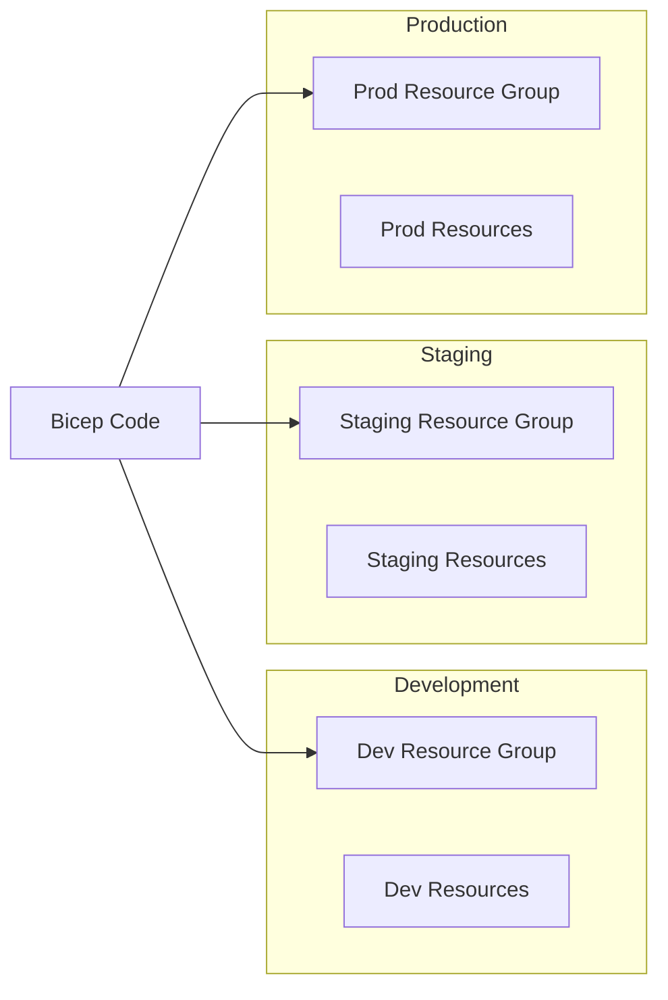
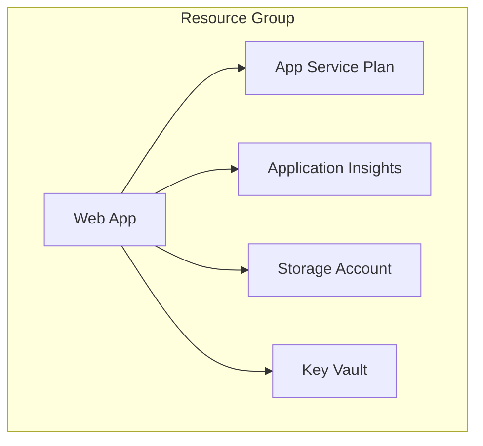
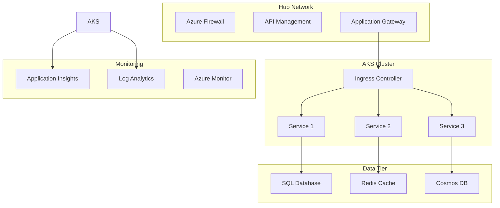
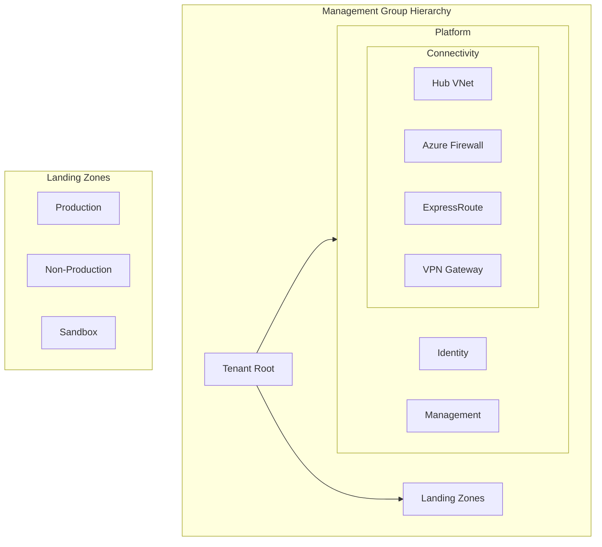
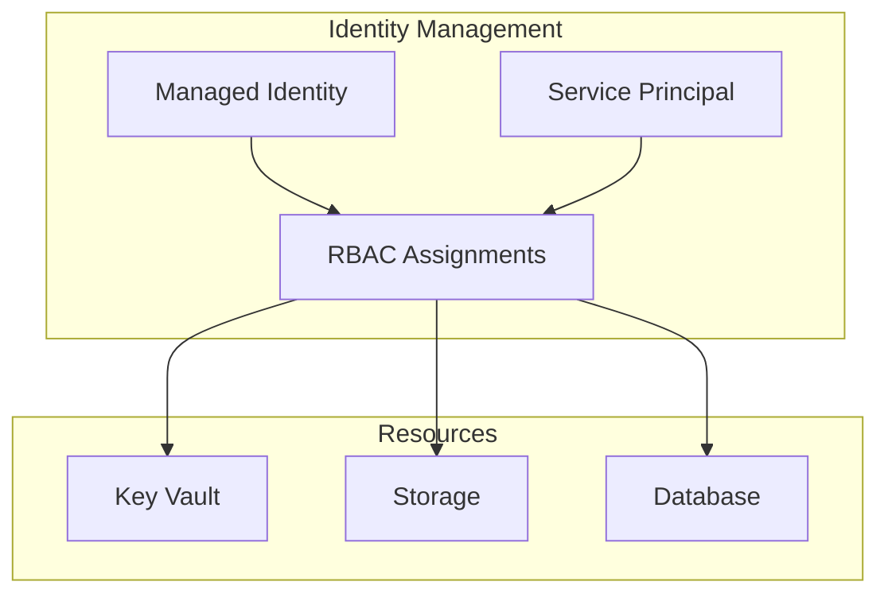
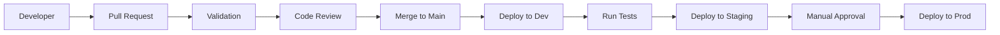

# Module 13: Infrastructure as Code Architecture Guide

## 🏗️ Overview

This guide provides architectural patterns and best practices for implementing Infrastructure as Code (IaC) using Azure Bicep and GitHub Actions. Learn how to design scalable, maintainable, and secure infrastructure deployments.

## 📐 Core Architecture Principles

### 1. Modularity

```
infrastructure/
├── main.bicep                 # Orchestrator
├── modules/                   # Reusable components
│   ├── networking/
│   │   ├── vnet.bicep
│   │   ├── nsg.bicep
│   │   └── firewall.bicep
│   ├── compute/
│   │   ├── webapp.bicep
│   │   ├── vm.bicep
│   │   └── aks.bicep
│   └── data/
│       ├── storage.bicep
│       ├── sql.bicep
│       └── cosmos.bicep
└── parameters/               # Environment configs
    ├── dev.json
    ├── staging.json
    └── prod.json
```

### 2. Environment Separation



## 🏛️ Reference Architectures

### 1. Basic Web Application



**Bicep Implementation:**

```bicep
// main.bicep
targetScope = 'resourceGroup'

// Parameters
param environment string
param location string = resourceGroup().location

// Modules
module appServicePlan 'modules/compute/appServicePlan.bicep' = {
  name: 'appServicePlan'
  params: {
    name: 'asp-${environment}'
    location: location
    sku: environment == 'prod' ? 'P1v3' : 'B1'
  }
}

module webApp 'modules/compute/webapp.bicep' = {
  name: 'webApp'
  params: {
    name: 'app-${environment}'
    location: location
    appServicePlanId: appServicePlan.outputs.id
  }
}

module monitoring 'modules/monitoring/appInsights.bicep' = {
  name: 'monitoring'
  params: {
    name: 'appi-${environment}'
    location: location
  }
}
```

### 2. Microservices Architecture



### 3. Enterprise Landing Zone



## 🔧 Module Patterns

### 1. Networking Module

```bicep
// modules/networking/vnet.bicep
@description('Virtual Network configuration')
param vnetName string
param location string
param addressPrefix string = '10.0.0.0/16'
param subnets array = []

resource vnet 'Microsoft.Network/virtualNetworks@2022-07-01' = {
  name: vnetName
  location: location
  properties: {
    addressSpace: {
      addressPrefixes: [addressPrefix]
    }
    subnets: [for subnet in subnets: {
      name: subnet.name
      properties: {
        addressPrefix: subnet.addressPrefix
        networkSecurityGroup: subnet.nsgId != '' ? {
          id: subnet.nsgId
        } : null
        delegations: subnet.delegations
      }
    }]
  }
}

output vnetId string = vnet.id
output subnets array = vnet.properties.subnets
```

### 2. Security Module

```bicep
// modules/security/keyvault.bicep
@description('Key Vault with RBAC')
param keyVaultName string
param location string
param enableSoftDelete bool = true
param enablePurgeProtection bool = true

resource keyVault 'Microsoft.KeyVault/vaults@2022-07-01' = {
  name: keyVaultName
  location: location
  properties: {
    sku: {
      family: 'A'
      name: 'standard'
    }
    tenantId: subscription().tenantId
    enableSoftDelete: enableSoftDelete
    enablePurgeProtection: enablePurgeProtection
    enableRbacAuthorization: true
    networkAcls: {
      defaultAction: 'Deny'
      bypass: 'AzureServices'
    }
  }
}

output keyVaultId string = keyVault.id
output keyVaultUri string = keyVault.properties.vaultUri
```

## 🚀 Deployment Patterns

### 1. Blue-Green Deployment

```yaml
# GitHub Actions workflow
name: Blue-Green Deployment

on:
  workflow_dispatch:
    inputs:
      target_slot:
        description: 'Target deployment slot'
        required: true
        type: choice
        options:
          - blue
          - green

jobs:
  deploy:
    runs-on: ubuntu-latest
    steps:
      - name: Deploy to Slot
        uses: azure/arm-deploy@v1
        with:
          resourceGroupName: rg-prod
          template: ./main.bicep
          parameters: slot=${{ inputs.target_slot }}
      
      - name: Test Deployment
        run: |
          # Run smoke tests
          
      - name: Swap Slots
        if: success()
        run: |
          az webapp deployment slot swap \
            --name app-prod \
            --resource-group rg-prod \
            --slot ${{ inputs.target_slot }}
```

### 2. Canary Deployment

```bicep
// Canary deployment with Traffic Manager
resource trafficManager 'Microsoft.Network/trafficManagerProfiles@2022-04-01' = {
  name: 'tm-${appName}'
  location: 'global'
  properties: {
    profileStatus: 'Enabled'
    trafficRoutingMethod: 'Weighted'
    endpoints: [
      {
        name: 'stable'
        type: 'Microsoft.Network/trafficManagerProfiles/azureEndpoints'
        properties: {
          targetResourceId: stableApp.id
          weight: 90
        }
      }
      {
        name: 'canary'
        type: 'Microsoft.Network/trafficManagerProfiles/azureEndpoints'
        properties: {
          targetResourceId: canaryApp.id
          weight: 10
        }
      }
    ]
  }
}
```

## 🛡️ Security Architecture

### 1. Network Security

```bicep
// Network security configuration
resource nsg 'Microsoft.Network/networkSecurityGroups@2022-07-01' = {
  name: 'nsg-${subnet.name}'
  location: location
  properties: {
    securityRules: [
      {
        name: 'AllowHttpsInbound'
        properties: {
          priority: 100
          direction: 'Inbound'
          access: 'Allow'
          protocol: 'Tcp'
          sourcePortRange: '*'
          destinationPortRange: '443'
          sourceAddressPrefix: 'Internet'
          destinationAddressPrefix: '*'
        }
      }
      {
        name: 'DenyAllInbound'
        properties: {
          priority: 1000
          direction: 'Inbound'
          access: 'Deny'
          protocol: '*'
          sourcePortRange: '*'
          destinationPortRange: '*'
          sourceAddressPrefix: '*'
          destinationAddressPrefix: '*'
        }
      }
    ]
  }
}
```

### 2. Identity & Access



## 📊 Monitoring Architecture

### 1. Comprehensive Monitoring

```bicep
// Monitoring setup
module monitoring 'modules/monitoring/fullStack.bicep' = {
  name: 'monitoring'
  params: {
    workspaceName: 'log-${environment}'
    appInsightsName: 'appi-${environment}'
    location: location
    retentionInDays: environment == 'prod' ? 90 : 30
    enableAlerts: true
  }
}

// Alert rules
resource cpuAlert 'Microsoft.Insights/metricAlerts@2018-03-01' = {
  name: 'cpu-alert-${webAppName}'
  location: 'global'
  properties: {
    severity: 2
    enabled: true
    scopes: [webApp.id]
    evaluationFrequency: 'PT5M'
    windowSize: 'PT15M'
    criteria: {
      'odata.type': 'Microsoft.Azure.Monitor.SingleResourceMultipleMetricCriteria'
      allOf: [
        {
          name: 'HighCPU'
          metricName: 'CpuPercentage'
          operator: 'GreaterThan'
          threshold: 80
          timeAggregation: 'Average'
        }
      ]
    }
    actions: [
      {
        actionGroupId: actionGroup.id
      }
    ]
  }
}
```

## 🔄 GitOps Architecture

### 1. Repository Structure

```
.github/
├── workflows/
│   ├── validate.yml      # PR validation
│   ├── deploy-dev.yml    # Dev deployment
│   ├── deploy-staging.yml # Staging deployment
│   └── deploy-prod.yml   # Production deployment
├── environments/
│   ├── dev.yml
│   ├── staging.yml
│   └── prod.yml
└── CODEOWNERS           # Approval requirements
```

### 2. Deployment Flow



## 📈 Scaling Patterns

### 1. Horizontal Scaling

```bicep
// Autoscale configuration
resource autoscale 'Microsoft.Insights/autoscalesettings@2022-10-01' = {
  name: 'autoscale-${appServicePlan.name}'
  location: location
  properties: {
    targetResourceUri: appServicePlan.id
    enabled: true
    profiles: [
      {
        name: 'Default'
        capacity: {
          minimum: '1'
          maximum: '10'
          default: '2'
        }
        rules: [
          {
            metricTrigger: {
              metricName: 'CpuPercentage'
              metricResourceUri: appServicePlan.id
              timeGrain: 'PT1M'
              statistic: 'Average'
              timeWindow: 'PT10M'
              timeAggregation: 'Average'
              operator: 'GreaterThan'
              threshold: 70
            }
            scaleAction: {
              direction: 'Increase'
              type: 'ChangeCount'
              value: '1'
              cooldown: 'PT5M'
            }
          }
        ]
      }
    ]
  }
}
```

## 🎯 Best Practices

1. **Module Design**
   - Single responsibility
   - Clear inputs/outputs
   - Sensible defaults
   - Comprehensive documentation

2. **Parameter Management**
   - Use parameter files per environment
   - Validate parameter values
   - Never hardcode secrets
   - Use Key Vault references

3. **Resource Naming**
   - Follow naming conventions
   - Include environment identifier
   - Use consistent prefixes
   - Consider resource limits

4. **State Management**
   - Use deployment what-if
   - Implement deployment locks
   - Tag resources properly
   - Document dependencies

5. **Security**
   - Enable managed identities
   - Use RBAC over keys
   - Implement network isolation
   - Regular security reviews

---

💡 **Remember**: Good architecture is modular, secure, and observable. Start simple and evolve based on requirements! 