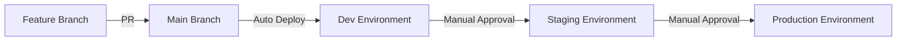

# Infrastructure as Code Best Practices

## 🎯 Overview

This guide provides production-ready best practices for Infrastructure as Code (IaC) with Terraform, Bicep, and GitOps. These practices are based on real-world enterprise implementations and industry standards.

## 📋 General IaC Principles

### 1. Declarative Over Imperative
```hcl
# ✅ Good: Declarative
resource "azurerm_resource_group" "main" {
  name     = "rg-${var.environment}-${var.location}"
  location = var.location
}

# ❌ Avoid: Imperative scripts
# az group create --name rg-prod-eastus --location eastus
```

### 2. Version Everything
```yaml
# .github/workflows/deploy.yml
- name: Setup Terraform
  uses: hashicorp/setup-terraform@v3
  with:
    terraform_version: '1.6.0'  # Pin versions

# providers.tf
terraform {
  required_version = ">= 1.6.0"
  required_providers {
    azurerm = {
      source  = "hashicorp/azurerm"
      version = "~> 3.85.0"  # Use pessimistic constraint
    }
  }
}
```

### 3. Idempotency is Key
- Running IaC multiple times should produce the same result
- Avoid random values without proper lifecycle management
- Use data sources for existing resources

## 🔧 Terraform Best Practices

### 1. Module Structure
```
modules/
├── network/
│   ├── main.tf        # Resource definitions
│   ├── variables.tf   # Input variables
│   ├── outputs.tf     # Output values
│   ├── versions.tf    # Provider requirements
│   └── README.md      # Module documentation
```

### 2. Naming Conventions
```hcl
# Consistent resource naming
locals {
  # Use a naming convention module
  resource_prefix = "${var.org}-${var.environment}-${var.location}"
  
  # Common tags for all resources
  common_tags = {
    Environment  = var.environment
    ManagedBy    = "Terraform"
    LastUpdated  = timestamp()
    CostCenter   = var.cost_center
    Owner        = var.owner_email
  }
}

# Apply naming convention
resource "azurerm_storage_account" "main" {
  name = "${replace(local.resource_prefix, "-", "")}st"  # Storage accounts don't allow hyphens
  # ...
}
```

### 3. State Management
```hcl
# backend.tf - Separate backend configuration
terraform {
  backend "azurerm" {
    # Use partial configuration
    # Specify during init: terraform init -backend-config=backend.hcl
  }
}

# backend.hcl (not committed to Git)
resource_group_name  = "rg-terraform-state"
storage_account_name = "tfstateprod12345"
container_name       = "tfstate"
key                  = "prod/terraform.tfstate"
```

### 4. Sensitive Data Handling
```hcl
# ✅ Good: Use Key Vault
data "azurerm_key_vault_secret" "db_password" {
  name         = "database-password"
  key_vault_id = azurerm_key_vault.main.id
}

# ❌ Avoid: Hardcoded secrets
variable "db_password" {
  default = "SuperSecret123!"  # Never do this!
}

# ✅ Good: Mark outputs as sensitive
output "connection_string" {
  value     = "Server=${azurerm_sql_server.main.fully_qualified_domain_name};Password=${random_password.sql.result}"
  sensitive = true
}
```

### 5. Resource Dependencies
```hcl
# Explicit dependencies when needed
resource "azurerm_application_insights" "main" {
  # ...
  
  depends_on = [
    azurerm_log_analytics_workspace.main
  ]
}

# Use data sources for external dependencies
data "azurerm_subnet" "existing" {
  name                 = "existing-subnet"
  virtual_network_name = "existing-vnet"
  resource_group_name  = "existing-rg"
}
```

## 🔷 Bicep Best Practices

### 1. Parameter Organization
```bicep
// Parameters grouped by purpose
@description('Environment Configuration')
@allowed(['dev', 'staging', 'prod'])
param environment string

@description('Resource Location')
param location string = resourceGroup().location

@description('Application Configuration')
@minLength(3)
@maxLength(24)
param appName string

@description('Security Configuration')
@secure()
param sqlAdminPassword string
```

### 2. Conditional Deployments
```bicep
// Deploy resources based on environment
resource stagingSlot 'Microsoft.Web/sites/slots@2023-01-01' = if (environment == 'prod') {
  parent: webApp
  name: 'staging'
  properties: {
    // Staging slot configuration
  }
}

// Use ternary for property values
resource appServicePlan 'Microsoft.Web/serverfarms@2023-01-01' = {
  name: 'asp-${appName}'
  sku: {
    name: environment == 'prod' ? 'P1v3' : 'B1'
  }
}
```

### 3. Module Usage
```bicep
// main.bicep
module networkModule 'modules/network.bicep' = {
  name: 'network-deployment'
  params: {
    vnetName: 'vnet-${environment}'
    addressPrefix: '10.0.0.0/16'
    subnets: [
      {
        name: 'subnet-web'
        addressPrefix: '10.0.1.0/24'
      }
      {
        name: 'subnet-app'
        addressPrefix: '10.0.2.0/24'
      }
    ]
  }
}

// Reference module outputs
resource webApp 'Microsoft.Web/sites@2023-01-01' = {
  name: 'app-${appName}'
  properties: {
    virtualNetworkSubnetId: networkModule.outputs.subnetIds['subnet-web']
  }
}
```

## 🔄 GitOps Best Practices

### 1. Branch Strategy
```yaml
# .github/branch-protection.yml
main:
  protection_rules:
    - require_pull_request_reviews:
        required_approving_review_count: 2
    - require_status_checks:
        contexts:
          - "Terraform Validate"
          - "Security Scan"
          - "Policy Check"
    - enforce_admins: true
    - restrict_who_can_push:
        teams: ["infrastructure-team"]
```

### 2. Environment Promotion


### 3. PR Automation
```yaml
# .github/workflows/pr-automation.yml
- name: Add Labels
  uses: actions/labeler@v4
  with:
    repo-token: "${{ secrets.GITHUB_TOKEN }}"

- name: Size Label
  uses: codelytv/pr-size-labeler@v1
  with:
    GITHUB_TOKEN: ${{ secrets.GITHUB_TOKEN }}
    xs_label: 'size/xs'
    xs_max_size: '10'
    s_label: 'size/s'
    s_max_size: '100'
```

## 🔐 Security Best Practices

### 1. Least Privilege Access
```hcl
# Service principal with minimal permissions
resource "azurerm_role_assignment" "github_actions" {
  scope                = azurerm_resource_group.main.id
  role_definition_name = "Contributor"  # Not Owner
  principal_id         = azurerm_user_assigned_identity.github_actions.principal_id
}
```

### 2. Network Security
```bicep
// Default deny all, explicitly allow required
resource nsg 'Microsoft.Network/networkSecurityGroups@2023-09-01' = {
  name: 'nsg-${appName}'
  properties: {
    securityRules: [
      {
        name: 'DenyAllInbound'
        properties: {
          priority: 4096
          direction: 'Inbound'
          access: 'Deny'
          protocol: '*'
          sourcePortRange: '*'
          sourceAddressPrefix: '*'
          destinationPortRange: '*'
          destinationAddressPrefix: '*'
        }
      }
      // Add specific allow rules above default deny
    ]
  }
}
```

### 3. Encryption Everything
```hcl
# Storage encryption
resource "azurerm_storage_account" "main" {
  # ...
  
  blob_properties {
    delete_retention_policy {
      days = 30
    }
  }
  
  encryption {
    key_vault_key_id = azurerm_key_vault_key.storage.id
    services {
      blob = true
      file = true
    }
  }
}

# Database encryption
resource "azurerm_mssql_database" "main" {
  # ...
  transparent_data_encryption_enabled = true
}
```

## 💰 Cost Optimization

### 1. Resource Tagging
```hcl
# Comprehensive tagging strategy
locals {
  mandatory_tags = {
    Environment     = var.environment
    CostCenter      = var.cost_center
    Owner          = var.owner_email
    Department     = var.department
    Project        = var.project_name
    AutoShutdown   = var.environment != "prod" ? "true" : "false"
    ExpirationDate = var.environment == "dev" ? timeadd(timestamp(), "720h") : "none"
  }
}
```

### 2. Auto-Shutdown for Non-Production
```bicep
// Auto-shutdown for dev/test resources
resource autoShutdown 'Microsoft.DevTestLab/schedules@2018-09-15' = if (environment != 'prod') {
  name: 'shutdown-computevm-${vmName}'
  location: location
  properties: {
    status: 'Enabled'
    taskType: 'ComputeVmShutdownTask'
    dailyRecurrence: {
      time: '1900'  // 7 PM
    }
    timeZoneId: 'UTC'
    targetResourceId: vm.id
  }
}
```

### 3. Right-Sizing
```hcl
# Environment-specific sizing
variable "vm_size_map" {
  default = {
    dev     = "Standard_B2s"     # Burstable, low cost
    staging = "Standard_D2s_v3"  # General purpose
    prod    = "Standard_D4s_v3"  # Production workload
  }
}

resource "azurerm_linux_virtual_machine" "main" {
  size = var.vm_size_map[var.environment]
  # ...
}
```

## 📊 Monitoring and Observability

### 1. Deployment Tracking
```yaml
# Add deployment annotations
- name: Create Deployment Marker
  run: |
    az monitor app-insights component update \
      --app ${{ env.APP_INSIGHTS_NAME }} \
      --resource-group ${{ env.RESOURCE_GROUP }} \
      --set-annotation "Deployment" \
        "Version=${{ github.sha }}" \
        "Environment=${{ matrix.environment }}" \
        "Timestamp=$(date -u +%Y-%m-%dT%H:%M:%SZ)"
```

### 2. Resource Health Monitoring
```bicep
// Configure alerts for resource health
resource healthAlert 'Microsoft.Insights/activityLogAlerts@2020-10-01' = {
  name: 'health-alert-${appName}'
  location: 'global'
  properties: {
    scopes: [
      resourceGroup().id
    ]
    condition: {
      allOf: [
        {
          field: 'category'
          equals: 'ResourceHealth'
        }
        {
          anyOf: [
            {
              field: 'properties.currentHealthStatus'
              equals: 'Degraded'
            }
            {
              field: 'properties.currentHealthStatus'
              equals: 'Unavailable'
            }
          ]
        }
      ]
    }
    actions: {
      actionGroups: [
        {
          actionGroupId: actionGroup.id
        }
      ]
    }
  }
}
```

## 🔄 Disaster Recovery

### 1. Backup State Files
```bash
#!/bin/bash
# backup-state.sh - Backup Terraform state files

STORAGE_ACCOUNT="tfstateprod"
CONTAINER="tfstate"
BACKUP_CONTAINER="tfstate-backups"
DATE=$(date +%Y%m%d-%H%M%S)

# Create backup
az storage blob copy start \
  --source-account-name $STORAGE_ACCOUNT \
  --source-container $CONTAINER \
  --source-blob "terraform.tfstate" \
  --destination-container $BACKUP_CONTAINER \
  --destination-blob "terraform.tfstate.$DATE"
```

### 2. Multi-Region Considerations
```hcl
# Deploy to multiple regions for DR
variable "regions" {
  default = {
    primary   = "eastus2"
    secondary = "westus2"
  }
}

module "primary_region" {
  source   = "./modules/regional-deployment"
  location = var.regions.primary
  # ...
}

module "secondary_region" {
  source   = "./modules/regional-deployment"
  location = var.regions.secondary
  # ...
}
```

## 📝 Documentation Standards

### 1. Self-Documenting Code
```hcl
# Every module should have a README
/**
 * # Network Module
 *
 * This module creates a standard network topology including:
 * - Virtual Network with configurable address space
 * - Subnets for web, app, and data tiers
 * - Network Security Groups with baseline rules
 * - Route tables for custom routing
 *
 * ## Usage
 *
 * ```hcl
 * module "network" {
 *   source = "./modules/network"
 *   
 *   resource_group_name = azurerm_resource_group.main.name
 *   location           = var.location
 *   address_space      = ["10.0.0.0/16"]
 * }
 * ```
 */
```

### 2. Change Documentation
```yaml
# Every PR should include
PR Description:
  - What: Clear description of changes
  - Why: Business justification
  - Testing: How it was tested
  - Rollback: How to rollback if needed
  - Dependencies: Any dependent changes
```

## ✅ Validation Checklist

Before deploying any IaC:

- [ ] Code formatted (`terraform fmt`, `bicep format`)
- [ ] Validation passed (`terraform validate`, `az bicep build`)
- [ ] Security scan clean (Checkov, tfsec)
- [ ] Cost estimate reviewed
- [ ] Documentation updated
- [ ] Tests passed
- [ ] Peer review completed
- [ ] Rollback plan documented

## 🚀 Continuous Improvement

1. **Regular Reviews**: Monthly IaC code reviews
2. **Update Dependencies**: Quarterly provider updates
3. **Security Audits**: Bi-annual security reviews
4. **Cost Optimization**: Monthly cost analysis
5. **Automation Enhancement**: Continuously improve pipelines

---

*Remember: Good IaC is like good code - clean, tested, documented, and maintainable!*
