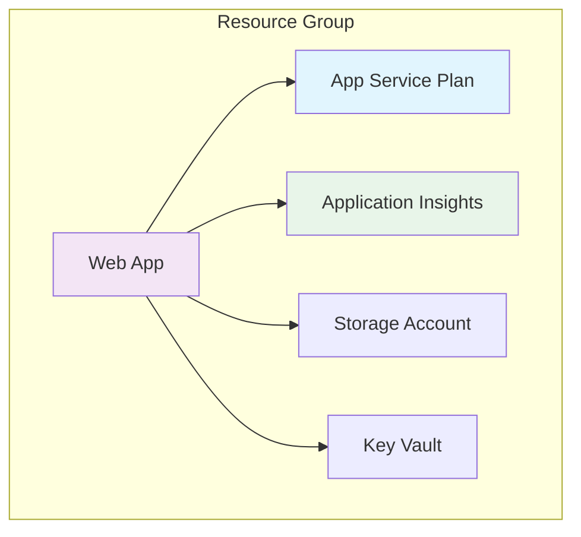
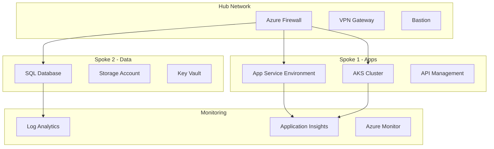

# Module 13: Infrastructure as Code Deployment Guide

## 🚀 Overview

This guide provides detailed instructions for deploying infrastructure using Azure Bicep and automating deployments with GitHub Actions. Learn how to manage cloud resources declaratively and implement GitOps practices.

## 📋 Table of Contents

1. [Prerequisites](#prerequisites)
2. [Environment Setup](#environment-setup)
3. [Exercise Deployments](#exercise-deployments)
4. [Production Patterns](#production-patterns)
5. [Monitoring & Validation](#monitoring--validation)
6. [Troubleshooting](#troubleshooting)
7. [Cost Management](#cost-management)

## Prerequisites

Before deploying any infrastructure:

```bash
# Install Azure CLI
brew install azure-cli  # macOS
# or
curl -sL https://aka.ms/InstallAzureCLIDeb | sudo bash  # Linux

# Install Bicep
az bicep install

# Verify installations
az --version
az bicep version

# Login to Azure
az login

# Set default subscription
az account set --subscription "Your-Subscription-Name"
```

## Environment Setup

### 1. GitHub Repository Setup

```bash
# Clone your repository
git clone https://github.com/yourusername/infrastructure-repo.git
cd infrastructure-repo

# Create branch structure
git checkout -b main
git checkout -b develop
git checkout -b feature/initial-infrastructure
```

### 2. GitHub Secrets Configuration

Navigate to Settings → Secrets → Actions and add:

```yaml
AZURE_CREDENTIALS: # Service Principal JSON
AZURE_SUBSCRIPTION_ID: # Your subscription ID
AZURE_TENANT_ID: # Your tenant ID
RESOURCE_GROUP_NAME: # Target resource group
```

### 3. Service Principal Creation

```bash
# Create service principal
az ad sp create-for-rbac --name "github-actions-sp" \
  --role contributor \
  --scopes /subscriptions/{subscription-id} \
  --sdk-auth

# Save the output as AZURE_CREDENTIALS secret
```

## Exercise Deployments

### Exercise 1: Bicep Basics

#### Local Deployment

```bash
# Navigate to exercise
cd exercises/exercise1-bicep-basics

# Deploy using Azure CLI
az deployment group create \
  --resource-group rg-module13-exercise1 \
  --template-file solution/main.bicep \
  --parameters solution/parameters.dev.json

# Validate deployment
az deployment group validate \
  --resource-group rg-module13-exercise1 \
  --template-file solution/main.bicep \
  --parameters solution/parameters.dev.json
```

#### Architecture



### Exercise 2: GitOps Automation

#### GitHub Actions Workflow

```yaml
name: Deploy Infrastructure

on:
  push:
    branches: [ main, develop ]
  pull_request:
    branches: [ main ]

env:
  BICEP_FILE: './main.bicep'
  PARAMETERS_FILE: './parameters.json'

jobs:
  validate:
    runs-on: ubuntu-latest
    steps:
      - uses: actions/checkout@v3
      
      - name: Azure Login
        uses: azure/login@v1
        with:
          creds: ${{ secrets.AZURE_CREDENTIALS }}
      
      - name: Validate Bicep
        run: |
          az deployment group validate \
            --resource-group ${{ secrets.RESOURCE_GROUP_NAME }} \
            --template-file ${{ env.BICEP_FILE }} \
            --parameters ${{ env.PARAMETERS_FILE }}
  
  deploy-dev:
    if: github.ref == 'refs/heads/develop'
    needs: validate
    runs-on: ubuntu-latest
    environment: development
    steps:
      - uses: actions/checkout@v3
      
      - name: Azure Login
        uses: azure/login@v1
        with:
          creds: ${{ secrets.AZURE_CREDENTIALS }}
      
      - name: Deploy to Dev
        run: |
          az deployment group create \
            --resource-group ${{ secrets.RESOURCE_GROUP_NAME }}-dev \
            --template-file ${{ env.BICEP_FILE }} \
            --parameters ${{ env.PARAMETERS_FILE }} \
            --parameters environmentName=dev
  
  deploy-prod:
    if: github.ref == 'refs/heads/main'
    needs: validate
    runs-on: ubuntu-latest
    environment: production
    steps:
      - uses: actions/checkout@v3
      
      - name: Azure Login
        uses: azure/login@v1
        with:
          creds: ${{ secrets.AZURE_CREDENTIALS }}
      
      - name: Deploy to Production
        run: |
          az deployment group create \
            --resource-group ${{ secrets.RESOURCE_GROUP_NAME }}-prod \
            --template-file ${{ env.BICEP_FILE }} \
            --parameters ${{ env.PARAMETERS_FILE }} \
            --parameters environmentName=prod
```

### Exercise 3: Enterprise Infrastructure

#### Multi-Module Deployment

```bash
# Deploy networking module
az deployment sub create \
  --location westeurope \
  --template-file modules/networking/main.bicep \
  --parameters @modules/networking/parameters.json

# Deploy compute module
az deployment group create \
  --resource-group rg-compute \
  --template-file modules/compute/main.bicep \
  --parameters @modules/compute/parameters.json

# Deploy monitoring module
az deployment group create \
  --resource-group rg-monitoring \
  --template-file modules/monitoring/main.bicep \
  --parameters @modules/monitoring/parameters.json
```

#### Enterprise Architecture



## Production Patterns

### 1. Module Organization

```
infrastructure/
├── modules/
│   ├── networking/
│   │   ├── main.bicep
│   │   ├── README.md
│   │   └── parameters.json
│   ├── compute/
│   │   ├── main.bicep
│   │   ├── README.md
│   │   └── parameters.json
│   └── monitoring/
│       ├── main.bicep
│       ├── README.md
│       └── parameters.json
├── environments/
│   ├── dev/
│   │   └── main.parameters.json
│   ├── staging/
│   │   └── main.parameters.json
│   └── prod/
│       └── main.parameters.json
└── main.bicep
```

### 2. Parameterization Strategy

```bicep
// main.bicep
@description('Environment name')
@allowed([
  'dev'
  'staging'
  'prod'
])
param environmentName string

@description('Location for all resources')
param location string = resourceGroup().location

@description('SKU configuration per environment')
var skuConfig = {
  dev: {
    appServicePlan: 'B1'
    storageAccount: 'Standard_LRS'
    sqlDatabase: 'Basic'
  }
  staging: {
    appServicePlan: 'S1'
    storageAccount: 'Standard_GRS'
    sqlDatabase: 'S0'
  }
  prod: {
    appServicePlan: 'P1v2'
    storageAccount: 'Standard_RAGRS'
    sqlDatabase: 'S2'
  }
}

var currentConfig = skuConfig[environmentName]
```

### 3. Deployment Pipeline

```yaml
# .github/workflows/infrastructure.yml
name: Infrastructure Deployment

on:
  workflow_dispatch:
    inputs:
      environment:
        description: 'Target environment'
        required: true
        type: choice
        options:
          - dev
          - staging
          - prod

jobs:
  plan:
    runs-on: ubuntu-latest
    outputs:
      changes: ${{ steps.plan.outputs.changes }}
    steps:
      - uses: actions/checkout@v3
      
      - name: Azure Login
        uses: azure/login@v1
        with:
          creds: ${{ secrets.AZURE_CREDENTIALS }}
      
      - name: Create Deployment Plan
        id: plan
        run: |
          az deployment group what-if \
            --resource-group rg-${{ inputs.environment }} \
            --template-file main.bicep \
            --parameters environments/${{ inputs.environment }}/main.parameters.json \
            --output json > plan.json
          
          echo "changes=$(cat plan.json)" >> $GITHUB_OUTPUT
  
  deploy:
    needs: plan
    runs-on: ubuntu-latest
    environment: ${{ inputs.environment }}
    steps:
      - uses: actions/checkout@v3
      
      - name: Show Plan
        run: echo "${{ needs.plan.outputs.changes }}"
      
      - name: Azure Login
        uses: azure/login@v1
        with:
          creds: ${{ secrets.AZURE_CREDENTIALS }}
      
      - name: Deploy Infrastructure
        run: |
          az deployment group create \
            --resource-group rg-${{ inputs.environment }} \
            --template-file main.bicep \
            --parameters environments/${{ inputs.environment }}/main.parameters.json \
            --name deploy-$(date +%Y%m%d%H%M%S)
```

## Monitoring & Validation

### 1. Deployment Validation

```bash
# Pre-deployment validation
az deployment group validate \
  --resource-group rg-production \
  --template-file main.bicep \
  --parameters @parameters.json

# What-if analysis
az deployment group what-if \
  --resource-group rg-production \
  --template-file main.bicep \
  --parameters @parameters.json
```

### 2. Post-Deployment Tests

```bash
# Test infrastructure endpoints
./scripts/test-infrastructure.sh

# Validate resource configurations
az resource list --resource-group rg-production \
  --query "[].{name:name, type:type, location:location}" \
  --output table

# Check resource health
az resource health list --resource-group rg-production
```

### 3. Monitoring Setup

```bicep
// monitoring.bicep
resource logAnalytics 'Microsoft.OperationalInsights/workspaces@2021-06-01' = {
  name: 'law-${environmentName}'
  location: location
  properties: {
    sku: {
      name: 'PerGB2018'
    }
    retentionInDays: 30
  }
}

resource appInsights 'Microsoft.Insights/components@2020-02-02' = {
  name: 'ai-${environmentName}'
  location: location
  kind: 'web'
  properties: {
    Application_Type: 'web'
    WorkspaceResourceId: logAnalytics.id
  }
}
```

## Troubleshooting

### Common Issues

1. **Deployment Failures**
   ```bash
   # Get deployment logs
   az deployment group show \
     --resource-group rg-production \
     --name deployment-name \
     --query properties.error
   
   # List deployment operations
   az deployment operation group list \
     --resource-group rg-production \
     --name deployment-name
   ```

2. **Permission Issues**
   ```bash
   # Check service principal permissions
   az role assignment list \
     --assignee <service-principal-id> \
     --output table
   ```

3. **Resource Conflicts**
   ```bash
   # Check existing resources
   az resource list --resource-group rg-production
   
   # Force update mode
   az deployment group create \
     --mode Complete \
     --confirm-with-what-if
   ```

## Cost Management

### 1. Cost Estimation

```bash
# Estimate costs before deployment
az consumption usage list \
  --start-date 2024-01-01 \
  --end-date 2024-01-31 \
  --query "[?contains(instanceName, 'module13')]"
```

### 2. Budget Alerts

```bicep
resource budget 'Microsoft.Consumption/budgets@2021-10-01' = {
  name: 'budget-${environmentName}'
  properties: {
    category: 'Cost'
    amount: environmentName == 'prod' ? 1000 : 100
    timeGrain: 'Monthly'
    timePeriod: {
      startDate: '2024-01-01'
    }
    notifications: {
      Actual_GreaterThan_80_Percent: {
        enabled: true
        operator: 'GreaterThan'
        threshold: 80
        contactEmails: [
          'admin@example.com'
        ]
      }
    }
  }
}
```

### 3. Resource Tagging

```bicep
var commonTags = {
  Environment: environmentName
  Module: 'Module13'
  ManagedBy: 'Bicep'
  CostCenter: 'Training'
  Owner: 'DevOps Team'
}

resource webApp 'Microsoft.Web/sites@2021-03-01' = {
  name: appName
  location: location
  tags: commonTags
  properties: {
    // ...
  }
}
```

## Best Practices

1. **Version Control**
   - Tag infrastructure releases
   - Document breaking changes
   - Use semantic versioning

2. **Security**
   - Use Key Vault for secrets
   - Enable managed identities
   - Implement network isolation

3. **Reliability**
   - Deploy to multiple regions
   - Implement backup strategies
   - Use availability zones

4. **Performance**
   - Right-size resources
   - Enable autoscaling
   - Optimize network routes

---

💡 **Remember**: Infrastructure as Code is about consistency, repeatability, and automation. Always validate before deploying and maintain proper documentation! 