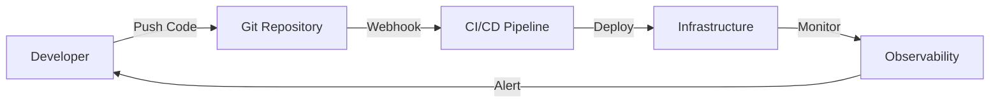

# Module 13: Infrastructure as Code Concepts

## What is Infrastructure as Code?

Infrastructure as Code (IaC) is the practice of managing and provisioning infrastructure through machine-readable definition files, rather than physical hardware configuration or interactive configuration tools.

### Key Principles

1. **Declarative Configuration**
   - Describe the desired end state
   - Let the tool figure out how to achieve it
   - Focus on "what" not "how"

2. **Version Control**
   - Infrastructure definitions in Git
   - Track changes over time
   - Enable collaboration and review

3. **Idempotency**
   - Running the same configuration multiple times produces the same result
   - Safe to re-apply configurations
   - Predictable outcomes

4. **Immutability**
   - Replace rather than modify
   - Avoid configuration drift
   - Ensure consistency

## Azure Bicep

### What is Bicep?

Bicep is a domain-specific language (DSL) for deploying Azure resources declaratively. It aims to drastically simplify the authoring experience with a cleaner syntax compared to ARM templates.

### Key Features

- **Simple Syntax**: Cleaner and more concise than JSON
- **Type Safety**: Built-in validation and IntelliSense
- **Modularity**: Reusable modules for common patterns
- **Day 0 Support**: All Azure resource types supported

### Bicep vs ARM Templates

```bicep
// Bicep - Clean and readable
resource storageAccount 'Microsoft.Storage/storageAccounts@2021-04-01' = {
  name: 'mystorageaccount'
  location: 'eastus'
  sku: {
    name: 'Standard_LRS'
  }
  kind: 'StorageV2'
}
```

vs

```json
// ARM Template - Verbose JSON
{
  "type": "Microsoft.Storage/storageAccounts",
  "apiVersion": "2021-04-01",
  "name": "mystorageaccount",
  "location": "eastus",
  "sku": {
    "name": "Standard_LRS"
  },
  "kind": "StorageV2"
}
```

## Terraform

### What is Terraform?

Terraform is an open-source infrastructure as code tool created by HashiCorp. It enables you to define both cloud and on-premises resources in human-readable configuration files.

### Key Features

- **Multi-Cloud**: Support for multiple providers
- **State Management**: Tracks resource state
- **Plan & Apply**: Preview changes before applying
- **Modular**: Reusable modules and workspaces

### Terraform Workflow

1. **Write**: Define infrastructure in HCL
2. **Plan**: Preview changes
3. **Apply**: Provision infrastructure
4. **Destroy**: Clean up resources

### State Management

Terraform maintains state to:
- Map configuration to real resources
- Track metadata
- Improve performance
- Enable collaboration

## GitOps

### What is GitOps?

GitOps is a way of implementing Continuous Deployment for cloud native applications. It focuses on a developer-centric experience when operating infrastructure.

### Core Components

1. **Git Repository**: Single source of truth
2. **Automated Pipelines**: Deploy on commit
3. **Monitoring & Alerting**: Detect drift
4. **Rollback Capability**: Easy recovery

### GitOps Workflow



## Comparing IaC Tools

| Feature | Bicep | Terraform | ARM Templates |
|---------|-------|-----------|---------------|
| **Syntax** | Simple DSL | HCL | JSON |
| **Multi-Cloud** | Azure only | Yes | Azure only |
| **State Management** | Implicit | Explicit | Implicit |
| **Modularity** | Yes | Yes | Limited |
| **Community** | Growing | Large | Established |
| **Learning Curve** | Low | Medium | High |

## Best Practices

### 1. Code Organization
```
infrastructure/
├── modules/
│   ├── network/
│   ├── compute/
│   └── storage/
├── environments/
│   ├── dev/
│   ├── staging/
│   └── prod/
└── policies/
```

### 2. Security
- Never commit secrets
- Use Key Vault references
- Implement least privilege
- Enable audit logging

### 3. Testing
- Validate syntax
- Test in isolated environments
- Use policy as code
- Implement smoke tests

### 4. Documentation
- Document module interfaces
- Provide usage examples
- Maintain changelog
- Include architecture diagrams

## AI and IaC

### How AI Accelerates IaC

1. **Code Generation**
   - Generate boilerplate code
   - Suggest best practices
   - Complete complex configurations

2. **Error Detection**
   - Identify security issues
   - Spot misconfigurations
   - Suggest fixes

3. **Documentation**
   - Generate comments
   - Create README files
   - Explain complex logic

### Copilot Best Practices for IaC

1. **Be Specific**
   ```
   # Good: Create an Azure Storage Account with private endpoints and encryption
   # Bad: Create storage
   ```

2. **Provide Context**
   ```
   # This module creates networking resources for a three-tier application
   # including VNet, subnets, NSGs, and Application Gateway
   ```

3. **Iterate**
   - Start simple
   - Add complexity gradually
   - Refine based on suggestions

## Summary

Infrastructure as Code transforms infrastructure management from manual, error-prone processes to automated, reliable, and repeatable workflows. By combining IaC with AI assistance, you can:

- 🚀 Accelerate development
- 🔒 Improve security
- 📊 Enhance consistency
- 🔄 Enable rapid iteration
- 👥 Facilitate collaboration

The key is choosing the right tool for your needs and following established best practices while leveraging AI to boost productivity.