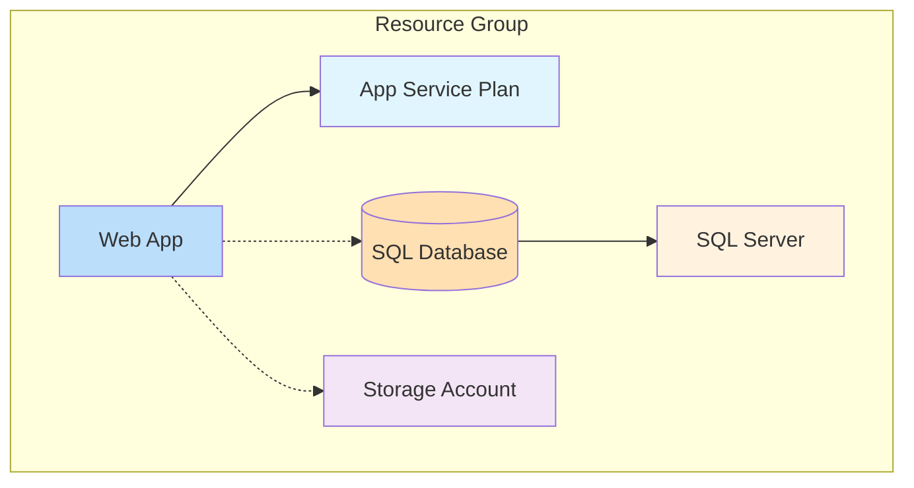

# Exercise 1: Bicep Fundamentals (⭐)

## 🎯 Exercise Overview

**Duration:** 30-45 minutes  
**Difficulty:** ⭐ Foundation  
**Success Rate:** 95%

In this exercise, you'll learn the fundamentals of Azure Bicep by creating your first Infrastructure as Code template. You'll deploy a web application with a database using declarative configuration and AI assistance.

### What You'll Build

- Azure App Service Plan
- Web App with application settings
- Azure SQL Database with server
- Storage Account for static assets
- Proper networking and security configurations

### Learning Objectives

By completing this exercise, you will:
- Understand Bicep syntax and structure
- Use GitHub Copilot for IaC development
- Deploy resources with parameters
- Implement security best practices
- Manage outputs and dependencies

## 🏗️ Architecture



## 📋 Prerequisites

- Azure subscription with contributor access
- Azure CLI installed and logged in
- VS Code with Bicep extension
- GitHub Copilot enabled
- Basic understanding of Azure resources

## 🚀 Getting Started

1. **Navigate to the exercise:**
   ```bash
   cd exercises/exercise1-bicep-basics
   ```

2. **Review the starter template:**
   ```bash
   cd starter
   code main.bicep
   ```

3. **Follow the instructions:**
   - Part 1: Basic resource definitions
   - Part 2: Parameters and security
   - Part 3: Deployment and validation

## 🎯 Success Criteria

You've successfully completed this exercise when:
- ✅ All resources deploy without errors
- ✅ Web app is accessible via HTTPS
- ✅ Database connection is secure
- ✅ Parameters are properly utilized
- ✅ Outputs show resource endpoints

## 🔍 Tips for Success

1. **Use Copilot Effectively:**
   ```bicep
   // Type this comment and let Copilot help:
   // Create an App Service Plan with Standard tier
   ```

2. **Start Simple:**
   - Deploy one resource at a time
   - Test incrementally
   - Add complexity gradually

3. **Security First:**
   - Never hardcode secrets
   - Use secure parameters
   - Enable HTTPS only

## 📚 Resources

- [Bicep Documentation](https://learn.microsoft.com/azure/azure-resource-manager/bicep/)
- [Bicep Playground](https://bicepdemo.z22.web.core.windows.net/)
- [Azure Quickstart Templates](https://github.com/Azure/azure-quickstart-templates)

## ⚡ Common Issues

- **Naming conflicts**: Use unique names with parameters
- **Region availability**: Check service availability in your region
- **Quota limits**: Ensure you have sufficient quota

## 🎉 Next Steps

After completing this exercise:
1. Try modifying the template to add more features
2. Experiment with modules for reusability
3. Move on to Exercise 2 for Terraform multi-environment setups

---

**Need help?** Check the [troubleshooting guide](../../troubleshooting.md) or review the solution in the `solution/` directory.