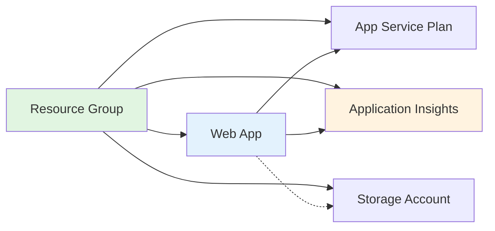

# Exercise 1: Deploy Azure Resources with Bicep (⭐ Easy)

## 🎯 Exercise Overview

In this exercise, you'll learn the fundamentals of Azure Bicep by creating and deploying a web application infrastructure. You'll use GitHub Copilot to accelerate your IaC development and understand how AI can help write better infrastructure code.

**Duration**: 30-45 minutes  
**Difficulty**: ⭐ Easy  
**Success Rate**: 95%

## 🎓 Learning Objectives

By completing this exercise, you will:
- Write your first Bicep template with AI assistance
- Understand Bicep syntax and structure
- Deploy resources to Azure using Bicep
- Use parameters for environment-specific configurations
- Leverage Copilot for IaC development

## 📋 Scenario

Your team needs a simple web application infrastructure consisting of:
- An App Service Plan (hosting environment)
- A Web App (application host)
- A Storage Account (for static assets)
- Application Insights (for monitoring)

You'll create this infrastructure using Bicep with help from GitHub Copilot.

## 🏗️ Architecture



## 🛠️ Prerequisites Check

Before starting, ensure you have:
```bash
# Check Azure CLI and login status
az account show

# Check Bicep installation
az bicep version

# Ensure you're in the correct directory
cd exercises/exercise1-bicep-basics
```

## 📝 Part 1: Create Basic Bicep Template

### Step 1: Initialize Your Bicep File

Create a new file called `main.bicep` in the exercise directory.

**💡 Copilot Prompt Suggestion:**
```bicep
// Create a Bicep template that deploys:
// - App Service Plan (Linux, B1 tier for dev)
// - Web App running Python 3.11
// - Storage Account (Standard_LRS)
// - Application Insights
// Use parameters for environment-specific values
// Add proper tags for resource management
```

**Expected Copilot Output:**
```bicep
// main.bicep
@description('The environment name (dev, staging, prod)')
@allowed([
  'dev'
  'staging'
  'prod'
])
param environment string = 'dev'

@description('The Azure region for resources')
param location string = resourceGroup().location

@description('Base name for resources')
@minLength(3)
@maxLength(24)
param appName string

// Variables for resource names
var appServicePlanName = 'asp-${appName}-${environment}'
var webAppName = 'app-${appName}-${environment}'
var storageAccountName = toLower('st${appName}${environment}')
var appInsightsName = 'ai-${appName}-${environment}'

// Tags for all resources
var tags = {
  Environment: environment
  Application: appName
  ManagedBy: 'Bicep'
  Module: 'Module-13'
}

// App Service Plan
resource appServicePlan 'Microsoft.Web/serverfarms@2023-01-01' = {
  name: appServicePlanName
  location: location
  tags: tags
  sku: {
    name: environment == 'prod' ? 'P1v3' : 'B1'
    tier: environment == 'prod' ? 'PremiumV3' : 'Basic'
  }
  kind: 'linux'
  properties: {
    reserved: true
  }
}

// Web App
resource webApp 'Microsoft.Web/sites@2023-01-01' = {
  name: webAppName
  location: location
  tags: tags
  properties: {
    serverFarmId: appServicePlan.id
    siteConfig: {
      linuxFxVersion: 'PYTHON|3.11'
      appSettings: [
        {
          name: 'APPINSIGHTS_INSTRUMENTATIONKEY'
          value: appInsights.properties.InstrumentationKey
        }
        {
          name: 'APPLICATIONINSIGHTS_CONNECTION_STRING'
          value: appInsights.properties.ConnectionString
        }
        {
          name: 'STORAGE_CONNECTION_STRING'
          value: 'DefaultEndpointsProtocol=https;AccountName=${storageAccount.name};EndpointSuffix=${az.environment().suffixes.storage};AccountKey=${storageAccount.listKeys().keys[0].value}'
        }
      ]
    }
    httpsOnly: true
  }
}

// Storage Account
resource storageAccount 'Microsoft.Storage/storageAccounts@2023-01-01' = {
  name: storageAccountName
  location: location
  tags: tags
  sku: {
    name: 'Standard_LRS'
  }
  kind: 'StorageV2'
  properties: {
    minimumTlsVersion: 'TLS1_2'
    supportsHttpsTrafficOnly: true
    allowBlobPublicAccess: false
  }
}

// Application Insights
resource appInsights 'Microsoft.Insights/components@2020-02-02' = {
  name: appInsightsName
  location: location
  tags: tags
  kind: 'web'
  properties: {
    Application_Type: 'web'
    Request_Source: 'rest'
  }
}

// Outputs
output webAppUrl string = 'https://${webApp.properties.defaultHostName}'
output webAppName string = webApp.name
output storageAccountName string = storageAccount.name
output appInsightsInstrumentationKey string = appInsights.properties.InstrumentationKey
```

### Step 2: Create Parameter File

Now create a parameter file for the dev environment.

**💡 Copilot Prompt Suggestion:**
```json
// Create a Bicep parameter file for dev environment
// File: main.parameters.dev.json
// Include appName and any other required parameters
```

**Expected Copilot Output:**
```json
{
  "$schema": "https://schema.management.azure.com/schemas/2019-04-01/deploymentParameters.json#",
  "contentVersion": "1.0.0.0",
  "parameters": {
    "environment": {
      "value": "dev"
    },
    "appName": {
      "value": "workshop13"
    },
    "location": {
      "value": "eastus2"
    }
  }
}
```

### Step 3: Validate Your Template

Before deployment, validate your Bicep template:

```bash
# Build the Bicep template to check for errors
az bicep build --file main.bicep

# Validate the deployment
az deployment group validate \
  --resource-group rg-workshop-module13 \
  --template-file main.bicep \
  --parameters @main.parameters.dev.json
```

## 💡 Understanding the Template

Let's break down key Bicep concepts:

### Parameters
```bicep
@description('The environment name')
@allowed(['dev', 'staging', 'prod'])
param environment string = 'dev'
```
- `@description`: Documents the parameter
- `@allowed`: Restricts values to a list
- Default values make parameters optional

### Variables
```bicep
var appServicePlanName = 'asp-${appName}-${environment}'
```
- Variables compute values from parameters
- String interpolation with `${}`
- Follow Azure naming conventions

### Resources
```bicep
resource webApp 'Microsoft.Web/sites@2023-01-01' = {
  name: webAppName
  location: location
  properties: {
    serverFarmId: appServicePlan.id
  }
}
```
- Symbolic name for reference
- Resource type and API version
- Properties configure the resource
- Reference other resources with `.id`

### Outputs
```bicep
output webAppUrl string = 'https://${webApp.properties.defaultHostName}'
```
- Export values for use after deployment
- Access resource properties
- Useful for CI/CD pipelines