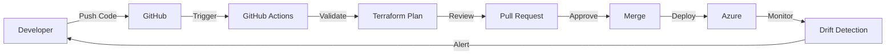

# Exercise 2: GitOps Automation

## 📋 Overview

This exercise teaches you how to implement GitOps principles for infrastructure automation. You'll create a multi-environment infrastructure deployment pipeline using Terraform, GitHub Actions, and GitOps best practices.

## 🎯 Learning Objectives

By completing this exercise, you will:

- ✅ Implement GitOps workflow for infrastructure
- ✅ Create multi-environment Terraform configurations
- ✅ Build reusable Terraform modules
- ✅ Set up automated CI/CD pipelines
- ✅ Configure environment-specific deployments
- ✅ Implement infrastructure validation
- ✅ Apply security and compliance checks
- ✅ Master Git-based infrastructure workflows

## 📁 Structure

```
exercise2-gitops-automation/
├── README.md                    # This file
├── instructions/                # Step-by-step guides
│   ├── part1.md                # GitOps fundamentals
│   └── part2.md                # Advanced automation
├── starter/                     # Starting templates
│   ├── main.tf                 # Main configuration
│   ├── variables.tf            # Variable definitions
│   ├── outputs.tf              # Output definitions
│   ├── environments/           # Environment configs
│   ├── modules/                # Terraform modules
│   ├── scripts/                # Helper scripts
│   └── .github/workflows/      # GitHub Actions
└── solution/                    # Complete implementation
    ├── main.tf                 # Complete main config
    ├── variables.tf            # All variables
    ├── outputs.tf              # All outputs
    ├── environments/           # Dev/Staging/Prod
    ├── modules/                # Reusable modules
    │   ├── network/           # Network module
    │   ├── webapp/            # Web app module
    │   └── database/          # Database module
    ├── scripts/                # Automation scripts
    └── .github/workflows/      # Complete pipelines
```

## 🚀 Getting Started

### Prerequisites

1. **Azure Subscription**: With appropriate permissions
2. **GitHub Account**: For repository and Actions
3. **Terraform**: Version 1.6.0 or later
   ```bash
   terraform --version
   ```
4. **Azure CLI**: Configured and authenticated
   ```bash
   az login
   ```
5. **Git**: For version control

### Quick Start

1. **Fork the repository** to your GitHub account

2. **Set up backend storage**:
   ```bash
   cd starter/scripts
   ./setup-backend.sh
   ```

3. **Configure GitHub secrets**:
   - `AZURE_CLIENT_ID`
   - `AZURE_CLIENT_SECRET`
   - `AZURE_SUBSCRIPTION_ID`
   - `AZURE_TENANT_ID`

4. **Start with development environment**:
   ```bash
   cd starter
   terraform init
   terraform plan -var-file=environments/dev/terraform.tfvars
   ```

## 📚 Exercise Parts

### Part 1: GitOps Fundamentals
- Set up Terraform backend
- Create modular infrastructure
- Implement environment separation
- Configure basic CI/CD

**Time**: ~45 minutes

### Part 2: Advanced Automation
- Add validation workflows
- Implement approval gates
- Configure drift detection
- Set up monitoring

**Time**: ~60 minutes

## 🎓 Key Concepts

### 1. **GitOps Principles**
- **Declarative**: Infrastructure defined in Git
- **Versioned**: All changes tracked
- **Automated**: Changes trigger deployments
- **Auditable**: Complete history available

### 2. **Terraform Modules**
```hcl
module "network" {
  source = "./modules/network"
  
  resource_group_name = azurerm_resource_group.main.name
  location           = var.location
  environment        = var.environment
}
```

### 3. **Environment Configuration**
```hcl
# environments/dev/terraform.tfvars
environment = "dev"
location    = "eastus2"

webapp_sku = {
  tier = "Basic"
  size = "B1"
}
```

### 4. **GitHub Actions Workflow**
```yaml
- name: Terraform Plan
  run: |
    terraform plan \
      -var-file=environments/${{ matrix.environment }}/terraform.tfvars \
      -out=tfplan
```

## 🏗️ Architecture

The solution deploys:

### Per Environment:
- **Virtual Network**: With subnets
- **Web App**: App Service with slots
- **Database**: Azure SQL Database
- **Storage**: For application data
- **Monitoring**: Application Insights

### Shared Resources:
- **Terraform Backend**: State storage
- **Key Vault**: Secrets management
- **Container Registry**: Docker images

## 📊 Success Criteria

- [ ] ✅ All Terraform modules validate
- [ ] ✅ CI/CD pipeline runs successfully
- [ ] ✅ Dev environment deploys automatically
- [ ] ✅ Staging requires approval
- [ ] ✅ Production has additional checks
- [ ] ✅ Infrastructure drift is detected
- [ ] ✅ Cost estimates are generated
- [ ] ✅ Security policies pass

## 🏆 Bonus Challenges

1. **Blue-Green Deployments**: Implement zero-downtime deployments
2. **Disaster Recovery**: Add multi-region support
3. **Cost Optimization**: Implement auto-shutdown
4. **Advanced Security**: Add WAF and DDoS protection
5. **Compliance**: Add policy as code with OPA

## 🛠️ Troubleshooting

### Common Issues

1. **Backend initialization fails**:
   ```bash
   # Re-run backend setup
   ./scripts/setup-backend.sh
   ```

2. **Permission errors**:
   - Check service principal permissions
   - Verify GitHub secrets

3. **Module version conflicts**:
   ```bash
   # Update modules
   terraform get -update
   ```

### Debug Commands

```bash
# Validate configuration
terraform validate

# Format check
terraform fmt -check -recursive

# View state
terraform state list

# Import existing resources
terraform import azurerm_resource_group.main /subscriptions/.../resourceGroups/...
```

## 🔄 GitOps Workflow



## 📖 Resources

- 📚 [GitOps Principles](https://www.gitops.tech/)
- 🔧 [Terraform Best Practices](https://www.terraform-best-practices.com/)
- 🚀 [GitHub Actions Documentation](https://docs.github.com/actions)
- 🏗️ [Azure Architecture Center](https://docs.microsoft.com/azure/architecture/)
- 📊 [Infrastructure as Code Patterns](https://www.hashicorp.com/resources/infrastructure-as-code-patterns)

## 🤝 Need Help?

1. Review the solution code for guidance
2. Check Terraform documentation
3. Use `terraform console` for testing
4. Enable debug logging: `export TF_LOG=DEBUG`

## ⏭️ Next Steps

After completing this exercise:
1. Implement the bonus challenges
2. Apply GitOps to your projects
3. Move on to [Exercise 3: Enterprise IaC](../exercise3-enterprise-iac/)
4. Explore advanced Terraform features

---

**Remember**: GitOps is about making infrastructure changes traceable, reviewable, and reversible. Every change should go through version control! 🚀
