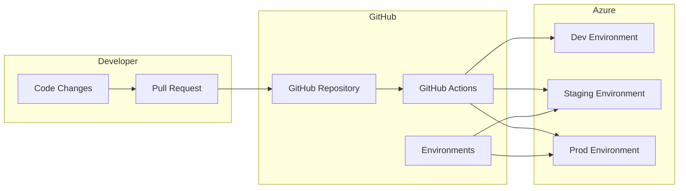

# Exercise 2: GitOps Automation (⭐⭐ Medium)

## Overview

In this exercise, you'll implement automated infrastructure deployments using GitHub Actions and GitOps principles. Learn how to create multi-environment pipelines with proper validation, testing, and approval gates.

## Learning Objectives

- Implement GitHub Actions workflows for IaC
- Create multi-environment deployment pipelines
- Configure deployment environments and secrets
- Implement validation and approval gates
- Apply GitOps best practices

## Instructions

The complete instructions for this exercise are divided into parts:

1. **Part 1**: [GitHub Actions Setup](./instructions/part1.md)
2. **Part 2**: [Multi-Environment Pipeline](./instructions/part2.md)

## Project Structure

```
exercise2-gitops-automation/
├── README.md          # This file
├── instructions/      # Step-by-step guides
│   ├── part1.md      # GitHub Actions setup
│   └── part2.md      # Pipeline implementation
├── starter/          # Starting templates
│   ├── .github/
│   │   └── workflows/
│   └── infrastructure/
└── solution/         # Complete solution
    ├── .github/
    │   └── workflows/
    └── infrastructure/
```

## Prerequisites

- Completed Exercise 1 or equivalent Bicep knowledge
- GitHub repository with Actions enabled
- Azure subscription and service principal
- Basic understanding of CI/CD concepts

## Quick Start

```bash
# Navigate to exercise directory
cd exercises/exercise2-gitops-automation

# Setup repository
git init
git remote add origin <your-repo-url>

# Configure secrets
# Add these in GitHub Settings → Secrets → Actions:
# - AZURE_CREDENTIALS
# - AZURE_SUBSCRIPTION_ID
# - AZURE_TENANT_ID

# Start with starter template
cd starter
```

## Duration

**Expected Time**: 45-60 minutes
- GitHub Actions Setup: 15 minutes
- Pipeline Development: 20 minutes
- Testing & Validation: 15 minutes
- Documentation: 10 minutes

## Key Features to Implement

### 1. Automated Validation
- Bicep linting on pull requests
- Security scanning with Checkov
- What-if deployment preview
- PR comment with changes

### 2. Environment Promotion
- Development → Staging → Production
- Automatic deployment to dev
- Manual approval for production
- Environment-specific parameters

### 3. Advanced Features
- Deployment rollback capability
- Integration with Azure Monitor
- Cost estimation before deployment
- Automated documentation updates

## Architecture



## Success Criteria

- [ ] PR validation workflow runs successfully
- [ ] Deployment pipeline deploys to all environments
- [ ] Manual approval works for production
- [ ] Rollback mechanism is functional
- [ ] All secrets are properly configured
- [ ] Documentation is updated

## Common Challenges

1. **Service Principal Permissions**
   - Ensure proper RBAC roles
   - Scope permissions correctly

2. **Environment Configuration**
   - Set up GitHub environments
   - Configure protection rules

3. **Secret Management**
   - Use GitHub Secrets properly
   - Reference secrets in workflows

## Tips

- Start with a simple workflow and add complexity
- Test locally with `act` tool when possible
- Use workflow dispatch for manual testing
- Monitor Actions logs for debugging
- Implement proper error handling

## Resources

- [GitHub Actions Documentation](https://docs.github.com/actions)
- [Azure Login Action](https://github.com/marketplace/actions/azure-login)
- [ARM Deploy Action](https://github.com/marketplace/actions/deploy-azure-resource-manager-arm-template)
- [GitHub Environments](https://docs.github.com/actions/deployment/environments)

---

**Ready to automate?** Start with [Part 1: GitHub Actions Setup](./instructions/part1.md)! 