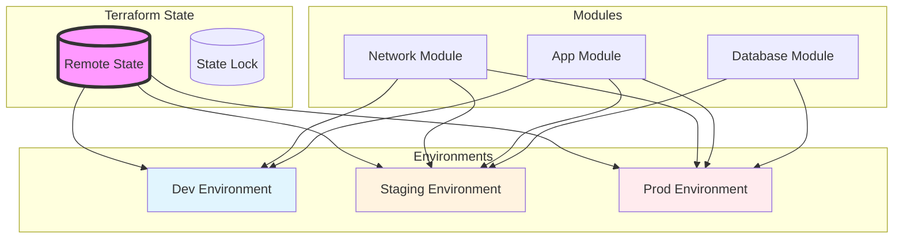

# Exercise 2: Terraform Multi-Environment (⭐⭐)

## 🎯 Exercise Overview

**Duration:** 45-60 minutes  
**Difficulty:** ⭐⭐ Intermediate  
**Success Rate:** 80%

In this exercise, you'll learn how to manage multiple environments (dev, staging, prod) using Terraform. You'll create reusable modules, implement remote state management, and use GitHub Copilot to accelerate your Terraform development.

### What You'll Build

- Terraform workspace structure for multiple environments
- Reusable modules for common infrastructure patterns
- Remote state management with Azure Storage
- Environment-specific configurations
- Automated deployment pipeline

### Learning Objectives

By completing this exercise, you will:
- Master Terraform modules and workspaces
- Implement secure remote state management
- Use variables and locals effectively
- Apply DRY (Don't Repeat Yourself) principles
- Leverage AI for Terraform development

## 🏗️ Architecture



## 📋 Prerequisites

- Completed Exercise 1 or equivalent Terraform knowledge
- Terraform CLI installed (>= 1.5.0)
- Azure subscription with contributor access
- VS Code with Terraform extension
- GitHub Copilot enabled

## 🚀 Getting Started

1. **Navigate to the exercise:**
   ```bash
   cd exercises/exercise2-terraform-multienv
   ```

2. **Review the starter structure:**
   ```bash
   tree starter/
   # Shows modular structure ready for implementation
   ```

3. **Follow the instructions:**
   - Part 1: Create reusable modules
   - Part 2: Implement environments
   - Part 3: Deploy and validate

## 🎯 Success Criteria

You've successfully completed this exercise when:
- ✅ All three environments deploy successfully
- ✅ Remote state is properly configured
- ✅ Modules are reusable and parameterized
- ✅ Environment isolation is maintained
- ✅ Cost differences reflect environment needs

## 🔍 Tips for Success

1. **Module Design:**
   - Keep modules focused on a single concern
   - Use clear input/output contracts
   - Document module usage

2. **Environment Management:**
   - Use workspaces for environment separation
   - Implement proper naming conventions
   - Tag resources appropriately

3. **State Management:**
   - Always use remote state for teams
   - Enable state locking
   - Regular state backups

## 📚 Resources

- [Terraform Best Practices](https://www.terraform.io/docs/cloud/guides/recommended-practices/)
- [Azure Provider Documentation](https://registry.terraform.io/providers/hashicorp/azurerm/latest)
- [Terraform Module Registry](https://registry.terraform.io/)

## ⚡ Common Issues

- **State lock conflicts**: Only one operation at a time
- **Module versioning**: Pin module versions for stability
- **Variable precedence**: Understand the override hierarchy

## 🎉 Next Steps

After completing this exercise:
1. Explore Terraform Cloud for enhanced collaboration
2. Implement policy as code with Sentinel
3. Move on to Exercise 3 for complete GitOps automation

---

**Need help?** Check the [troubleshooting guide](../../troubleshooting.md) or review the solution in the `solution/` directory.