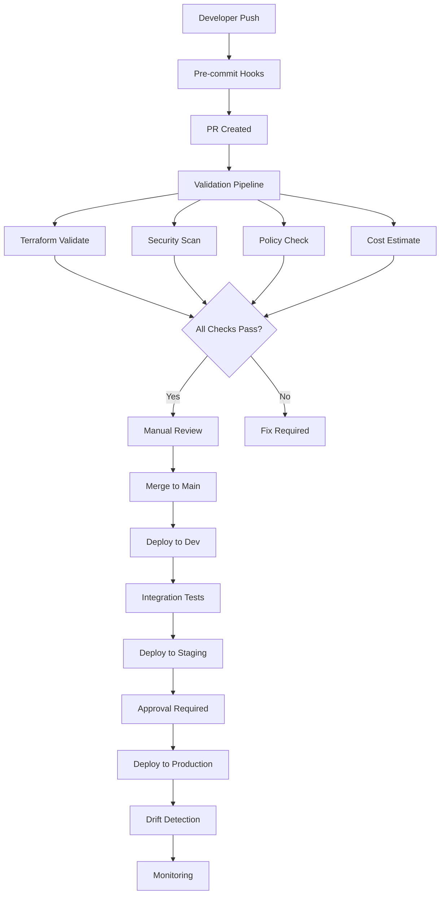

# Exercise 3: Enterprise Infrastructure as Code

## 📋 Overview

This advanced exercise implements a complete enterprise-grade Infrastructure as Code (IaC) solution. You'll build a production-ready GitOps pipeline with comprehensive validation, security scanning, cost management, and policy enforcement using industry best practices.

## 🎯 Learning Objectives

By completing this exercise, you will:

- ✅ Design enterprise-scale IaC architecture
- ✅ Implement comprehensive validation pipelines
- ✅ Configure policy as code with OPA
- ✅ Set up security and compliance scanning
- ✅ Implement cost estimation and controls
- ✅ Create advanced GitOps workflows
- ✅ Build self-service infrastructure platform
- ✅ Master enterprise governance patterns

## 📁 Structure

```
exercise3-enterprise-iac/
├── README.md                      # This file
├── instructions/                  # Detailed guides
│   ├── part1.md                  # Pipeline setup
│   └── part2.md                  # Advanced features
├── starter/                       # Starting point
│   ├── setup-gitops.sh           # Setup script
│   ├── README.md                 # Starter guide
│   ├── .github/workflows/        # Basic workflows
│   └── policies/                 # Basic policies
└── solution/                      # Complete solution
    ├── .github/                  # GitHub configuration
    │   ├── workflows/            # All workflows
    │   ├── ISSUE_TEMPLATE/       # Issue templates
    │   └── pull_request_template.md
    ├── terraform/                # Terraform code
    │   ├── modules/              # Reusable modules
    │   ├── environments/         # Environment configs
    │   └── policies/             # Terraform policies
    ├── policies/                 # OPA policies
    │   ├── azure/               # Azure-specific
    │   ├── cost/                # Cost controls
    │   └── security/            # Security rules
    ├── scripts/                  # Automation scripts
    │   ├── setup-gitops.sh      # Complete setup
    │   ├── validate-pr.sh       # PR validation
    │   └── cost-report.sh       # Cost reporting
    ├── docs/                     # Documentation
    │   ├── architecture.md      # Architecture guide
    │   ├── runbook.md          # Operations runbook
    │   └── troubleshooting.md  # Common issues
    ├── .pre-commit-config.yaml   # Pre-commit hooks
    ├── Makefile                  # Common tasks
    └── CONTRIBUTING.md           # Contribution guide
```

## 🚀 Getting Started

### Prerequisites

1. **Azure Subscription**: With Enterprise Agreement
2. **GitHub Organization**: With Actions enabled
3. **Tools Required**:
   ```bash
   # Terraform
   terraform version  # >= 1.6.0
   
   # Azure CLI
   az version        # >= 2.50.0
   
   # OPA
   opa version       # >= 0.55.0
   
   # Additional tools
   checkov --version  # Security scanning
   infracost --version # Cost estimation
   tflint --version    # Terraform linting
   ```

### Quick Start

1. **Run the setup script**:
   ```bash
   cd starter
   ./setup-gitops.sh
   ```

2. **Configure secrets** in GitHub:
   - Azure Service Principal
   - Infracost API key
   - Slack webhook (optional)

3. **Create your first PR**:
   ```bash
   git checkout -b feature/initial-infrastructure
   # Make changes
   git commit -m "feat: initial infrastructure"
   git push origin feature/initial-infrastructure
   ```

4. **Watch the magic happen!** 🎉

## 📚 Exercise Parts

### Part 1: Core Pipeline Setup
- Configure validation workflow
- Implement security scanning
- Add cost estimation
- Set up policy validation

**Time**: ~60 minutes

### Part 2: Advanced Features
- Add drift detection
- Implement approval workflows
- Configure notifications
- Set up self-service

**Time**: ~90 minutes

## 🏗️ Enterprise Architecture

### GitOps Pipeline Stages



### Policy Framework

#### 1. **Naming Standards**
```rego
# policies/azure/naming.rego
deny[msg] {
    resource := input.resource_changes[_]
    resource.type == "azurerm_resource_group"
    not regex.match("^rg-[a-z]+-[a-z]+-[0-9]+$", resource.change.after.name)
    msg := sprintf("Resource group '%s' doesn't follow naming convention", [resource.change.after.name])
}
```

#### 2. **Cost Controls**
```rego
# policies/cost/limits.rego
deny[msg] {
    total_cost := to_number(input.totalMonthlyCost)
    environment := input.projects[_].metadata.environment
    environment == "dev"
    total_cost > 500
    msg := sprintf("Dev environment cost $%.2f exceeds limit of $500", [total_cost])
}
```

#### 3. **Security Requirements**
```rego
# policies/security/encryption.rego
deny[msg] {
    resource := input.resource_changes[_]
    resource.type == "azurerm_storage_account"
    not resource.change.after.enable_https_traffic_only
    msg := "Storage accounts must enforce HTTPS"
}
```

## 📊 Success Criteria

### Pipeline Implementation
- [ ] ✅ All validation checks run automatically
- [ ] ✅ Security vulnerabilities are detected
- [ ] ✅ Cost estimates appear in PRs
- [ ] ✅ Policy violations block deployment
- [ ] ✅ Drift is detected and reported
- [ ] ✅ Approvals work correctly

### Code Quality
- [ ] ✅ 100% of resources tagged properly
- [ ] ✅ No hardcoded secrets
- [ ] ✅ All modules have documentation
- [ ] ✅ Terraform code is DRY
- [ ] ✅ Pre-commit hooks pass

### Governance
- [ ] ✅ Naming conventions enforced
- [ ] ✅ Cost limits implemented
- [ ] ✅ Security policies active
- [ ] ✅ Audit trail complete

## 🏆 Advanced Challenges

1. **Multi-Cloud Support**: Extend to AWS/GCP
2. **Disaster Recovery**: Automated failover
3. **FinOps Dashboard**: Real-time cost tracking
4. **Compliance Reports**: SOC2/ISO27001
5. **Infrastructure Marketplace**: Self-service catalog

## 🛠️ Troubleshooting

### Common Issues

1. **OPA policy syntax errors**:
   ```bash
   # Test policies locally
   opa test policies/ -v
   ```

2. **Infracost API issues**:
   ```bash
   # Debug cost estimation
   infracost breakdown --path . --log-level debug
   ```

3. **Workflow permissions**:
   - Check GITHUB_TOKEN permissions
   - Verify Azure RBAC assignments

### Validation Commands

```bash
# Run all pre-commit hooks
pre-commit run --all-files

# Test GitHub Actions locally
act -j validate-infrastructure

# Validate all policies
make validate-policies

# Generate cost report
make cost-report ENV=prod
```

## 📈 Metrics & Monitoring

Track these KPIs:
- **Lead Time**: PR creation to production
- **Deployment Frequency**: Deploys per day
- **MTTR**: Mean time to recovery
- **Change Failure Rate**: Failed deploys
- **Cost Variance**: Actual vs estimated
- **Policy Compliance**: Pass rate

## 📖 Resources

- 📚 [Enterprise-Scale Architecture](https://aka.ms/eslz)
- 🔒 [Azure Security Baseline](https://docs.microsoft.com/security/benchmark/azure/)
- 💰 [FinOps Framework](https://www.finops.org/)
- 📋 [OPA Best Practices](https://www.openpolicyagent.org/docs/latest/best-practices/)
- 🚀 [GitOps Toolkit](https://fluxcd.io/)
- 🏗️ [Terraform Enterprise Patterns](https://www.terraform.io/cloud-docs/recommended-practices)

## 🤝 Need Help?

1. Check solution code and documentation
2. Review workflow run logs
3. Use GitHub Discussions
4. Consult the troubleshooting guide

## ⏭️ Next Steps

After mastering this exercise:
1. Implement in your organization
2. Contribute improvements back
3. Share your learnings
4. Build your own IaC platform
5. Get certified in cloud architecture

---

**Remember**: Enterprise IaC is about enabling teams while maintaining governance. Balance automation with control, and always prioritize security and reliability! 🚀
