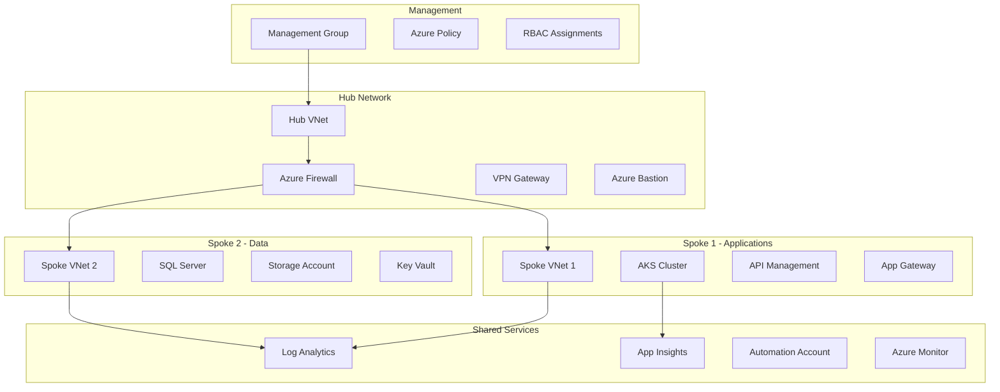

# Exercise 3: Enterprise Infrastructure (⭐⭐⭐ Hard)

## Overview

In this advanced exercise, you'll build a complete enterprise-grade infrastructure using modular Bicep templates. Implement hub-spoke networking, comprehensive security controls, and advanced monitoring - all deployed through an automated GitOps pipeline.

## Learning Objectives

- Design complex modular infrastructure
- Implement hub-spoke network architecture
- Apply enterprise security patterns
- Create reusable Bicep modules
- Orchestrate multi-module deployments
- Implement comprehensive monitoring

## Instructions

The complete instructions for this exercise are divided into parts:

1. **Part 1**: [Enterprise Architecture Design](./instructions/part1.md)
2. **Part 2**: [Module Implementation & Deployment](./instructions/part2.md)

## Project Structure

```
exercise3-enterprise-iac/
├── README.md                # This file
├── instructions/            # Step-by-step guides
│   ├── part1.md            # Architecture design
│   └── part2.md            # Implementation
├── starter/                # Starting templates
│   ├── main.bicep          # Orchestrator template
│   ├── modules/            # Module stubs
│   └── parameters/         # Environment configs
└── solution/              # Complete solution
    ├── main.bicep         # Full orchestrator
    ├── modules/           # Complete modules
    │   ├── networking/    # VNet, NSG, Firewall
    │   ├── compute/       # VMs, App Services, AKS
    │   ├── data/          # Storage, SQL, Cosmos
    │   ├── security/      # Key Vault, Managed Identity
    │   └── monitoring/    # Log Analytics, App Insights
    └── parameters/        # All environments
```

## Prerequisites

- Completed Exercises 1 & 2
- Strong understanding of Azure networking
- Experience with modular code design
- Azure subscription with sufficient quota
- GitHub repository with Actions configured

## Quick Start

```bash
# Navigate to exercise directory
cd exercises/exercise3-enterprise-iac

# Review the architecture
cat instructions/architecture-diagram.md

# Start with the orchestrator
cd starter
code main.bicep

# Begin module development
cd modules/networking
```

## Duration

**Expected Time**: 60-90 minutes
- Architecture Design: 20 minutes
- Module Development: 30 minutes
- Integration & Testing: 25 minutes
- Documentation: 15 minutes

## Enterprise Architecture



## Key Components to Implement

### 1. Networking Module
- Hub VNet with subnets for:
  - Firewall
  - Gateway
  - Bastion
  - Management
- Spoke VNets with:
  - Application subnets
  - Data subnets
  - Private endpoints
- Network Security Groups
- Route Tables
- VNet Peering

### 2. Security Module
- Azure Firewall with rules
- Key Vault with RBAC
- Managed Identities
- Private Endpoints
- Diagnostic Settings

### 3. Compute Module
- AKS cluster with:
  - System node pool
  - User node pool
  - Container Registry
- App Service Environment
- Virtual Machine Scale Sets

### 4. Data Module
- SQL Database with:
  - Failover groups
  - Elastic pools
  - Threat detection
- Storage Accounts with:
  - Lifecycle policies
  - Encryption
  - Private endpoints

### 5. Monitoring Module
- Log Analytics Workspace
- Application Insights
- Alerts and Action Groups
- Workbooks
- Dashboard

## Implementation Guidelines

### Module Design Principles

```bicep
// Example module structure
@description('Detailed description of module purpose')
param requiredParam string

@description('Optional parameter with default')
param optionalParam string = 'default-value'

// Variables for computed values
var computedName = 'prefix-${requiredParam}'

// Resources with consistent naming
resource mainResource 'Microsoft.Example/resource@2023-01-01' = {
  name: computedName
  location: location
  properties: {
    // Configuration
  }
}

// Comprehensive outputs
output resourceId string = mainResource.id
output resourceName string = mainResource.name
```

### Orchestration Pattern

```bicep
// main.bicep - Orchestrator
targetScope = 'subscription'

// Deploy resource groups
module resourceGroups 'modules/resource-groups.bicep' = {
  name: 'resourceGroups'
  params: {
    location: location
    environment: environment
  }
}

// Deploy networking
module networking 'modules/networking/main.bicep' = {
  name: 'networking'
  scope: resourceGroup(resourceGroups.outputs.networkRgName)
  params: {
    // Parameters
  }
}

// Deploy compute - depends on networking
module compute 'modules/compute/main.bicep' = {
  name: 'compute'
  scope: resourceGroup(resourceGroups.outputs.computeRgName)
  params: {
    vnetId: networking.outputs.vnetId
    subnetId: networking.outputs.computeSubnetId
  }
  dependsOn: [
    networking
  ]
}
```

## Success Criteria

- [ ] All modules deploy independently
- [ ] Orchestrator successfully coordinates deployment
- [ ] Hub-spoke networking is functional
- [ ] Security controls are in place
- [ ] Monitoring captures all metrics
- [ ] Cost stays within budget constraints
- [ ] Documentation is comprehensive

## Testing Strategy

1. **Unit Testing** - Test each module individually
2. **Integration Testing** - Test module interactions
3. **Security Testing** - Validate security controls
4. **Performance Testing** - Verify scalability
5. **Disaster Recovery** - Test failover scenarios

## Common Challenges

1. **Module Dependencies**
   - Use explicit `dependsOn`
   - Pass outputs between modules
   - Handle circular dependencies

2. **Resource Naming**
   - Follow naming conventions
   - Handle name length limits
   - Ensure global uniqueness

3. **Network Configuration**
   - Plan IP address spaces
   - Configure peering correctly
   - Set up routing tables

4. **Cost Management**
   - Use appropriate SKUs
   - Implement auto-shutdown
   - Monitor spending

## Tips for Success

- Start with networking foundation
- Test each module in isolation
- Use parameter files for each environment
- Implement comprehensive tagging
- Document architectural decisions
- Consider disaster recovery from the start

## Resources

- [Azure Architecture Center](https://docs.microsoft.com/azure/architecture/)
- [Bicep Best Practices](https://docs.microsoft.com/azure/azure-resource-manager/bicep/best-practices)
- [Enterprise Scale Landing Zones](https://docs.microsoft.com/azure/cloud-adoption-framework/ready/enterprise-scale/)
- [Hub-Spoke Network Topology](https://docs.microsoft.com/azure/architecture/reference-architectures/hybrid-networking/hub-spoke)

---

**Ready for enterprise-grade IaC?** Start with [Part 1: Enterprise Architecture Design](./instructions/part1.md)! 